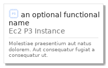

# AwsEc2P3Instance
```text
elements/aws/Compute/Instance/AwsEc2P3Instance
```
| Icon | Element | Card |
| :-: | :-: | --- |
|  |  |  |
## Element
### Load remotely
```plantuml
@startuml
' configures the library
!global $LIB_BRANCH="master"
!global $LIB_BASE_LOCATION="https://raw.githubusercontent.com/tmorin/plantuml-libs/" + $LIB_BRANCH + "/cloud"

' loads the library
!includeurl $LIB_BASE_LOCATION/library.puml

' loads the AWS style
include('styles/aws')

' loads the AwsEc2P3Instance element
include('elements/aws/Compute/Instance/AwsEc2P3Instance')
AwsEc2P3Instance('element', 'Ec2 P3 Instance', 'an optional tech field')
@enduml
```
### Load locally
```plantuml
@startuml
' configures the library
!global $INCLUSION_MODE="local"
!global $LIB_BASE_LOCATION="../../../../"

' loads the library
!include ../../../../library.puml

' loads the AWS style
include('styles/aws')

' loads the AwsEc2P3Instance element
include('elements/aws/Compute/Instance/AwsEc2P3Instance')
AwsEc2P3Instance('element', 'Ec2 P3 Instance', 'an optional tech field')
@enduml
```
## Card
### Load remotely
```plantuml
@startuml
' configures the library
!global $LIB_BRANCH="master"
!global $LIB_BASE_LOCATION="https://raw.githubusercontent.com/tmorin/plantuml-libs/" + $LIB_BRANCH + "/cloud"

' loads the library
!includeurl $LIB_BASE_LOCATION/library.puml

' loads the AWS style
include('styles/gcp')

' loads the AwsEc2P3Instance card
include('elements/aws/Compute/Instance/AwsEc2P3Instance')
AwsEc2P3InstanceCard('card', 'an optional functional name', 'Molestiae praesentium aut natus dolorem. Aut consequatur fugiat a consequatur ut.')
@enduml
```
### Load locally
```plantuml
@startuml
' configures the library
!global $INCLUSION_MODE="local"
!global $LIB_BASE_LOCATION="../../../../"

' loads the library
!include ../../../../library.puml

' loads the GCP style
include('styles/gcp')

' loads the AwsEc2P3Instance card
include('elements/aws/Compute/Instance/AwsEc2P3Instance')
AwsEc2P3InstanceCard('card', 'an optional functional name', 'Molestiae praesentium aut natus dolorem. Aut consequatur fugiat a consequatur ut.')
@enduml
```
