# aws - Elements
## elements/aws/Analytics
| | Name |
| :-: | --- |
| 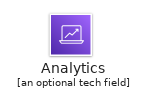 | [AwsAnalytics](Analytics/AwsAnalytics.md) `elements/aws/Analytics/AwsAnalytics` |
|  | [AwsAthena](Analytics/AwsAthena.md) `elements/aws/Analytics/AwsAthena` |
|  | [AwsCloudsearch](Analytics/AwsCloudsearch.md) `elements/aws/Analytics/AwsCloudsearch` |
|  | [AwsCloudsearchSearchDocuments](Analytics/AwsCloudsearchSearchDocuments.md) `elements/aws/Analytics/AwsCloudsearchSearchDocuments` |
|  | [AwsDataLakeResourceIcon](Analytics/AwsDataLakeResourceIcon.md) `elements/aws/Analytics/AwsDataLakeResourceIcon` |
|  | [AwsDataPipeline](Analytics/AwsDataPipeline.md) `elements/aws/Analytics/AwsDataPipeline` |
|  | [AwsElasticsearchService](Analytics/AwsElasticsearchService.md) `elements/aws/Analytics/AwsElasticsearchService` |
|  | [AwsEmrCluster](Analytics/AwsEmrCluster.md) `elements/aws/Analytics/AwsEmrCluster` |
|  | [AwsEmr](Analytics/AwsEmr.md) `elements/aws/Analytics/AwsEmr` |
|  | [AwsEmrEmrEngine](Analytics/AwsEmrEmrEngine.md) `elements/aws/Analytics/AwsEmrEmrEngine` |
| 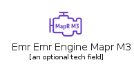 | [AwsEmrEmrEngineMaprM3](Analytics/AwsEmrEmrEngineMaprM3.md) `elements/aws/Analytics/AwsEmrEmrEngineMaprM3` |
|  | [AwsEmrEmrEngineMaprM5](Analytics/AwsEmrEmrEngineMaprM5.md) `elements/aws/Analytics/AwsEmrEmrEngineMaprM5` |
|  | [AwsEmrEmrEngineMaprM7](Analytics/AwsEmrEmrEngineMaprM7.md) `elements/aws/Analytics/AwsEmrEmrEngineMaprM7` |
|  | [AwsEmrHdfsCluster](Analytics/AwsEmrHdfsCluster.md) `elements/aws/Analytics/AwsEmrHdfsCluster` |
|  | [AwsGlueCrawlers](Analytics/AwsGlueCrawlers.md) `elements/aws/Analytics/AwsGlueCrawlers` |
|  | [AwsGlueDataCatalog](Analytics/AwsGlueDataCatalog.md) `elements/aws/Analytics/AwsGlueDataCatalog` |
| 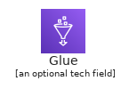 | [AwsGlue](Analytics/AwsGlue.md) `elements/aws/Analytics/AwsGlue` |
|  | [AwsKinesisDataAnalytics](Analytics/AwsKinesisDataAnalytics.md) `elements/aws/Analytics/AwsKinesisDataAnalytics` |
|  | [AwsKinesisDataFirehose](Analytics/AwsKinesisDataFirehose.md) `elements/aws/Analytics/AwsKinesisDataFirehose` |
|  | [AwsKinesisDataStreams](Analytics/AwsKinesisDataStreams.md) `elements/aws/Analytics/AwsKinesisDataStreams` |
|  | [AwsKinesis](Analytics/AwsKinesis.md) `elements/aws/Analytics/AwsKinesis` |
|  | [AwsKinesisVideoStreams](Analytics/AwsKinesisVideoStreams.md) `elements/aws/Analytics/AwsKinesisVideoStreams` |
|  | [AwsLakeFormation](Analytics/AwsLakeFormation.md) `elements/aws/Analytics/AwsLakeFormation` |
|  | [AwsManagedStreamingForKafka](Analytics/AwsManagedStreamingForKafka.md) `elements/aws/Analytics/AwsManagedStreamingForKafka` |
|  | [AwsQuicksight](Analytics/AwsQuicksight.md) `elements/aws/Analytics/AwsQuicksight` |
|  | [AwsRedshiftDenseComputeNode](Analytics/AwsRedshiftDenseComputeNode.md) `elements/aws/Analytics/AwsRedshiftDenseComputeNode` |
| 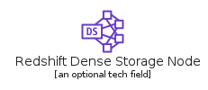 | [AwsRedshiftDenseStorageNode](Analytics/AwsRedshiftDenseStorageNode.md) `elements/aws/Analytics/AwsRedshiftDenseStorageNode` |
| 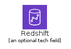 | [AwsRedshift](Analytics/AwsRedshift.md) `elements/aws/Analytics/AwsRedshift` |
## elements/aws/ApplicationIntegration
| | Name |
| :-: | --- |
| 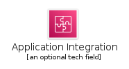 | [AwsApplicationIntegration](ApplicationIntegration/AwsApplicationIntegration.md) `elements/aws/ApplicationIntegration/AwsApplicationIntegration` |
|  | [AwsApplicationIntegrationEventResource](ApplicationIntegration/AwsApplicationIntegrationEventResource.md) `elements/aws/ApplicationIntegration/AwsApplicationIntegrationEventResource` |
|  | [AwsAppsync](ApplicationIntegration/AwsAppsync.md) `elements/aws/ApplicationIntegration/AwsAppsync` |
|  | [AwsConsoleMobileApplication](ApplicationIntegration/AwsConsoleMobileApplication.md) `elements/aws/ApplicationIntegration/AwsConsoleMobileApplication` |
|  | [AwsCustomEventBusResourceIcon64Squid](ApplicationIntegration/AwsCustomEventBusResourceIcon64Squid.md) `elements/aws/ApplicationIntegration/AwsCustomEventBusResourceIcon64Squid` |
|  | [AwsCustomEventBusResourceIcon64White](ApplicationIntegration/AwsCustomEventBusResourceIcon64White.md) `elements/aws/ApplicationIntegration/AwsCustomEventBusResourceIcon64White` |
|  | [AwsDefaultEventBusResourceIcon64Squid](ApplicationIntegration/AwsDefaultEventBusResourceIcon64Squid.md) `elements/aws/ApplicationIntegration/AwsDefaultEventBusResourceIcon64Squid` |
|  | [AwsDefaultEventBusResourceIcon64White](ApplicationIntegration/AwsDefaultEventBusResourceIcon64White.md) `elements/aws/ApplicationIntegration/AwsDefaultEventBusResourceIcon64White` |
|  | [AwsEventbridgeCustomEventBusResourceIcon](ApplicationIntegration/AwsEventbridgeCustomEventBusResourceIcon.md) `elements/aws/ApplicationIntegration/AwsEventbridgeCustomEventBusResourceIcon` |
|  | [AwsEventbridgeDefaultEventBusResourceIcon](ApplicationIntegration/AwsEventbridgeDefaultEventBusResourceIcon.md) `elements/aws/ApplicationIntegration/AwsEventbridgeDefaultEventBusResourceIcon` |
|  | [AwsEventbridge](ApplicationIntegration/AwsEventbridge.md) `elements/aws/ApplicationIntegration/AwsEventbridge` |
|  | [AwsEventbridgeSaasPartnerEventBusResourceIcon](ApplicationIntegration/AwsEventbridgeSaasPartnerEventBusResourceIcon.md) `elements/aws/ApplicationIntegration/AwsEventbridgeSaasPartnerEventBusResourceIcon` |
|  | [AwsExpressWorkflows](ApplicationIntegration/AwsExpressWorkflows.md) `elements/aws/ApplicationIntegration/AwsExpressWorkflows` |
|  | [AwsMq](ApplicationIntegration/AwsMq.md) `elements/aws/ApplicationIntegration/AwsMq` |
|  | [AwsSaasEventBusResourceIcon64Squid](ApplicationIntegration/AwsSaasEventBusResourceIcon64Squid.md) `elements/aws/ApplicationIntegration/AwsSaasEventBusResourceIcon64Squid` |
|  | [AwsSaasEventBusResourceIcon64White](ApplicationIntegration/AwsSaasEventBusResourceIcon64White.md) `elements/aws/ApplicationIntegration/AwsSaasEventBusResourceIcon64White` |
|  | [AwsSimpleNotificationServiceSns](ApplicationIntegration/AwsSimpleNotificationServiceSns.md) `elements/aws/ApplicationIntegration/AwsSimpleNotificationServiceSns` |
|  | [AwsSimpleNotificationServiceSnsEmailNotification](ApplicationIntegration/AwsSimpleNotificationServiceSnsEmailNotification.md) `elements/aws/ApplicationIntegration/AwsSimpleNotificationServiceSnsEmailNotification` |
|  | [AwsSimpleNotificationServiceSnsHttpNotification](ApplicationIntegration/AwsSimpleNotificationServiceSnsHttpNotification.md) `elements/aws/ApplicationIntegration/AwsSimpleNotificationServiceSnsHttpNotification` |
|  | [AwsSimpleNotificationServiceSnsTopic](ApplicationIntegration/AwsSimpleNotificationServiceSnsTopic.md) `elements/aws/ApplicationIntegration/AwsSimpleNotificationServiceSnsTopic` |
|  | [AwsSimpleQueueServiceSqs](ApplicationIntegration/AwsSimpleQueueServiceSqs.md) `elements/aws/ApplicationIntegration/AwsSimpleQueueServiceSqs` |
|  | [AwsSimpleQueueServiceSqsMessage](ApplicationIntegration/AwsSimpleQueueServiceSqsMessage.md) `elements/aws/ApplicationIntegration/AwsSimpleQueueServiceSqsMessage` |
|  | [AwsSimpleQueueServiceSqsQueue](ApplicationIntegration/AwsSimpleQueueServiceSqsQueue.md) `elements/aws/ApplicationIntegration/AwsSimpleQueueServiceSqsQueue` |
|  | [AwsStepFunctions](ApplicationIntegration/AwsStepFunctions.md) `elements/aws/ApplicationIntegration/AwsStepFunctions` |
## elements/aws/ArVr
| | Name |
| :-: | --- |
|  | [AwsArVr](ArVr/AwsArVr.md) `elements/aws/ArVr/AwsArVr` |
|  | [AwsSumerian](ArVr/AwsSumerian.md) `elements/aws/ArVr/AwsSumerian` |
## elements/aws/AwsCostManagement
| | Name |
| :-: | --- |
|  | [AwsBudgets](AwsCostManagement/AwsBudgets.md) `elements/aws/AwsCostManagement/AwsBudgets` |
|  | [AwsCostAndUsageReport](AwsCostManagement/AwsCostAndUsageReport.md) `elements/aws/AwsCostManagement/AwsCostAndUsageReport` |
|  | [AwsCostExplorer](AwsCostManagement/AwsCostExplorer.md) `elements/aws/AwsCostManagement/AwsCostExplorer` |
|  | [AwsCostManagement](AwsCostManagement/AwsCostManagement.md) `elements/aws/AwsCostManagement/AwsCostManagement` |
|  | [AwsReservedInstanceReporting](AwsCostManagement/AwsReservedInstanceReporting.md) `elements/aws/AwsCostManagement/AwsReservedInstanceReporting` |
|  | [AwsSavingsPlans](AwsCostManagement/AwsSavingsPlans.md) `elements/aws/AwsCostManagement/AwsSavingsPlans` |
## elements/aws/Blockchain
| | Name |
| :-: | --- |
|  | [AwsBlockchain](Blockchain/AwsBlockchain.md) `elements/aws/Blockchain/AwsBlockchain` |
|  | [AwsBlockchainResourceIcon](Blockchain/AwsBlockchainResourceIcon.md) `elements/aws/Blockchain/AwsBlockchainResourceIcon` |
|  | [AwsManagedBlockchain](Blockchain/AwsManagedBlockchain.md) `elements/aws/Blockchain/AwsManagedBlockchain` |
|  | [AwsQuantumLedgerDatabaseQldb](Blockchain/AwsQuantumLedgerDatabaseQldb.md) `elements/aws/Blockchain/AwsQuantumLedgerDatabaseQldb` |
## elements/aws/BusinessApplications
| | Name |
| :-: | --- |
|  | [AwsAlexaForBusiness](BusinessApplications/AwsAlexaForBusiness.md) `elements/aws/BusinessApplications/AwsAlexaForBusiness` |
|  | [AwsBusinessApplications](BusinessApplications/AwsBusinessApplications.md) `elements/aws/BusinessApplications/AwsBusinessApplications` |
|  | [AwsChime](BusinessApplications/AwsChime.md) `elements/aws/BusinessApplications/AwsChime` |
|  | [AwsWorkmail](BusinessApplications/AwsWorkmail.md) `elements/aws/BusinessApplications/AwsWorkmail` |
## elements/aws/Compute/Instance
| | Name |
| :-: | --- |
|  | [AwsEc2A1Instance](Compute/Instance/AwsEc2A1Instance.md) `elements/aws/Compute/Instance/AwsEc2A1Instance` |
|  | [AwsEc2C4Instance](Compute/Instance/AwsEc2C4Instance.md) `elements/aws/Compute/Instance/AwsEc2C4Instance` |
|  | [AwsEc2C5Instance](Compute/Instance/AwsEc2C5Instance.md) `elements/aws/Compute/Instance/AwsEc2C5Instance` |
|  | [AwsEc2C5nInstance](Compute/Instance/AwsEc2C5nInstance.md) `elements/aws/Compute/Instance/AwsEc2C5nInstance` |
| 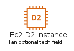 | [AwsEc2D2Instance](Compute/Instance/AwsEc2D2Instance.md) `elements/aws/Compute/Instance/AwsEc2D2Instance` |
| 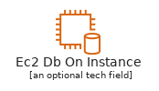 | [AwsEc2DbOnInstance](Compute/Instance/AwsEc2DbOnInstance.md) `elements/aws/Compute/Instance/AwsEc2DbOnInstance` |
|  | [AwsEc2F1Instance](Compute/Instance/AwsEc2F1Instance.md) `elements/aws/Compute/Instance/AwsEc2F1Instance` |
|  | [AwsEc2G3Instance](Compute/Instance/AwsEc2G3Instance.md) `elements/aws/Compute/Instance/AwsEc2G3Instance` |
| 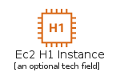 | [AwsEc2H1Instance](Compute/Instance/AwsEc2H1Instance.md) `elements/aws/Compute/Instance/AwsEc2H1Instance` |
|  | [AwsEc2HighMemoryInstance](Compute/Instance/AwsEc2HighMemoryInstance.md) `elements/aws/Compute/Instance/AwsEc2HighMemoryInstance` |
| 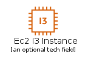 | [AwsEc2I3Instance](Compute/Instance/AwsEc2I3Instance.md) `elements/aws/Compute/Instance/AwsEc2I3Instance` |
| 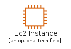 | [AwsEc2Instance](Compute/Instance/AwsEc2Instance.md) `elements/aws/Compute/Instance/AwsEc2Instance` |
|  | [AwsEc2Instances](Compute/Instance/AwsEc2Instances.md) `elements/aws/Compute/Instance/AwsEc2Instances` |
|  | [AwsEc2InstanceWithCloudwatch](Compute/Instance/AwsEc2InstanceWithCloudwatch.md) `elements/aws/Compute/Instance/AwsEc2InstanceWithCloudwatch` |
| 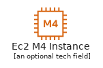 | [AwsEc2M4Instance](Compute/Instance/AwsEc2M4Instance.md) `elements/aws/Compute/Instance/AwsEc2M4Instance` |
|  | [AwsEc2M5aInstance](Compute/Instance/AwsEc2M5aInstance.md) `elements/aws/Compute/Instance/AwsEc2M5aInstance` |
|  | [AwsEc2M5Instance](Compute/Instance/AwsEc2M5Instance.md) `elements/aws/Compute/Instance/AwsEc2M5Instance` |
|  | [AwsEc2OptimizedInstance](Compute/Instance/AwsEc2OptimizedInstance.md) `elements/aws/Compute/Instance/AwsEc2OptimizedInstance` |
|  | [AwsEc2P2Instance](Compute/Instance/AwsEc2P2Instance.md) `elements/aws/Compute/Instance/AwsEc2P2Instance` |
| 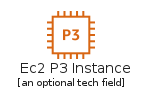 | [AwsEc2P3Instance](Compute/Instance/AwsEc2P3Instance.md) `elements/aws/Compute/Instance/AwsEc2P3Instance` |
| 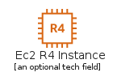 | [AwsEc2R4Instance](Compute/Instance/AwsEc2R4Instance.md) `elements/aws/Compute/Instance/AwsEc2R4Instance` |
|  | [AwsEc2R5aInstance](Compute/Instance/AwsEc2R5aInstance.md) `elements/aws/Compute/Instance/AwsEc2R5aInstance` |
|  | [AwsEc2R5Instance](Compute/Instance/AwsEc2R5Instance.md) `elements/aws/Compute/Instance/AwsEc2R5Instance` |
|  | [AwsEc2SpotInstance](Compute/Instance/AwsEc2SpotInstance.md) `elements/aws/Compute/Instance/AwsEc2SpotInstance` |
|  | [AwsEc2T3aInstance](Compute/Instance/AwsEc2T3aInstance.md) `elements/aws/Compute/Instance/AwsEc2T3aInstance` |
|  | [AwsEc2T3InstanceCopy](Compute/Instance/AwsEc2T3InstanceCopy.md) `elements/aws/Compute/Instance/AwsEc2T3InstanceCopy` |
|  | [AwsEc2T3Instance](Compute/Instance/AwsEc2T3Instance.md) `elements/aws/Compute/Instance/AwsEc2T3Instance` |
|  | [AwsEc2X1eInstance](Compute/Instance/AwsEc2X1eInstance.md) `elements/aws/Compute/Instance/AwsEc2X1eInstance` |
| 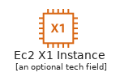 | [AwsEc2X1Instance](Compute/Instance/AwsEc2X1Instance.md) `elements/aws/Compute/Instance/AwsEc2X1Instance` |
|  | [AwsEc2Z1dInstance](Compute/Instance/AwsEc2Z1dInstance.md) `elements/aws/Compute/Instance/AwsEc2Z1dInstance` |
## elements/aws/Compute
| | Name |
| :-: | --- |
|  | [AwsApplicationAutoScaling](Compute/AwsApplicationAutoScaling.md) `elements/aws/Compute/AwsApplicationAutoScaling` |
|  | [AwsBatch](Compute/AwsBatch.md) `elements/aws/Compute/AwsBatch` |
|  | [AwsBottlerocket](Compute/AwsBottlerocket.md) `elements/aws/Compute/AwsBottlerocket` |
|  | [AwsCompute](Compute/AwsCompute.md) `elements/aws/Compute/AwsCompute` |
|  | [AwsComputeOptimizer](Compute/AwsComputeOptimizer.md) `elements/aws/Compute/AwsComputeOptimizer` |
|  | [AwsEc2Ami](Compute/AwsEc2Ami.md) `elements/aws/Compute/AwsEc2Ami` |
|  | [AwsEc2AutoScaling](Compute/AwsEc2AutoScaling.md) `elements/aws/Compute/AwsEc2AutoScaling` |
|  | [AwsEc2ContainerRegistry](Compute/AwsEc2ContainerRegistry.md) `elements/aws/Compute/AwsEc2ContainerRegistry` |
|  | [AwsEc2ContainerRegistryImage](Compute/AwsEc2ContainerRegistryImage.md) `elements/aws/Compute/AwsEc2ContainerRegistryImage` |
|  | [AwsEc2ContainerRegistryRegistry](Compute/AwsEc2ContainerRegistryRegistry.md) `elements/aws/Compute/AwsEc2ContainerRegistryRegistry` |
|  | [AwsEc2ElasticIpAddress](Compute/AwsEc2ElasticIpAddress.md) `elements/aws/Compute/AwsEc2ElasticIpAddress` |
| 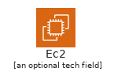 | [AwsEc2](Compute/AwsEc2.md) `elements/aws/Compute/AwsEc2` |
|  | [AwsEc2ImageBuilder](Compute/AwsEc2ImageBuilder.md) `elements/aws/Compute/AwsEc2ImageBuilder` |
|  | [AwsEc2Rescue](Compute/AwsEc2Rescue.md) `elements/aws/Compute/AwsEc2Rescue` |
|  | [AwsElasticBeanstalkApplication](Compute/AwsElasticBeanstalkApplication.md) `elements/aws/Compute/AwsElasticBeanstalkApplication` |
|  | [AwsElasticBeanstalkDeployment](Compute/AwsElasticBeanstalkDeployment.md) `elements/aws/Compute/AwsElasticBeanstalkDeployment` |
|  | [AwsElasticBeanstalk](Compute/AwsElasticBeanstalk.md) `elements/aws/Compute/AwsElasticBeanstalk` |
|  | [AwsElasticContainerServiceContainer1](Compute/AwsElasticContainerServiceContainer1.md) `elements/aws/Compute/AwsElasticContainerServiceContainer1` |
|  | [AwsElasticContainerServiceContainer2](Compute/AwsElasticContainerServiceContainer2.md) `elements/aws/Compute/AwsElasticContainerServiceContainer2` |
|  | [AwsElasticContainerServiceContainer3](Compute/AwsElasticContainerServiceContainer3.md) `elements/aws/Compute/AwsElasticContainerServiceContainer3` |
|  | [AwsElasticContainerService](Compute/AwsElasticContainerService.md) `elements/aws/Compute/AwsElasticContainerService` |
|  | [AwsElasticContainerServiceService](Compute/AwsElasticContainerServiceService.md) `elements/aws/Compute/AwsElasticContainerServiceService` |
|  | [AwsElasticContainerServiceTask](Compute/AwsElasticContainerServiceTask.md) `elements/aws/Compute/AwsElasticContainerServiceTask` |
|  | [AwsElasticKubernetesService](Compute/AwsElasticKubernetesService.md) `elements/aws/Compute/AwsElasticKubernetesService` |
|  | [AwsFargate](Compute/AwsFargate.md) `elements/aws/Compute/AwsFargate` |
|  | [AwsLambda](Compute/AwsLambda.md) `elements/aws/Compute/AwsLambda` |
|  | [AwsLambdaLambdaFunction](Compute/AwsLambdaLambdaFunction.md) `elements/aws/Compute/AwsLambdaLambdaFunction` |
|  | [AwsLightsail](Compute/AwsLightsail.md) `elements/aws/Compute/AwsLightsail` |
|  | [AwsLocalZones](Compute/AwsLocalZones.md) `elements/aws/Compute/AwsLocalZones` |
|  | [AwsOutposts](Compute/AwsOutposts.md) `elements/aws/Compute/AwsOutposts` |
|  | [AwsParallelCluster](Compute/AwsParallelCluster.md) `elements/aws/Compute/AwsParallelCluster` |
|  | [AwsServerlessApplicationRepository](Compute/AwsServerlessApplicationRepository.md) `elements/aws/Compute/AwsServerlessApplicationRepository` |
|  | [AwsThinkboxDeadline](Compute/AwsThinkboxDeadline.md) `elements/aws/Compute/AwsThinkboxDeadline` |
|  | [AwsThinkboxDraft](Compute/AwsThinkboxDraft.md) `elements/aws/Compute/AwsThinkboxDraft` |
|  | [AwsThinkboxFrost](Compute/AwsThinkboxFrost.md) `elements/aws/Compute/AwsThinkboxFrost` |
|  | [AwsThinkboxKrakatoa](Compute/AwsThinkboxKrakatoa.md) `elements/aws/Compute/AwsThinkboxKrakatoa` |
|  | [AwsThinkboxSequoia](Compute/AwsThinkboxSequoia.md) `elements/aws/Compute/AwsThinkboxSequoia` |
|  | [AwsThinkboxStoke](Compute/AwsThinkboxStoke.md) `elements/aws/Compute/AwsThinkboxStoke` |
|  | [AwsThinkboxXmesh](Compute/AwsThinkboxXmesh.md) `elements/aws/Compute/AwsThinkboxXmesh` |
|  | [AwsVmwareCloud](Compute/AwsVmwareCloud.md) `elements/aws/Compute/AwsVmwareCloud` |
|  | [AwsWavelength](Compute/AwsWavelength.md) `elements/aws/Compute/AwsWavelength` |
## elements/aws/CustomerEnablement
| | Name |
| :-: | --- |
|  | [AwsCustomerEnablement](CustomerEnablement/AwsCustomerEnablement.md) `elements/aws/CustomerEnablement/AwsCustomerEnablement` |
|  | [AwsIq](CustomerEnablement/AwsIq.md) `elements/aws/CustomerEnablement/AwsIq` |
|  | [AwsManagedServices](CustomerEnablement/AwsManagedServices.md) `elements/aws/CustomerEnablement/AwsManagedServices` |
|  | [AwsProfessionalServices](CustomerEnablement/AwsProfessionalServices.md) `elements/aws/CustomerEnablement/AwsProfessionalServices` |
|  | [AwsSupport](CustomerEnablement/AwsSupport.md) `elements/aws/CustomerEnablement/AwsSupport` |
## elements/aws/CustomerEngagement
| | Name |
| :-: | --- |
|  | [AwsConnect](CustomerEngagement/AwsConnect.md) `elements/aws/CustomerEngagement/AwsConnect` |
|  | [AwsCustomerEngagement](CustomerEngagement/AwsCustomerEngagement.md) `elements/aws/CustomerEngagement/AwsCustomerEngagement` |
|  | [AwsPinpoint](CustomerEngagement/AwsPinpoint.md) `elements/aws/CustomerEngagement/AwsPinpoint` |
|  | [AwsSimpleEmailServiceSes](CustomerEngagement/AwsSimpleEmailServiceSes.md) `elements/aws/CustomerEngagement/AwsSimpleEmailServiceSes` |
|  | [AwsSimpleEmailServiceSesEmail](CustomerEngagement/AwsSimpleEmailServiceSesEmail.md) `elements/aws/CustomerEngagement/AwsSimpleEmailServiceSesEmail` |
## elements/aws/Database
| | Name |
| :-: | --- |
| 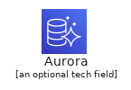 | [AwsAurora](Database/AwsAurora.md) `elements/aws/Database/AwsAurora` |
|  | [AwsDatabase](Database/AwsDatabase.md) `elements/aws/Database/AwsDatabase` |
|  | [AwsDatabaseMigrationServiceDatabaseMigrationWorkflow](Database/AwsDatabaseMigrationServiceDatabaseMigrationWorkflow.md) `elements/aws/Database/AwsDatabaseMigrationServiceDatabaseMigrationWorkflow` |
|  | [AwsDatabaseMigrationService](Database/AwsDatabaseMigrationService.md) `elements/aws/Database/AwsDatabaseMigrationService` |
|  | [AwsDocumentdbWithMongodbCompatibility](Database/AwsDocumentdbWithMongodbCompatibility.md) `elements/aws/Database/AwsDocumentdbWithMongodbCompatibility` |
|  | [AwsDynamodbAttribute](Database/AwsDynamodbAttribute.md) `elements/aws/Database/AwsDynamodbAttribute` |
| 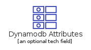 | [AwsDynamodbAttributes](Database/AwsDynamodbAttributes.md) `elements/aws/Database/AwsDynamodbAttributes` |
|  | [AwsDynamodbDax](Database/AwsDynamodbDax.md) `elements/aws/Database/AwsDynamodbDax` |
|  | [AwsDynamodb](Database/AwsDynamodb.md) `elements/aws/Database/AwsDynamodb` |
|  | [AwsDynamodbGlobalSecondaryIndex](Database/AwsDynamodbGlobalSecondaryIndex.md) `elements/aws/Database/AwsDynamodbGlobalSecondaryIndex` |
|  | [AwsDynamodbItem](Database/AwsDynamodbItem.md) `elements/aws/Database/AwsDynamodbItem` |
|  | [AwsDynamodbItems](Database/AwsDynamodbItems.md) `elements/aws/Database/AwsDynamodbItems` |
|  | [AwsDynamodbTable](Database/AwsDynamodbTable.md) `elements/aws/Database/AwsDynamodbTable` |
| 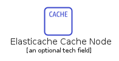 | [AwsElasticacheCacheNode](Database/AwsElasticacheCacheNode.md) `elements/aws/Database/AwsElasticacheCacheNode` |
|  | [AwsElasticache](Database/AwsElasticache.md) `elements/aws/Database/AwsElasticache` |
|  | [AwsElasticacheForMemcached](Database/AwsElasticacheForMemcached.md) `elements/aws/Database/AwsElasticacheForMemcached` |
|  | [AwsElasticacheForRedis](Database/AwsElasticacheForRedis.md) `elements/aws/Database/AwsElasticacheForRedis` |
|  | [AwsManagedApacheCassandraService](Database/AwsManagedApacheCassandraService.md) `elements/aws/Database/AwsManagedApacheCassandraService` |
|  | [AwsNeptune](Database/AwsNeptune.md) `elements/aws/Database/AwsNeptune` |
|  | [AwsQuantumLedgerDatabaseQldb](Database/AwsQuantumLedgerDatabaseQldb.md) `elements/aws/Database/AwsQuantumLedgerDatabaseQldb` |
|  | [AwsRdsAuroraInstanceAlt](Database/AwsRdsAuroraInstanceAlt.md) `elements/aws/Database/AwsRdsAuroraInstanceAlt` |
| 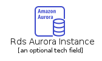 | [AwsRdsAuroraInstance](Database/AwsRdsAuroraInstance.md) `elements/aws/Database/AwsRdsAuroraInstance` |
| 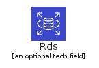 | [AwsRds](Database/AwsRds.md) `elements/aws/Database/AwsRds` |
|  | [AwsRdsMariadbInstanceAlt](Database/AwsRdsMariadbInstanceAlt.md) `elements/aws/Database/AwsRdsMariadbInstanceAlt` |
| 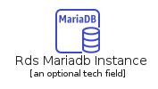 | [AwsRdsMariadbInstance](Database/AwsRdsMariadbInstance.md) `elements/aws/Database/AwsRdsMariadbInstance` |
|  | [AwsRdsMysqlInstanceAlt](Database/AwsRdsMysqlInstanceAlt.md) `elements/aws/Database/AwsRdsMysqlInstanceAlt` |
|  | [AwsRdsMysqlInstance](Database/AwsRdsMysqlInstance.md) `elements/aws/Database/AwsRdsMysqlInstance` |
|  | [AwsRdsOnVmware](Database/AwsRdsOnVmware.md) `elements/aws/Database/AwsRdsOnVmware` |
| 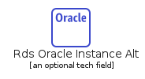 | [AwsRdsOracleInstanceAlt](Database/AwsRdsOracleInstanceAlt.md) `elements/aws/Database/AwsRdsOracleInstanceAlt` |
| 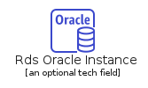 | [AwsRdsOracleInstance](Database/AwsRdsOracleInstance.md) `elements/aws/Database/AwsRdsOracleInstance` |
|  | [AwsRdsPiop](Database/AwsRdsPiop.md) `elements/aws/Database/AwsRdsPiop` |
| 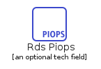 | [AwsRdsPiops](Database/AwsRdsPiops.md) `elements/aws/Database/AwsRdsPiops` |
|  | [AwsRdsPostgresqlInstanceAlt](Database/AwsRdsPostgresqlInstanceAlt.md) `elements/aws/Database/AwsRdsPostgresqlInstanceAlt` |
| 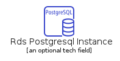 | [AwsRdsPostgresqlInstance](Database/AwsRdsPostgresqlInstance.md) `elements/aws/Database/AwsRdsPostgresqlInstance` |
|  | [AwsRdsRdsInstanceAlt](Database/AwsRdsRdsInstanceAlt.md) `elements/aws/Database/AwsRdsRdsInstanceAlt` |
|  | [AwsRdsRdsInstance](Database/AwsRdsRdsInstance.md) `elements/aws/Database/AwsRdsRdsInstance` |
| 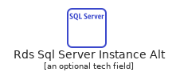 | [AwsRdsSqlServerInstanceAlt](Database/AwsRdsSqlServerInstanceAlt.md) `elements/aws/Database/AwsRdsSqlServerInstanceAlt` |
|  | [AwsRdsSqlServerInstance](Database/AwsRdsSqlServerInstance.md) `elements/aws/Database/AwsRdsSqlServerInstance` |
| 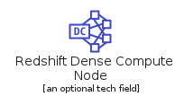 | [AwsRedshiftDenseComputeNode](Database/AwsRedshiftDenseComputeNode.md) `elements/aws/Database/AwsRedshiftDenseComputeNode` |
| 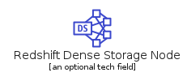 | [AwsRedshiftDenseStorageNode](Database/AwsRedshiftDenseStorageNode.md) `elements/aws/Database/AwsRedshiftDenseStorageNode` |
|  | [AwsRedshift](Database/AwsRedshift.md) `elements/aws/Database/AwsRedshift` |
|  | [AwsTimestream](Database/AwsTimestream.md) `elements/aws/Database/AwsTimestream` |
## elements/aws/DeveloperTools
| | Name |
| :-: | --- |
| 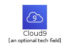 | [AwsCloud9](DeveloperTools/AwsCloud9.md) `elements/aws/DeveloperTools/AwsCloud9` |
| 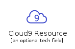 | [AwsCloud9Resource](DeveloperTools/AwsCloud9Resource.md) `elements/aws/DeveloperTools/AwsCloud9Resource` |
|  | [AwsCloudDevelopmentKit](DeveloperTools/AwsCloudDevelopmentKit.md) `elements/aws/DeveloperTools/AwsCloudDevelopmentKit` |
| 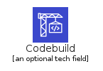 | [AwsCodebuild](DeveloperTools/AwsCodebuild.md) `elements/aws/DeveloperTools/AwsCodebuild` |
|  | [AwsCodecommit](DeveloperTools/AwsCodecommit.md) `elements/aws/DeveloperTools/AwsCodecommit` |
|  | [AwsCodedeploy](DeveloperTools/AwsCodedeploy.md) `elements/aws/DeveloperTools/AwsCodedeploy` |
|  | [AwsCodepipeline](DeveloperTools/AwsCodepipeline.md) `elements/aws/DeveloperTools/AwsCodepipeline` |
|  | [AwsCodestar](DeveloperTools/AwsCodestar.md) `elements/aws/DeveloperTools/AwsCodestar` |
|  | [AwsCommandLineInterface](DeveloperTools/AwsCommandLineInterface.md) `elements/aws/DeveloperTools/AwsCommandLineInterface` |
|  | [AwsDeveloperTools](DeveloperTools/AwsDeveloperTools.md) `elements/aws/DeveloperTools/AwsDeveloperTools` |
|  | [AwsDynamodbDax](DeveloperTools/AwsDynamodbDax.md) `elements/aws/DeveloperTools/AwsDynamodbDax` |
|  | [AwsToolsAndSdks](DeveloperTools/AwsToolsAndSdks.md) `elements/aws/DeveloperTools/AwsToolsAndSdks` |
| 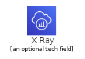 | [AwsXRay](DeveloperTools/AwsXRay.md) `elements/aws/DeveloperTools/AwsXRay` |
## elements/aws/EndUserComputing
| | Name |
| :-: | --- |
|  | [AwsAppstream20](EndUserComputing/AwsAppstream20.md) `elements/aws/EndUserComputing/AwsAppstream20` |
|  | [AwsEndUserComputing](EndUserComputing/AwsEndUserComputing.md) `elements/aws/EndUserComputing/AwsEndUserComputing` |
|  | [AwsWorkdocs](EndUserComputing/AwsWorkdocs.md) `elements/aws/EndUserComputing/AwsWorkdocs` |
|  | [AwsWorklink](EndUserComputing/AwsWorklink.md) `elements/aws/EndUserComputing/AwsWorklink` |
|  | [AwsWorkspaces](EndUserComputing/AwsWorkspaces.md) `elements/aws/EndUserComputing/AwsWorkspaces` |
## elements/aws/GameTech
| | Name |
| :-: | --- |
|  | [AwsGamelift](GameTech/AwsGamelift.md) `elements/aws/GameTech/AwsGamelift` |
|  | [AwsGameTech](GameTech/AwsGameTech.md) `elements/aws/GameTech/AwsGameTech` |
## elements/aws/General
| | Name |
| :-: | --- |
|  | [AwsClient](General/AwsClient.md) `elements/aws/General/AwsClient` |
| 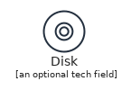 | [AwsDisk](General/AwsDisk.md) `elements/aws/General/AwsDisk` |
|  | [AwsEmail](General/AwsEmail.md) `elements/aws/General/AwsEmail` |
|  | [AwsForums](General/AwsForums.md) `elements/aws/General/AwsForums` |
| 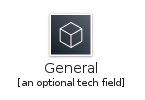 | [AwsGeneral](General/AwsGeneral.md) `elements/aws/General/AwsGeneral` |
|  | [AwsGenericDatabase](General/AwsGenericDatabase.md) `elements/aws/General/AwsGenericDatabase` |
|  | [AwsGenericFirewall](General/AwsGenericFirewall.md) `elements/aws/General/AwsGenericFirewall` |
|  | [AwsInternetAlt1](General/AwsInternetAlt1.md) `elements/aws/General/AwsInternetAlt1` |
|  | [AwsInternetAlt2](General/AwsInternetAlt2.md) `elements/aws/General/AwsInternetAlt2` |
|  | [AwsInternetGateway](General/AwsInternetGateway.md) `elements/aws/General/AwsInternetGateway` |
|  | [AwsMarketplace](General/AwsMarketplace.md) `elements/aws/General/AwsMarketplace` |
|  | [AwsMobileClient](General/AwsMobileClient.md) `elements/aws/General/AwsMobileClient` |
|  | [AwsMultimedia](General/AwsMultimedia.md) `elements/aws/General/AwsMultimedia` |
|  | [AwsOfficeBuilding](General/AwsOfficeBuilding.md) `elements/aws/General/AwsOfficeBuilding` |
|  | [AwsSamlToken](General/AwsSamlToken.md) `elements/aws/General/AwsSamlToken` |
|  | [AwsSdk](General/AwsSdk.md) `elements/aws/General/AwsSdk` |
|  | [AwsSslPadlock](General/AwsSslPadlock.md) `elements/aws/General/AwsSslPadlock` |
|  | [AwsTapeStorage](General/AwsTapeStorage.md) `elements/aws/General/AwsTapeStorage` |
|  | [AwsToolkit](General/AwsToolkit.md) `elements/aws/General/AwsToolkit` |
|  | [AwsTraditionalServer](General/AwsTraditionalServer.md) `elements/aws/General/AwsTraditionalServer` |
|  | [AwsUser](General/AwsUser.md) `elements/aws/General/AwsUser` |
|  | [AwsUsers](General/AwsUsers.md) `elements/aws/General/AwsUsers` |
## elements/aws/GroupIcons
| | Name |
| :-: | --- |
|  | [AwsAutoScaling](GroupIcons/AwsAutoScaling.md) `elements/aws/GroupIcons/AwsAutoScaling` |
|  | [AwsCloudAlt](GroupIcons/AwsCloudAlt.md) `elements/aws/GroupIcons/AwsCloudAlt` |
|  | [AwsCloud](GroupIcons/AwsCloud.md) `elements/aws/GroupIcons/AwsCloud` |
|  | [AwsCorporateDataCenter](GroupIcons/AwsCorporateDataCenter.md) `elements/aws/GroupIcons/AwsCorporateDataCenter` |
|  | [AwsEc2InstanceContainer](GroupIcons/AwsEc2InstanceContainer.md) `elements/aws/GroupIcons/AwsEc2InstanceContainer` |
|  | [AwsElasticBeanstalkContainer](GroupIcons/AwsElasticBeanstalkContainer.md) `elements/aws/GroupIcons/AwsElasticBeanstalkContainer` |
|  | [AwsRegion](GroupIcons/AwsRegion.md) `elements/aws/GroupIcons/AwsRegion` |
|  | [AwsServerContents](GroupIcons/AwsServerContents.md) `elements/aws/GroupIcons/AwsServerContents` |
|  | [AwsSpotFleet](GroupIcons/AwsSpotFleet.md) `elements/aws/GroupIcons/AwsSpotFleet` |
|  | [AwsStepFunction](GroupIcons/AwsStepFunction.md) `elements/aws/GroupIcons/AwsStepFunction` |
|  | [AwsVirtualPrivateCloudVpc](GroupIcons/AwsVirtualPrivateCloudVpc.md) `elements/aws/GroupIcons/AwsVirtualPrivateCloudVpc` |
|  | [AwsVpcSubnetPrivate](GroupIcons/AwsVpcSubnetPrivate.md) `elements/aws/GroupIcons/AwsVpcSubnetPrivate` |
|  | [AwsVpcSubnetPublic](GroupIcons/AwsVpcSubnetPublic.md) `elements/aws/GroupIcons/AwsVpcSubnetPublic` |
## elements/aws/InternetOfThings
| | Name |
| :-: | --- |
|  | [AwsFreertos](InternetOfThings/AwsFreertos.md) `elements/aws/InternetOfThings/AwsFreertos` |
|  | [AwsInternetOfThings](InternetOfThings/AwsInternetOfThings.md) `elements/aws/InternetOfThings/AwsInternetOfThings` |
|  | [AwsIot1Click](InternetOfThings/AwsIot1Click.md) `elements/aws/InternetOfThings/AwsIot1Click` |
|  | [AwsIotAction](InternetOfThings/AwsIotAction.md) `elements/aws/InternetOfThings/AwsIotAction` |
|  | [AwsIotActuator](InternetOfThings/AwsIotActuator.md) `elements/aws/InternetOfThings/AwsIotActuator` |
|  | [AwsIotAlexaEnabledDevice](InternetOfThings/AwsIotAlexaEnabledDevice.md) `elements/aws/InternetOfThings/AwsIotAlexaEnabledDevice` |
|  | [AwsIotAlexaSkill](InternetOfThings/AwsIotAlexaSkill.md) `elements/aws/InternetOfThings/AwsIotAlexaSkill` |
|  | [AwsIotAlexaVoiceService](InternetOfThings/AwsIotAlexaVoiceService.md) `elements/aws/InternetOfThings/AwsIotAlexaVoiceService` |
|  | [AwsIotAnalyticsChannel](InternetOfThings/AwsIotAnalyticsChannel.md) `elements/aws/InternetOfThings/AwsIotAnalyticsChannel` |
|  | [AwsIotAnalyticsDataSet](InternetOfThings/AwsIotAnalyticsDataSet.md) `elements/aws/InternetOfThings/AwsIotAnalyticsDataSet` |
|  | [AwsIotAnalyticsDataStore](InternetOfThings/AwsIotAnalyticsDataStore.md) `elements/aws/InternetOfThings/AwsIotAnalyticsDataStore` |
|  | [AwsIotAnalytics](InternetOfThings/AwsIotAnalytics.md) `elements/aws/InternetOfThings/AwsIotAnalytics` |
|  | [AwsIotAnalyticsNotebook](InternetOfThings/AwsIotAnalyticsNotebook.md) `elements/aws/InternetOfThings/AwsIotAnalyticsNotebook` |
|  | [AwsIotAnalyticsPipeline](InternetOfThings/AwsIotAnalyticsPipeline.md) `elements/aws/InternetOfThings/AwsIotAnalyticsPipeline` |
|  | [AwsIotBank](InternetOfThings/AwsIotBank.md) `elements/aws/InternetOfThings/AwsIotBank` |
|  | [AwsIotBicycle](InternetOfThings/AwsIotBicycle.md) `elements/aws/InternetOfThings/AwsIotBicycle` |
|  | [AwsIotButton](InternetOfThings/AwsIotButton.md) `elements/aws/InternetOfThings/AwsIotButton` |
|  | [AwsIotCamera](InternetOfThings/AwsIotCamera.md) `elements/aws/InternetOfThings/AwsIotCamera` |
|  | [AwsIotCar](InternetOfThings/AwsIotCar.md) `elements/aws/InternetOfThings/AwsIotCar` |
|  | [AwsIotCart](InternetOfThings/AwsIotCart.md) `elements/aws/InternetOfThings/AwsIotCart` |
|  | [AwsIotCertificateManager](InternetOfThings/AwsIotCertificateManager.md) `elements/aws/InternetOfThings/AwsIotCertificateManager` |
|  | [AwsIotCoffeePot](InternetOfThings/AwsIotCoffeePot.md) `elements/aws/InternetOfThings/AwsIotCoffeePot` |
|  | [AwsIotCore](InternetOfThings/AwsIotCore.md) `elements/aws/InternetOfThings/AwsIotCore` |
|  | [AwsIotDesiredState](InternetOfThings/AwsIotDesiredState.md) `elements/aws/InternetOfThings/AwsIotDesiredState` |
|  | [AwsIotDeviceDefender](InternetOfThings/AwsIotDeviceDefender.md) `elements/aws/InternetOfThings/AwsIotDeviceDefender` |
|  | [AwsIotDeviceGateway](InternetOfThings/AwsIotDeviceGateway.md) `elements/aws/InternetOfThings/AwsIotDeviceGateway` |
|  | [AwsIotDeviceJobsResource](InternetOfThings/AwsIotDeviceJobsResource.md) `elements/aws/InternetOfThings/AwsIotDeviceJobsResource` |
|  | [AwsIotDeviceManagement](InternetOfThings/AwsIotDeviceManagement.md) `elements/aws/InternetOfThings/AwsIotDeviceManagement` |
|  | [AwsIotDoorLock](InternetOfThings/AwsIotDoorLock.md) `elements/aws/InternetOfThings/AwsIotDoorLock` |
|  | [AwsIotEcho](InternetOfThings/AwsIotEcho.md) `elements/aws/InternetOfThings/AwsIotEcho` |
|  | [AwsIotEvents](InternetOfThings/AwsIotEvents.md) `elements/aws/InternetOfThings/AwsIotEvents` |
|  | [AwsIotFactory](InternetOfThings/AwsIotFactory.md) `elements/aws/InternetOfThings/AwsIotFactory` |
|  | [AwsIotFireTv](InternetOfThings/AwsIotFireTv.md) `elements/aws/InternetOfThings/AwsIotFireTv` |
|  | [AwsIotFireTvStick](InternetOfThings/AwsIotFireTvStick.md) `elements/aws/InternetOfThings/AwsIotFireTvStick` |
|  | [AwsIotGeneric](InternetOfThings/AwsIotGeneric.md) `elements/aws/InternetOfThings/AwsIotGeneric` |
|  | [AwsIotGreengrassConnector](InternetOfThings/AwsIotGreengrassConnector.md) `elements/aws/InternetOfThings/AwsIotGreengrassConnector` |
|  | [AwsIotGreengrass](InternetOfThings/AwsIotGreengrass.md) `elements/aws/InternetOfThings/AwsIotGreengrass` |
|  | [AwsIotHardwareBoard](InternetOfThings/AwsIotHardwareBoard.md) `elements/aws/InternetOfThings/AwsIotHardwareBoard` |
|  | [AwsIotHouse](InternetOfThings/AwsIotHouse.md) `elements/aws/InternetOfThings/AwsIotHouse` |
|  | [AwsIotHttp2Protocol](InternetOfThings/AwsIotHttp2Protocol.md) `elements/aws/InternetOfThings/AwsIotHttp2Protocol` |
|  | [AwsIotHttpProtocol](InternetOfThings/AwsIotHttpProtocol.md) `elements/aws/InternetOfThings/AwsIotHttpProtocol` |
| 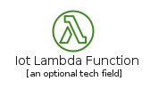 | [AwsIotLambdaFunction](InternetOfThings/AwsIotLambdaFunction.md) `elements/aws/InternetOfThings/AwsIotLambdaFunction` |
|  | [AwsIotLightbulb](InternetOfThings/AwsIotLightbulb.md) `elements/aws/InternetOfThings/AwsIotLightbulb` |
|  | [AwsIotMedicalEmergency](InternetOfThings/AwsIotMedicalEmergency.md) `elements/aws/InternetOfThings/AwsIotMedicalEmergency` |
|  | [AwsIotMqttProtocol](InternetOfThings/AwsIotMqttProtocol.md) `elements/aws/InternetOfThings/AwsIotMqttProtocol` |
|  | [AwsIotOverTheAirUpdate](InternetOfThings/AwsIotOverTheAirUpdate.md) `elements/aws/InternetOfThings/AwsIotOverTheAirUpdate` |
|  | [AwsIotPoliceEmergency](InternetOfThings/AwsIotPoliceEmergency.md) `elements/aws/InternetOfThings/AwsIotPoliceEmergency` |
| 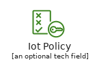 | [AwsIotPolicy](InternetOfThings/AwsIotPolicy.md) `elements/aws/InternetOfThings/AwsIotPolicy` |
|  | [AwsIotReportedState](InternetOfThings/AwsIotReportedState.md) `elements/aws/InternetOfThings/AwsIotReportedState` |
| 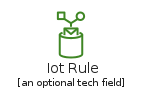 | [AwsIotRule](InternetOfThings/AwsIotRule.md) `elements/aws/InternetOfThings/AwsIotRule` |
|  | [AwsIotSensor](InternetOfThings/AwsIotSensor.md) `elements/aws/InternetOfThings/AwsIotSensor` |
|  | [AwsIotServo](InternetOfThings/AwsIotServo.md) `elements/aws/InternetOfThings/AwsIotServo` |
|  | [AwsIotShadow](InternetOfThings/AwsIotShadow.md) `elements/aws/InternetOfThings/AwsIotShadow` |
|  | [AwsIotSimulator](InternetOfThings/AwsIotSimulator.md) `elements/aws/InternetOfThings/AwsIotSimulator` |
|  | [AwsIotSitewise](InternetOfThings/AwsIotSitewise.md) `elements/aws/InternetOfThings/AwsIotSitewise` |
|  | [AwsIotThermostat](InternetOfThings/AwsIotThermostat.md) `elements/aws/InternetOfThings/AwsIotThermostat` |
|  | [AwsIotThingsGraph](InternetOfThings/AwsIotThingsGraph.md) `elements/aws/InternetOfThings/AwsIotThingsGraph` |
|  | [AwsIotTopic](InternetOfThings/AwsIotTopic.md) `elements/aws/InternetOfThings/AwsIotTopic` |
|  | [AwsIotTravel](InternetOfThings/AwsIotTravel.md) `elements/aws/InternetOfThings/AwsIotTravel` |
|  | [AwsIotUtility](InternetOfThings/AwsIotUtility.md) `elements/aws/InternetOfThings/AwsIotUtility` |
|  | [AwsIotWindfarm](InternetOfThings/AwsIotWindfarm.md) `elements/aws/InternetOfThings/AwsIotWindfarm` |
## elements/aws/MachineLearning
| | Name |
| :-: | --- |
|  | [AwsApacheMxnet](MachineLearning/AwsApacheMxnet.md) `elements/aws/MachineLearning/AwsApacheMxnet` |
|  | [AwsAugmentedAi](MachineLearning/AwsAugmentedAi.md) `elements/aws/MachineLearning/AwsAugmentedAi` |
|  | [AwsCodeguru](MachineLearning/AwsCodeguru.md) `elements/aws/MachineLearning/AwsCodeguru` |
|  | [AwsComprehend](MachineLearning/AwsComprehend.md) `elements/aws/MachineLearning/AwsComprehend` |
|  | [AwsDeepcomposer](MachineLearning/AwsDeepcomposer.md) `elements/aws/MachineLearning/AwsDeepcomposer` |
|  | [AwsDeepcomposerPrimaryBg](MachineLearning/AwsDeepcomposerPrimaryBg.md) `elements/aws/MachineLearning/AwsDeepcomposerPrimaryBg` |
|  | [AwsDeepLearningAmis](MachineLearning/AwsDeepLearningAmis.md) `elements/aws/MachineLearning/AwsDeepLearningAmis` |
|  | [AwsDeepLearningContainers](MachineLearning/AwsDeepLearningContainers.md) `elements/aws/MachineLearning/AwsDeepLearningContainers` |
|  | [AwsDeeplens](MachineLearning/AwsDeeplens.md) `elements/aws/MachineLearning/AwsDeeplens` |
|  | [AwsDeepracer](MachineLearning/AwsDeepracer.md) `elements/aws/MachineLearning/AwsDeepracer` |
|  | [AwsElasticInference](MachineLearning/AwsElasticInference.md) `elements/aws/MachineLearning/AwsElasticInference` |
|  | [AwsForecast](MachineLearning/AwsForecast.md) `elements/aws/MachineLearning/AwsForecast` |
|  | [AwsFraudDetector](MachineLearning/AwsFraudDetector.md) `elements/aws/MachineLearning/AwsFraudDetector` |
|  | [AwsKendra](MachineLearning/AwsKendra.md) `elements/aws/MachineLearning/AwsKendra` |
|  | [AwsLex](MachineLearning/AwsLex.md) `elements/aws/MachineLearning/AwsLex` |
|  | [AwsMachineLearning](MachineLearning/AwsMachineLearning.md) `elements/aws/MachineLearning/AwsMachineLearning` |
|  | [AwsPersonalize](MachineLearning/AwsPersonalize.md) `elements/aws/MachineLearning/AwsPersonalize` |
|  | [AwsPolly](MachineLearning/AwsPolly.md) `elements/aws/MachineLearning/AwsPolly` |
|  | [AwsRekognition](MachineLearning/AwsRekognition.md) `elements/aws/MachineLearning/AwsRekognition` |
|  | [AwsRekognitionImage](MachineLearning/AwsRekognitionImage.md) `elements/aws/MachineLearning/AwsRekognitionImage` |
|  | [AwsRekognitionVideo](MachineLearning/AwsRekognitionVideo.md) `elements/aws/MachineLearning/AwsRekognitionVideo` |
|  | [AwsSagemaker](MachineLearning/AwsSagemaker.md) `elements/aws/MachineLearning/AwsSagemaker` |
|  | [AwsSagemakerGroundTruth](MachineLearning/AwsSagemakerGroundTruth.md) `elements/aws/MachineLearning/AwsSagemakerGroundTruth` |
|  | [AwsSagemakerModel](MachineLearning/AwsSagemakerModel.md) `elements/aws/MachineLearning/AwsSagemakerModel` |
|  | [AwsSagemakerNotebook](MachineLearning/AwsSagemakerNotebook.md) `elements/aws/MachineLearning/AwsSagemakerNotebook` |
|  | [AwsSagemakerTrain](MachineLearning/AwsSagemakerTrain.md) `elements/aws/MachineLearning/AwsSagemakerTrain` |
|  | [AwsTensorflow](MachineLearning/AwsTensorflow.md) `elements/aws/MachineLearning/AwsTensorflow` |
|  | [AwsTextract](MachineLearning/AwsTextract.md) `elements/aws/MachineLearning/AwsTextract` |
|  | [AwsTranscribe](MachineLearning/AwsTranscribe.md) `elements/aws/MachineLearning/AwsTranscribe` |
|  | [AwsTranslate](MachineLearning/AwsTranslate.md) `elements/aws/MachineLearning/AwsTranslate` |
## elements/aws/ManagementGovernance
| | Name |
| :-: | --- |
|  | [AwsAppConfig](ManagementGovernance/AwsAppConfig.md) `elements/aws/ManagementGovernance/AwsAppConfig` |
|  | [AwsAutoScaling](ManagementGovernance/AwsAutoScaling.md) `elements/aws/ManagementGovernance/AwsAutoScaling` |
|  | [AwsCloudformationChangeSet](ManagementGovernance/AwsCloudformationChangeSet.md) `elements/aws/ManagementGovernance/AwsCloudformationChangeSet` |
|  | [AwsCloudformation](ManagementGovernance/AwsCloudformation.md) `elements/aws/ManagementGovernance/AwsCloudformation` |
|  | [AwsCloudformationStack](ManagementGovernance/AwsCloudformationStack.md) `elements/aws/ManagementGovernance/AwsCloudformationStack` |
|  | [AwsCloudformationTemplate](ManagementGovernance/AwsCloudformationTemplate.md) `elements/aws/ManagementGovernance/AwsCloudformationTemplate` |
|  | [AwsCloudtrail](ManagementGovernance/AwsCloudtrail.md) `elements/aws/ManagementGovernance/AwsCloudtrail` |
|  | [AwsCloudwatchAlarm](ManagementGovernance/AwsCloudwatchAlarm.md) `elements/aws/ManagementGovernance/AwsCloudwatchAlarm` |
|  | [AwsCloudwatch](ManagementGovernance/AwsCloudwatch.md) `elements/aws/ManagementGovernance/AwsCloudwatch` |
|  | [AwsCloudwatchEventEventBased](ManagementGovernance/AwsCloudwatchEventEventBased.md) `elements/aws/ManagementGovernance/AwsCloudwatchEventEventBased` |
|  | [AwsCloudwatchEventTimeBased](ManagementGovernance/AwsCloudwatchEventTimeBased.md) `elements/aws/ManagementGovernance/AwsCloudwatchEventTimeBased` |
|  | [AwsCloudwatchRule](ManagementGovernance/AwsCloudwatchRule.md) `elements/aws/ManagementGovernance/AwsCloudwatchRule` |
|  | [AwsCommandLineInterface](ManagementGovernance/AwsCommandLineInterface.md) `elements/aws/ManagementGovernance/AwsCommandLineInterface` |
|  | [AwsConfig](ManagementGovernance/AwsConfig.md) `elements/aws/ManagementGovernance/AwsConfig` |
|  | [AwsControlTower](ManagementGovernance/AwsControlTower.md) `elements/aws/ManagementGovernance/AwsControlTower` |
|  | [AwsLicenseManager](ManagementGovernance/AwsLicenseManager.md) `elements/aws/ManagementGovernance/AwsLicenseManager` |
|  | [AwsManagedServices](ManagementGovernance/AwsManagedServices.md) `elements/aws/ManagementGovernance/AwsManagedServices` |
|  | [AwsManagementAndGovernance](ManagementGovernance/AwsManagementAndGovernance.md) `elements/aws/ManagementGovernance/AwsManagementAndGovernance` |
|  | [AwsManagementConsole](ManagementGovernance/AwsManagementConsole.md) `elements/aws/ManagementGovernance/AwsManagementConsole` |
|  | [AwsOpsworksApps](ManagementGovernance/AwsOpsworksApps.md) `elements/aws/ManagementGovernance/AwsOpsworksApps` |
|  | [AwsOpsworksDeployments](ManagementGovernance/AwsOpsworksDeployments.md) `elements/aws/ManagementGovernance/AwsOpsworksDeployments` |
|  | [AwsOpsworks](ManagementGovernance/AwsOpsworks.md) `elements/aws/ManagementGovernance/AwsOpsworks` |
|  | [AwsOpsworksInstances](ManagementGovernance/AwsOpsworksInstances.md) `elements/aws/ManagementGovernance/AwsOpsworksInstances` |
|  | [AwsOpsworksLayers](ManagementGovernance/AwsOpsworksLayers.md) `elements/aws/ManagementGovernance/AwsOpsworksLayers` |
|  | [AwsOpsworksMonitoring](ManagementGovernance/AwsOpsworksMonitoring.md) `elements/aws/ManagementGovernance/AwsOpsworksMonitoring` |
|  | [AwsOpsworksPermissions](ManagementGovernance/AwsOpsworksPermissions.md) `elements/aws/ManagementGovernance/AwsOpsworksPermissions` |
|  | [AwsOpsworksResources](ManagementGovernance/AwsOpsworksResources.md) `elements/aws/ManagementGovernance/AwsOpsworksResources` |
| 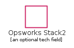 | [AwsOpsworksStack2](ManagementGovernance/AwsOpsworksStack2.md) `elements/aws/ManagementGovernance/AwsOpsworksStack2` |
|  | [AwsOrganizationsAccount](ManagementGovernance/AwsOrganizationsAccount.md) `elements/aws/ManagementGovernance/AwsOrganizationsAccount` |
|  | [AwsOrganizations](ManagementGovernance/AwsOrganizations.md) `elements/aws/ManagementGovernance/AwsOrganizations` |
|  | [AwsOrganizationsOrganizationalUnit](ManagementGovernance/AwsOrganizationsOrganizationalUnit.md) `elements/aws/ManagementGovernance/AwsOrganizationsOrganizationalUnit` |
|  | [AwsPersonalHealthDashboard](ManagementGovernance/AwsPersonalHealthDashboard.md) `elements/aws/ManagementGovernance/AwsPersonalHealthDashboard` |
|  | [AwsServiceCatalog](ManagementGovernance/AwsServiceCatalog.md) `elements/aws/ManagementGovernance/AwsServiceCatalog` |
|  | [AwsSystemsManagerAutomation](ManagementGovernance/AwsSystemsManagerAutomation.md) `elements/aws/ManagementGovernance/AwsSystemsManagerAutomation` |
|  | [AwsSystemsManagerDocuments](ManagementGovernance/AwsSystemsManagerDocuments.md) `elements/aws/ManagementGovernance/AwsSystemsManagerDocuments` |
|  | [AwsSystemsManager](ManagementGovernance/AwsSystemsManager.md) `elements/aws/ManagementGovernance/AwsSystemsManager` |
|  | [AwsSystemsManagerInventory](ManagementGovernance/AwsSystemsManagerInventory.md) `elements/aws/ManagementGovernance/AwsSystemsManagerInventory` |
|  | [AwsSystemsManagerMaintenanceWindows](ManagementGovernance/AwsSystemsManagerMaintenanceWindows.md) `elements/aws/ManagementGovernance/AwsSystemsManagerMaintenanceWindows` |
|  | [AwsSystemsManagerOpscenter](ManagementGovernance/AwsSystemsManagerOpscenter.md) `elements/aws/ManagementGovernance/AwsSystemsManagerOpscenter` |
| 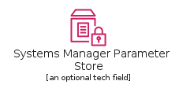 | [AwsSystemsManagerParameterStore](ManagementGovernance/AwsSystemsManagerParameterStore.md) `elements/aws/ManagementGovernance/AwsSystemsManagerParameterStore` |
|  | [AwsSystemsManagerPatchManager](ManagementGovernance/AwsSystemsManagerPatchManager.md) `elements/aws/ManagementGovernance/AwsSystemsManagerPatchManager` |
|  | [AwsSystemsManagerRunCommand](ManagementGovernance/AwsSystemsManagerRunCommand.md) `elements/aws/ManagementGovernance/AwsSystemsManagerRunCommand` |
|  | [AwsSystemsManagerStateManager](ManagementGovernance/AwsSystemsManagerStateManager.md) `elements/aws/ManagementGovernance/AwsSystemsManagerStateManager` |
|  | [AwsTrustedAdvisorChecklistCost](ManagementGovernance/AwsTrustedAdvisorChecklistCost.md) `elements/aws/ManagementGovernance/AwsTrustedAdvisorChecklistCost` |
|  | [AwsTrustedAdvisorChecklist](ManagementGovernance/AwsTrustedAdvisorChecklist.md) `elements/aws/ManagementGovernance/AwsTrustedAdvisorChecklist` |
|  | [AwsTrustedAdvisorChecklistFaultTolerant](ManagementGovernance/AwsTrustedAdvisorChecklistFaultTolerant.md) `elements/aws/ManagementGovernance/AwsTrustedAdvisorChecklistFaultTolerant` |
|  | [AwsTrustedAdvisorChecklistPerformance](ManagementGovernance/AwsTrustedAdvisorChecklistPerformance.md) `elements/aws/ManagementGovernance/AwsTrustedAdvisorChecklistPerformance` |
|  | [AwsTrustedAdvisorChecklistSecurity](ManagementGovernance/AwsTrustedAdvisorChecklistSecurity.md) `elements/aws/ManagementGovernance/AwsTrustedAdvisorChecklistSecurity` |
|  | [AwsTrustedAdvisor](ManagementGovernance/AwsTrustedAdvisor.md) `elements/aws/ManagementGovernance/AwsTrustedAdvisor` |
|  | [AwsWellArchitectedTool](ManagementGovernance/AwsWellArchitectedTool.md) `elements/aws/ManagementGovernance/AwsWellArchitectedTool` |
## elements/aws/MediaServices
| | Name |
| :-: | --- |
|  | [AwsElasticTranscoder](MediaServices/AwsElasticTranscoder.md) `elements/aws/MediaServices/AwsElasticTranscoder` |
|  | [AwsElementalConductor](MediaServices/AwsElementalConductor.md) `elements/aws/MediaServices/AwsElementalConductor` |
|  | [AwsElementalDelta](MediaServices/AwsElementalDelta.md) `elements/aws/MediaServices/AwsElementalDelta` |
|  | [AwsElementalLive](MediaServices/AwsElementalLive.md) `elements/aws/MediaServices/AwsElementalLive` |
|  | [AwsElementalMediaconnect](MediaServices/AwsElementalMediaconnect.md) `elements/aws/MediaServices/AwsElementalMediaconnect` |
|  | [AwsElementalMedialive](MediaServices/AwsElementalMedialive.md) `elements/aws/MediaServices/AwsElementalMedialive` |
|  | [AwsElementalMediapackage](MediaServices/AwsElementalMediapackage.md) `elements/aws/MediaServices/AwsElementalMediapackage` |
|  | [AwsElementalMediastore](MediaServices/AwsElementalMediastore.md) `elements/aws/MediaServices/AwsElementalMediastore` |
|  | [AwsElementalMediatailor](MediaServices/AwsElementalMediatailor.md) `elements/aws/MediaServices/AwsElementalMediatailor` |
|  | [AwsElementalServer](MediaServices/AwsElementalServer.md) `elements/aws/MediaServices/AwsElementalServer` |
|  | [AwsKinesisVideoStreams](MediaServices/AwsKinesisVideoStreams.md) `elements/aws/MediaServices/AwsKinesisVideoStreams` |
|  | [AwsMediaServices](MediaServices/AwsMediaServices.md) `elements/aws/MediaServices/AwsMediaServices` |
## elements/aws/MigrationTransfer
| | Name |
| :-: | --- |
|  | [AwsApplicationDiscoveryService](MigrationTransfer/AwsApplicationDiscoveryService.md) `elements/aws/MigrationTransfer/AwsApplicationDiscoveryService` |
|  | [AwsCloudendureMigration](MigrationTransfer/AwsCloudendureMigration.md) `elements/aws/MigrationTransfer/AwsCloudendureMigration` |
|  | [AwsDatabaseMigrationService](MigrationTransfer/AwsDatabaseMigrationService.md) `elements/aws/MigrationTransfer/AwsDatabaseMigrationService` |
|  | [AwsDatasyncAgent](MigrationTransfer/AwsDatasyncAgent.md) `elements/aws/MigrationTransfer/AwsDatasyncAgent` |
|  | [AwsDatasync](MigrationTransfer/AwsDatasync.md) `elements/aws/MigrationTransfer/AwsDatasync` |
|  | [AwsMigrationAndTransfer](MigrationTransfer/AwsMigrationAndTransfer.md) `elements/aws/MigrationTransfer/AwsMigrationAndTransfer` |
|  | [AwsMigrationHub](MigrationTransfer/AwsMigrationHub.md) `elements/aws/MigrationTransfer/AwsMigrationHub` |
|  | [AwsServerMigrationService](MigrationTransfer/AwsServerMigrationService.md) `elements/aws/MigrationTransfer/AwsServerMigrationService` |
|  | [AwsSnowballEdge](MigrationTransfer/AwsSnowballEdge.md) `elements/aws/MigrationTransfer/AwsSnowballEdge` |
|  | [AwsSnowball](MigrationTransfer/AwsSnowball.md) `elements/aws/MigrationTransfer/AwsSnowball` |
|  | [AwsSnowmobile](MigrationTransfer/AwsSnowmobile.md) `elements/aws/MigrationTransfer/AwsSnowmobile` |
|  | [AwsTransferFamily](MigrationTransfer/AwsTransferFamily.md) `elements/aws/MigrationTransfer/AwsTransferFamily` |
|  | [AwsTransferForFtpResourceIcon](MigrationTransfer/AwsTransferForFtpResourceIcon.md) `elements/aws/MigrationTransfer/AwsTransferForFtpResourceIcon` |
|  | [AwsTransferForFtpsResourceIcon](MigrationTransfer/AwsTransferForFtpsResourceIcon.md) `elements/aws/MigrationTransfer/AwsTransferForFtpsResourceIcon` |
|  | [AwsTransferForSftpResourceIcon](MigrationTransfer/AwsTransferForSftpResourceIcon.md) `elements/aws/MigrationTransfer/AwsTransferForSftpResourceIcon` |
## elements/aws/Mobile
| | Name |
| :-: | --- |
|  | [AwsAmplify](Mobile/AwsAmplify.md) `elements/aws/Mobile/AwsAmplify` |
|  | [AwsApiGateway](Mobile/AwsApiGateway.md) `elements/aws/Mobile/AwsApiGateway` |
|  | [AwsApiGatewayEndpoint](Mobile/AwsApiGatewayEndpoint.md) `elements/aws/Mobile/AwsApiGatewayEndpoint` |
| 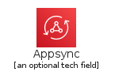 | [AwsAppsync](Mobile/AwsAppsync.md) `elements/aws/Mobile/AwsAppsync` |
|  | [AwsDeviceFarm](Mobile/AwsDeviceFarm.md) `elements/aws/Mobile/AwsDeviceFarm` |
|  | [AwsMobile](Mobile/AwsMobile.md) `elements/aws/Mobile/AwsMobile` |
|  | [AwsPinpoint](Mobile/AwsPinpoint.md) `elements/aws/Mobile/AwsPinpoint` |
## elements/aws/NetworkingContentDelivery
| | Name |
| :-: | --- |
| 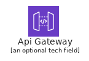 | [AwsApiGateway](NetworkingContentDelivery/AwsApiGateway.md) `elements/aws/NetworkingContentDelivery/AwsApiGateway` |
| 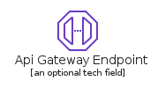 | [AwsApiGatewayEndpoint](NetworkingContentDelivery/AwsApiGatewayEndpoint.md) `elements/aws/NetworkingContentDelivery/AwsApiGatewayEndpoint` |
|  | [AwsAppMesh](NetworkingContentDelivery/AwsAppMesh.md) `elements/aws/NetworkingContentDelivery/AwsAppMesh` |
|  | [AwsClientVpn](NetworkingContentDelivery/AwsClientVpn.md) `elements/aws/NetworkingContentDelivery/AwsClientVpn` |
| 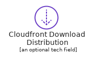 | [AwsCloudfrontDownloadDistribution](NetworkingContentDelivery/AwsCloudfrontDownloadDistribution.md) `elements/aws/NetworkingContentDelivery/AwsCloudfrontDownloadDistribution` |
|  | [AwsCloudfrontEdgeLocation](NetworkingContentDelivery/AwsCloudfrontEdgeLocation.md) `elements/aws/NetworkingContentDelivery/AwsCloudfrontEdgeLocation` |
|  | [AwsCloudfront](NetworkingContentDelivery/AwsCloudfront.md) `elements/aws/NetworkingContentDelivery/AwsCloudfront` |
|  | [AwsCloudfrontStreamingDistribution](NetworkingContentDelivery/AwsCloudfrontStreamingDistribution.md) `elements/aws/NetworkingContentDelivery/AwsCloudfrontStreamingDistribution` |
|  | [AwsCloudMap](NetworkingContentDelivery/AwsCloudMap.md) `elements/aws/NetworkingContentDelivery/AwsCloudMap` |
|  | [AwsDirectConnect](NetworkingContentDelivery/AwsDirectConnect.md) `elements/aws/NetworkingContentDelivery/AwsDirectConnect` |
|  | [AwsElasticLoadBalancingClassicLoadBalancer](NetworkingContentDelivery/AwsElasticLoadBalancingClassicLoadBalancer.md) `elements/aws/NetworkingContentDelivery/AwsElasticLoadBalancingClassicLoadBalancer` |
|  | [AwsElasticLoadBalancingElbApplicationLoadBalancer](NetworkingContentDelivery/AwsElasticLoadBalancingElbApplicationLoadBalancer.md) `elements/aws/NetworkingContentDelivery/AwsElasticLoadBalancingElbApplicationLoadBalancer` |
|  | [AwsElasticLoadBalancingElbNetworkLoadBalancer](NetworkingContentDelivery/AwsElasticLoadBalancingElbNetworkLoadBalancer.md) `elements/aws/NetworkingContentDelivery/AwsElasticLoadBalancingElbNetworkLoadBalancer` |
|  | [AwsElasticLoadBalancing](NetworkingContentDelivery/AwsElasticLoadBalancing.md) `elements/aws/NetworkingContentDelivery/AwsElasticLoadBalancing` |
|  | [AwsGlobalAccelerator](NetworkingContentDelivery/AwsGlobalAccelerator.md) `elements/aws/NetworkingContentDelivery/AwsGlobalAccelerator` |
| 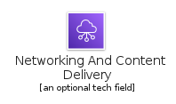 | [AwsNetworkingAndContentDelivery](NetworkingContentDelivery/AwsNetworkingAndContentDelivery.md) `elements/aws/NetworkingContentDelivery/AwsNetworkingAndContentDelivery` |
|  | [AwsPrivatelink](NetworkingContentDelivery/AwsPrivatelink.md) `elements/aws/NetworkingContentDelivery/AwsPrivatelink` |
|  | [AwsRoute53](NetworkingContentDelivery/AwsRoute53.md) `elements/aws/NetworkingContentDelivery/AwsRoute53` |
| 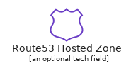 | [AwsRoute53HostedZone](NetworkingContentDelivery/AwsRoute53HostedZone.md) `elements/aws/NetworkingContentDelivery/AwsRoute53HostedZone` |
| 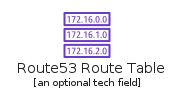 | [AwsRoute53RouteTable](NetworkingContentDelivery/AwsRoute53RouteTable.md) `elements/aws/NetworkingContentDelivery/AwsRoute53RouteTable` |
|  | [AwsSiteToSiteVpn](NetworkingContentDelivery/AwsSiteToSiteVpn.md) `elements/aws/NetworkingContentDelivery/AwsSiteToSiteVpn` |
|  | [AwsTransitGateway](NetworkingContentDelivery/AwsTransitGateway.md) `elements/aws/NetworkingContentDelivery/AwsTransitGateway` |
|  | [AwsVpcCustomerGateway](NetworkingContentDelivery/AwsVpcCustomerGateway.md) `elements/aws/NetworkingContentDelivery/AwsVpcCustomerGateway` |
| 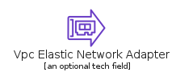 | [AwsVpcElasticNetworkAdapter](NetworkingContentDelivery/AwsVpcElasticNetworkAdapter.md) `elements/aws/NetworkingContentDelivery/AwsVpcElasticNetworkAdapter` |
|  | [AwsVpcElasticNetworkInterface](NetworkingContentDelivery/AwsVpcElasticNetworkInterface.md) `elements/aws/NetworkingContentDelivery/AwsVpcElasticNetworkInterface` |
| 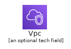 | [AwsVpc](NetworkingContentDelivery/AwsVpc.md) `elements/aws/NetworkingContentDelivery/AwsVpc` |
|  | [AwsVpcEndpoints](NetworkingContentDelivery/AwsVpcEndpoints.md) `elements/aws/NetworkingContentDelivery/AwsVpcEndpoints` |
|  | [AwsVpcFlowLogs](NetworkingContentDelivery/AwsVpcFlowLogs.md) `elements/aws/NetworkingContentDelivery/AwsVpcFlowLogs` |
|  | [AwsVpcInternetGateway](NetworkingContentDelivery/AwsVpcInternetGateway.md) `elements/aws/NetworkingContentDelivery/AwsVpcInternetGateway` |
|  | [AwsVpcNatGateway](NetworkingContentDelivery/AwsVpcNatGateway.md) `elements/aws/NetworkingContentDelivery/AwsVpcNatGateway` |
|  | [AwsVpcNetworkAccessControlList](NetworkingContentDelivery/AwsVpcNetworkAccessControlList.md) `elements/aws/NetworkingContentDelivery/AwsVpcNetworkAccessControlList` |
|  | [AwsVpcPeering](NetworkingContentDelivery/AwsVpcPeering.md) `elements/aws/NetworkingContentDelivery/AwsVpcPeering` |
|  | [AwsVpcRouter](NetworkingContentDelivery/AwsVpcRouter.md) `elements/aws/NetworkingContentDelivery/AwsVpcRouter` |
|  | [AwsVpcTrafficMirroring](NetworkingContentDelivery/AwsVpcTrafficMirroring.md) `elements/aws/NetworkingContentDelivery/AwsVpcTrafficMirroring` |
|  | [AwsVpcVpnConnection](NetworkingContentDelivery/AwsVpcVpnConnection.md) `elements/aws/NetworkingContentDelivery/AwsVpcVpnConnection` |
|  | [AwsVpcVpnGateway](NetworkingContentDelivery/AwsVpcVpnGateway.md) `elements/aws/NetworkingContentDelivery/AwsVpcVpnGateway` |
## elements/aws/QuantumTechnologies
| | Name |
| :-: | --- |
|  | [AwsBraket](QuantumTechnologies/AwsBraket.md) `elements/aws/QuantumTechnologies/AwsBraket` |
|  | [AwsQuantumTechnologies](QuantumTechnologies/AwsQuantumTechnologies.md) `elements/aws/QuantumTechnologies/AwsQuantumTechnologies` |
## elements/aws/Robotics
| | Name |
| :-: | --- |
|  | [AwsRobomakerCloudExtensionRos](Robotics/AwsRobomakerCloudExtensionRos.md) `elements/aws/Robotics/AwsRobomakerCloudExtensionRos` |
|  | [AwsRobomakerDevelopmentEnvironment](Robotics/AwsRobomakerDevelopmentEnvironment.md) `elements/aws/Robotics/AwsRobomakerDevelopmentEnvironment` |
|  | [AwsRobomaker](Robotics/AwsRobomaker.md) `elements/aws/Robotics/AwsRobomaker` |
|  | [AwsRobomakerFleetManagement](Robotics/AwsRobomakerFleetManagement.md) `elements/aws/Robotics/AwsRobomakerFleetManagement` |
|  | [AwsRobomakerSimulation](Robotics/AwsRobomakerSimulation.md) `elements/aws/Robotics/AwsRobomakerSimulation` |
|  | [AwsRobotics](Robotics/AwsRobotics.md) `elements/aws/Robotics/AwsRobotics` |
## elements/aws/Satellite
| | Name |
| :-: | --- |
|  | [AwsGroundStation](Satellite/AwsGroundStation.md) `elements/aws/Satellite/AwsGroundStation` |
|  | [AwsSatellite](Satellite/AwsSatellite.md) `elements/aws/Satellite/AwsSatellite` |
## elements/aws/SecurityIdentityCompliance
| | Name |
| :-: | --- |
|  | [AwsAdConnector](SecurityIdentityCompliance/AwsAdConnector.md) `elements/aws/SecurityIdentityCompliance/AwsAdConnector` |
| 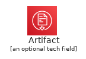 | [AwsArtifact](SecurityIdentityCompliance/AwsArtifact.md) `elements/aws/SecurityIdentityCompliance/AwsArtifact` |
|  | [AwsCertificateAuthority](SecurityIdentityCompliance/AwsCertificateAuthority.md) `elements/aws/SecurityIdentityCompliance/AwsCertificateAuthority` |
|  | [AwsCertificateManager](SecurityIdentityCompliance/AwsCertificateManager.md) `elements/aws/SecurityIdentityCompliance/AwsCertificateManager` |
|  | [AwsCloudDirectory](SecurityIdentityCompliance/AwsCloudDirectory.md) `elements/aws/SecurityIdentityCompliance/AwsCloudDirectory` |
|  | [AwsCloudhsm](SecurityIdentityCompliance/AwsCloudhsm.md) `elements/aws/SecurityIdentityCompliance/AwsCloudhsm` |
|  | [AwsCognito](SecurityIdentityCompliance/AwsCognito.md) `elements/aws/SecurityIdentityCompliance/AwsCognito` |
|  | [AwsDetective](SecurityIdentityCompliance/AwsDetective.md) `elements/aws/SecurityIdentityCompliance/AwsDetective` |
|  | [AwsDirectoryService](SecurityIdentityCompliance/AwsDirectoryService.md) `elements/aws/SecurityIdentityCompliance/AwsDirectoryService` |
|  | [AwsFirewallManager](SecurityIdentityCompliance/AwsFirewallManager.md) `elements/aws/SecurityIdentityCompliance/AwsFirewallManager` |
|  | [AwsGuardduty](SecurityIdentityCompliance/AwsGuardduty.md) `elements/aws/SecurityIdentityCompliance/AwsGuardduty` |
|  | [AwsIdentityAndAccessManagementIamAccessAnalyzer](SecurityIdentityCompliance/AwsIdentityAndAccessManagementIamAccessAnalyzer.md) `elements/aws/SecurityIdentityCompliance/AwsIdentityAndAccessManagementIamAccessAnalyzer` |
|  | [AwsIdentityAndAccessManagementIamAddOn](SecurityIdentityCompliance/AwsIdentityAndAccessManagementIamAddOn.md) `elements/aws/SecurityIdentityCompliance/AwsIdentityAndAccessManagementIamAddOn` |
|  | [AwsIdentityAndAccessManagementIamDataEncryptionKey](SecurityIdentityCompliance/AwsIdentityAndAccessManagementIamDataEncryptionKey.md) `elements/aws/SecurityIdentityCompliance/AwsIdentityAndAccessManagementIamDataEncryptionKey` |
|  | [AwsIdentityAndAccessManagementIam](SecurityIdentityCompliance/AwsIdentityAndAccessManagementIam.md) `elements/aws/SecurityIdentityCompliance/AwsIdentityAndAccessManagementIam` |
|  | [AwsIdentityAndAccessManagementIamEncryptedData](SecurityIdentityCompliance/AwsIdentityAndAccessManagementIamEncryptedData.md) `elements/aws/SecurityIdentityCompliance/AwsIdentityAndAccessManagementIamEncryptedData` |
|  | [AwsIdentityAndAccessManagementIamLongTermSecurityCredential](SecurityIdentityCompliance/AwsIdentityAndAccessManagementIamLongTermSecurityCredential.md) `elements/aws/SecurityIdentityCompliance/AwsIdentityAndAccessManagementIamLongTermSecurityCredential` |
|  | [AwsIdentityAndAccessManagementIamMfaToken](SecurityIdentityCompliance/AwsIdentityAndAccessManagementIamMfaToken.md) `elements/aws/SecurityIdentityCompliance/AwsIdentityAndAccessManagementIamMfaToken` |
|  | [AwsIdentityAndAccessManagementIamPermissions](SecurityIdentityCompliance/AwsIdentityAndAccessManagementIamPermissions.md) `elements/aws/SecurityIdentityCompliance/AwsIdentityAndAccessManagementIamPermissions` |
|  | [AwsIdentityAndAccessManagementIamRole](SecurityIdentityCompliance/AwsIdentityAndAccessManagementIamRole.md) `elements/aws/SecurityIdentityCompliance/AwsIdentityAndAccessManagementIamRole` |
|  | [AwsIdentityAndAccessManagementIamStsAlternate](SecurityIdentityCompliance/AwsIdentityAndAccessManagementIamStsAlternate.md) `elements/aws/SecurityIdentityCompliance/AwsIdentityAndAccessManagementIamStsAlternate` |
|  | [AwsIdentityAndAccessManagementIamSts](SecurityIdentityCompliance/AwsIdentityAndAccessManagementIamSts.md) `elements/aws/SecurityIdentityCompliance/AwsIdentityAndAccessManagementIamSts` |
|  | [AwsIdentityAndAccessManagementIamTemporarySecurityCredential](SecurityIdentityCompliance/AwsIdentityAndAccessManagementIamTemporarySecurityCredential.md) `elements/aws/SecurityIdentityCompliance/AwsIdentityAndAccessManagementIamTemporarySecurityCredential` |
|  | [AwsInspectorAgent](SecurityIdentityCompliance/AwsInspectorAgent.md) `elements/aws/SecurityIdentityCompliance/AwsInspectorAgent` |
|  | [AwsInspector](SecurityIdentityCompliance/AwsInspector.md) `elements/aws/SecurityIdentityCompliance/AwsInspector` |
|  | [AwsKeyManagementService](SecurityIdentityCompliance/AwsKeyManagementService.md) `elements/aws/SecurityIdentityCompliance/AwsKeyManagementService` |
|  | [AwsMacie](SecurityIdentityCompliance/AwsMacie.md) `elements/aws/SecurityIdentityCompliance/AwsMacie` |
|  | [AwsManagedMicrosoftAd](SecurityIdentityCompliance/AwsManagedMicrosoftAd.md) `elements/aws/SecurityIdentityCompliance/AwsManagedMicrosoftAd` |
|  | [AwsResourceAccessManager](SecurityIdentityCompliance/AwsResourceAccessManager.md) `elements/aws/SecurityIdentityCompliance/AwsResourceAccessManager` |
|  | [AwsSecretsManager](SecurityIdentityCompliance/AwsSecretsManager.md) `elements/aws/SecurityIdentityCompliance/AwsSecretsManager` |
|  | [AwsSecurityHub](SecurityIdentityCompliance/AwsSecurityHub.md) `elements/aws/SecurityIdentityCompliance/AwsSecurityHub` |
|  | [AwsSecurityHubFinding](SecurityIdentityCompliance/AwsSecurityHubFinding.md) `elements/aws/SecurityIdentityCompliance/AwsSecurityHubFinding` |
|  | [AwsSecurityIdentityAndCompliance](SecurityIdentityCompliance/AwsSecurityIdentityAndCompliance.md) `elements/aws/SecurityIdentityCompliance/AwsSecurityIdentityAndCompliance` |
|  | [AwsShield](SecurityIdentityCompliance/AwsShield.md) `elements/aws/SecurityIdentityCompliance/AwsShield` |
|  | [AwsShieldShieldAdvanced](SecurityIdentityCompliance/AwsShieldShieldAdvanced.md) `elements/aws/SecurityIdentityCompliance/AwsShieldShieldAdvanced` |
|  | [AwsSimpleAd](SecurityIdentityCompliance/AwsSimpleAd.md) `elements/aws/SecurityIdentityCompliance/AwsSimpleAd` |
|  | [AwsSingleSignOn](SecurityIdentityCompliance/AwsSingleSignOn.md) `elements/aws/SecurityIdentityCompliance/AwsSingleSignOn` |
|  | [AwsWaf](SecurityIdentityCompliance/AwsWaf.md) `elements/aws/SecurityIdentityCompliance/AwsWaf` |
|  | [AwsWafFilteringRule](SecurityIdentityCompliance/AwsWafFilteringRule.md) `elements/aws/SecurityIdentityCompliance/AwsWafFilteringRule` |
## elements/aws/Storage
| | Name |
| :-: | --- |
|  | [AwsBackup](Storage/AwsBackup.md) `elements/aws/Storage/AwsBackup` |
|  | [AwsCloudendureDisasterRecovery](Storage/AwsCloudendureDisasterRecovery.md) `elements/aws/Storage/AwsCloudendureDisasterRecovery` |
|  | [AwsEfsInfrequentaccess](Storage/AwsEfsInfrequentaccess.md) `elements/aws/Storage/AwsEfsInfrequentaccess` |
|  | [AwsEfsInfrequentaccessPrimaryBg](Storage/AwsEfsInfrequentaccessPrimaryBg.md) `elements/aws/Storage/AwsEfsInfrequentaccessPrimaryBg` |
|  | [AwsEfsStandard](Storage/AwsEfsStandard.md) `elements/aws/Storage/AwsEfsStandard` |
|  | [AwsEfsStandardPrimaryBg](Storage/AwsEfsStandardPrimaryBg.md) `elements/aws/Storage/AwsEfsStandardPrimaryBg` |
|  | [AwsElasticBlockStoreEbs](Storage/AwsElasticBlockStoreEbs.md) `elements/aws/Storage/AwsElasticBlockStoreEbs` |
|  | [AwsElasticBlockStoreEbsSnapshot](Storage/AwsElasticBlockStoreEbsSnapshot.md) `elements/aws/Storage/AwsElasticBlockStoreEbsSnapshot` |
|  | [AwsElasticBlockStoreEbsVolume](Storage/AwsElasticBlockStoreEbsVolume.md) `elements/aws/Storage/AwsElasticBlockStoreEbsVolume` |
|  | [AwsElasticFileSystemEfs](Storage/AwsElasticFileSystemEfs.md) `elements/aws/Storage/AwsElasticFileSystemEfs` |
|  | [AwsElasticFileSystemEfsFileSystem](Storage/AwsElasticFileSystemEfsFileSystem.md) `elements/aws/Storage/AwsElasticFileSystemEfsFileSystem` |
|  | [AwsFsx](Storage/AwsFsx.md) `elements/aws/Storage/AwsFsx` |
|  | [AwsFsxForLustre](Storage/AwsFsxForLustre.md) `elements/aws/Storage/AwsFsxForLustre` |
|  | [AwsFsxForWindowsFileServer](Storage/AwsFsxForWindowsFileServer.md) `elements/aws/Storage/AwsFsxForWindowsFileServer` |
|  | [AwsGeneralAccessPointsDarkBg](Storage/AwsGeneralAccessPointsDarkBg.md) `elements/aws/Storage/AwsGeneralAccessPointsDarkBg` |
|  | [AwsMultipleVolumesResourceIcon](Storage/AwsMultipleVolumesResourceIcon.md) `elements/aws/Storage/AwsMultipleVolumesResourceIcon` |
|  | [AwsS3GlacierArchive](Storage/AwsS3GlacierArchive.md) `elements/aws/Storage/AwsS3GlacierArchive` |
|  | [AwsS3Glacier](Storage/AwsS3Glacier.md) `elements/aws/Storage/AwsS3Glacier` |
|  | [AwsS3GlacierVault](Storage/AwsS3GlacierVault.md) `elements/aws/Storage/AwsS3GlacierVault` |
|  | [AwsSimpleStorageServiceS3Bucket](Storage/AwsSimpleStorageServiceS3Bucket.md) `elements/aws/Storage/AwsSimpleStorageServiceS3Bucket` |
|  | [AwsSimpleStorageServiceS3BucketWithObjects](Storage/AwsSimpleStorageServiceS3BucketWithObjects.md) `elements/aws/Storage/AwsSimpleStorageServiceS3BucketWithObjects` |
|  | [AwsSimpleStorageServiceS3](Storage/AwsSimpleStorageServiceS3.md) `elements/aws/Storage/AwsSimpleStorageServiceS3` |
|  | [AwsSimpleStorageServiceS3Object](Storage/AwsSimpleStorageServiceS3Object.md) `elements/aws/Storage/AwsSimpleStorageServiceS3Object` |
|  | [AwsSnowballEdge](Storage/AwsSnowballEdge.md) `elements/aws/Storage/AwsSnowballEdge` |
|  | [AwsSnowball](Storage/AwsSnowball.md) `elements/aws/Storage/AwsSnowball` |
|  | [AwsSnowFamilySnowballImportExport](Storage/AwsSnowFamilySnowballImportExport.md) `elements/aws/Storage/AwsSnowFamilySnowballImportExport` |
|  | [AwsSnowmobile](Storage/AwsSnowmobile.md) `elements/aws/Storage/AwsSnowmobile` |
|  | [AwsStorage](Storage/AwsStorage.md) `elements/aws/Storage/AwsStorage` |
|  | [AwsStorageGatewayCachedVolume](Storage/AwsStorageGatewayCachedVolume.md) `elements/aws/Storage/AwsStorageGatewayCachedVolume` |
|  | [AwsStorageGateway](Storage/AwsStorageGateway.md) `elements/aws/Storage/AwsStorageGateway` |
|  | [AwsStorageGatewayFileGateway](Storage/AwsStorageGatewayFileGateway.md) `elements/aws/Storage/AwsStorageGatewayFileGateway` |
|  | [AwsStorageGatewayNonCachedVolume](Storage/AwsStorageGatewayNonCachedVolume.md) `elements/aws/Storage/AwsStorageGatewayNonCachedVolume` |
|  | [AwsStorageGatewayTapeGateway](Storage/AwsStorageGatewayTapeGateway.md) `elements/aws/Storage/AwsStorageGatewayTapeGateway` |
|  | [AwsStorageGatewayVirtualTapeLibrary](Storage/AwsStorageGatewayVirtualTapeLibrary.md) `elements/aws/Storage/AwsStorageGatewayVirtualTapeLibrary` |
|  | [AwsStorageGatewayVolumeGateway](Storage/AwsStorageGatewayVolumeGateway.md) `elements/aws/Storage/AwsStorageGatewayVolumeGateway` |
|  | [AwsVpcAccessPointsDarkBg](Storage/AwsVpcAccessPointsDarkBg.md) `elements/aws/Storage/AwsVpcAccessPointsDarkBg` |
