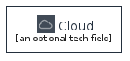
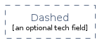

# aws - Groups
## groups/aws
| | Name |
| :-: | --- |
|  | [AwsGroupAutoScaling](AwsGroupAutoScaling.md) `groups/aws/AwsGroupAutoScaling` |
|  | [AwsGroupAvailabilityZone](AwsGroupAvailabilityZone.md) `groups/aws/AwsGroupAvailabilityZone` |
|  | [AwsGroupCloudAws](AwsGroupCloudAws.md) `groups/aws/AwsGroupCloudAws` |
|  | [AwsGroupCloud](AwsGroupCloud.md) `groups/aws/AwsGroupCloud` |
|  | [AwsGroupContainerRegistryService](AwsGroupContainerRegistryService.md) `groups/aws/AwsGroupContainerRegistryService` |
|  | [AwsGroupCorporateDataCenter](AwsGroupCorporateDataCenter.md) `groups/aws/AwsGroupCorporateDataCenter` |
|  | [AwsGroupDashed](AwsGroupDashed.md) `groups/aws/AwsGroupDashed` |
|  | [AwsGroupEc2InstanceContents](AwsGroupEc2InstanceContents.md) `groups/aws/AwsGroupEc2InstanceContents` |
|  | [AwsGroupEcsContainer](AwsGroupEcsContainer.md) `groups/aws/AwsGroupEcsContainer` |
|  | [AwsGroupEcsService](AwsGroupEcsService.md) `groups/aws/AwsGroupEcsService` |
|  | [AwsGroupEcsTask](AwsGroupEcsTask.md) `groups/aws/AwsGroupEcsTask` |
|  | [AwsGroupEksContainer](AwsGroupEksContainer.md) `groups/aws/AwsGroupEksContainer` |
|  | [AwsGroupEksPod](AwsGroupEksPod.md) `groups/aws/AwsGroupEksPod` |
|  | [AwsGroupEksService](AwsGroupEksService.md) `groups/aws/AwsGroupEksService` |
|  | [AwsGroupElasticBeanstalkContainer](AwsGroupElasticBeanstalkContainer.md) `groups/aws/AwsGroupElasticBeanstalkContainer` |
|  | [AwsGroupElasticContainerService](AwsGroupElasticContainerService.md) `groups/aws/AwsGroupElasticContainerService` |
|  | [AwsGroupElasticKubernetesService](AwsGroupElasticKubernetesService.md) `groups/aws/AwsGroupElasticKubernetesService` |
|  | [AwsGroupPlain](AwsGroupPlain.md) `groups/aws/AwsGroupPlain` |
|  | [AwsGroupPrivateSubnet](AwsGroupPrivateSubnet.md) `groups/aws/AwsGroupPrivateSubnet` |
|  | [AwsGroupPublicSubnet](AwsGroupPublicSubnet.md) `groups/aws/AwsGroupPublicSubnet` |
|  | [AwsGroupRegion](AwsGroupRegion.md) `groups/aws/AwsGroupRegion` |
|  | [AwsGroupSecurity](AwsGroupSecurity.md) `groups/aws/AwsGroupSecurity` |
|  | [AwsGroupServerContents](AwsGroupServerContents.md) `groups/aws/AwsGroupServerContents` |
|  | [AwsGroupSpotFleet](AwsGroupSpotFleet.md) `groups/aws/AwsGroupSpotFleet` |
|  | [AwsGroupStepFunctionsWorkflow](AwsGroupStepFunctionsWorkflow.md) `groups/aws/AwsGroupStepFunctionsWorkflow` |
|  | [AwsGroupVpc](AwsGroupVpc.md) `groups/aws/AwsGroupVpc` |
