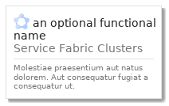

# AzureServiceFabricClusters
```text
elements/azure/ComputeServiceColor/AzureServiceFabricClusters
```
| Icon | Element | Card |
| :-: | :-: | --- |
|  |  |  |
## Element
### Load remotely
```plantuml
@startuml
' configures the library
!global $LIB_BRANCH="master"
!global $LIB_BASE_LOCATION="https://raw.githubusercontent.com/tmorin/plantuml-libs/" + $LIB_BRANCH + "/cloud"

' loads the library
!includeurl $LIB_BASE_LOCATION/library.puml

' loads the style
include('styles/azure')

' loads the AzureServiceFabricClusters element
include('elements/azure/ComputeServiceColor/AzureServiceFabricClusters')
AzureServiceFabricClusters('element', 'Service Fabric Clusters', 'an optional tech field')
@enduml
```
### Load locally
```plantuml
@startuml
' configures the library
!global $INCLUSION_MODE="local"
!global $LIB_BASE_LOCATION="../../../"

' loads the library
!include ../../../library.puml

' loads the style
include('styles/azure')

' loads the AzureServiceFabricClusters element
include('elements/azure/ComputeServiceColor/AzureServiceFabricClusters')
AzureServiceFabricClusters('element', 'Service Fabric Clusters', 'an optional tech field')
@enduml
```
## Card
### Load remotely
```plantuml
@startuml
' configures the library
!global $LIB_BRANCH="master"
!global $LIB_BASE_LOCATION="https://raw.githubusercontent.com/tmorin/plantuml-libs/" + $LIB_BRANCH + "/cloud"

' loads the library
!includeurl $LIB_BASE_LOCATION/library.puml

' loads the style
include('styles/azure')

' loads the AzureServiceFabricClusters card
include('elements/azure/ComputeServiceColor/AzureServiceFabricClusters')
AzureServiceFabricClustersCard('card', 'an optional functional name', 'Molestiae praesentium aut natus dolorem. Aut consequatur fugiat a consequatur ut.')
@enduml
```
### Load locally
```plantuml
@startuml
' configures the library
!global $INCLUSION_MODE="local"
!global $LIB_BASE_LOCATION="../../../"

' loads the library
!include ../../../library.puml

' loads the style
include('styles/azure')

' loads the AzureServiceFabricClusters card
include('elements/azure/ComputeServiceColor/AzureServiceFabricClusters')
AzureServiceFabricClustersCard('card', 'an optional functional name', 'Molestiae praesentium aut natus dolorem. Aut consequatur fugiat a consequatur ut.')
@enduml
```
