# azure - Elements
## elements/azure/AiAndMlServiceColor
| | Name |
| :-: | --- |
|  | [AzureBatchAi](AiAndMlServiceColor/AzureBatchAi.md) `elements/azure/AiAndMlServiceColor/AzureBatchAi` |
|  | [AzureBotServices](AiAndMlServiceColor/AzureBotServices.md) `elements/azure/AiAndMlServiceColor/AzureBotServices` |
|  | [AzureCognitiveServices](AiAndMlServiceColor/AzureCognitiveServices.md) `elements/azure/AiAndMlServiceColor/AzureCognitiveServices` |
|  | [AzureGenomicsAccounts](AiAndMlServiceColor/AzureGenomicsAccounts.md) `elements/azure/AiAndMlServiceColor/AzureGenomicsAccounts` |
|  | [AzureMachineLearningServiceWorkspaces](AiAndMlServiceColor/AzureMachineLearningServiceWorkspaces.md) `elements/azure/AiAndMlServiceColor/AzureMachineLearningServiceWorkspaces` |
|  | [AzureMachineLearningStudioWebServicePlans](AiAndMlServiceColor/AzureMachineLearningStudioWebServicePlans.md) `elements/azure/AiAndMlServiceColor/AzureMachineLearningStudioWebServicePlans` |
|  | [AzureMachineLearningStudioWebServices](AiAndMlServiceColor/AzureMachineLearningStudioWebServices.md) `elements/azure/AiAndMlServiceColor/AzureMachineLearningStudioWebServices` |
|  | [AzureMachineLearningStudioWorkspaces](AiAndMlServiceColor/AzureMachineLearningStudioWorkspaces.md) `elements/azure/AiAndMlServiceColor/AzureMachineLearningStudioWorkspaces` |
## elements/azure/AnalyticsServiceColor
| | Name |
| :-: | --- |
|  | [AzureAnalysisServices](AnalyticsServiceColor/AzureAnalysisServices.md) `elements/azure/AnalyticsServiceColor/AzureAnalysisServices` |
|  | [AzureDatabricks](AnalyticsServiceColor/AzureDatabricks.md) `elements/azure/AnalyticsServiceColor/AzureDatabricks` |
|  | [AzureDataExplorerClusters](AnalyticsServiceColor/AzureDataExplorerClusters.md) `elements/azure/AnalyticsServiceColor/AzureDataExplorerClusters` |
|  | [AzureDataFactories](AnalyticsServiceColor/AzureDataFactories.md) `elements/azure/AnalyticsServiceColor/AzureDataFactories` |
|  | [AzureDataLakeAnalytics](AnalyticsServiceColor/AzureDataLakeAnalytics.md) `elements/azure/AnalyticsServiceColor/AzureDataLakeAnalytics` |
|  | [AzureDataLakeStoreGen1](AnalyticsServiceColor/AzureDataLakeStoreGen1.md) `elements/azure/AnalyticsServiceColor/AzureDataLakeStoreGen1` |
|  | [AzureEventHubClusters](AnalyticsServiceColor/AzureEventHubClusters.md) `elements/azure/AnalyticsServiceColor/AzureEventHubClusters` |
|  | [AzureEventHubs](AnalyticsServiceColor/AzureEventHubs.md) `elements/azure/AnalyticsServiceColor/AzureEventHubs` |
|  | [AzureHdinsightclusters](AnalyticsServiceColor/AzureHdinsightclusters.md) `elements/azure/AnalyticsServiceColor/AzureHdinsightclusters` |
|  | [AzureLogAnalyticsWorkspaces](AnalyticsServiceColor/AzureLogAnalyticsWorkspaces.md) `elements/azure/AnalyticsServiceColor/AzureLogAnalyticsWorkspaces` |
|  | [AzureStreamAnalyticsJobs](AnalyticsServiceColor/AzureStreamAnalyticsJobs.md) `elements/azure/AnalyticsServiceColor/AzureStreamAnalyticsJobs` |
## elements/azure/Companies
| | Name |
| :-: | --- |
|  | [AzureCacheRedisProductIcon](Companies/AzureCacheRedisProductIcon.md) `elements/azure/Companies/AzureCacheRedisProductIcon` |
|  | [AzureCloudCycle](Companies/AzureCloudCycle.md) `elements/azure/Companies/AzureCloudCycle` |
|  | [AzureDatabricks](Companies/AzureDatabricks.md) `elements/azure/Companies/AzureDatabricks` |
|  | [AzureHdinsightColor](Companies/AzureHdinsightColor.md) `elements/azure/Companies/AzureHdinsightColor` |
|  | [AzureHdInsight](Companies/AzureHdInsight.md) `elements/azure/Companies/AzureHdInsight` |
|  | [AzureHockeyappColor](Companies/AzureHockeyappColor.md) `elements/azure/Companies/AzureHockeyappColor` |
|  | [AzureHockeyapp](Companies/AzureHockeyapp.md) `elements/azure/Companies/AzureHockeyapp` |
|  | [AzureKubernetes](Companies/AzureKubernetes.md) `elements/azure/Companies/AzureKubernetes` |
|  | [AzureLogoDcOs](Companies/AzureLogoDcOs.md) `elements/azure/Companies/AzureLogoDcOs` |
|  | [AzureLogoDocker](Companies/AzureLogoDocker.md) `elements/azure/Companies/AzureLogoDocker` |
|  | [AzureLogoPluralsightMono](Companies/AzureLogoPluralsightMono.md) `elements/azure/Companies/AzureLogoPluralsightMono` |
|  | [AzureLogoPluralsightTwotone](Companies/AzureLogoPluralsightTwotone.md) `elements/azure/Companies/AzureLogoPluralsightTwotone` |
|  | [AzureOpenshift](Companies/AzureOpenshift.md) `elements/azure/Companies/AzureOpenshift` |
|  | [AzureStackoverflow](Companies/AzureStackoverflow.md) `elements/azure/Companies/AzureStackoverflow` |
|  | [AzureWebappumbraco](Companies/AzureWebappumbraco.md) `elements/azure/Companies/AzureWebappumbraco` |
|  | [AzureWebappwordpress](Companies/AzureWebappwordpress.md) `elements/azure/Companies/AzureWebappwordpress` |
## elements/azure/ComputeServiceColor
| | Name |
| :-: | --- |
|  | [AzureBatchAccounts](ComputeServiceColor/AzureBatchAccounts.md) `elements/azure/ComputeServiceColor/AzureBatchAccounts` |
|  | [AzureCitrixVirtualDesktopsEssentials](ComputeServiceColor/AzureCitrixVirtualDesktopsEssentials.md) `elements/azure/ComputeServiceColor/AzureCitrixVirtualDesktopsEssentials` |
|  | [AzureCloudServicesClassic](ComputeServiceColor/AzureCloudServicesClassic.md) `elements/azure/ComputeServiceColor/AzureCloudServicesClassic` |
|  | [AzureCloudServices](ComputeServiceColor/AzureCloudServices.md) `elements/azure/ComputeServiceColor/AzureCloudServices` |
|  | [AzureCloudsimpleVirtualMachines](ComputeServiceColor/AzureCloudsimpleVirtualMachines.md) `elements/azure/ComputeServiceColor/AzureCloudsimpleVirtualMachines` |
| 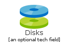 | [AzureDisks](ComputeServiceColor/AzureDisks.md) `elements/azure/ComputeServiceColor/AzureDisks` |
|  | [AzureDiskSnapshots](ComputeServiceColor/AzureDiskSnapshots.md) `elements/azure/ComputeServiceColor/AzureDiskSnapshots` |
|  | [AzureFunctionApps](ComputeServiceColor/AzureFunctionApps.md) `elements/azure/ComputeServiceColor/AzureFunctionApps` |
|  | [AzureMeshApplications](ComputeServiceColor/AzureMeshApplications.md) `elements/azure/ComputeServiceColor/AzureMeshApplications` |
|  | [AzureSapHana](ComputeServiceColor/AzureSapHana.md) `elements/azure/ComputeServiceColor/AzureSapHana` |
|  | [AzureServiceFabricClusters](ComputeServiceColor/AzureServiceFabricClusters.md) `elements/azure/ComputeServiceColor/AzureServiceFabricClusters` |
|  | [AzureVmImages](ComputeServiceColor/AzureVmImages.md) `elements/azure/ComputeServiceColor/AzureVmImages` |
## elements/azure/ComputeServiceColor/Vm
| | Name |
| :-: | --- |
|  | [AzureAvailabilitySets](ComputeServiceColor/Vm/AzureAvailabilitySets.md) `elements/azure/ComputeServiceColor/Vm/AzureAvailabilitySets` |
|  | [AzureNonMachine](ComputeServiceColor/Vm/AzureNonMachine.md) `elements/azure/ComputeServiceColor/Vm/AzureNonMachine` |
|  | [AzureOsImagesClassic](ComputeServiceColor/Vm/AzureOsImagesClassic.md) `elements/azure/ComputeServiceColor/Vm/AzureOsImagesClassic` |
|  | [AzureVmClassic](ComputeServiceColor/Vm/AzureVmClassic.md) `elements/azure/ComputeServiceColor/Vm/AzureVmClassic` |
|  | [AzureVm](ComputeServiceColor/Vm/AzureVm.md) `elements/azure/ComputeServiceColor/Vm/AzureVm` |
|  | [AzureVmExternal](ComputeServiceColor/Vm/AzureVmExternal.md) `elements/azure/ComputeServiceColor/Vm/AzureVmExternal` |
|  | [AzureVmLinux](ComputeServiceColor/Vm/AzureVmLinux.md) `elements/azure/ComputeServiceColor/Vm/AzureVmLinux` |
|  | [AzureVmLinuxExternal](ComputeServiceColor/Vm/AzureVmLinuxExternal.md) `elements/azure/ComputeServiceColor/Vm/AzureVmLinuxExternal` |
| 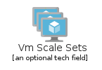 | [AzureVmScaleSets](ComputeServiceColor/Vm/AzureVmScaleSets.md) `elements/azure/ComputeServiceColor/Vm/AzureVmScaleSets` |
|  | [AzureVmWindows](ComputeServiceColor/Vm/AzureVmWindows.md) `elements/azure/ComputeServiceColor/Vm/AzureVmWindows` |
|  | [AzureVmWindowsExternal](ComputeServiceColor/Vm/AzureVmWindowsExternal.md) `elements/azure/ComputeServiceColor/Vm/AzureVmWindowsExternal` |
## elements/azure/ContainerServiceColor
| | Name |
| :-: | --- |
|  | [AzureContainerInstances](ContainerServiceColor/AzureContainerInstances.md) `elements/azure/ContainerServiceColor/AzureContainerInstances` |
|  | [AzureContainerRegistries](ContainerServiceColor/AzureContainerRegistries.md) `elements/azure/ContainerServiceColor/AzureContainerRegistries` |
|  | [AzureKubernetesServices](ContainerServiceColor/AzureKubernetesServices.md) `elements/azure/ContainerServiceColor/AzureKubernetesServices` |
## elements/azure/DatabasesServiceColor
| | Name |
| :-: | --- |
|  | [AzureBlobStorage](DatabasesServiceColor/AzureBlobStorage.md) `elements/azure/DatabasesServiceColor/AzureBlobStorage` |
|  | [AzureCacheForRedis](DatabasesServiceColor/AzureCacheForRedis.md) `elements/azure/DatabasesServiceColor/AzureCacheForRedis` |
|  | [AzureCachePlusRedis](DatabasesServiceColor/AzureCachePlusRedis.md) `elements/azure/DatabasesServiceColor/AzureCachePlusRedis` |
|  | [AzureCosmosDb](DatabasesServiceColor/AzureCosmosDb.md) `elements/azure/DatabasesServiceColor/AzureCosmosDb` |
|  | [AzureDatabaseForMariadbServers](DatabasesServiceColor/AzureDatabaseForMariadbServers.md) `elements/azure/DatabasesServiceColor/AzureDatabaseForMariadbServers` |
|  | [AzureDatabaseForMysqlServers](DatabasesServiceColor/AzureDatabaseForMysqlServers.md) `elements/azure/DatabasesServiceColor/AzureDatabaseForMysqlServers` |
|  | [AzureDatabaseForPostgresqlServers](DatabasesServiceColor/AzureDatabaseForPostgresqlServers.md) `elements/azure/DatabasesServiceColor/AzureDatabaseForPostgresqlServers` |
|  | [AzureDatabaseGeneric](DatabasesServiceColor/AzureDatabaseGeneric.md) `elements/azure/DatabasesServiceColor/AzureDatabaseGeneric` |
|  | [AzureDataLake](DatabasesServiceColor/AzureDataLake.md) `elements/azure/DatabasesServiceColor/AzureDataLake` |
|  | [AzureElasticDatabasePools](DatabasesServiceColor/AzureElasticDatabasePools.md) `elements/azure/DatabasesServiceColor/AzureElasticDatabasePools` |
|  | [AzureElasticJobAgents](DatabasesServiceColor/AzureElasticJobAgents.md) `elements/azure/DatabasesServiceColor/AzureElasticJobAgents` |
|  | [AzureManagedDatabases](DatabasesServiceColor/AzureManagedDatabases.md) `elements/azure/DatabasesServiceColor/AzureManagedDatabases` |
|  | [AzureSqlDatabases](DatabasesServiceColor/AzureSqlDatabases.md) `elements/azure/DatabasesServiceColor/AzureSqlDatabases` |
|  | [AzureSqlDatawarehouse](DatabasesServiceColor/AzureSqlDatawarehouse.md) `elements/azure/DatabasesServiceColor/AzureSqlDatawarehouse` |
|  | [AzureSqlManagedInstances](DatabasesServiceColor/AzureSqlManagedInstances.md) `elements/azure/DatabasesServiceColor/AzureSqlManagedInstances` |
|  | [AzureSqlServers](DatabasesServiceColor/AzureSqlServers.md) `elements/azure/DatabasesServiceColor/AzureSqlServers` |
|  | [AzureSqlServerStretchDatabases](DatabasesServiceColor/AzureSqlServerStretchDatabases.md) `elements/azure/DatabasesServiceColor/AzureSqlServerStretchDatabases` |
|  | [AzureVirtualClusters](DatabasesServiceColor/AzureVirtualClusters.md) `elements/azure/DatabasesServiceColor/AzureVirtualClusters` |
|  | [AzureVirtualDatacenter](DatabasesServiceColor/AzureVirtualDatacenter.md) `elements/azure/DatabasesServiceColor/AzureVirtualDatacenter` |
## elements/azure/DevopsServiceColor
| | Name |
| :-: | --- |
|  | [AzureApplicationInsights](DevopsServiceColor/AzureApplicationInsights.md) `elements/azure/DevopsServiceColor/AzureApplicationInsights` |
|  | [AzureArtifacts](DevopsServiceColor/AzureArtifacts.md) `elements/azure/DevopsServiceColor/AzureArtifacts` |
|  | [AzureBoards](DevopsServiceColor/AzureBoards.md) `elements/azure/DevopsServiceColor/AzureBoards` |
|  | [AzureDevops](DevopsServiceColor/AzureDevops.md) `elements/azure/DevopsServiceColor/AzureDevops` |
|  | [AzureDevtestLabs](DevopsServiceColor/AzureDevtestLabs.md) `elements/azure/DevopsServiceColor/AzureDevtestLabs` |
|  | [AzurePipelines](DevopsServiceColor/AzurePipelines.md) `elements/azure/DevopsServiceColor/AzurePipelines` |
|  | [AzureRepos](DevopsServiceColor/AzureRepos.md) `elements/azure/DevopsServiceColor/AzureRepos` |
|  | [AzureTestPlans](DevopsServiceColor/AzureTestPlans.md) `elements/azure/DevopsServiceColor/AzureTestPlans` |
## elements/azure/FlatSymbols/CneEnterprise
| | Name |
| :-: | --- |
|  | [AzureActivedirectoryfederationservicesproxy](FlatSymbols/CneEnterprise/AzureActivedirectoryfederationservicesproxy.md) `elements/azure/FlatSymbols/CneEnterprise/AzureActivedirectoryfederationservicesproxy` |
|  | [AzureAdFs](FlatSymbols/CneEnterprise/AzureAdFs.md) `elements/azure/FlatSymbols/CneEnterprise/AzureAdFs` |
|  | [AzureAndroidPhone](FlatSymbols/CneEnterprise/AzureAndroidPhone.md) `elements/azure/FlatSymbols/CneEnterprise/AzureAndroidPhone` |
|  | [AzureApplicationBlankForText](FlatSymbols/CneEnterprise/AzureApplicationBlankForText.md) `elements/azure/FlatSymbols/CneEnterprise/AzureApplicationBlankForText` |
|  | [AzureApplicationGeneric](FlatSymbols/CneEnterprise/AzureApplicationGeneric.md) `elements/azure/FlatSymbols/CneEnterprise/AzureApplicationGeneric` |
|  | [AzureApplicationServer](FlatSymbols/CneEnterprise/AzureApplicationServer.md) `elements/azure/FlatSymbols/CneEnterprise/AzureApplicationServer` |
|  | [AzureBackupLocal](FlatSymbols/CneEnterprise/AzureBackupLocal.md) `elements/azure/FlatSymbols/CneEnterprise/AzureBackupLocal` |
|  | [AzureBackupOnline](FlatSymbols/CneEnterprise/AzureBackupOnline.md) `elements/azure/FlatSymbols/CneEnterprise/AzureBackupOnline` |
|  | [AzureCalendar](FlatSymbols/CneEnterprise/AzureCalendar.md) `elements/azure/FlatSymbols/CneEnterprise/AzureCalendar` |
|  | [AzureCertificate](FlatSymbols/CneEnterprise/AzureCertificate.md) `elements/azure/FlatSymbols/CneEnterprise/AzureCertificate` |
|  | [AzureClientApplication](FlatSymbols/CneEnterprise/AzureClientApplication.md) `elements/azure/FlatSymbols/CneEnterprise/AzureClientApplication` |
|  | [AzureCloud](FlatSymbols/CneEnterprise/AzureCloud.md) `elements/azure/FlatSymbols/CneEnterprise/AzureCloud` |
|  | [AzureClusterServer](FlatSymbols/CneEnterprise/AzureClusterServer.md) `elements/azure/FlatSymbols/CneEnterprise/AzureClusterServer` |
|  | [AzureCodeFile](FlatSymbols/CneEnterprise/AzureCodeFile.md) `elements/azure/FlatSymbols/CneEnterprise/AzureCodeFile` |
|  | [AzureConnectors](FlatSymbols/CneEnterprise/AzureConnectors.md) `elements/azure/FlatSymbols/CneEnterprise/AzureConnectors` |
|  | [AzureDatabaseGeneric](FlatSymbols/CneEnterprise/AzureDatabaseGeneric.md) `elements/azure/FlatSymbols/CneEnterprise/AzureDatabaseGeneric` |
|  | [AzureDatabaseServer](FlatSymbols/CneEnterprise/AzureDatabaseServer.md) `elements/azure/FlatSymbols/CneEnterprise/AzureDatabaseServer` |
|  | [AzureDatabaseSynchronization](FlatSymbols/CneEnterprise/AzureDatabaseSynchronization.md) `elements/azure/FlatSymbols/CneEnterprise/AzureDatabaseSynchronization` |
|  | [AzureDevice](FlatSymbols/CneEnterprise/AzureDevice.md) `elements/azure/FlatSymbols/CneEnterprise/AzureDevice` |
|  | [AzureDirectAccess](FlatSymbols/CneEnterprise/AzureDirectAccess.md) `elements/azure/FlatSymbols/CneEnterprise/AzureDirectAccess` |
|  | [AzureDocumentDbFile](FlatSymbols/CneEnterprise/AzureDocumentDbFile.md) `elements/azure/FlatSymbols/CneEnterprise/AzureDocumentDbFile` |
|  | [AzureDocument](FlatSymbols/CneEnterprise/AzureDocument.md) `elements/azure/FlatSymbols/CneEnterprise/AzureDocument` |
|  | [AzureDomainController](FlatSymbols/CneEnterprise/AzureDomainController.md) `elements/azure/FlatSymbols/CneEnterprise/AzureDomainController` |
|  | [AzureEnterpriseBuilding](FlatSymbols/CneEnterprise/AzureEnterpriseBuilding.md) `elements/azure/FlatSymbols/CneEnterprise/AzureEnterpriseBuilding` |
|  | [AzureEnterprise](FlatSymbols/CneEnterprise/AzureEnterprise.md) `elements/azure/FlatSymbols/CneEnterprise/AzureEnterprise` |
|  | [AzureFileGeneral](FlatSymbols/CneEnterprise/AzureFileGeneral.md) `elements/azure/FlatSymbols/CneEnterprise/AzureFileGeneral` |
| 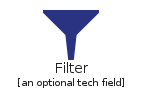 | [AzureFilter](FlatSymbols/CneEnterprise/AzureFilter.md) `elements/azure/FlatSymbols/CneEnterprise/AzureFilter` |
|  | [AzureFirewall](FlatSymbols/CneEnterprise/AzureFirewall.md) `elements/azure/FlatSymbols/CneEnterprise/AzureFirewall` |
|  | [AzureFolder](FlatSymbols/CneEnterprise/AzureFolder.md) `elements/azure/FlatSymbols/CneEnterprise/AzureFolder` |
|  | [AzureGateway](FlatSymbols/CneEnterprise/AzureGateway.md) `elements/azure/FlatSymbols/CneEnterprise/AzureGateway` |
|  | [AzureGenericApp](FlatSymbols/CneEnterprise/AzureGenericApp.md) `elements/azure/FlatSymbols/CneEnterprise/AzureGenericApp` |
|  | [AzureGenericAppNamedText](FlatSymbols/CneEnterprise/AzureGenericAppNamedText.md) `elements/azure/FlatSymbols/CneEnterprise/AzureGenericAppNamedText` |
|  | [AzureGenericCode](FlatSymbols/CneEnterprise/AzureGenericCode.md) `elements/azure/FlatSymbols/CneEnterprise/AzureGenericCode` |
|  | [AzureGraph](FlatSymbols/CneEnterprise/AzureGraph.md) `elements/azure/FlatSymbols/CneEnterprise/AzureGraph` |
|  | [AzureHealthMonitoring](FlatSymbols/CneEnterprise/AzureHealthMonitoring.md) `elements/azure/FlatSymbols/CneEnterprise/AzureHealthMonitoring` |
|  | [AzureHealthy](FlatSymbols/CneEnterprise/AzureHealthy.md) `elements/azure/FlatSymbols/CneEnterprise/AzureHealthy` |
|  | [AzureHealthyGrey](FlatSymbols/CneEnterprise/AzureHealthyGrey.md) `elements/azure/FlatSymbols/CneEnterprise/AzureHealthyGrey` |
|  | [AzureImportGeneric](FlatSymbols/CneEnterprise/AzureImportGeneric.md) `elements/azure/FlatSymbols/CneEnterprise/AzureImportGeneric` |
|  | [AzureInternet](FlatSymbols/CneEnterprise/AzureInternet.md) `elements/azure/FlatSymbols/CneEnterprise/AzureInternet` |
|  | [AzureInternetHollow](FlatSymbols/CneEnterprise/AzureInternetHollow.md) `elements/azure/FlatSymbols/CneEnterprise/AzureInternetHollow` |
|  | [AzureIphone](FlatSymbols/CneEnterprise/AzureIphone.md) `elements/azure/FlatSymbols/CneEnterprise/AzureIphone` |
|  | [AzureKeyboard](FlatSymbols/CneEnterprise/AzureKeyboard.md) `elements/azure/FlatSymbols/CneEnterprise/AzureKeyboard` |
|  | [AzureKeyPermissions](FlatSymbols/CneEnterprise/AzureKeyPermissions.md) `elements/azure/FlatSymbols/CneEnterprise/AzureKeyPermissions` |
|  | [AzureLaptopComputer](FlatSymbols/CneEnterprise/AzureLaptopComputer.md) `elements/azure/FlatSymbols/CneEnterprise/AzureLaptopComputer` |
|  | [AzureLaptop](FlatSymbols/CneEnterprise/AzureLaptop.md) `elements/azure/FlatSymbols/CneEnterprise/AzureLaptop` |
|  | [AzureLoadBalancerGeneric](FlatSymbols/CneEnterprise/AzureLoadBalancerGeneric.md) `elements/azure/FlatSymbols/CneEnterprise/AzureLoadBalancerGeneric` |
|  | [AzureLoadTesting](FlatSymbols/CneEnterprise/AzureLoadTesting.md) `elements/azure/FlatSymbols/CneEnterprise/AzureLoadTesting` |
|  | [AzureLockProtected](FlatSymbols/CneEnterprise/AzureLockProtected.md) `elements/azure/FlatSymbols/CneEnterprise/AzureLockProtected` |
|  | [AzureLockUnprotected](FlatSymbols/CneEnterprise/AzureLockUnprotected.md) `elements/azure/FlatSymbols/CneEnterprise/AzureLockUnprotected` |
|  | [AzureMaintenance](FlatSymbols/CneEnterprise/AzureMaintenance.md) `elements/azure/FlatSymbols/CneEnterprise/AzureMaintenance` |
|  | [AzureManagementConsole](FlatSymbols/CneEnterprise/AzureManagementConsole.md) `elements/azure/FlatSymbols/CneEnterprise/AzureManagementConsole` |
|  | [AzureMessage](FlatSymbols/CneEnterprise/AzureMessage.md) `elements/azure/FlatSymbols/CneEnterprise/AzureMessage` |
|  | [AzureMonitor](FlatSymbols/CneEnterprise/AzureMonitor.md) `elements/azure/FlatSymbols/CneEnterprise/AzureMonitor` |
|  | [AzureMonitorRunningApps](FlatSymbols/CneEnterprise/AzureMonitorRunningApps.md) `elements/azure/FlatSymbols/CneEnterprise/AzureMonitorRunningApps` |
|  | [AzureMouse](FlatSymbols/CneEnterprise/AzureMouse.md) `elements/azure/FlatSymbols/CneEnterprise/AzureMouse` |
|  | [AzureNetworkCard](FlatSymbols/CneEnterprise/AzureNetworkCard.md) `elements/azure/FlatSymbols/CneEnterprise/AzureNetworkCard` |
|  | [AzureNotAllowed](FlatSymbols/CneEnterprise/AzureNotAllowed.md) `elements/azure/FlatSymbols/CneEnterprise/AzureNotAllowed` |
| 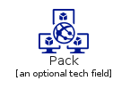 | [AzurePack](FlatSymbols/CneEnterprise/AzurePack.md) `elements/azure/FlatSymbols/CneEnterprise/AzurePack` |
|  | [AzurePerformance](FlatSymbols/CneEnterprise/AzurePerformance.md) `elements/azure/FlatSymbols/CneEnterprise/AzurePerformance` |
|  | [AzurePerformanceMonitor](FlatSymbols/CneEnterprise/AzurePerformanceMonitor.md) `elements/azure/FlatSymbols/CneEnterprise/AzurePerformanceMonitor` |
|  | [AzurePhone](FlatSymbols/CneEnterprise/AzurePhone.md) `elements/azure/FlatSymbols/CneEnterprise/AzurePhone` |
|  | [AzurePlugAndPlay](FlatSymbols/CneEnterprise/AzurePlugAndPlay.md) `elements/azure/FlatSymbols/CneEnterprise/AzurePlugAndPlay` |
|  | [AzurePowerpoint](FlatSymbols/CneEnterprise/AzurePowerpoint.md) `elements/azure/FlatSymbols/CneEnterprise/AzurePowerpoint` |
|  | [AzurePowershellScriptFile](FlatSymbols/CneEnterprise/AzurePowershellScriptFile.md) `elements/azure/FlatSymbols/CneEnterprise/AzurePowershellScriptFile` |
|  | [AzureProtocolStack](FlatSymbols/CneEnterprise/AzureProtocolStack.md) `elements/azure/FlatSymbols/CneEnterprise/AzureProtocolStack` |
|  | [AzureQueueGeneral](FlatSymbols/CneEnterprise/AzureQueueGeneral.md) `elements/azure/FlatSymbols/CneEnterprise/AzureQueueGeneral` |
|  | [AzureRmsConnector](FlatSymbols/CneEnterprise/AzureRmsConnector.md) `elements/azure/FlatSymbols/CneEnterprise/AzureRmsConnector` |
|  | [AzureRouter](FlatSymbols/CneEnterprise/AzureRouter.md) `elements/azure/FlatSymbols/CneEnterprise/AzureRouter` |
|  | [AzureRpdRemotingFile](FlatSymbols/CneEnterprise/AzureRpdRemotingFile.md) `elements/azure/FlatSymbols/CneEnterprise/AzureRpdRemotingFile` |
|  | [AzureScriptFile](FlatSymbols/CneEnterprise/AzureScriptFile.md) `elements/azure/FlatSymbols/CneEnterprise/AzureScriptFile` |
|  | [AzureSecureVirtualMachine](FlatSymbols/CneEnterprise/AzureSecureVirtualMachine.md) `elements/azure/FlatSymbols/CneEnterprise/AzureSecureVirtualMachine` |
|  | [AzureServerBlade](FlatSymbols/CneEnterprise/AzureServerBlade.md) `elements/azure/FlatSymbols/CneEnterprise/AzureServerBlade` |
|  | [AzureServerDirectory](FlatSymbols/CneEnterprise/AzureServerDirectory.md) `elements/azure/FlatSymbols/CneEnterprise/AzureServerDirectory` |
|  | [AzureServerFarm](FlatSymbols/CneEnterprise/AzureServerFarm.md) `elements/azure/FlatSymbols/CneEnterprise/AzureServerFarm` |
|  | [AzureServerGeneric](FlatSymbols/CneEnterprise/AzureServerGeneric.md) `elements/azure/FlatSymbols/CneEnterprise/AzureServerGeneric` |
|  | [AzureServerRack](FlatSymbols/CneEnterprise/AzureServerRack.md) `elements/azure/FlatSymbols/CneEnterprise/AzureServerRack` |
|  | [AzureSettings](FlatSymbols/CneEnterprise/AzureSettings.md) `elements/azure/FlatSymbols/CneEnterprise/AzureSettings` |
|  | [AzureSharedFolder](FlatSymbols/CneEnterprise/AzureSharedFolder.md) `elements/azure/FlatSymbols/CneEnterprise/AzureSharedFolder` |
|  | [AzureSmartcard](FlatSymbols/CneEnterprise/AzureSmartcard.md) `elements/azure/FlatSymbols/CneEnterprise/AzureSmartcard` |
|  | [AzureStartupTask](FlatSymbols/CneEnterprise/AzureStartupTask.md) `elements/azure/FlatSymbols/CneEnterprise/AzureStartupTask` |
|  | [AzureStorage](FlatSymbols/CneEnterprise/AzureStorage.md) `elements/azure/FlatSymbols/CneEnterprise/AzureStorage` |
|  | [AzureStoredProcedures](FlatSymbols/CneEnterprise/AzureStoredProcedures.md) `elements/azure/FlatSymbols/CneEnterprise/AzureStoredProcedures` |
|  | [AzureTable](FlatSymbols/CneEnterprise/AzureTable.md) `elements/azure/FlatSymbols/CneEnterprise/AzureTable` |
|  | [AzureTablet](FlatSymbols/CneEnterprise/AzureTablet.md) `elements/azure/FlatSymbols/CneEnterprise/AzureTablet` |
|  | [AzureTool](FlatSymbols/CneEnterprise/AzureTool.md) `elements/azure/FlatSymbols/CneEnterprise/AzureTool` |
|  | [AzureTriggers](FlatSymbols/CneEnterprise/AzureTriggers.md) `elements/azure/FlatSymbols/CneEnterprise/AzureTriggers` |
|  | [AzureTunnel](FlatSymbols/CneEnterprise/AzureTunnel.md) `elements/azure/FlatSymbols/CneEnterprise/AzureTunnel` |
|  | [AzureUdfFunction](FlatSymbols/CneEnterprise/AzureUdfFunction.md) `elements/azure/FlatSymbols/CneEnterprise/AzureUdfFunction` |
|  | [AzureUnhealthy](FlatSymbols/CneEnterprise/AzureUnhealthy.md) `elements/azure/FlatSymbols/CneEnterprise/AzureUnhealthy` |
| 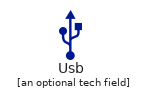 | [AzureUsb](FlatSymbols/CneEnterprise/AzureUsb.md) `elements/azure/FlatSymbols/CneEnterprise/AzureUsb` |
|  | [AzureUserEnterprise](FlatSymbols/CneEnterprise/AzureUserEnterprise.md) `elements/azure/FlatSymbols/CneEnterprise/AzureUserEnterprise` |
|  | [AzureUserPermissions](FlatSymbols/CneEnterprise/AzureUserPermissions.md) `elements/azure/FlatSymbols/CneEnterprise/AzureUserPermissions` |
|  | [AzureVideo](FlatSymbols/CneEnterprise/AzureVideo.md) `elements/azure/FlatSymbols/CneEnterprise/AzureVideo` |
|  | [AzureVirtualMachine](FlatSymbols/CneEnterprise/AzureVirtualMachine.md) `elements/azure/FlatSymbols/CneEnterprise/AzureVirtualMachine` |
|  | [AzureWeb](FlatSymbols/CneEnterprise/AzureWeb.md) `elements/azure/FlatSymbols/CneEnterprise/AzureWeb` |
|  | [AzureWebServer](FlatSymbols/CneEnterprise/AzureWebServer.md) `elements/azure/FlatSymbols/CneEnterprise/AzureWebServer` |
|  | [AzureWebSiteGeneric](FlatSymbols/CneEnterprise/AzureWebSiteGeneric.md) `elements/azure/FlatSymbols/CneEnterprise/AzureWebSiteGeneric` |
|  | [AzureWindowsServer](FlatSymbols/CneEnterprise/AzureWindowsServer.md) `elements/azure/FlatSymbols/CneEnterprise/AzureWindowsServer` |
|  | [AzureWirelessConnection](FlatSymbols/CneEnterprise/AzureWirelessConnection.md) `elements/azure/FlatSymbols/CneEnterprise/AzureWirelessConnection` |
|  | [AzureWorkstationClient](FlatSymbols/CneEnterprise/AzureWorkstationClient.md) `elements/azure/FlatSymbols/CneEnterprise/AzureWorkstationClient` |
|  | [AzureXmlWebService](FlatSymbols/CneEnterprise/AzureXmlWebService.md) `elements/azure/FlatSymbols/CneEnterprise/AzureXmlWebService` |
## elements/azure/FlatSymbols/CneGeneralsymbols
| | Name |
| :-: | --- |
|  | [AzureAttachments1](FlatSymbols/CneGeneralsymbols/AzureAttachments1.md) `elements/azure/FlatSymbols/CneGeneralsymbols/AzureAttachments1` |
|  | [AzureAudio](FlatSymbols/CneGeneralsymbols/AzureAudio.md) `elements/azure/FlatSymbols/CneGeneralsymbols/AzureAudio` |
|  | [AzureBug](FlatSymbols/CneGeneralsymbols/AzureBug.md) `elements/azure/FlatSymbols/CneGeneralsymbols/AzureBug` |
|  | [AzureCableSettopTvBox](FlatSymbols/CneGeneralsymbols/AzureCableSettopTvBox.md) `elements/azure/FlatSymbols/CneGeneralsymbols/AzureCableSettopTvBox` |
|  | [AzureCalendar](FlatSymbols/CneGeneralsymbols/AzureCalendar.md) `elements/azure/FlatSymbols/CneGeneralsymbols/AzureCalendar` |
|  | [AzureChart](FlatSymbols/CneGeneralsymbols/AzureChart.md) `elements/azure/FlatSymbols/CneGeneralsymbols/AzureChart` |
|  | [AzureCheckmarkSuccess](FlatSymbols/CneGeneralsymbols/AzureCheckmarkSuccess.md) `elements/azure/FlatSymbols/CneGeneralsymbols/AzureCheckmarkSuccess` |
|  | [AzureContinousCycleCircle](FlatSymbols/CneGeneralsymbols/AzureContinousCycleCircle.md) `elements/azure/FlatSymbols/CneGeneralsymbols/AzureContinousCycleCircle` |
|  | [AzureCrossoutFailure](FlatSymbols/CneGeneralsymbols/AzureCrossoutFailure.md) `elements/azure/FlatSymbols/CneGeneralsymbols/AzureCrossoutFailure` |
|  | [AzureCutAndPaste](FlatSymbols/CneGeneralsymbols/AzureCutAndPaste.md) `elements/azure/FlatSymbols/CneGeneralsymbols/AzureCutAndPaste` |
|  | [AzureFavorite](FlatSymbols/CneGeneralsymbols/AzureFavorite.md) `elements/azure/FlatSymbols/CneGeneralsymbols/AzureFavorite` |
|  | [AzureFolder](FlatSymbols/CneGeneralsymbols/AzureFolder.md) `elements/azure/FlatSymbols/CneGeneralsymbols/AzureFolder` |
|  | [AzureGameController](FlatSymbols/CneGeneralsymbols/AzureGameController.md) `elements/azure/FlatSymbols/CneGeneralsymbols/AzureGameController` |
|  | [AzureGears](FlatSymbols/CneGeneralsymbols/AzureGears.md) `elements/azure/FlatSymbols/CneGeneralsymbols/AzureGears` |
|  | [AzureGraph](FlatSymbols/CneGeneralsymbols/AzureGraph.md) `elements/azure/FlatSymbols/CneGeneralsymbols/AzureGraph` |
|  | [AzureLike](FlatSymbols/CneGeneralsymbols/AzureLike.md) `elements/azure/FlatSymbols/CneGeneralsymbols/AzureLike` |
|  | [AzureNotAllowed](FlatSymbols/CneGeneralsymbols/AzureNotAllowed.md) `elements/azure/FlatSymbols/CneGeneralsymbols/AzureNotAllowed` |
|  | [AzurePremiumStar](FlatSymbols/CneGeneralsymbols/AzurePremiumStar.md) `elements/azure/FlatSymbols/CneGeneralsymbols/AzurePremiumStar` |
|  | [AzureSliderBarHorizontal](FlatSymbols/CneGeneralsymbols/AzureSliderBarHorizontal.md) `elements/azure/FlatSymbols/CneGeneralsymbols/AzureSliderBarHorizontal` |
| 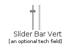 | [AzureSliderBarVert](FlatSymbols/CneGeneralsymbols/AzureSliderBarVert.md) `elements/azure/FlatSymbols/CneGeneralsymbols/AzureSliderBarVert` |
|  | [AzureTaskListOrBacklog](FlatSymbols/CneGeneralsymbols/AzureTaskListOrBacklog.md) `elements/azure/FlatSymbols/CneGeneralsymbols/AzureTaskListOrBacklog` |
|  | [AzureTasks](FlatSymbols/CneGeneralsymbols/AzureTasks.md) `elements/azure/FlatSymbols/CneGeneralsymbols/AzureTasks` |
|  | [AzureTunnel](FlatSymbols/CneGeneralsymbols/AzureTunnel.md) `elements/azure/FlatSymbols/CneGeneralsymbols/AzureTunnel` |
|  | [AzureUser](FlatSymbols/CneGeneralsymbols/AzureUser.md) `elements/azure/FlatSymbols/CneGeneralsymbols/AzureUser` |
|  | [AzureVideo](FlatSymbols/CneGeneralsymbols/AzureVideo.md) `elements/azure/FlatSymbols/CneGeneralsymbols/AzureVideo` |
## elements/azure/FlatSymbols/CneIntune
| | Name |
| :-: | --- |
|  | [AzureAccountPortal](FlatSymbols/CneIntune/AzureAccountPortal.md) `elements/azure/FlatSymbols/CneIntune/AzureAccountPortal` |
|  | [AzureAdministration](FlatSymbols/CneIntune/AzureAdministration.md) `elements/azure/FlatSymbols/CneIntune/AzureAdministration` |
|  | [AzureAlerts](FlatSymbols/CneIntune/AzureAlerts.md) `elements/azure/FlatSymbols/CneIntune/AzureAlerts` |
| 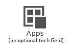 | [AzureApps](FlatSymbols/CneIntune/AzureApps.md) `elements/azure/FlatSymbols/CneIntune/AzureApps` |
|  | [AzureCertificateCompliance](FlatSymbols/CneIntune/AzureCertificateCompliance.md) `elements/azure/FlatSymbols/CneIntune/AzureCertificateCompliance` |
|  | [AzureClientSoftwareDeploymentWizard](FlatSymbols/CneIntune/AzureClientSoftwareDeploymentWizard.md) `elements/azure/FlatSymbols/CneIntune/AzureClientSoftwareDeploymentWizard` |
|  | [AzureCompanyPortal](FlatSymbols/CneIntune/AzureCompanyPortal.md) `elements/azure/FlatSymbols/CneIntune/AzureCompanyPortal` |
|  | [AzureComputerInventory](FlatSymbols/CneIntune/AzureComputerInventory.md) `elements/azure/FlatSymbols/CneIntune/AzureComputerInventory` |
|  | [AzureConditionalAccessExchange](FlatSymbols/CneIntune/AzureConditionalAccessExchange.md) `elements/azure/FlatSymbols/CneIntune/AzureConditionalAccessExchange` |
|  | [AzureConditionalAccessSharepoint](FlatSymbols/CneIntune/AzureConditionalAccessSharepoint.md) `elements/azure/FlatSymbols/CneIntune/AzureConditionalAccessSharepoint` |
|  | [AzureConnector](FlatSymbols/CneIntune/AzureConnector.md) `elements/azure/FlatSymbols/CneIntune/AzureConnector` |
|  | [AzureDashboard](FlatSymbols/CneIntune/AzureDashboard.md) `elements/azure/FlatSymbols/CneIntune/AzureDashboard` |
|  | [AzureDataMigrationWizard](FlatSymbols/CneIntune/AzureDataMigrationWizard.md) `elements/azure/FlatSymbols/CneIntune/AzureDataMigrationWizard` |
|  | [AzureDetectedSoftware](FlatSymbols/CneIntune/AzureDetectedSoftware.md) `elements/azure/FlatSymbols/CneIntune/AzureDetectedSoftware` |
|  | [AzureDeviceGroup](FlatSymbols/CneIntune/AzureDeviceGroup.md) `elements/azure/FlatSymbols/CneIntune/AzureDeviceGroup` |
|  | [AzureDeviceHealth](FlatSymbols/CneIntune/AzureDeviceHealth.md) `elements/azure/FlatSymbols/CneIntune/AzureDeviceHealth` |
|  | [AzureDeviceHistory](FlatSymbols/CneIntune/AzureDeviceHistory.md) `elements/azure/FlatSymbols/CneIntune/AzureDeviceHistory` |
|  | [AzureDeviceOs](FlatSymbols/CneIntune/AzureDeviceOs.md) `elements/azure/FlatSymbols/CneIntune/AzureDeviceOs` |
|  | [AzureEndProtection](FlatSymbols/CneIntune/AzureEndProtection.md) `elements/azure/FlatSymbols/CneIntune/AzureEndProtection` |
|  | [AzureExchangeConnector](FlatSymbols/CneIntune/AzureExchangeConnector.md) `elements/azure/FlatSymbols/CneIntune/AzureExchangeConnector` |
|  | [AzureGroups](FlatSymbols/CneIntune/AzureGroups.md) `elements/azure/FlatSymbols/CneIntune/AzureGroups` |
|  | [AzureHybrid](FlatSymbols/CneIntune/AzureHybrid.md) `elements/azure/FlatSymbols/CneIntune/AzureHybrid` |
|  | [AzureIntuneCertificateProfiles](FlatSymbols/CneIntune/AzureIntuneCertificateProfiles.md) `elements/azure/FlatSymbols/CneIntune/AzureIntuneCertificateProfiles` |
|  | [AzureIntuneConnectorSystemCenter](FlatSymbols/CneIntune/AzureIntuneConnectorSystemCenter.md) `elements/azure/FlatSymbols/CneIntune/AzureIntuneConnectorSystemCenter` |
|  | [AzureIntuneEmailProfiles](FlatSymbols/CneIntune/AzureIntuneEmailProfiles.md) `elements/azure/FlatSymbols/CneIntune/AzureIntuneEmailProfiles` |
|  | [AzureIntuneManagedApp](FlatSymbols/CneIntune/AzureIntuneManagedApp.md) `elements/azure/FlatSymbols/CneIntune/AzureIntuneManagedApp` |
| 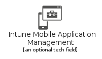 | [AzureIntuneMobileApplicationManagement](FlatSymbols/CneIntune/AzureIntuneMobileApplicationManagement.md) `elements/azure/FlatSymbols/CneIntune/AzureIntuneMobileApplicationManagement` |
|  | [AzureIntuneVpnProfiles](FlatSymbols/CneIntune/AzureIntuneVpnProfiles.md) `elements/azure/FlatSymbols/CneIntune/AzureIntuneVpnProfiles` |
|  | [AzureIntuneWiFiProfiles](FlatSymbols/CneIntune/AzureIntuneWiFiProfiles.md) `elements/azure/FlatSymbols/CneIntune/AzureIntuneWiFiProfiles` |
|  | [AzureInventoryLicense](FlatSymbols/CneIntune/AzureInventoryLicense.md) `elements/azure/FlatSymbols/CneIntune/AzureInventoryLicense` |
|  | [AzureInventorySoftware](FlatSymbols/CneIntune/AzureInventorySoftware.md) `elements/azure/FlatSymbols/CneIntune/AzureInventorySoftware` |
|  | [AzureLicenseGroup](FlatSymbols/CneIntune/AzureLicenseGroup.md) `elements/azure/FlatSymbols/CneIntune/AzureLicenseGroup` |
|  | [AzureLicenseInstallation](FlatSymbols/CneIntune/AzureLicenseInstallation.md) `elements/azure/FlatSymbols/CneIntune/AzureLicenseInstallation` |
|  | [AzureMicrosoftIntune](FlatSymbols/CneIntune/AzureMicrosoftIntune.md) `elements/azure/FlatSymbols/CneIntune/AzureMicrosoftIntune` |
|  | [AzureMobileInventory](FlatSymbols/CneIntune/AzureMobileInventory.md) `elements/azure/FlatSymbols/CneIntune/AzureMobileInventory` |
|  | [AzureNoncompliantApps](FlatSymbols/CneIntune/AzureNoncompliantApps.md) `elements/azure/FlatSymbols/CneIntune/AzureNoncompliantApps` |
|  | [AzurePolicy](FlatSymbols/CneIntune/AzurePolicy.md) `elements/azure/FlatSymbols/CneIntune/AzurePolicy` |
|  | [AzureProtection](FlatSymbols/CneIntune/AzureProtection.md) `elements/azure/FlatSymbols/CneIntune/AzureProtection` |
|  | [AzureReports](FlatSymbols/CneIntune/AzureReports.md) `elements/azure/FlatSymbols/CneIntune/AzureReports` |
|  | [AzureSettings](FlatSymbols/CneIntune/AzureSettings.md) `elements/azure/FlatSymbols/CneIntune/AzureSettings` |
|  | [AzureSubscriptionPortal](FlatSymbols/CneIntune/AzureSubscriptionPortal.md) `elements/azure/FlatSymbols/CneIntune/AzureSubscriptionPortal` |
|  | [AzureTermsAndConditions](FlatSymbols/CneIntune/AzureTermsAndConditions.md) `elements/azure/FlatSymbols/CneIntune/AzureTermsAndConditions` |
|  | [AzureUpdate](FlatSymbols/CneIntune/AzureUpdate.md) `elements/azure/FlatSymbols/CneIntune/AzureUpdate` |
|  | [AzureUserGroup](FlatSymbols/CneIntune/AzureUserGroup.md) `elements/azure/FlatSymbols/CneIntune/AzureUserGroup` |
|  | [AzureUserManagement](FlatSymbols/CneIntune/AzureUserManagement.md) `elements/azure/FlatSymbols/CneIntune/AzureUserManagement` |
## elements/azure/FlatSymbols/CneSystemCenter
| | Name |
| :-: | --- |
|  | [AzureCentralAdministrationSite](FlatSymbols/CneSystemCenter/AzureCentralAdministrationSite.md) `elements/azure/FlatSymbols/CneSystemCenter/AzureCentralAdministrationSite` |
|  | [AzureCentralAdministrationSiteSql](FlatSymbols/CneSystemCenter/AzureCentralAdministrationSiteSql.md) `elements/azure/FlatSymbols/CneSystemCenter/AzureCentralAdministrationSiteSql` |
|  | [AzureCloudDistributionPoint](FlatSymbols/CneSystemCenter/AzureCloudDistributionPoint.md) `elements/azure/FlatSymbols/CneSystemCenter/AzureCloudDistributionPoint` |
|  | [AzureDistributionPoint](FlatSymbols/CneSystemCenter/AzureDistributionPoint.md) `elements/azure/FlatSymbols/CneSystemCenter/AzureDistributionPoint` |
|  | [AzureManagementPoint](FlatSymbols/CneSystemCenter/AzureManagementPoint.md) `elements/azure/FlatSymbols/CneSystemCenter/AzureManagementPoint` |
|  | [AzurePrimarySite](FlatSymbols/CneSystemCenter/AzurePrimarySite.md) `elements/azure/FlatSymbols/CneSystemCenter/AzurePrimarySite` |
|  | [AzureRolesClassForMultipleVersions](FlatSymbols/CneSystemCenter/AzureRolesClassForMultipleVersions.md) `elements/azure/FlatSymbols/CneSystemCenter/AzureRolesClassForMultipleVersions` |
|  | [AzureSecondarySite](FlatSymbols/CneSystemCenter/AzureSecondarySite.md) `elements/azure/FlatSymbols/CneSystemCenter/AzureSecondarySite` |
|  | [AzureSoftwareUpdatePoint](FlatSymbols/CneSystemCenter/AzureSoftwareUpdatePoint.md) `elements/azure/FlatSymbols/CneSystemCenter/AzureSoftwareUpdatePoint` |
|  | [AzureSystemCenterAdminConsole](FlatSymbols/CneSystemCenter/AzureSystemCenterAdminConsole.md) `elements/azure/FlatSymbols/CneSystemCenter/AzureSystemCenterAdminConsole` |
## elements/azure/GeneralServiceIcons
| | Name |
| :-: | --- |
|  | [AzureAllResources](GeneralServiceIcons/AzureAllResources.md) `elements/azure/GeneralServiceIcons/AzureAllResources` |
|  | [AzureDevelopertools](GeneralServiceIcons/AzureDevelopertools.md) `elements/azure/GeneralServiceIcons/AzureDevelopertools` |
|  | [AzureHelpSupport](GeneralServiceIcons/AzureHelpSupport.md) `elements/azure/GeneralServiceIcons/AzureHelpSupport` |
|  | [AzureHome](GeneralServiceIcons/AzureHome.md) `elements/azure/GeneralServiceIcons/AzureHome` |
|  | [AzureInformation](GeneralServiceIcons/AzureInformation.md) `elements/azure/GeneralServiceIcons/AzureInformation` |
|  | [AzureManagementGroups](GeneralServiceIcons/AzureManagementGroups.md) `elements/azure/GeneralServiceIcons/AzureManagementGroups` |
|  | [AzureMarketplace](GeneralServiceIcons/AzureMarketplace.md) `elements/azure/GeneralServiceIcons/AzureMarketplace` |
|  | [AzureQuickStartCenter](GeneralServiceIcons/AzureQuickStartCenter.md) `elements/azure/GeneralServiceIcons/AzureQuickStartCenter` |
|  | [AzureRecent](GeneralServiceIcons/AzureRecent.md) `elements/azure/GeneralServiceIcons/AzureRecent` |
|  | [AzureReservations](GeneralServiceIcons/AzureReservations.md) `elements/azure/GeneralServiceIcons/AzureReservations` |
|  | [AzureResource](GeneralServiceIcons/AzureResource.md) `elements/azure/GeneralServiceIcons/AzureResource` |
|  | [AzureResourceGroups](GeneralServiceIcons/AzureResourceGroups.md) `elements/azure/GeneralServiceIcons/AzureResourceGroups` |
|  | [AzureServiceHealth](GeneralServiceIcons/AzureServiceHealth.md) `elements/azure/GeneralServiceIcons/AzureServiceHealth` |
|  | [AzureSharedDashboard](GeneralServiceIcons/AzureSharedDashboard.md) `elements/azure/GeneralServiceIcons/AzureSharedDashboard` |
|  | [AzureSubscriptions](GeneralServiceIcons/AzureSubscriptions.md) `elements/azure/GeneralServiceIcons/AzureSubscriptions` |
|  | [AzureSupport](GeneralServiceIcons/AzureSupport.md) `elements/azure/GeneralServiceIcons/AzureSupport` |
|  | [AzureSupportRequests](GeneralServiceIcons/AzureSupportRequests.md) `elements/azure/GeneralServiceIcons/AzureSupportRequests` |
|  | [AzureTag](GeneralServiceIcons/AzureTag.md) `elements/azure/GeneralServiceIcons/AzureTag` |
|  | [AzureTags](GeneralServiceIcons/AzureTags.md) `elements/azure/GeneralServiceIcons/AzureTags` |
|  | [AzureTemplates](GeneralServiceIcons/AzureTemplates.md) `elements/azure/GeneralServiceIcons/AzureTemplates` |
|  | [AzureTwoUserIcon](GeneralServiceIcons/AzureTwoUserIcon.md) `elements/azure/GeneralServiceIcons/AzureTwoUserIcon` |
|  | [AzureUserHealthIcon](GeneralServiceIcons/AzureUserHealthIcon.md) `elements/azure/GeneralServiceIcons/AzureUserHealthIcon` |
|  | [AzureUserIcon](GeneralServiceIcons/AzureUserIcon.md) `elements/azure/GeneralServiceIcons/AzureUserIcon` |
|  | [AzureUserPrivacy](GeneralServiceIcons/AzureUserPrivacy.md) `elements/azure/GeneralServiceIcons/AzureUserPrivacy` |
|  | [AzureUserResource](GeneralServiceIcons/AzureUserResource.md) `elements/azure/GeneralServiceIcons/AzureUserResource` |
|  | [AzureWhatSNew](GeneralServiceIcons/AzureWhatSNew.md) `elements/azure/GeneralServiceIcons/AzureWhatSNew` |
## elements/azure/IdentityServiceColor
| | Name |
| :-: | --- |
|  | [AzureAccessReview](IdentityServiceColor/AzureAccessReview.md) `elements/azure/IdentityServiceColor/AzureAccessReview` |
|  | [AzureActiveDirectoryConnectHealth](IdentityServiceColor/AzureActiveDirectoryConnectHealth.md) `elements/azure/IdentityServiceColor/AzureActiveDirectoryConnectHealth` |
|  | [AzureActiveDirectory](IdentityServiceColor/AzureActiveDirectory.md) `elements/azure/IdentityServiceColor/AzureActiveDirectory` |
|  | [AzureAdB2c](IdentityServiceColor/AzureAdB2c.md) `elements/azure/IdentityServiceColor/AzureAdB2c` |
|  | [AzureAdDomainServices](IdentityServiceColor/AzureAdDomainServices.md) `elements/azure/IdentityServiceColor/AzureAdDomainServices` |
|  | [AzureAdIdentityProtection](IdentityServiceColor/AzureAdIdentityProtection.md) `elements/azure/IdentityServiceColor/AzureAdIdentityProtection` |
|  | [AzureAdPrivilegedIdentityManagement](IdentityServiceColor/AzureAdPrivilegedIdentityManagement.md) `elements/azure/IdentityServiceColor/AzureAdPrivilegedIdentityManagement` |
|  | [AzureAppRegistrations](IdentityServiceColor/AzureAppRegistrations.md) `elements/azure/IdentityServiceColor/AzureAppRegistrations` |
|  | [AzureConditionalAccess](IdentityServiceColor/AzureConditionalAccess.md) `elements/azure/IdentityServiceColor/AzureConditionalAccess` |
|  | [AzureEnterpriseApplications](IdentityServiceColor/AzureEnterpriseApplications.md) `elements/azure/IdentityServiceColor/AzureEnterpriseApplications` |
|  | [AzureIdentityGovernance](IdentityServiceColor/AzureIdentityGovernance.md) `elements/azure/IdentityServiceColor/AzureIdentityGovernance` |
|  | [AzureInformationProtection](IdentityServiceColor/AzureInformationProtection.md) `elements/azure/IdentityServiceColor/AzureInformationProtection` |
|  | [AzureManagedIdentities](IdentityServiceColor/AzureManagedIdentities.md) `elements/azure/IdentityServiceColor/AzureManagedIdentities` |
## elements/azure/IntegrationServiceColor
| | Name |
| :-: | --- |
|  | [AzureApiForFhir](IntegrationServiceColor/AzureApiForFhir.md) `elements/azure/IntegrationServiceColor/AzureApiForFhir` |
|  | [AzureApiManagementServices](IntegrationServiceColor/AzureApiManagementServices.md) `elements/azure/IntegrationServiceColor/AzureApiManagementServices` |
|  | [AzureAppConfiguration](IntegrationServiceColor/AzureAppConfiguration.md) `elements/azure/IntegrationServiceColor/AzureAppConfiguration` |
|  | [AzureDataCatalog](IntegrationServiceColor/AzureDataCatalog.md) `elements/azure/IntegrationServiceColor/AzureDataCatalog` |
|  | [AzureEventGridDomains](IntegrationServiceColor/AzureEventGridDomains.md) `elements/azure/IntegrationServiceColor/AzureEventGridDomains` |
|  | [AzureEventGridSubscriptions](IntegrationServiceColor/AzureEventGridSubscriptions.md) `elements/azure/IntegrationServiceColor/AzureEventGridSubscriptions` |
|  | [AzureEventGridTopics](IntegrationServiceColor/AzureEventGridTopics.md) `elements/azure/IntegrationServiceColor/AzureEventGridTopics` |
|  | [AzureIntegrationAccounts](IntegrationServiceColor/AzureIntegrationAccounts.md) `elements/azure/IntegrationServiceColor/AzureIntegrationAccounts` |
|  | [AzureIntegrationServiceEnvironments](IntegrationServiceColor/AzureIntegrationServiceEnvironments.md) `elements/azure/IntegrationServiceColor/AzureIntegrationServiceEnvironments` |
|  | [AzureLogicAppsCustomConnector](IntegrationServiceColor/AzureLogicAppsCustomConnector.md) `elements/azure/IntegrationServiceColor/AzureLogicAppsCustomConnector` |
|  | [AzureLogicApps](IntegrationServiceColor/AzureLogicApps.md) `elements/azure/IntegrationServiceColor/AzureLogicApps` |
|  | [AzureSendgridAccounts](IntegrationServiceColor/AzureSendgridAccounts.md) `elements/azure/IntegrationServiceColor/AzureSendgridAccounts` |
|  | [AzureServiceBus](IntegrationServiceColor/AzureServiceBus.md) `elements/azure/IntegrationServiceColor/AzureServiceBus` |
|  | [AzureServiceBusRelays](IntegrationServiceColor/AzureServiceBusRelays.md) `elements/azure/IntegrationServiceColor/AzureServiceBusRelays` |
|  | [AzureServiceCatalogManagedApplicationDefinitions](IntegrationServiceColor/AzureServiceCatalogManagedApplicationDefinitions.md) `elements/azure/IntegrationServiceColor/AzureServiceCatalogManagedApplicationDefinitions` |
|  | [AzureSoftwareAsAServiceSaas](IntegrationServiceColor/AzureSoftwareAsAServiceSaas.md) `elements/azure/IntegrationServiceColor/AzureSoftwareAsAServiceSaas` |
|  | [AzureStorsimpleDeviceManagers](IntegrationServiceColor/AzureStorsimpleDeviceManagers.md) `elements/azure/IntegrationServiceColor/AzureStorsimpleDeviceManagers` |
## elements/azure/InternetOfThingsServiceColor
| | Name |
| :-: | --- |
|  | [AzureDeviceProvisioningServices](InternetOfThingsServiceColor/AzureDeviceProvisioningServices.md) `elements/azure/InternetOfThingsServiceColor/AzureDeviceProvisioningServices` |
| 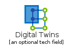 | [AzureDigitalTwins](InternetOfThingsServiceColor/AzureDigitalTwins.md) `elements/azure/InternetOfThingsServiceColor/AzureDigitalTwins` |
|  | [AzureIotCentralApplications](InternetOfThingsServiceColor/AzureIotCentralApplications.md) `elements/azure/InternetOfThingsServiceColor/AzureIotCentralApplications` |
|  | [AzureIotHub](InternetOfThingsServiceColor/AzureIotHub.md) `elements/azure/InternetOfThingsServiceColor/AzureIotHub` |
|  | [AzureIotHubSecurity](InternetOfThingsServiceColor/AzureIotHubSecurity.md) `elements/azure/InternetOfThingsServiceColor/AzureIotHubSecurity` |
|  | [AzureMaps](InternetOfThingsServiceColor/AzureMaps.md) `elements/azure/InternetOfThingsServiceColor/AzureMaps` |
|  | [AzureSphere](InternetOfThingsServiceColor/AzureSphere.md) `elements/azure/InternetOfThingsServiceColor/AzureSphere` |
|  | [AzureTimeSeriesInsightsEnvironments](InternetOfThingsServiceColor/AzureTimeSeriesInsightsEnvironments.md) `elements/azure/InternetOfThingsServiceColor/AzureTimeSeriesInsightsEnvironments` |
|  | [AzureTimeSeriesInsightsEventsSources](InternetOfThingsServiceColor/AzureTimeSeriesInsightsEventsSources.md) `elements/azure/InternetOfThingsServiceColor/AzureTimeSeriesInsightsEventsSources` |
|  | [AzureWindows10IotCoreServices](InternetOfThingsServiceColor/AzureWindows10IotCoreServices.md) `elements/azure/InternetOfThingsServiceColor/AzureWindows10IotCoreServices` |
## elements/azure/IntuneServiceColor
| | Name |
| :-: | --- |
|  | [AzureClientApps](IntuneServiceColor/AzureClientApps.md) `elements/azure/IntuneServiceColor/AzureClientApps` |
|  | [AzureDedicatedEventHub](IntuneServiceColor/AzureDedicatedEventHub.md) `elements/azure/IntuneServiceColor/AzureDedicatedEventHub` |
|  | [AzureDeviceCompliance](IntuneServiceColor/AzureDeviceCompliance.md) `elements/azure/IntuneServiceColor/AzureDeviceCompliance` |
|  | [AzureDeviceConfig](IntuneServiceColor/AzureDeviceConfig.md) `elements/azure/IntuneServiceColor/AzureDeviceConfig` |
|  | [AzureDevicesGroups](IntuneServiceColor/AzureDevicesGroups.md) `elements/azure/IntuneServiceColor/AzureDevicesGroups` |
|  | [AzureEbooks](IntuneServiceColor/AzureEbooks.md) `elements/azure/IntuneServiceColor/AzureEbooks` |
|  | [AzureEnrollment](IntuneServiceColor/AzureEnrollment.md) `elements/azure/IntuneServiceColor/AzureEnrollment` |
|  | [AzureExchangeOnPremisesAccess](IntuneServiceColor/AzureExchangeOnPremisesAccess.md) `elements/azure/IntuneServiceColor/AzureExchangeOnPremisesAccess` |
|  | [AzureIntuneAppProtection](IntuneServiceColor/AzureIntuneAppProtection.md) `elements/azure/IntuneServiceColor/AzureIntuneAppProtection` |
|  | [AzureManagedDesktop](IntuneServiceColor/AzureManagedDesktop.md) `elements/azure/IntuneServiceColor/AzureManagedDesktop` |
|  | [AzureSecurityBaselines](IntuneServiceColor/AzureSecurityBaselines.md) `elements/azure/IntuneServiceColor/AzureSecurityBaselines` |
|  | [AzureSoftwareUpdate](IntuneServiceColor/AzureSoftwareUpdate.md) `elements/azure/IntuneServiceColor/AzureSoftwareUpdate` |
|  | [AzureTools](IntuneServiceColor/AzureTools.md) `elements/azure/IntuneServiceColor/AzureTools` |
## elements/azure/ManagementAndGovernanceServiceColor
| | Name |
| :-: | --- |
|  | [AzureActivityLog](ManagementAndGovernanceServiceColor/AzureActivityLog.md) `elements/azure/ManagementAndGovernanceServiceColor/AzureActivityLog` |
|  | [AzureAdvisor](ManagementAndGovernanceServiceColor/AzureAdvisor.md) `elements/azure/ManagementAndGovernanceServiceColor/AzureAdvisor` |
|  | [AzureAlerts](ManagementAndGovernanceServiceColor/AzureAlerts.md) `elements/azure/ManagementAndGovernanceServiceColor/AzureAlerts` |
|  | [AzureAutomationAccounts](ManagementAndGovernanceServiceColor/AzureAutomationAccounts.md) `elements/azure/ManagementAndGovernanceServiceColor/AzureAutomationAccounts` |
|  | [AzureBlueprints](ManagementAndGovernanceServiceColor/AzureBlueprints.md) `elements/azure/ManagementAndGovernanceServiceColor/AzureBlueprints` |
|  | [AzureCostManagementBilling](ManagementAndGovernanceServiceColor/AzureCostManagementBilling.md) `elements/azure/ManagementAndGovernanceServiceColor/AzureCostManagementBilling` |
|  | [AzureDiagnosticSettings](ManagementAndGovernanceServiceColor/AzureDiagnosticSettings.md) `elements/azure/ManagementAndGovernanceServiceColor/AzureDiagnosticSettings` |
|  | [AzureFreeServices](ManagementAndGovernanceServiceColor/AzureFreeServices.md) `elements/azure/ManagementAndGovernanceServiceColor/AzureFreeServices` |
|  | [AzureGuestAssignments](ManagementAndGovernanceServiceColor/AzureGuestAssignments.md) `elements/azure/ManagementAndGovernanceServiceColor/AzureGuestAssignments` |
|  | [AzureManagedApplications](ManagementAndGovernanceServiceColor/AzureManagedApplications.md) `elements/azure/ManagementAndGovernanceServiceColor/AzureManagedApplications` |
|  | [AzureMetrics](ManagementAndGovernanceServiceColor/AzureMetrics.md) `elements/azure/ManagementAndGovernanceServiceColor/AzureMetrics` |
|  | [AzureMonitor](ManagementAndGovernanceServiceColor/AzureMonitor.md) `elements/azure/ManagementAndGovernanceServiceColor/AzureMonitor` |
|  | [AzureNetworkWatcher](ManagementAndGovernanceServiceColor/AzureNetworkWatcher.md) `elements/azure/ManagementAndGovernanceServiceColor/AzureNetworkWatcher` |
|  | [AzurePolicy](ManagementAndGovernanceServiceColor/AzurePolicy.md) `elements/azure/ManagementAndGovernanceServiceColor/AzurePolicy` |
|  | [AzureRecoveryServicesVaults](ManagementAndGovernanceServiceColor/AzureRecoveryServicesVaults.md) `elements/azure/ManagementAndGovernanceServiceColor/AzureRecoveryServicesVaults` |
|  | [AzureResourceGraphExplorer](ManagementAndGovernanceServiceColor/AzureResourceGraphExplorer.md) `elements/azure/ManagementAndGovernanceServiceColor/AzureResourceGraphExplorer` |
|  | [AzureSchedulerJobCollections](ManagementAndGovernanceServiceColor/AzureSchedulerJobCollections.md) `elements/azure/ManagementAndGovernanceServiceColor/AzureSchedulerJobCollections` |
|  | [AzureSolutions](ManagementAndGovernanceServiceColor/AzureSolutions.md) `elements/azure/ManagementAndGovernanceServiceColor/AzureSolutions` |
## elements/azure/ManagementAndGovernanceServiceColor/Media
| | Name |
| :-: | --- |
|  | [AzureContentProtection](ManagementAndGovernanceServiceColor/Media/AzureContentProtection.md) `elements/azure/ManagementAndGovernanceServiceColor/Media/AzureContentProtection` |
|  | [AzureMediaEncoding](ManagementAndGovernanceServiceColor/Media/AzureMediaEncoding.md) `elements/azure/ManagementAndGovernanceServiceColor/Media/AzureMediaEncoding` |
|  | [AzureMediaOnDemand](ManagementAndGovernanceServiceColor/Media/AzureMediaOnDemand.md) `elements/azure/ManagementAndGovernanceServiceColor/Media/AzureMediaOnDemand` |
|  | [AzureMediaPlayer](ManagementAndGovernanceServiceColor/Media/AzureMediaPlayer.md) `elements/azure/ManagementAndGovernanceServiceColor/Media/AzureMediaPlayer` |
## elements/azure/MigrateServiceColor
| | Name |
| :-: | --- |
|  | [AzureDatabaseMigrationServices](MigrateServiceColor/AzureDatabaseMigrationServices.md) `elements/azure/MigrateServiceColor/AzureDatabaseMigrationServices` |
|  | [AzureMigrationProjects](MigrateServiceColor/AzureMigrationProjects.md) `elements/azure/MigrateServiceColor/AzureMigrationProjects` |
|  | [AzureRecoveryServicesVaults](MigrateServiceColor/AzureRecoveryServicesVaults.md) `elements/azure/MigrateServiceColor/AzureRecoveryServicesVaults` |
## elements/azure/MixedRealityServiceIcon
| | Name |
| :-: | --- |
|  | [AzureSpatialAnchor](MixedRealityServiceIcon/AzureSpatialAnchor.md) `elements/azure/MixedRealityServiceIcon/AzureSpatialAnchor` |
## elements/azure/MobileServiceColor
| | Name |
| :-: | --- |
|  | [AzureAppServiceMobile](MobileServiceColor/AzureAppServiceMobile.md) `elements/azure/MobileServiceColor/AzureAppServiceMobile` |
|  | [AzureMobileEngagement](MobileServiceColor/AzureMobileEngagement.md) `elements/azure/MobileServiceColor/AzureMobileEngagement` |
|  | [AzureNotificationHubs](MobileServiceColor/AzureNotificationHubs.md) `elements/azure/MobileServiceColor/AzureNotificationHubs` |
## elements/azure/NetworkingServiceColor
| | Name |
| :-: | --- |
|  | [AzureApplicationGateway](NetworkingServiceColor/AzureApplicationGateway.md) `elements/azure/NetworkingServiceColor/AzureApplicationGateway` |
|  | [AzureApplicationSecurityGroups](NetworkingServiceColor/AzureApplicationSecurityGroups.md) `elements/azure/NetworkingServiceColor/AzureApplicationSecurityGroups` |
|  | [AzureCdnProfiles](NetworkingServiceColor/AzureCdnProfiles.md) `elements/azure/NetworkingServiceColor/AzureCdnProfiles` |
|  | [AzureConnections](NetworkingServiceColor/AzureConnections.md) `elements/azure/NetworkingServiceColor/AzureConnections` |
|  | [AzureDdosProtectionPlans](NetworkingServiceColor/AzureDdosProtectionPlans.md) `elements/azure/NetworkingServiceColor/AzureDdosProtectionPlans` |
|  | [AzureDnsPrivateZones](NetworkingServiceColor/AzureDnsPrivateZones.md) `elements/azure/NetworkingServiceColor/AzureDnsPrivateZones` |
|  | [AzureDnsZones](NetworkingServiceColor/AzureDnsZones.md) `elements/azure/NetworkingServiceColor/AzureDnsZones` |
|  | [AzureExpressrouteCircuits](NetworkingServiceColor/AzureExpressrouteCircuits.md) `elements/azure/NetworkingServiceColor/AzureExpressrouteCircuits` |
|  | [AzureFirewall](NetworkingServiceColor/AzureFirewall.md) `elements/azure/NetworkingServiceColor/AzureFirewall` |
|  | [AzureFrontDoors](NetworkingServiceColor/AzureFrontDoors.md) `elements/azure/NetworkingServiceColor/AzureFrontDoors` |
|  | [AzureLoadBalancers](NetworkingServiceColor/AzureLoadBalancers.md) `elements/azure/NetworkingServiceColor/AzureLoadBalancers` |
|  | [AzureLocalNetworkGateways](NetworkingServiceColor/AzureLocalNetworkGateways.md) `elements/azure/NetworkingServiceColor/AzureLocalNetworkGateways` |
|  | [AzureNetworkInterfaces](NetworkingServiceColor/AzureNetworkInterfaces.md) `elements/azure/NetworkingServiceColor/AzureNetworkInterfaces` |
|  | [AzureNetworkSecurityGroupsClassic](NetworkingServiceColor/AzureNetworkSecurityGroupsClassic.md) `elements/azure/NetworkingServiceColor/AzureNetworkSecurityGroupsClassic` |
|  | [AzureNetworkWatcher](NetworkingServiceColor/AzureNetworkWatcher.md) `elements/azure/NetworkingServiceColor/AzureNetworkWatcher` |
|  | [AzureOnPremisesDataGateways](NetworkingServiceColor/AzureOnPremisesDataGateways.md) `elements/azure/NetworkingServiceColor/AzureOnPremisesDataGateways` |
|  | [AzurePublicIpAddresses](NetworkingServiceColor/AzurePublicIpAddresses.md) `elements/azure/NetworkingServiceColor/AzurePublicIpAddresses` |
| 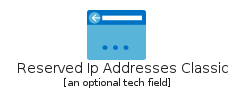 | [AzureReservedIpAddressesClassic](NetworkingServiceColor/AzureReservedIpAddressesClassic.md) `elements/azure/NetworkingServiceColor/AzureReservedIpAddressesClassic` |
|  | [AzureRouteFilters](NetworkingServiceColor/AzureRouteFilters.md) `elements/azure/NetworkingServiceColor/AzureRouteFilters` |
|  | [AzureRouteTables](NetworkingServiceColor/AzureRouteTables.md) `elements/azure/NetworkingServiceColor/AzureRouteTables` |
|  | [AzureServiceEndpointPolicies](NetworkingServiceColor/AzureServiceEndpointPolicies.md) `elements/azure/NetworkingServiceColor/AzureServiceEndpointPolicies` |
|  | [AzureTrafficManagerProfiles](NetworkingServiceColor/AzureTrafficManagerProfiles.md) `elements/azure/NetworkingServiceColor/AzureTrafficManagerProfiles` |
|  | [AzureVirtualNetworkClassic](NetworkingServiceColor/AzureVirtualNetworkClassic.md) `elements/azure/NetworkingServiceColor/AzureVirtualNetworkClassic` |
|  | [AzureVirtualNetworkGateways](NetworkingServiceColor/AzureVirtualNetworkGateways.md) `elements/azure/NetworkingServiceColor/AzureVirtualNetworkGateways` |
|  | [AzureVirtualNetworks](NetworkingServiceColor/AzureVirtualNetworks.md) `elements/azure/NetworkingServiceColor/AzureVirtualNetworks` |
|  | [AzureVirtualWans](NetworkingServiceColor/AzureVirtualWans.md) `elements/azure/NetworkingServiceColor/AzureVirtualWans` |
## elements/azure/OtherCategoryServiceIcon
| | Name |
| :-: | --- |
|  | [AzureCloudsimpleNodes](OtherCategoryServiceIcon/AzureCloudsimpleNodes.md) `elements/azure/OtherCategoryServiceIcon/AzureCloudsimpleNodes` |
|  | [AzureCloudsimpleServices](OtherCategoryServiceIcon/AzureCloudsimpleServices.md) `elements/azure/OtherCategoryServiceIcon/AzureCloudsimpleServices` |
|  | [AzureControllers](OtherCategoryServiceIcon/AzureControllers.md) `elements/azure/OtherCategoryServiceIcon/AzureControllers` |
|  | [AzureCustomerLockbox](OtherCategoryServiceIcon/AzureCustomerLockbox.md) `elements/azure/OtherCategoryServiceIcon/AzureCustomerLockbox` |
|  | [AzureEducation](OtherCategoryServiceIcon/AzureEducation.md) `elements/azure/OtherCategoryServiceIcon/AzureEducation` |
| 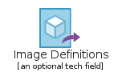 | [AzureImageDefinitions](OtherCategoryServiceIcon/AzureImageDefinitions.md) `elements/azure/OtherCategoryServiceIcon/AzureImageDefinitions` |
|  | [AzureImageVersions](OtherCategoryServiceIcon/AzureImageVersions.md) `elements/azure/OtherCategoryServiceIcon/AzureImageVersions` |
|  | [AzureResourceExplorer](OtherCategoryServiceIcon/AzureResourceExplorer.md) `elements/azure/OtherCategoryServiceIcon/AzureResourceExplorer` |
|  | [AzureSharedImageGalleries](OtherCategoryServiceIcon/AzureSharedImageGalleries.md) `elements/azure/OtherCategoryServiceIcon/AzureSharedImageGalleries` |
|  | [AzureTenantStatus](OtherCategoryServiceIcon/AzureTenantStatus.md) `elements/azure/OtherCategoryServiceIcon/AzureTenantStatus` |
|  | [AzureWebAppFirewall](OtherCategoryServiceIcon/AzureWebAppFirewall.md) `elements/azure/OtherCategoryServiceIcon/AzureWebAppFirewall` |
## elements/azure/SecurityServiceColor
| | Name |
| :-: | --- |
|  | [AzureKeyVaults](SecurityServiceColor/AzureKeyVaults.md) `elements/azure/SecurityServiceColor/AzureKeyVaults` |
|  | [AzureSecurityCenter](SecurityServiceColor/AzureSecurityCenter.md) `elements/azure/SecurityServiceColor/AzureSecurityCenter` |
|  | [AzureSentinel](SecurityServiceColor/AzureSentinel.md) `elements/azure/SecurityServiceColor/AzureSentinel` |
## elements/azure/StorageServiceColor
| | Name |
| :-: | --- |
|  | [AzureArchiveStorage](StorageServiceColor/AzureArchiveStorage.md) `elements/azure/StorageServiceColor/AzureArchiveStorage` |
| 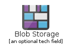 | [AzureBlobStorage](StorageServiceColor/AzureBlobStorage.md) `elements/azure/StorageServiceColor/AzureBlobStorage` |
|  | [AzureDataBoxEdgeDataBoxGateway](StorageServiceColor/AzureDataBoxEdgeDataBoxGateway.md) `elements/azure/StorageServiceColor/AzureDataBoxEdgeDataBoxGateway` |
|  | [AzureDataBox](StorageServiceColor/AzureDataBox.md) `elements/azure/StorageServiceColor/AzureDataBox` |
|  | [AzureDataLakeStorage](StorageServiceColor/AzureDataLakeStorage.md) `elements/azure/StorageServiceColor/AzureDataLakeStorage` |
|  | [AzureFxtedgefiler](StorageServiceColor/AzureFxtedgefiler.md) `elements/azure/StorageServiceColor/AzureFxtedgefiler` |
|  | [AzureGeneralStorage](StorageServiceColor/AzureGeneralStorage.md) `elements/azure/StorageServiceColor/AzureGeneralStorage` |
|  | [AzureNetappFiles](StorageServiceColor/AzureNetappFiles.md) `elements/azure/StorageServiceColor/AzureNetappFiles` |
|  | [AzureQueuesStorage](StorageServiceColor/AzureQueuesStorage.md) `elements/azure/StorageServiceColor/AzureQueuesStorage` |
|  | [AzureStorageAccountsClassic](StorageServiceColor/AzureStorageAccountsClassic.md) `elements/azure/StorageServiceColor/AzureStorageAccountsClassic` |
|  | [AzureStorageAccounts](StorageServiceColor/AzureStorageAccounts.md) `elements/azure/StorageServiceColor/AzureStorageAccounts` |
|  | [AzureStorageExplorer](StorageServiceColor/AzureStorageExplorer.md) `elements/azure/StorageServiceColor/AzureStorageExplorer` |
|  | [AzureStorageSyncServices](StorageServiceColor/AzureStorageSyncServices.md) `elements/azure/StorageServiceColor/AzureStorageSyncServices` |
|  | [AzureStorsimpleDataManagers](StorageServiceColor/AzureStorsimpleDataManagers.md) `elements/azure/StorageServiceColor/AzureStorsimpleDataManagers` |
|  | [AzureStorsimpleDeviceManagers](StorageServiceColor/AzureStorsimpleDeviceManagers.md) `elements/azure/StorageServiceColor/AzureStorsimpleDeviceManagers` |
|  | [AzureTableStorage](StorageServiceColor/AzureTableStorage.md) `elements/azure/StorageServiceColor/AzureTableStorage` |
## elements/azure/WebServiceColor
| | Name |
| :-: | --- |
|  | [AzureApiConnections](WebServiceColor/AzureApiConnections.md) `elements/azure/WebServiceColor/AzureApiConnections` |
|  | [AzureAppServiceCertificates](WebServiceColor/AzureAppServiceCertificates.md) `elements/azure/WebServiceColor/AzureAppServiceCertificates` |
|  | [AzureAppServiceDomains](WebServiceColor/AzureAppServiceDomains.md) `elements/azure/WebServiceColor/AzureAppServiceDomains` |
|  | [AzureAppServiceEnvironments](WebServiceColor/AzureAppServiceEnvironments.md) `elements/azure/WebServiceColor/AzureAppServiceEnvironments` |
|  | [AzureAppServicePlans](WebServiceColor/AzureAppServicePlans.md) `elements/azure/WebServiceColor/AzureAppServicePlans` |
|  | [AzureAppServices](WebServiceColor/AzureAppServices.md) `elements/azure/WebServiceColor/AzureAppServices` |
|  | [AzureMediaServices](WebServiceColor/AzureMediaServices.md) `elements/azure/WebServiceColor/AzureMediaServices` |
|  | [AzureNotificationHubNamespaces](WebServiceColor/AzureNotificationHubNamespaces.md) `elements/azure/WebServiceColor/AzureNotificationHubNamespaces` |
|  | [AzureSearch](WebServiceColor/AzureSearch.md) `elements/azure/WebServiceColor/AzureSearch` |
|  | [AzureSignalr](WebServiceColor/AzureSignalr.md) `elements/azure/WebServiceColor/AzureSignalr` |
