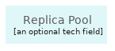

# GcpGroupReplicaPool
| Example | Resource |
| :-: | --- |
|  | `groups/gcp/GcpGroupReplicaPool` |
## Load remotely
```plantuml
@startuml
' configures the library
!global $LIB_BRANCH="v1.x"
!global $LIB_BASE_LOCATION="https://raw.githubusercontent.com/tmorin/plantuml-libs/" + $LIB_BRANCH + "/cloud"

' loads the library
!includeurl $LIB_BASE_LOCATION/library.puml

' loads the style
include('styles/gcp')

' loads the GcpGroupReplicaPool group
include('groups/gcp/GcpGroupReplicaPool')
GcpGroupReplicaPool('element', 'Replica Pool', 'an optional tech field')
@enduml
```
## Load locally
```plantuml
@startuml
' configures the library
!global $INCLUSION_MODE="local"
!global $LIB_BASE_LOCATION="../../"

' loads the library
!include ../../library.puml

' loads the style
include('styles/gcp')

' loads the GcpGroupReplicaPool group
include('groups/gcp/GcpGroupReplicaPool')
GcpGroupReplicaPool('element', 'Replica Pool', 'an optional tech field')
@enduml
```
