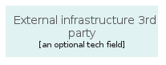
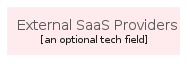
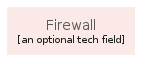
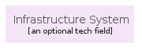
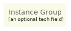
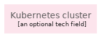
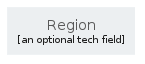
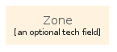

# gcp - Groups
## groups/gcp
| | Name |
| :-: | --- |
|  | [GcpGroupAccount](GcpGroupAccount.md) `groups/gcp/GcpGroupAccount` |
|  | [GcpGroupCloudServiceProvider](GcpGroupCloudServiceProvider.md) `groups/gcp/GcpGroupCloudServiceProvider` |
|  | [GcpGroupExternalDataSources](GcpGroupExternalDataSources.md) `groups/gcp/GcpGroupExternalDataSources` |
|  | [GcpGroupExternalInfrastructure1stParty](GcpGroupExternalInfrastructure1stParty.md) `groups/gcp/GcpGroupExternalInfrastructure1stParty` |
|  | [GcpGroupExternalInfrastructure3rdParty](GcpGroupExternalInfrastructure3rdParty.md) `groups/gcp/GcpGroupExternalInfrastructure3rdParty` |
|  | [GcpGroupExternalSaasProviders](GcpGroupExternalSaasProviders.md) `groups/gcp/GcpGroupExternalSaasProviders` |
|  | [GcpGroupFirewall](GcpGroupFirewall.md) `groups/gcp/GcpGroupFirewall` |
|  | [GcpGroupInfrastructureSystem](GcpGroupInfrastructureSystem.md) `groups/gcp/GcpGroupInfrastructureSystem` |
|  | [GcpGroupInstanceGroup](GcpGroupInstanceGroup.md) `groups/gcp/GcpGroupInstanceGroup` |
|  | [GcpGroupInstances](GcpGroupInstances.md) `groups/gcp/GcpGroupInstances` |
|  | [GcpGroupKubernetesCluster](GcpGroupKubernetesCluster.md) `groups/gcp/GcpGroupKubernetesCluster` |
|  | [GcpGroupLogicalGroupingOfServices](GcpGroupLogicalGroupingOfServices.md) `groups/gcp/GcpGroupLogicalGroupingOfServices` |
|  | [GcpGroupOnPremise](GcpGroupOnPremise.md) `groups/gcp/GcpGroupOnPremise` |
|  | [GcpGroupOptionalComponent](GcpGroupOptionalComponent.md) `groups/gcp/GcpGroupOptionalComponent` |
|  | [GcpGroupPod](GcpGroupPod.md) `groups/gcp/GcpGroupPod` |
|  | [GcpGroupProjectZone](GcpGroupProjectZone.md) `groups/gcp/GcpGroupProjectZone` |
|  | [GcpGroupRegion](GcpGroupRegion.md) `groups/gcp/GcpGroupRegion` |
|  | [GcpGroupReplicaPool](GcpGroupReplicaPool.md) `groups/gcp/GcpGroupReplicaPool` |
|  | [GcpGroupSubNetwork](GcpGroupSubNetwork.md) `groups/gcp/GcpGroupSubNetwork` |
|  | [GcpGroupSystem](GcpGroupSystem.md) `groups/gcp/GcpGroupSystem` |
|  | [GcpGroupUser](GcpGroupUser.md) `groups/gcp/GcpGroupUser` |
|  | [GcpGroupZone](GcpGroupZone.md) `groups/gcp/GcpGroupZone` |
