# materials - Elements
## elements/materials/Action
| | Name |
| :-: | --- |
| 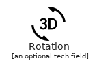 | [Materials3dRotation](Action/Materials3dRotation.md) `elements/materials/Action/Materials3dRotation` |
| 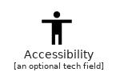 | [MaterialsAccessibility](Action/MaterialsAccessibility.md) `elements/materials/Action/MaterialsAccessibility` |
|  | [MaterialsAccessible](Action/MaterialsAccessible.md) `elements/materials/Action/MaterialsAccessible` |
|  | [MaterialsAccountBalance](Action/MaterialsAccountBalance.md) `elements/materials/Action/MaterialsAccountBalance` |
|  | [MaterialsAccountBalanceWallet](Action/MaterialsAccountBalanceWallet.md) `elements/materials/Action/MaterialsAccountBalanceWallet` |
|  | [MaterialsAccountBox](Action/MaterialsAccountBox.md) `elements/materials/Action/MaterialsAccountBox` |
|  | [MaterialsAccountCircle](Action/MaterialsAccountCircle.md) `elements/materials/Action/MaterialsAccountCircle` |
|  | [MaterialsAddShoppingCart](Action/MaterialsAddShoppingCart.md) `elements/materials/Action/MaterialsAddShoppingCart` |
|  | [MaterialsAlarmAdd](Action/MaterialsAlarmAdd.md) `elements/materials/Action/MaterialsAlarmAdd` |
| 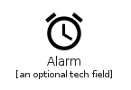 | [MaterialsAlarm](Action/MaterialsAlarm.md) `elements/materials/Action/MaterialsAlarm` |
|  | [MaterialsAlarmOff](Action/MaterialsAlarmOff.md) `elements/materials/Action/MaterialsAlarmOff` |
|  | [MaterialsAlarmOn](Action/MaterialsAlarmOn.md) `elements/materials/Action/MaterialsAlarmOn` |
|  | [MaterialsAllOut](Action/MaterialsAllOut.md) `elements/materials/Action/MaterialsAllOut` |
|  | [MaterialsAndroid](Action/MaterialsAndroid.md) `elements/materials/Action/MaterialsAndroid` |
|  | [MaterialsAnnouncement](Action/MaterialsAnnouncement.md) `elements/materials/Action/MaterialsAnnouncement` |
| 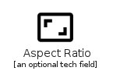 | [MaterialsAspectRatio](Action/MaterialsAspectRatio.md) `elements/materials/Action/MaterialsAspectRatio` |
|  | [MaterialsAssessment](Action/MaterialsAssessment.md) `elements/materials/Action/MaterialsAssessment` |
|  | [MaterialsAssignment](Action/MaterialsAssignment.md) `elements/materials/Action/MaterialsAssignment` |
|  | [MaterialsAssignmentInd](Action/MaterialsAssignmentInd.md) `elements/materials/Action/MaterialsAssignmentInd` |
|  | [MaterialsAssignmentLate](Action/MaterialsAssignmentLate.md) `elements/materials/Action/MaterialsAssignmentLate` |
|  | [MaterialsAssignmentReturned](Action/MaterialsAssignmentReturned.md) `elements/materials/Action/MaterialsAssignmentReturned` |
|  | [MaterialsAssignmentReturn](Action/MaterialsAssignmentReturn.md) `elements/materials/Action/MaterialsAssignmentReturn` |
|  | [MaterialsAssignmentTurnedIn](Action/MaterialsAssignmentTurnedIn.md) `elements/materials/Action/MaterialsAssignmentTurnedIn` |
| 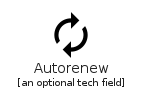 | [MaterialsAutorenew](Action/MaterialsAutorenew.md) `elements/materials/Action/MaterialsAutorenew` |
|  | [MaterialsBackup](Action/MaterialsBackup.md) `elements/materials/Action/MaterialsBackup` |
|  | [MaterialsBook](Action/MaterialsBook.md) `elements/materials/Action/MaterialsBook` |
|  | [MaterialsBookmarkBorder](Action/MaterialsBookmarkBorder.md) `elements/materials/Action/MaterialsBookmarkBorder` |
|  | [MaterialsBookmark](Action/MaterialsBookmark.md) `elements/materials/Action/MaterialsBookmark` |
|  | [MaterialsBugReport](Action/MaterialsBugReport.md) `elements/materials/Action/MaterialsBugReport` |
| 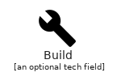 | [MaterialsBuild](Action/MaterialsBuild.md) `elements/materials/Action/MaterialsBuild` |
|  | [MaterialsCached](Action/MaterialsCached.md) `elements/materials/Action/MaterialsCached` |
|  | [MaterialsCardGiftcard](Action/MaterialsCardGiftcard.md) `elements/materials/Action/MaterialsCardGiftcard` |
|  | [MaterialsCardMembership](Action/MaterialsCardMembership.md) `elements/materials/Action/MaterialsCardMembership` |
|  | [MaterialsCardTravel](Action/MaterialsCardTravel.md) `elements/materials/Action/MaterialsCardTravel` |
|  | [MaterialsChangeHistory](Action/MaterialsChangeHistory.md) `elements/materials/Action/MaterialsChangeHistory` |
|  | [MaterialsCheckCircle](Action/MaterialsCheckCircle.md) `elements/materials/Action/MaterialsCheckCircle` |
|  | [MaterialsChromeReaderMode](Action/MaterialsChromeReaderMode.md) `elements/materials/Action/MaterialsChromeReaderMode` |
|  | [MaterialsClass](Action/MaterialsClass.md) `elements/materials/Action/MaterialsClass` |
| 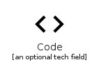 | [MaterialsCode](Action/MaterialsCode.md) `elements/materials/Action/MaterialsCode` |
| 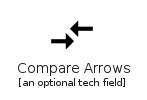 | [MaterialsCompareArrows](Action/MaterialsCompareArrows.md) `elements/materials/Action/MaterialsCompareArrows` |
|  | [MaterialsCopyright](Action/MaterialsCopyright.md) `elements/materials/Action/MaterialsCopyright` |
|  | [MaterialsCreditCard](Action/MaterialsCreditCard.md) `elements/materials/Action/MaterialsCreditCard` |
|  | [MaterialsDashboard](Action/MaterialsDashboard.md) `elements/materials/Action/MaterialsDashboard` |
|  | [MaterialsDateRange](Action/MaterialsDateRange.md) `elements/materials/Action/MaterialsDateRange` |
|  | [MaterialsDelete](Action/MaterialsDelete.md) `elements/materials/Action/MaterialsDelete` |
|  | [MaterialsDeleteForever](Action/MaterialsDeleteForever.md) `elements/materials/Action/MaterialsDeleteForever` |
|  | [MaterialsDescription](Action/MaterialsDescription.md) `elements/materials/Action/MaterialsDescription` |
|  | [MaterialsDns](Action/MaterialsDns.md) `elements/materials/Action/MaterialsDns` |
|  | [MaterialsDoneAll](Action/MaterialsDoneAll.md) `elements/materials/Action/MaterialsDoneAll` |
| 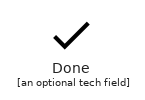 | [MaterialsDone](Action/MaterialsDone.md) `elements/materials/Action/MaterialsDone` |
|  | [MaterialsDonutLarge](Action/MaterialsDonutLarge.md) `elements/materials/Action/MaterialsDonutLarge` |
|  | [MaterialsDonutSmall](Action/MaterialsDonutSmall.md) `elements/materials/Action/MaterialsDonutSmall` |
|  | [MaterialsEuroSymbol](Action/MaterialsEuroSymbol.md) `elements/materials/Action/MaterialsEuroSymbol` |
|  | [MaterialsEvent](Action/MaterialsEvent.md) `elements/materials/Action/MaterialsEvent` |
|  | [MaterialsEventSeat](Action/MaterialsEventSeat.md) `elements/materials/Action/MaterialsEventSeat` |
|  | [MaterialsExitToApp](Action/MaterialsExitToApp.md) `elements/materials/Action/MaterialsExitToApp` |
|  | [MaterialsExplore](Action/MaterialsExplore.md) `elements/materials/Action/MaterialsExplore` |
|  | [MaterialsExtension](Action/MaterialsExtension.md) `elements/materials/Action/MaterialsExtension` |
| 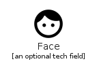 | [MaterialsFace](Action/MaterialsFace.md) `elements/materials/Action/MaterialsFace` |
|  | [MaterialsFavoriteBorder](Action/MaterialsFavoriteBorder.md) `elements/materials/Action/MaterialsFavoriteBorder` |
|  | [MaterialsFavorite](Action/MaterialsFavorite.md) `elements/materials/Action/MaterialsFavorite` |
|  | [MaterialsFeedback](Action/MaterialsFeedback.md) `elements/materials/Action/MaterialsFeedback` |
|  | [MaterialsFindInPage](Action/MaterialsFindInPage.md) `elements/materials/Action/MaterialsFindInPage` |
|  | [MaterialsFindReplace](Action/MaterialsFindReplace.md) `elements/materials/Action/MaterialsFindReplace` |
|  | [MaterialsFingerprint](Action/MaterialsFingerprint.md) `elements/materials/Action/MaterialsFingerprint` |
|  | [MaterialsFlightLand](Action/MaterialsFlightLand.md) `elements/materials/Action/MaterialsFlightLand` |
|  | [MaterialsFlightTakeoff](Action/MaterialsFlightTakeoff.md) `elements/materials/Action/MaterialsFlightTakeoff` |
|  | [MaterialsFlipToBack](Action/MaterialsFlipToBack.md) `elements/materials/Action/MaterialsFlipToBack` |
|  | [MaterialsFlipToFront](Action/MaterialsFlipToFront.md) `elements/materials/Action/MaterialsFlipToFront` |
|  | [MaterialsGavel](Action/MaterialsGavel.md) `elements/materials/Action/MaterialsGavel` |
|  | [MaterialsGetApp](Action/MaterialsGetApp.md) `elements/materials/Action/MaterialsGetApp` |
|  | [MaterialsGrade](Action/MaterialsGrade.md) `elements/materials/Action/MaterialsGrade` |
|  | [MaterialsGroupWork](Action/MaterialsGroupWork.md) `elements/materials/Action/MaterialsGroupWork` |
|  | [MaterialsGTranslate](Action/MaterialsGTranslate.md) `elements/materials/Action/MaterialsGTranslate` |
|  | [MaterialsHelp](Action/MaterialsHelp.md) `elements/materials/Action/MaterialsHelp` |
|  | [MaterialsHighlightOff](Action/MaterialsHighlightOff.md) `elements/materials/Action/MaterialsHighlightOff` |
|  | [MaterialsHistory](Action/MaterialsHistory.md) `elements/materials/Action/MaterialsHistory` |
| 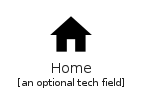 | [MaterialsHome](Action/MaterialsHome.md) `elements/materials/Action/MaterialsHome` |
| 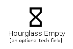 | [MaterialsHourglassEmpty](Action/MaterialsHourglassEmpty.md) `elements/materials/Action/MaterialsHourglassEmpty` |
|  | [MaterialsHourglassFull](Action/MaterialsHourglassFull.md) `elements/materials/Action/MaterialsHourglassFull` |
|  | [MaterialsHttp](Action/MaterialsHttp.md) `elements/materials/Action/MaterialsHttp` |
|  | [MaterialsHttps](Action/MaterialsHttps.md) `elements/materials/Action/MaterialsHttps` |
|  | [MaterialsImportantDevices](Action/MaterialsImportantDevices.md) `elements/materials/Action/MaterialsImportantDevices` |
|  | [MaterialsInfo](Action/MaterialsInfo.md) `elements/materials/Action/MaterialsInfo` |
|  | [MaterialsInfoOutline](Action/MaterialsInfoOutline.md) `elements/materials/Action/MaterialsInfoOutline` |
| 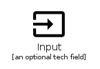 | [MaterialsInput](Action/MaterialsInput.md) `elements/materials/Action/MaterialsInput` |
|  | [MaterialsInvertColors](Action/MaterialsInvertColors.md) `elements/materials/Action/MaterialsInvertColors` |
|  | [MaterialsLabel](Action/MaterialsLabel.md) `elements/materials/Action/MaterialsLabel` |
|  | [MaterialsLabelOutline](Action/MaterialsLabelOutline.md) `elements/materials/Action/MaterialsLabelOutline` |
|  | [MaterialsLanguage](Action/MaterialsLanguage.md) `elements/materials/Action/MaterialsLanguage` |
|  | [MaterialsLaunch](Action/MaterialsLaunch.md) `elements/materials/Action/MaterialsLaunch` |
|  | [MaterialsLightbulbOutline](Action/MaterialsLightbulbOutline.md) `elements/materials/Action/MaterialsLightbulbOutline` |
|  | [MaterialsLineStyle](Action/MaterialsLineStyle.md) `elements/materials/Action/MaterialsLineStyle` |
|  | [MaterialsLineWeight](Action/MaterialsLineWeight.md) `elements/materials/Action/MaterialsLineWeight` |
|  | [MaterialsList](Action/MaterialsList.md) `elements/materials/Action/MaterialsList` |
|  | [MaterialsLock](Action/MaterialsLock.md) `elements/materials/Action/MaterialsLock` |
|  | [MaterialsLockOpen](Action/MaterialsLockOpen.md) `elements/materials/Action/MaterialsLockOpen` |
|  | [MaterialsLockOutline](Action/MaterialsLockOutline.md) `elements/materials/Action/MaterialsLockOutline` |
|  | [MaterialsLoyalty](Action/MaterialsLoyalty.md) `elements/materials/Action/MaterialsLoyalty` |
|  | [MaterialsMarkunreadMailbox](Action/MaterialsMarkunreadMailbox.md) `elements/materials/Action/MaterialsMarkunreadMailbox` |
|  | [MaterialsMotorcycle](Action/MaterialsMotorcycle.md) `elements/materials/Action/MaterialsMotorcycle` |
|  | [MaterialsNoteAdd](Action/MaterialsNoteAdd.md) `elements/materials/Action/MaterialsNoteAdd` |
|  | [MaterialsOpacity](Action/MaterialsOpacity.md) `elements/materials/Action/MaterialsOpacity` |
|  | [MaterialsOpenInBrowser](Action/MaterialsOpenInBrowser.md) `elements/materials/Action/MaterialsOpenInBrowser` |
|  | [MaterialsOpenInNew](Action/MaterialsOpenInNew.md) `elements/materials/Action/MaterialsOpenInNew` |
|  | [MaterialsOpenWith](Action/MaterialsOpenWith.md) `elements/materials/Action/MaterialsOpenWith` |
|  | [MaterialsPageview](Action/MaterialsPageview.md) `elements/materials/Action/MaterialsPageview` |
|  | [MaterialsPanTool](Action/MaterialsPanTool.md) `elements/materials/Action/MaterialsPanTool` |
|  | [MaterialsPayment](Action/MaterialsPayment.md) `elements/materials/Action/MaterialsPayment` |
|  | [MaterialsPermCameraMic](Action/MaterialsPermCameraMic.md) `elements/materials/Action/MaterialsPermCameraMic` |
|  | [MaterialsPermContactCalendar](Action/MaterialsPermContactCalendar.md) `elements/materials/Action/MaterialsPermContactCalendar` |
|  | [MaterialsPermDataSetting](Action/MaterialsPermDataSetting.md) `elements/materials/Action/MaterialsPermDataSetting` |
|  | [MaterialsPermDeviceInformation](Action/MaterialsPermDeviceInformation.md) `elements/materials/Action/MaterialsPermDeviceInformation` |
|  | [MaterialsPermIdentity](Action/MaterialsPermIdentity.md) `elements/materials/Action/MaterialsPermIdentity` |
|  | [MaterialsPermMedia](Action/MaterialsPermMedia.md) `elements/materials/Action/MaterialsPermMedia` |
|  | [MaterialsPermPhoneMsg](Action/MaterialsPermPhoneMsg.md) `elements/materials/Action/MaterialsPermPhoneMsg` |
|  | [MaterialsPermScanWifi](Action/MaterialsPermScanWifi.md) `elements/materials/Action/MaterialsPermScanWifi` |
| 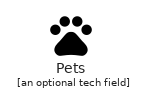 | [MaterialsPets](Action/MaterialsPets.md) `elements/materials/Action/MaterialsPets` |
|  | [MaterialsPictureInPictureAlt](Action/MaterialsPictureInPictureAlt.md) `elements/materials/Action/MaterialsPictureInPictureAlt` |
|  | [MaterialsPictureInPicture](Action/MaterialsPictureInPicture.md) `elements/materials/Action/MaterialsPictureInPicture` |
|  | [MaterialsPlayForWork](Action/MaterialsPlayForWork.md) `elements/materials/Action/MaterialsPlayForWork` |
|  | [MaterialsPolymer](Action/MaterialsPolymer.md) `elements/materials/Action/MaterialsPolymer` |
|  | [MaterialsPowerSettingsNew](Action/MaterialsPowerSettingsNew.md) `elements/materials/Action/MaterialsPowerSettingsNew` |
|  | [MaterialsPregnantWoman](Action/MaterialsPregnantWoman.md) `elements/materials/Action/MaterialsPregnantWoman` |
|  | [MaterialsPrint](Action/MaterialsPrint.md) `elements/materials/Action/MaterialsPrint` |
|  | [MaterialsQueryBuilder](Action/MaterialsQueryBuilder.md) `elements/materials/Action/MaterialsQueryBuilder` |
|  | [MaterialsQuestionAnswer](Action/MaterialsQuestionAnswer.md) `elements/materials/Action/MaterialsQuestionAnswer` |
|  | [MaterialsReceipt](Action/MaterialsReceipt.md) `elements/materials/Action/MaterialsReceipt` |
|  | [MaterialsRecordVoiceOver](Action/MaterialsRecordVoiceOver.md) `elements/materials/Action/MaterialsRecordVoiceOver` |
|  | [MaterialsRedeem](Action/MaterialsRedeem.md) `elements/materials/Action/MaterialsRedeem` |
|  | [MaterialsRemoveShoppingCart](Action/MaterialsRemoveShoppingCart.md) `elements/materials/Action/MaterialsRemoveShoppingCart` |
| 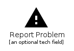 | [MaterialsReportProblem](Action/MaterialsReportProblem.md) `elements/materials/Action/MaterialsReportProblem` |
| 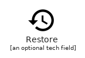 | [MaterialsRestore](Action/MaterialsRestore.md) `elements/materials/Action/MaterialsRestore` |
|  | [MaterialsRestorePage](Action/MaterialsRestorePage.md) `elements/materials/Action/MaterialsRestorePage` |
|  | [MaterialsRoom](Action/MaterialsRoom.md) `elements/materials/Action/MaterialsRoom` |
|  | [MaterialsRoundedCorner](Action/MaterialsRoundedCorner.md) `elements/materials/Action/MaterialsRoundedCorner` |
| 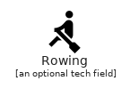 | [MaterialsRowing](Action/MaterialsRowing.md) `elements/materials/Action/MaterialsRowing` |
|  | [MaterialsSchedule](Action/MaterialsSchedule.md) `elements/materials/Action/MaterialsSchedule` |
|  | [MaterialsSearch](Action/MaterialsSearch.md) `elements/materials/Action/MaterialsSearch` |
|  | [MaterialsSettingsApplications](Action/MaterialsSettingsApplications.md) `elements/materials/Action/MaterialsSettingsApplications` |
|  | [MaterialsSettingsBackupRestore](Action/MaterialsSettingsBackupRestore.md) `elements/materials/Action/MaterialsSettingsBackupRestore` |
|  | [MaterialsSettingsBluetooth](Action/MaterialsSettingsBluetooth.md) `elements/materials/Action/MaterialsSettingsBluetooth` |
|  | [MaterialsSettingsBrightness](Action/MaterialsSettingsBrightness.md) `elements/materials/Action/MaterialsSettingsBrightness` |
|  | [MaterialsSettingsCell](Action/MaterialsSettingsCell.md) `elements/materials/Action/MaterialsSettingsCell` |
|  | [MaterialsSettings](Action/MaterialsSettings.md) `elements/materials/Action/MaterialsSettings` |
| 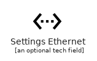 | [MaterialsSettingsEthernet](Action/MaterialsSettingsEthernet.md) `elements/materials/Action/MaterialsSettingsEthernet` |
|  | [MaterialsSettingsInputAntenna](Action/MaterialsSettingsInputAntenna.md) `elements/materials/Action/MaterialsSettingsInputAntenna` |
| 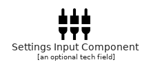 | [MaterialsSettingsInputComponent](Action/MaterialsSettingsInputComponent.md) `elements/materials/Action/MaterialsSettingsInputComponent` |
|  | [MaterialsSettingsInputComposite](Action/MaterialsSettingsInputComposite.md) `elements/materials/Action/MaterialsSettingsInputComposite` |
| 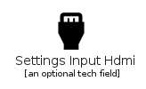 | [MaterialsSettingsInputHdmi](Action/MaterialsSettingsInputHdmi.md) `elements/materials/Action/MaterialsSettingsInputHdmi` |
|  | [MaterialsSettingsInputSvideo](Action/MaterialsSettingsInputSvideo.md) `elements/materials/Action/MaterialsSettingsInputSvideo` |
|  | [MaterialsSettingsOverscan](Action/MaterialsSettingsOverscan.md) `elements/materials/Action/MaterialsSettingsOverscan` |
|  | [MaterialsSettingsPhone](Action/MaterialsSettingsPhone.md) `elements/materials/Action/MaterialsSettingsPhone` |
|  | [MaterialsSettingsPower](Action/MaterialsSettingsPower.md) `elements/materials/Action/MaterialsSettingsPower` |
|  | [MaterialsSettingsRemote](Action/MaterialsSettingsRemote.md) `elements/materials/Action/MaterialsSettingsRemote` |
|  | [MaterialsSettingsVoice](Action/MaterialsSettingsVoice.md) `elements/materials/Action/MaterialsSettingsVoice` |
|  | [MaterialsShop](Action/MaterialsShop.md) `elements/materials/Action/MaterialsShop` |
|  | [MaterialsShoppingBasket](Action/MaterialsShoppingBasket.md) `elements/materials/Action/MaterialsShoppingBasket` |
|  | [MaterialsShoppingCart](Action/MaterialsShoppingCart.md) `elements/materials/Action/MaterialsShoppingCart` |
|  | [MaterialsShopTwo](Action/MaterialsShopTwo.md) `elements/materials/Action/MaterialsShopTwo` |
|  | [MaterialsSpeakerNotes](Action/MaterialsSpeakerNotes.md) `elements/materials/Action/MaterialsSpeakerNotes` |
|  | [MaterialsSpeakerNotesOff](Action/MaterialsSpeakerNotesOff.md) `elements/materials/Action/MaterialsSpeakerNotesOff` |
|  | [MaterialsSpellcheck](Action/MaterialsSpellcheck.md) `elements/materials/Action/MaterialsSpellcheck` |
|  | [MaterialsStars](Action/MaterialsStars.md) `elements/materials/Action/MaterialsStars` |
|  | [MaterialsStore](Action/MaterialsStore.md) `elements/materials/Action/MaterialsStore` |
|  | [MaterialsSubject](Action/MaterialsSubject.md) `elements/materials/Action/MaterialsSubject` |
|  | [MaterialsSupervisorAccount](Action/MaterialsSupervisorAccount.md) `elements/materials/Action/MaterialsSupervisorAccount` |
| 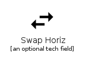 | [MaterialsSwapHoriz](Action/MaterialsSwapHoriz.md) `elements/materials/Action/MaterialsSwapHoriz` |
| 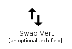 | [MaterialsSwapVert](Action/MaterialsSwapVert.md) `elements/materials/Action/MaterialsSwapVert` |
|  | [MaterialsSwapVerticalCircle](Action/MaterialsSwapVerticalCircle.md) `elements/materials/Action/MaterialsSwapVerticalCircle` |
|  | [MaterialsSystemUpdateAlt](Action/MaterialsSystemUpdateAlt.md) `elements/materials/Action/MaterialsSystemUpdateAlt` |
|  | [MaterialsTab](Action/MaterialsTab.md) `elements/materials/Action/MaterialsTab` |
|  | [MaterialsTabUnselected](Action/MaterialsTabUnselected.md) `elements/materials/Action/MaterialsTabUnselected` |
|  | [MaterialsTheaters](Action/MaterialsTheaters.md) `elements/materials/Action/MaterialsTheaters` |
|  | [MaterialsThumbDown](Action/MaterialsThumbDown.md) `elements/materials/Action/MaterialsThumbDown` |
|  | [MaterialsThumbsUpDown](Action/MaterialsThumbsUpDown.md) `elements/materials/Action/MaterialsThumbsUpDown` |
|  | [MaterialsThumbUp](Action/MaterialsThumbUp.md) `elements/materials/Action/MaterialsThumbUp` |
|  | [MaterialsTimeline](Action/MaterialsTimeline.md) `elements/materials/Action/MaterialsTimeline` |
| 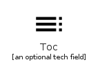 | [MaterialsToc](Action/MaterialsToc.md) `elements/materials/Action/MaterialsToc` |
|  | [MaterialsToday](Action/MaterialsToday.md) `elements/materials/Action/MaterialsToday` |
|  | [MaterialsToll](Action/MaterialsToll.md) `elements/materials/Action/MaterialsToll` |
|  | [MaterialsTouchApp](Action/MaterialsTouchApp.md) `elements/materials/Action/MaterialsTouchApp` |
|  | [MaterialsTrackChanges](Action/MaterialsTrackChanges.md) `elements/materials/Action/MaterialsTrackChanges` |
|  | [MaterialsTranslate](Action/MaterialsTranslate.md) `elements/materials/Action/MaterialsTranslate` |
|  | [MaterialsTrendingDown](Action/MaterialsTrendingDown.md) `elements/materials/Action/MaterialsTrendingDown` |
| 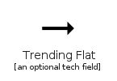 | [MaterialsTrendingFlat](Action/MaterialsTrendingFlat.md) `elements/materials/Action/MaterialsTrendingFlat` |
|  | [MaterialsTrendingUp](Action/MaterialsTrendingUp.md) `elements/materials/Action/MaterialsTrendingUp` |
|  | [MaterialsTurnedIn](Action/MaterialsTurnedIn.md) `elements/materials/Action/MaterialsTurnedIn` |
|  | [MaterialsTurnedInNot](Action/MaterialsTurnedInNot.md) `elements/materials/Action/MaterialsTurnedInNot` |
| 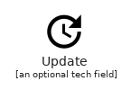 | [MaterialsUpdate](Action/MaterialsUpdate.md) `elements/materials/Action/MaterialsUpdate` |
|  | [MaterialsVerifiedUser](Action/MaterialsVerifiedUser.md) `elements/materials/Action/MaterialsVerifiedUser` |
|  | [MaterialsViewAgenda](Action/MaterialsViewAgenda.md) `elements/materials/Action/MaterialsViewAgenda` |
| 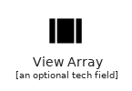 | [MaterialsViewArray](Action/MaterialsViewArray.md) `elements/materials/Action/MaterialsViewArray` |
|  | [MaterialsViewCarousel](Action/MaterialsViewCarousel.md) `elements/materials/Action/MaterialsViewCarousel` |
|  | [MaterialsViewColumn](Action/MaterialsViewColumn.md) `elements/materials/Action/MaterialsViewColumn` |
|  | [MaterialsViewDay](Action/MaterialsViewDay.md) `elements/materials/Action/MaterialsViewDay` |
|  | [MaterialsViewHeadline](Action/MaterialsViewHeadline.md) `elements/materials/Action/MaterialsViewHeadline` |
|  | [MaterialsViewList](Action/MaterialsViewList.md) `elements/materials/Action/MaterialsViewList` |
|  | [MaterialsViewModule](Action/MaterialsViewModule.md) `elements/materials/Action/MaterialsViewModule` |
|  | [MaterialsViewQuilt](Action/MaterialsViewQuilt.md) `elements/materials/Action/MaterialsViewQuilt` |
|  | [MaterialsViewStream](Action/MaterialsViewStream.md) `elements/materials/Action/MaterialsViewStream` |
|  | [MaterialsViewWeek](Action/MaterialsViewWeek.md) `elements/materials/Action/MaterialsViewWeek` |
|  | [MaterialsVisibility](Action/MaterialsVisibility.md) `elements/materials/Action/MaterialsVisibility` |
|  | [MaterialsVisibilityOff](Action/MaterialsVisibilityOff.md) `elements/materials/Action/MaterialsVisibilityOff` |
|  | [MaterialsWatchLater](Action/MaterialsWatchLater.md) `elements/materials/Action/MaterialsWatchLater` |
|  | [MaterialsWork](Action/MaterialsWork.md) `elements/materials/Action/MaterialsWork` |
|  | [MaterialsYoutubeSearchedFor](Action/MaterialsYoutubeSearchedFor.md) `elements/materials/Action/MaterialsYoutubeSearchedFor` |
## elements/materials/Alert
| | Name |
| :-: | --- |
|  | [MaterialsAddAlert](Alert/MaterialsAddAlert.md) `elements/materials/Alert/MaterialsAddAlert` |
|  | [MaterialsError](Alert/MaterialsError.md) `elements/materials/Alert/MaterialsError` |
| 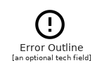 | [MaterialsErrorOutline](Alert/MaterialsErrorOutline.md) `elements/materials/Alert/MaterialsErrorOutline` |
|  | [MaterialsWarning](Alert/MaterialsWarning.md) `elements/materials/Alert/MaterialsWarning` |
## elements/materials/Av
| | Name |
| :-: | --- |
|  | [MaterialsAddToQueue](Av/MaterialsAddToQueue.md) `elements/materials/Av/MaterialsAddToQueue` |
|  | [MaterialsAirplay](Av/MaterialsAirplay.md) `elements/materials/Av/MaterialsAirplay` |
|  | [MaterialsAlbum](Av/MaterialsAlbum.md) `elements/materials/Av/MaterialsAlbum` |
|  | [MaterialsArtTrack](Av/MaterialsArtTrack.md) `elements/materials/Av/MaterialsArtTrack` |
| 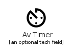 | [MaterialsAvTimer](Av/MaterialsAvTimer.md) `elements/materials/Av/MaterialsAvTimer` |
|  | [MaterialsBrandingWatermark](Av/MaterialsBrandingWatermark.md) `elements/materials/Av/MaterialsBrandingWatermark` |
|  | [MaterialsCallToAction](Av/MaterialsCallToAction.md) `elements/materials/Av/MaterialsCallToAction` |
|  | [MaterialsClosedCaption](Av/MaterialsClosedCaption.md) `elements/materials/Av/MaterialsClosedCaption` |
|  | [MaterialsEqualizer](Av/MaterialsEqualizer.md) `elements/materials/Av/MaterialsEqualizer` |
|  | [MaterialsExplicit](Av/MaterialsExplicit.md) `elements/materials/Av/MaterialsExplicit` |
|  | [MaterialsFastForward](Av/MaterialsFastForward.md) `elements/materials/Av/MaterialsFastForward` |
|  | [MaterialsFastRewind](Av/MaterialsFastRewind.md) `elements/materials/Av/MaterialsFastRewind` |
|  | [MaterialsFeaturedPlayList](Av/MaterialsFeaturedPlayList.md) `elements/materials/Av/MaterialsFeaturedPlayList` |
|  | [MaterialsFeaturedVideo](Av/MaterialsFeaturedVideo.md) `elements/materials/Av/MaterialsFeaturedVideo` |
|  | [MaterialsFiberDvr](Av/MaterialsFiberDvr.md) `elements/materials/Av/MaterialsFiberDvr` |
|  | [MaterialsFiberManualRecord](Av/MaterialsFiberManualRecord.md) `elements/materials/Av/MaterialsFiberManualRecord` |
|  | [MaterialsFiberNew](Av/MaterialsFiberNew.md) `elements/materials/Av/MaterialsFiberNew` |
|  | [MaterialsFiberPin](Av/MaterialsFiberPin.md) `elements/materials/Av/MaterialsFiberPin` |
|  | [MaterialsFiberSmartRecord](Av/MaterialsFiberSmartRecord.md) `elements/materials/Av/MaterialsFiberSmartRecord` |
| 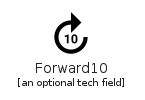 | [MaterialsForward10](Av/MaterialsForward10.md) `elements/materials/Av/MaterialsForward10` |
|  | [MaterialsForward30](Av/MaterialsForward30.md) `elements/materials/Av/MaterialsForward30` |
| 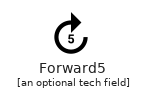 | [MaterialsForward5](Av/MaterialsForward5.md) `elements/materials/Av/MaterialsForward5` |
|  | [MaterialsGames](Av/MaterialsGames.md) `elements/materials/Av/MaterialsGames` |
|  | [MaterialsHearing](Av/MaterialsHearing.md) `elements/materials/Av/MaterialsHearing` |
|  | [MaterialsHighQuality](Av/MaterialsHighQuality.md) `elements/materials/Av/MaterialsHighQuality` |
|  | [MaterialsLibraryAdd](Av/MaterialsLibraryAdd.md) `elements/materials/Av/MaterialsLibraryAdd` |
|  | [MaterialsLibraryBooks](Av/MaterialsLibraryBooks.md) `elements/materials/Av/MaterialsLibraryBooks` |
|  | [MaterialsLibraryMusic](Av/MaterialsLibraryMusic.md) `elements/materials/Av/MaterialsLibraryMusic` |
| 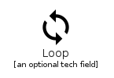 | [MaterialsLoop](Av/MaterialsLoop.md) `elements/materials/Av/MaterialsLoop` |
| 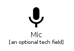 | [MaterialsMic](Av/MaterialsMic.md) `elements/materials/Av/MaterialsMic` |
|  | [MaterialsMicNone](Av/MaterialsMicNone.md) `elements/materials/Av/MaterialsMicNone` |
| 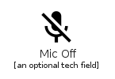 | [MaterialsMicOff](Av/MaterialsMicOff.md) `elements/materials/Av/MaterialsMicOff` |
|  | [MaterialsMovie](Av/MaterialsMovie.md) `elements/materials/Av/MaterialsMovie` |
|  | [MaterialsMusicVideo](Av/MaterialsMusicVideo.md) `elements/materials/Av/MaterialsMusicVideo` |
|  | [MaterialsNewReleases](Av/MaterialsNewReleases.md) `elements/materials/Av/MaterialsNewReleases` |
|  | [MaterialsNote](Av/MaterialsNote.md) `elements/materials/Av/MaterialsNote` |
|  | [MaterialsNotInterested](Av/MaterialsNotInterested.md) `elements/materials/Av/MaterialsNotInterested` |
|  | [MaterialsPauseCircleFilled](Av/MaterialsPauseCircleFilled.md) `elements/materials/Av/MaterialsPauseCircleFilled` |
| 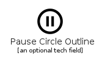 | [MaterialsPauseCircleOutline](Av/MaterialsPauseCircleOutline.md) `elements/materials/Av/MaterialsPauseCircleOutline` |
| 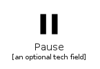 | [MaterialsPause](Av/MaterialsPause.md) `elements/materials/Av/MaterialsPause` |
| 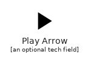 | [MaterialsPlayArrow](Av/MaterialsPlayArrow.md) `elements/materials/Av/MaterialsPlayArrow` |
|  | [MaterialsPlayCircleFilled](Av/MaterialsPlayCircleFilled.md) `elements/materials/Av/MaterialsPlayCircleFilled` |
|  | [MaterialsPlayCircleFilledWhite](Av/MaterialsPlayCircleFilledWhite.md) `elements/materials/Av/MaterialsPlayCircleFilledWhite` |
|  | [MaterialsPlayCircleOutline](Av/MaterialsPlayCircleOutline.md) `elements/materials/Av/MaterialsPlayCircleOutline` |
|  | [MaterialsPlaylistAddCheck](Av/MaterialsPlaylistAddCheck.md) `elements/materials/Av/MaterialsPlaylistAddCheck` |
|  | [MaterialsPlaylistAdd](Av/MaterialsPlaylistAdd.md) `elements/materials/Av/MaterialsPlaylistAdd` |
|  | [MaterialsPlaylistPlay](Av/MaterialsPlaylistPlay.md) `elements/materials/Av/MaterialsPlaylistPlay` |
|  | [MaterialsQueue](Av/MaterialsQueue.md) `elements/materials/Av/MaterialsQueue` |
|  | [MaterialsQueueMusic](Av/MaterialsQueueMusic.md) `elements/materials/Av/MaterialsQueueMusic` |
|  | [MaterialsQueuePlayNext](Av/MaterialsQueuePlayNext.md) `elements/materials/Av/MaterialsQueuePlayNext` |
|  | [MaterialsRadio](Av/MaterialsRadio.md) `elements/materials/Av/MaterialsRadio` |
|  | [MaterialsRecentActors](Av/MaterialsRecentActors.md) `elements/materials/Av/MaterialsRecentActors` |
|  | [MaterialsRemoveFromQueue](Av/MaterialsRemoveFromQueue.md) `elements/materials/Av/MaterialsRemoveFromQueue` |
| 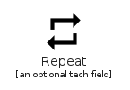 | [MaterialsRepeat](Av/MaterialsRepeat.md) `elements/materials/Av/MaterialsRepeat` |
|  | [MaterialsRepeatOne](Av/MaterialsRepeatOne.md) `elements/materials/Av/MaterialsRepeatOne` |
|  | [MaterialsReplay10](Av/MaterialsReplay10.md) `elements/materials/Av/MaterialsReplay10` |
| 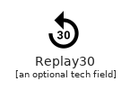 | [MaterialsReplay30](Av/MaterialsReplay30.md) `elements/materials/Av/MaterialsReplay30` |
|  | [MaterialsReplay5](Av/MaterialsReplay5.md) `elements/materials/Av/MaterialsReplay5` |
|  | [MaterialsReplay](Av/MaterialsReplay.md) `elements/materials/Av/MaterialsReplay` |
|  | [MaterialsShuffle](Av/MaterialsShuffle.md) `elements/materials/Av/MaterialsShuffle` |
|  | [MaterialsSkipNext](Av/MaterialsSkipNext.md) `elements/materials/Av/MaterialsSkipNext` |
|  | [MaterialsSkipPrevious](Av/MaterialsSkipPrevious.md) `elements/materials/Av/MaterialsSkipPrevious` |
|  | [MaterialsSlowMotionVideo](Av/MaterialsSlowMotionVideo.md) `elements/materials/Av/MaterialsSlowMotionVideo` |
|  | [MaterialsSnooze](Av/MaterialsSnooze.md) `elements/materials/Av/MaterialsSnooze` |
| 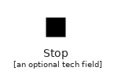 | [MaterialsStop](Av/MaterialsStop.md) `elements/materials/Av/MaterialsStop` |
|  | [MaterialsSubscriptions](Av/MaterialsSubscriptions.md) `elements/materials/Av/MaterialsSubscriptions` |
|  | [MaterialsSubtitles](Av/MaterialsSubtitles.md) `elements/materials/Av/MaterialsSubtitles` |
|  | [MaterialsSurroundSound](Av/MaterialsSurroundSound.md) `elements/materials/Av/MaterialsSurroundSound` |
|  | [MaterialsVideoCall](Av/MaterialsVideoCall.md) `elements/materials/Av/MaterialsVideoCall` |
|  | [MaterialsVideocam](Av/MaterialsVideocam.md) `elements/materials/Av/MaterialsVideocam` |
|  | [MaterialsVideocamOff](Av/MaterialsVideocamOff.md) `elements/materials/Av/MaterialsVideocamOff` |
|  | [MaterialsVideoLabel](Av/MaterialsVideoLabel.md) `elements/materials/Av/MaterialsVideoLabel` |
|  | [MaterialsVideoLibrary](Av/MaterialsVideoLibrary.md) `elements/materials/Av/MaterialsVideoLibrary` |
|  | [MaterialsVolumeDown](Av/MaterialsVolumeDown.md) `elements/materials/Av/MaterialsVolumeDown` |
|  | [MaterialsVolumeMute](Av/MaterialsVolumeMute.md) `elements/materials/Av/MaterialsVolumeMute` |
|  | [MaterialsVolumeOff](Av/MaterialsVolumeOff.md) `elements/materials/Av/MaterialsVolumeOff` |
|  | [MaterialsVolumeUp](Av/MaterialsVolumeUp.md) `elements/materials/Av/MaterialsVolumeUp` |
|  | [MaterialsWebAsset](Av/MaterialsWebAsset.md) `elements/materials/Av/MaterialsWebAsset` |
|  | [MaterialsWeb](Av/MaterialsWeb.md) `elements/materials/Av/MaterialsWeb` |
## elements/materials/Communication
| | Name |
| :-: | --- |
|  | [MaterialsBusiness](Communication/MaterialsBusiness.md) `elements/materials/Communication/MaterialsBusiness` |
|  | [MaterialsCall](Communication/MaterialsCall.md) `elements/materials/Communication/MaterialsCall` |
|  | [MaterialsCallEnd](Communication/MaterialsCallEnd.md) `elements/materials/Communication/MaterialsCallEnd` |
|  | [MaterialsCallMade](Communication/MaterialsCallMade.md) `elements/materials/Communication/MaterialsCallMade` |
|  | [MaterialsCallMerge](Communication/MaterialsCallMerge.md) `elements/materials/Communication/MaterialsCallMerge` |
|  | [MaterialsCallMissed](Communication/MaterialsCallMissed.md) `elements/materials/Communication/MaterialsCallMissed` |
|  | [MaterialsCallMissedOutgoing](Communication/MaterialsCallMissedOutgoing.md) `elements/materials/Communication/MaterialsCallMissedOutgoing` |
|  | [MaterialsCallReceived](Communication/MaterialsCallReceived.md) `elements/materials/Communication/MaterialsCallReceived` |
|  | [MaterialsCallSplit](Communication/MaterialsCallSplit.md) `elements/materials/Communication/MaterialsCallSplit` |
|  | [MaterialsChatBubble](Communication/MaterialsChatBubble.md) `elements/materials/Communication/MaterialsChatBubble` |
|  | [MaterialsChatBubbleOutline](Communication/MaterialsChatBubbleOutline.md) `elements/materials/Communication/MaterialsChatBubbleOutline` |
|  | [MaterialsChat](Communication/MaterialsChat.md) `elements/materials/Communication/MaterialsChat` |
| 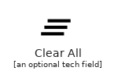 | [MaterialsClearAll](Communication/MaterialsClearAll.md) `elements/materials/Communication/MaterialsClearAll` |
|  | [MaterialsComment](Communication/MaterialsComment.md) `elements/materials/Communication/MaterialsComment` |
|  | [MaterialsContactMail](Communication/MaterialsContactMail.md) `elements/materials/Communication/MaterialsContactMail` |
|  | [MaterialsContactPhone](Communication/MaterialsContactPhone.md) `elements/materials/Communication/MaterialsContactPhone` |
|  | [MaterialsContacts](Communication/MaterialsContacts.md) `elements/materials/Communication/MaterialsContacts` |
|  | [MaterialsDialerSip](Communication/MaterialsDialerSip.md) `elements/materials/Communication/MaterialsDialerSip` |
|  | [MaterialsDialpad](Communication/MaterialsDialpad.md) `elements/materials/Communication/MaterialsDialpad` |
|  | [MaterialsEmail](Communication/MaterialsEmail.md) `elements/materials/Communication/MaterialsEmail` |
|  | [MaterialsForum](Communication/MaterialsForum.md) `elements/materials/Communication/MaterialsForum` |
|  | [MaterialsImportContacts](Communication/MaterialsImportContacts.md) `elements/materials/Communication/MaterialsImportContacts` |
|  | [MaterialsImportExport](Communication/MaterialsImportExport.md) `elements/materials/Communication/MaterialsImportExport` |
|  | [MaterialsInvertColorsOff](Communication/MaterialsInvertColorsOff.md) `elements/materials/Communication/MaterialsInvertColorsOff` |
|  | [MaterialsLiveHelp](Communication/MaterialsLiveHelp.md) `elements/materials/Communication/MaterialsLiveHelp` |
|  | [MaterialsLocationOff](Communication/MaterialsLocationOff.md) `elements/materials/Communication/MaterialsLocationOff` |
|  | [MaterialsLocationOn](Communication/MaterialsLocationOn.md) `elements/materials/Communication/MaterialsLocationOn` |
|  | [MaterialsMailOutline](Communication/MaterialsMailOutline.md) `elements/materials/Communication/MaterialsMailOutline` |
|  | [MaterialsMessage](Communication/MaterialsMessage.md) `elements/materials/Communication/MaterialsMessage` |
| 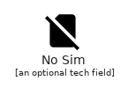 | [MaterialsNoSim](Communication/MaterialsNoSim.md) `elements/materials/Communication/MaterialsNoSim` |
|  | [MaterialsPhone](Communication/MaterialsPhone.md) `elements/materials/Communication/MaterialsPhone` |
|  | [MaterialsPortableWifiOff](Communication/MaterialsPortableWifiOff.md) `elements/materials/Communication/MaterialsPortableWifiOff` |
|  | [MaterialsPresentToAll](Communication/MaterialsPresentToAll.md) `elements/materials/Communication/MaterialsPresentToAll` |
|  | [MaterialsRingVolume](Communication/MaterialsRingVolume.md) `elements/materials/Communication/MaterialsRingVolume` |
|  | [MaterialsRssFeed](Communication/MaterialsRssFeed.md) `elements/materials/Communication/MaterialsRssFeed` |
|  | [MaterialsScreenShare](Communication/MaterialsScreenShare.md) `elements/materials/Communication/MaterialsScreenShare` |
|  | [MaterialsSpeakerPhone](Communication/MaterialsSpeakerPhone.md) `elements/materials/Communication/MaterialsSpeakerPhone` |
|  | [MaterialsStayCurrentLandscape](Communication/MaterialsStayCurrentLandscape.md) `elements/materials/Communication/MaterialsStayCurrentLandscape` |
|  | [MaterialsStayCurrentPortrait](Communication/MaterialsStayCurrentPortrait.md) `elements/materials/Communication/MaterialsStayCurrentPortrait` |
|  | [MaterialsStayPrimaryLandscape](Communication/MaterialsStayPrimaryLandscape.md) `elements/materials/Communication/MaterialsStayPrimaryLandscape` |
|  | [MaterialsStayPrimaryPortrait](Communication/MaterialsStayPrimaryPortrait.md) `elements/materials/Communication/MaterialsStayPrimaryPortrait` |
|  | [MaterialsStopScreenShare](Communication/MaterialsStopScreenShare.md) `elements/materials/Communication/MaterialsStopScreenShare` |
|  | [MaterialsSwapCalls](Communication/MaterialsSwapCalls.md) `elements/materials/Communication/MaterialsSwapCalls` |
|  | [MaterialsTextsms](Communication/MaterialsTextsms.md) `elements/materials/Communication/MaterialsTextsms` |
|  | [MaterialsVoicemail](Communication/MaterialsVoicemail.md) `elements/materials/Communication/MaterialsVoicemail` |
|  | [MaterialsVpnKey](Communication/MaterialsVpnKey.md) `elements/materials/Communication/MaterialsVpnKey` |
## elements/materials/Content
| | Name |
| :-: | --- |
|  | [MaterialsAddBox](Content/MaterialsAddBox.md) `elements/materials/Content/MaterialsAddBox` |
|  | [MaterialsAddCircle](Content/MaterialsAddCircle.md) `elements/materials/Content/MaterialsAddCircle` |
| 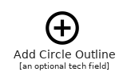 | [MaterialsAddCircleOutline](Content/MaterialsAddCircleOutline.md) `elements/materials/Content/MaterialsAddCircleOutline` |
| 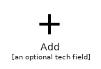 | [MaterialsAdd](Content/MaterialsAdd.md) `elements/materials/Content/MaterialsAdd` |
|  | [MaterialsArchive](Content/MaterialsArchive.md) `elements/materials/Content/MaterialsArchive` |
|  | [MaterialsBackspace](Content/MaterialsBackspace.md) `elements/materials/Content/MaterialsBackspace` |
|  | [MaterialsBlock](Content/MaterialsBlock.md) `elements/materials/Content/MaterialsBlock` |
| 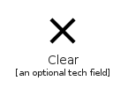 | [MaterialsClear](Content/MaterialsClear.md) `elements/materials/Content/MaterialsClear` |
|  | [MaterialsContentCopy](Content/MaterialsContentCopy.md) `elements/materials/Content/MaterialsContentCopy` |
|  | [MaterialsContentCut](Content/MaterialsContentCut.md) `elements/materials/Content/MaterialsContentCut` |
|  | [MaterialsContentPaste](Content/MaterialsContentPaste.md) `elements/materials/Content/MaterialsContentPaste` |
|  | [MaterialsCreate](Content/MaterialsCreate.md) `elements/materials/Content/MaterialsCreate` |
| 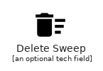 | [MaterialsDeleteSweep](Content/MaterialsDeleteSweep.md) `elements/materials/Content/MaterialsDeleteSweep` |
|  | [MaterialsDrafts](Content/MaterialsDrafts.md) `elements/materials/Content/MaterialsDrafts` |
| 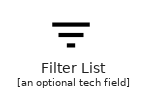 | [MaterialsFilterList](Content/MaterialsFilterList.md) `elements/materials/Content/MaterialsFilterList` |
| 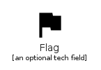 | [MaterialsFlag](Content/MaterialsFlag.md) `elements/materials/Content/MaterialsFlag` |
|  | [MaterialsForward](Content/MaterialsForward.md) `elements/materials/Content/MaterialsForward` |
|  | [MaterialsGesture](Content/MaterialsGesture.md) `elements/materials/Content/MaterialsGesture` |
|  | [MaterialsInbox](Content/MaterialsInbox.md) `elements/materials/Content/MaterialsInbox` |
|  | [MaterialsLink](Content/MaterialsLink.md) `elements/materials/Content/MaterialsLink` |
|  | [MaterialsLowPriority](Content/MaterialsLowPriority.md) `elements/materials/Content/MaterialsLowPriority` |
|  | [MaterialsMail](Content/MaterialsMail.md) `elements/materials/Content/MaterialsMail` |
|  | [MaterialsMarkunread](Content/MaterialsMarkunread.md) `elements/materials/Content/MaterialsMarkunread` |
|  | [MaterialsMoveToInbox](Content/MaterialsMoveToInbox.md) `elements/materials/Content/MaterialsMoveToInbox` |
|  | [MaterialsNextWeek](Content/MaterialsNextWeek.md) `elements/materials/Content/MaterialsNextWeek` |
|  | [MaterialsRedo](Content/MaterialsRedo.md) `elements/materials/Content/MaterialsRedo` |
|  | [MaterialsRemoveCircle](Content/MaterialsRemoveCircle.md) `elements/materials/Content/MaterialsRemoveCircle` |
|  | [MaterialsRemoveCircleOutline](Content/MaterialsRemoveCircleOutline.md) `elements/materials/Content/MaterialsRemoveCircleOutline` |
| 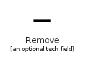 | [MaterialsRemove](Content/MaterialsRemove.md) `elements/materials/Content/MaterialsRemove` |
|  | [MaterialsReplyAll](Content/MaterialsReplyAll.md) `elements/materials/Content/MaterialsReplyAll` |
|  | [MaterialsReply](Content/MaterialsReply.md) `elements/materials/Content/MaterialsReply` |
|  | [MaterialsReport](Content/MaterialsReport.md) `elements/materials/Content/MaterialsReport` |
|  | [MaterialsSave](Content/MaterialsSave.md) `elements/materials/Content/MaterialsSave` |
|  | [MaterialsSelectAll](Content/MaterialsSelectAll.md) `elements/materials/Content/MaterialsSelectAll` |
|  | [MaterialsSend](Content/MaterialsSend.md) `elements/materials/Content/MaterialsSend` |
| 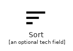 | [MaterialsSort](Content/MaterialsSort.md) `elements/materials/Content/MaterialsSort` |
| 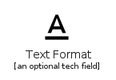 | [MaterialsTextFormat](Content/MaterialsTextFormat.md) `elements/materials/Content/MaterialsTextFormat` |
|  | [MaterialsUnarchive](Content/MaterialsUnarchive.md) `elements/materials/Content/MaterialsUnarchive` |
|  | [MaterialsUndo](Content/MaterialsUndo.md) `elements/materials/Content/MaterialsUndo` |
|  | [MaterialsWeekend](Content/MaterialsWeekend.md) `elements/materials/Content/MaterialsWeekend` |
## elements/materials/Device
| | Name |
| :-: | --- |
|  | [MaterialsAccessAlarm](Device/MaterialsAccessAlarm.md) `elements/materials/Device/MaterialsAccessAlarm` |
|  | [MaterialsAccessAlarms](Device/MaterialsAccessAlarms.md) `elements/materials/Device/MaterialsAccessAlarms` |
|  | [MaterialsAccessTime](Device/MaterialsAccessTime.md) `elements/materials/Device/MaterialsAccessTime` |
|  | [MaterialsAddAlarm](Device/MaterialsAddAlarm.md) `elements/materials/Device/MaterialsAddAlarm` |
|  | [MaterialsAirplanemodeActive](Device/MaterialsAirplanemodeActive.md) `elements/materials/Device/MaterialsAirplanemodeActive` |
|  | [MaterialsAirplanemodeInactive](Device/MaterialsAirplanemodeInactive.md) `elements/materials/Device/MaterialsAirplanemodeInactive` |
|  | [MaterialsBattery20](Device/MaterialsBattery20.md) `elements/materials/Device/MaterialsBattery20` |
|  | [MaterialsBattery30](Device/MaterialsBattery30.md) `elements/materials/Device/MaterialsBattery30` |
|  | [MaterialsBattery50](Device/MaterialsBattery50.md) `elements/materials/Device/MaterialsBattery50` |
|  | [MaterialsBattery60](Device/MaterialsBattery60.md) `elements/materials/Device/MaterialsBattery60` |
|  | [MaterialsBattery80](Device/MaterialsBattery80.md) `elements/materials/Device/MaterialsBattery80` |
|  | [MaterialsBattery90](Device/MaterialsBattery90.md) `elements/materials/Device/MaterialsBattery90` |
|  | [MaterialsBatteryAlert](Device/MaterialsBatteryAlert.md) `elements/materials/Device/MaterialsBatteryAlert` |
|  | [MaterialsBatteryCharging20](Device/MaterialsBatteryCharging20.md) `elements/materials/Device/MaterialsBatteryCharging20` |
|  | [MaterialsBatteryCharging30](Device/MaterialsBatteryCharging30.md) `elements/materials/Device/MaterialsBatteryCharging30` |
|  | [MaterialsBatteryCharging50](Device/MaterialsBatteryCharging50.md) `elements/materials/Device/MaterialsBatteryCharging50` |
|  | [MaterialsBatteryCharging60](Device/MaterialsBatteryCharging60.md) `elements/materials/Device/MaterialsBatteryCharging60` |
|  | [MaterialsBatteryCharging80](Device/MaterialsBatteryCharging80.md) `elements/materials/Device/MaterialsBatteryCharging80` |
|  | [MaterialsBatteryCharging90](Device/MaterialsBatteryCharging90.md) `elements/materials/Device/MaterialsBatteryCharging90` |
|  | [MaterialsBatteryChargingFull](Device/MaterialsBatteryChargingFull.md) `elements/materials/Device/MaterialsBatteryChargingFull` |
|  | [MaterialsBatteryFull](Device/MaterialsBatteryFull.md) `elements/materials/Device/MaterialsBatteryFull` |
|  | [MaterialsBatteryStd](Device/MaterialsBatteryStd.md) `elements/materials/Device/MaterialsBatteryStd` |
|  | [MaterialsBatteryUnknown](Device/MaterialsBatteryUnknown.md) `elements/materials/Device/MaterialsBatteryUnknown` |
|  | [MaterialsBluetoothConnected](Device/MaterialsBluetoothConnected.md) `elements/materials/Device/MaterialsBluetoothConnected` |
|  | [MaterialsBluetoothDisabled](Device/MaterialsBluetoothDisabled.md) `elements/materials/Device/MaterialsBluetoothDisabled` |
|  | [MaterialsBluetooth](Device/MaterialsBluetooth.md) `elements/materials/Device/MaterialsBluetooth` |
|  | [MaterialsBluetoothSearching](Device/MaterialsBluetoothSearching.md) `elements/materials/Device/MaterialsBluetoothSearching` |
|  | [MaterialsBrightnessAuto](Device/MaterialsBrightnessAuto.md) `elements/materials/Device/MaterialsBrightnessAuto` |
|  | [MaterialsBrightnessHigh](Device/MaterialsBrightnessHigh.md) `elements/materials/Device/MaterialsBrightnessHigh` |
|  | [MaterialsBrightnessLow](Device/MaterialsBrightnessLow.md) `elements/materials/Device/MaterialsBrightnessLow` |
|  | [MaterialsBrightnessMedium](Device/MaterialsBrightnessMedium.md) `elements/materials/Device/MaterialsBrightnessMedium` |
|  | [MaterialsDataUsage](Device/MaterialsDataUsage.md) `elements/materials/Device/MaterialsDataUsage` |
|  | [MaterialsDeveloperMode](Device/MaterialsDeveloperMode.md) `elements/materials/Device/MaterialsDeveloperMode` |
|  | [MaterialsDevices](Device/MaterialsDevices.md) `elements/materials/Device/MaterialsDevices` |
|  | [MaterialsDvr](Device/MaterialsDvr.md) `elements/materials/Device/MaterialsDvr` |
|  | [MaterialsGpsFixed](Device/MaterialsGpsFixed.md) `elements/materials/Device/MaterialsGpsFixed` |
|  | [MaterialsGpsNotFixed](Device/MaterialsGpsNotFixed.md) `elements/materials/Device/MaterialsGpsNotFixed` |
|  | [MaterialsGpsOff](Device/MaterialsGpsOff.md) `elements/materials/Device/MaterialsGpsOff` |
|  | [MaterialsGraphicEq](Device/MaterialsGraphicEq.md) `elements/materials/Device/MaterialsGraphicEq` |
|  | [MaterialsLocationDisabled](Device/MaterialsLocationDisabled.md) `elements/materials/Device/MaterialsLocationDisabled` |
|  | [MaterialsLocationSearching](Device/MaterialsLocationSearching.md) `elements/materials/Device/MaterialsLocationSearching` |
|  | [MaterialsNetworkCell](Device/MaterialsNetworkCell.md) `elements/materials/Device/MaterialsNetworkCell` |
|  | [MaterialsNetworkWifi](Device/MaterialsNetworkWifi.md) `elements/materials/Device/MaterialsNetworkWifi` |
|  | [MaterialsNfc](Device/MaterialsNfc.md) `elements/materials/Device/MaterialsNfc` |
|  | [MaterialsScreenLockLandscape](Device/MaterialsScreenLockLandscape.md) `elements/materials/Device/MaterialsScreenLockLandscape` |
|  | [MaterialsScreenLockPortrait](Device/MaterialsScreenLockPortrait.md) `elements/materials/Device/MaterialsScreenLockPortrait` |
|  | [MaterialsScreenLockRotation](Device/MaterialsScreenLockRotation.md) `elements/materials/Device/MaterialsScreenLockRotation` |
|  | [MaterialsScreenRotation](Device/MaterialsScreenRotation.md) `elements/materials/Device/MaterialsScreenRotation` |
|  | [MaterialsSdStorage](Device/MaterialsSdStorage.md) `elements/materials/Device/MaterialsSdStorage` |
|  | [MaterialsSettingsSystemDaydream](Device/MaterialsSettingsSystemDaydream.md) `elements/materials/Device/MaterialsSettingsSystemDaydream` |
|  | [MaterialsSignalCellular0Bar](Device/MaterialsSignalCellular0Bar.md) `elements/materials/Device/MaterialsSignalCellular0Bar` |
|  | [MaterialsSignalCellular1Bar](Device/MaterialsSignalCellular1Bar.md) `elements/materials/Device/MaterialsSignalCellular1Bar` |
|  | [MaterialsSignalCellular2Bar](Device/MaterialsSignalCellular2Bar.md) `elements/materials/Device/MaterialsSignalCellular2Bar` |
|  | [MaterialsSignalCellular3Bar](Device/MaterialsSignalCellular3Bar.md) `elements/materials/Device/MaterialsSignalCellular3Bar` |
|  | [MaterialsSignalCellular4Bar](Device/MaterialsSignalCellular4Bar.md) `elements/materials/Device/MaterialsSignalCellular4Bar` |
|  | [MaterialsSignalCellularConnectedNoInternet0Bar](Device/MaterialsSignalCellularConnectedNoInternet0Bar.md) `elements/materials/Device/MaterialsSignalCellularConnectedNoInternet0Bar` |
|  | [MaterialsSignalCellularConnectedNoInternet1Bar](Device/MaterialsSignalCellularConnectedNoInternet1Bar.md) `elements/materials/Device/MaterialsSignalCellularConnectedNoInternet1Bar` |
|  | [MaterialsSignalCellularConnectedNoInternet2Bar](Device/MaterialsSignalCellularConnectedNoInternet2Bar.md) `elements/materials/Device/MaterialsSignalCellularConnectedNoInternet2Bar` |
|  | [MaterialsSignalCellularConnectedNoInternet3Bar](Device/MaterialsSignalCellularConnectedNoInternet3Bar.md) `elements/materials/Device/MaterialsSignalCellularConnectedNoInternet3Bar` |
|  | [MaterialsSignalCellularConnectedNoInternet4Bar](Device/MaterialsSignalCellularConnectedNoInternet4Bar.md) `elements/materials/Device/MaterialsSignalCellularConnectedNoInternet4Bar` |
|  | [MaterialsSignalCellularNoSim](Device/MaterialsSignalCellularNoSim.md) `elements/materials/Device/MaterialsSignalCellularNoSim` |
|  | [MaterialsSignalCellularNull](Device/MaterialsSignalCellularNull.md) `elements/materials/Device/MaterialsSignalCellularNull` |
|  | [MaterialsSignalCellularOff](Device/MaterialsSignalCellularOff.md) `elements/materials/Device/MaterialsSignalCellularOff` |
|  | [MaterialsSignalWifi0Bar](Device/MaterialsSignalWifi0Bar.md) `elements/materials/Device/MaterialsSignalWifi0Bar` |
|  | [MaterialsSignalWifi1Bar](Device/MaterialsSignalWifi1Bar.md) `elements/materials/Device/MaterialsSignalWifi1Bar` |
|  | [MaterialsSignalWifi1BarLock](Device/MaterialsSignalWifi1BarLock.md) `elements/materials/Device/MaterialsSignalWifi1BarLock` |
|  | [MaterialsSignalWifi2Bar](Device/MaterialsSignalWifi2Bar.md) `elements/materials/Device/MaterialsSignalWifi2Bar` |
|  | [MaterialsSignalWifi2BarLock](Device/MaterialsSignalWifi2BarLock.md) `elements/materials/Device/MaterialsSignalWifi2BarLock` |
|  | [MaterialsSignalWifi3Bar](Device/MaterialsSignalWifi3Bar.md) `elements/materials/Device/MaterialsSignalWifi3Bar` |
|  | [MaterialsSignalWifi3BarLock](Device/MaterialsSignalWifi3BarLock.md) `elements/materials/Device/MaterialsSignalWifi3BarLock` |
|  | [MaterialsSignalWifi4Bar](Device/MaterialsSignalWifi4Bar.md) `elements/materials/Device/MaterialsSignalWifi4Bar` |
|  | [MaterialsSignalWifi4BarLock](Device/MaterialsSignalWifi4BarLock.md) `elements/materials/Device/MaterialsSignalWifi4BarLock` |
|  | [MaterialsSignalWifiOff](Device/MaterialsSignalWifiOff.md) `elements/materials/Device/MaterialsSignalWifiOff` |
|  | [MaterialsStorage](Device/MaterialsStorage.md) `elements/materials/Device/MaterialsStorage` |
|  | [MaterialsUsb](Device/MaterialsUsb.md) `elements/materials/Device/MaterialsUsb` |
|  | [MaterialsWallpaper](Device/MaterialsWallpaper.md) `elements/materials/Device/MaterialsWallpaper` |
|  | [MaterialsWidgets](Device/MaterialsWidgets.md) `elements/materials/Device/MaterialsWidgets` |
|  | [MaterialsWifiLock](Device/MaterialsWifiLock.md) `elements/materials/Device/MaterialsWifiLock` |
|  | [MaterialsWifiTethering](Device/MaterialsWifiTethering.md) `elements/materials/Device/MaterialsWifiTethering` |
## elements/materials/Editor
| | Name |
| :-: | --- |
|  | [MaterialsAttachFile](Editor/MaterialsAttachFile.md) `elements/materials/Editor/MaterialsAttachFile` |
|  | [MaterialsAttachMoney](Editor/MaterialsAttachMoney.md) `elements/materials/Editor/MaterialsAttachMoney` |
|  | [MaterialsBorderAll](Editor/MaterialsBorderAll.md) `elements/materials/Editor/MaterialsBorderAll` |
|  | [MaterialsBorderBottom](Editor/MaterialsBorderBottom.md) `elements/materials/Editor/MaterialsBorderBottom` |
|  | [MaterialsBorderClear](Editor/MaterialsBorderClear.md) `elements/materials/Editor/MaterialsBorderClear` |
|  | [MaterialsBorderColor](Editor/MaterialsBorderColor.md) `elements/materials/Editor/MaterialsBorderColor` |
|  | [MaterialsBorderHorizontal](Editor/MaterialsBorderHorizontal.md) `elements/materials/Editor/MaterialsBorderHorizontal` |
|  | [MaterialsBorderInner](Editor/MaterialsBorderInner.md) `elements/materials/Editor/MaterialsBorderInner` |
|  | [MaterialsBorderLeft](Editor/MaterialsBorderLeft.md) `elements/materials/Editor/MaterialsBorderLeft` |
|  | [MaterialsBorderOuter](Editor/MaterialsBorderOuter.md) `elements/materials/Editor/MaterialsBorderOuter` |
|  | [MaterialsBorderRight](Editor/MaterialsBorderRight.md) `elements/materials/Editor/MaterialsBorderRight` |
|  | [MaterialsBorderStyle](Editor/MaterialsBorderStyle.md) `elements/materials/Editor/MaterialsBorderStyle` |
|  | [MaterialsBorderTop](Editor/MaterialsBorderTop.md) `elements/materials/Editor/MaterialsBorderTop` |
|  | [MaterialsBorderVertical](Editor/MaterialsBorderVertical.md) `elements/materials/Editor/MaterialsBorderVertical` |
|  | [MaterialsBubbleChart](Editor/MaterialsBubbleChart.md) `elements/materials/Editor/MaterialsBubbleChart` |
|  | [MaterialsDragHandle](Editor/MaterialsDragHandle.md) `elements/materials/Editor/MaterialsDragHandle` |
|  | [MaterialsFormatAlignCenter](Editor/MaterialsFormatAlignCenter.md) `elements/materials/Editor/MaterialsFormatAlignCenter` |
|  | [MaterialsFormatAlignJustify](Editor/MaterialsFormatAlignJustify.md) `elements/materials/Editor/MaterialsFormatAlignJustify` |
|  | [MaterialsFormatAlignLeft](Editor/MaterialsFormatAlignLeft.md) `elements/materials/Editor/MaterialsFormatAlignLeft` |
|  | [MaterialsFormatAlignRight](Editor/MaterialsFormatAlignRight.md) `elements/materials/Editor/MaterialsFormatAlignRight` |
|  | [MaterialsFormatBold](Editor/MaterialsFormatBold.md) `elements/materials/Editor/MaterialsFormatBold` |
|  | [MaterialsFormatClear](Editor/MaterialsFormatClear.md) `elements/materials/Editor/MaterialsFormatClear` |
|  | [MaterialsFormatColorFill](Editor/MaterialsFormatColorFill.md) `elements/materials/Editor/MaterialsFormatColorFill` |
|  | [MaterialsFormatColorReset](Editor/MaterialsFormatColorReset.md) `elements/materials/Editor/MaterialsFormatColorReset` |
|  | [MaterialsFormatColorText](Editor/MaterialsFormatColorText.md) `elements/materials/Editor/MaterialsFormatColorText` |
|  | [MaterialsFormatIndentDecrease](Editor/MaterialsFormatIndentDecrease.md) `elements/materials/Editor/MaterialsFormatIndentDecrease` |
|  | [MaterialsFormatIndentIncrease](Editor/MaterialsFormatIndentIncrease.md) `elements/materials/Editor/MaterialsFormatIndentIncrease` |
|  | [MaterialsFormatItalic](Editor/MaterialsFormatItalic.md) `elements/materials/Editor/MaterialsFormatItalic` |
|  | [MaterialsFormatLineSpacing](Editor/MaterialsFormatLineSpacing.md) `elements/materials/Editor/MaterialsFormatLineSpacing` |
|  | [MaterialsFormatListBulleted](Editor/MaterialsFormatListBulleted.md) `elements/materials/Editor/MaterialsFormatListBulleted` |
|  | [MaterialsFormatListNumbered](Editor/MaterialsFormatListNumbered.md) `elements/materials/Editor/MaterialsFormatListNumbered` |
|  | [MaterialsFormatPaint](Editor/MaterialsFormatPaint.md) `elements/materials/Editor/MaterialsFormatPaint` |
|  | [MaterialsFormatQuote](Editor/MaterialsFormatQuote.md) `elements/materials/Editor/MaterialsFormatQuote` |
|  | [MaterialsFormatShapes](Editor/MaterialsFormatShapes.md) `elements/materials/Editor/MaterialsFormatShapes` |
|  | [MaterialsFormatSize](Editor/MaterialsFormatSize.md) `elements/materials/Editor/MaterialsFormatSize` |
|  | [MaterialsFormatStrikethrough](Editor/MaterialsFormatStrikethrough.md) `elements/materials/Editor/MaterialsFormatStrikethrough` |
|  | [MaterialsFormatTextdirectionLToR](Editor/MaterialsFormatTextdirectionLToR.md) `elements/materials/Editor/MaterialsFormatTextdirectionLToR` |
|  | [MaterialsFormatTextdirectionRToL](Editor/MaterialsFormatTextdirectionRToL.md) `elements/materials/Editor/MaterialsFormatTextdirectionRToL` |
|  | [MaterialsFormatUnderlined](Editor/MaterialsFormatUnderlined.md) `elements/materials/Editor/MaterialsFormatUnderlined` |
|  | [MaterialsFunctions](Editor/MaterialsFunctions.md) `elements/materials/Editor/MaterialsFunctions` |
|  | [MaterialsHighlight](Editor/MaterialsHighlight.md) `elements/materials/Editor/MaterialsHighlight` |
|  | [MaterialsInsertChart](Editor/MaterialsInsertChart.md) `elements/materials/Editor/MaterialsInsertChart` |
|  | [MaterialsInsertComment](Editor/MaterialsInsertComment.md) `elements/materials/Editor/MaterialsInsertComment` |
|  | [MaterialsInsertDriveFile](Editor/MaterialsInsertDriveFile.md) `elements/materials/Editor/MaterialsInsertDriveFile` |
|  | [MaterialsInsertEmoticon](Editor/MaterialsInsertEmoticon.md) `elements/materials/Editor/MaterialsInsertEmoticon` |
|  | [MaterialsInsertInvitation](Editor/MaterialsInsertInvitation.md) `elements/materials/Editor/MaterialsInsertInvitation` |
|  | [MaterialsInsertLink](Editor/MaterialsInsertLink.md) `elements/materials/Editor/MaterialsInsertLink` |
|  | [MaterialsInsertPhoto](Editor/MaterialsInsertPhoto.md) `elements/materials/Editor/MaterialsInsertPhoto` |
|  | [MaterialsLinearScale](Editor/MaterialsLinearScale.md) `elements/materials/Editor/MaterialsLinearScale` |
|  | [MaterialsMergeType](Editor/MaterialsMergeType.md) `elements/materials/Editor/MaterialsMergeType` |
|  | [MaterialsModeComment](Editor/MaterialsModeComment.md) `elements/materials/Editor/MaterialsModeComment` |
|  | [MaterialsModeEdit](Editor/MaterialsModeEdit.md) `elements/materials/Editor/MaterialsModeEdit` |
|  | [MaterialsMonetizationOn](Editor/MaterialsMonetizationOn.md) `elements/materials/Editor/MaterialsMonetizationOn` |
|  | [MaterialsMultilineChart](Editor/MaterialsMultilineChart.md) `elements/materials/Editor/MaterialsMultilineChart` |
|  | [MaterialsPieChart](Editor/MaterialsPieChart.md) `elements/materials/Editor/MaterialsPieChart` |
|  | [MaterialsPieChartOutlined](Editor/MaterialsPieChartOutlined.md) `elements/materials/Editor/MaterialsPieChartOutlined` |
|  | [MaterialsPublish](Editor/MaterialsPublish.md) `elements/materials/Editor/MaterialsPublish` |
|  | [MaterialsShortText](Editor/MaterialsShortText.md) `elements/materials/Editor/MaterialsShortText` |
|  | [MaterialsShowChart](Editor/MaterialsShowChart.md) `elements/materials/Editor/MaterialsShowChart` |
|  | [MaterialsSpaceBar](Editor/MaterialsSpaceBar.md) `elements/materials/Editor/MaterialsSpaceBar` |
|  | [MaterialsStrikethroughS](Editor/MaterialsStrikethroughS.md) `elements/materials/Editor/MaterialsStrikethroughS` |
|  | [MaterialsTextFields](Editor/MaterialsTextFields.md) `elements/materials/Editor/MaterialsTextFields` |
|  | [MaterialsTitle](Editor/MaterialsTitle.md) `elements/materials/Editor/MaterialsTitle` |
|  | [MaterialsVerticalAlignBottom](Editor/MaterialsVerticalAlignBottom.md) `elements/materials/Editor/MaterialsVerticalAlignBottom` |
|  | [MaterialsVerticalAlignCenter](Editor/MaterialsVerticalAlignCenter.md) `elements/materials/Editor/MaterialsVerticalAlignCenter` |
|  | [MaterialsVerticalAlignTop](Editor/MaterialsVerticalAlignTop.md) `elements/materials/Editor/MaterialsVerticalAlignTop` |
|  | [MaterialsWrapText](Editor/MaterialsWrapText.md) `elements/materials/Editor/MaterialsWrapText` |
## elements/materials/File
| | Name |
| :-: | --- |
|  | [MaterialsAttachment](File/MaterialsAttachment.md) `elements/materials/File/MaterialsAttachment` |
|  | [MaterialsCloudCircle](File/MaterialsCloudCircle.md) `elements/materials/File/MaterialsCloudCircle` |
|  | [MaterialsCloudDone](File/MaterialsCloudDone.md) `elements/materials/File/MaterialsCloudDone` |
|  | [MaterialsCloudDownload](File/MaterialsCloudDownload.md) `elements/materials/File/MaterialsCloudDownload` |
|  | [MaterialsCloud](File/MaterialsCloud.md) `elements/materials/File/MaterialsCloud` |
|  | [MaterialsCloudOff](File/MaterialsCloudOff.md) `elements/materials/File/MaterialsCloudOff` |
|  | [MaterialsCloudQueue](File/MaterialsCloudQueue.md) `elements/materials/File/MaterialsCloudQueue` |
|  | [MaterialsCloudUpload](File/MaterialsCloudUpload.md) `elements/materials/File/MaterialsCloudUpload` |
|  | [MaterialsCreateNewFolder](File/MaterialsCreateNewFolder.md) `elements/materials/File/MaterialsCreateNewFolder` |
|  | [MaterialsFileDownload](File/MaterialsFileDownload.md) `elements/materials/File/MaterialsFileDownload` |
|  | [MaterialsFileUpload](File/MaterialsFileUpload.md) `elements/materials/File/MaterialsFileUpload` |
|  | [MaterialsFolder](File/MaterialsFolder.md) `elements/materials/File/MaterialsFolder` |
|  | [MaterialsFolderOpen](File/MaterialsFolderOpen.md) `elements/materials/File/MaterialsFolderOpen` |
|  | [MaterialsFolderShared](File/MaterialsFolderShared.md) `elements/materials/File/MaterialsFolderShared` |
## elements/materials/Hardware
| | Name |
| :-: | --- |
|  | [MaterialsCastConnected](Hardware/MaterialsCastConnected.md) `elements/materials/Hardware/MaterialsCastConnected` |
|  | [MaterialsCast](Hardware/MaterialsCast.md) `elements/materials/Hardware/MaterialsCast` |
|  | [MaterialsComputer](Hardware/MaterialsComputer.md) `elements/materials/Hardware/MaterialsComputer` |
|  | [MaterialsDesktopMac](Hardware/MaterialsDesktopMac.md) `elements/materials/Hardware/MaterialsDesktopMac` |
|  | [MaterialsDesktopWindows](Hardware/MaterialsDesktopWindows.md) `elements/materials/Hardware/MaterialsDesktopWindows` |
|  | [MaterialsDeveloperBoard](Hardware/MaterialsDeveloperBoard.md) `elements/materials/Hardware/MaterialsDeveloperBoard` |
|  | [MaterialsDevicesOther](Hardware/MaterialsDevicesOther.md) `elements/materials/Hardware/MaterialsDevicesOther` |
|  | [MaterialsDock](Hardware/MaterialsDock.md) `elements/materials/Hardware/MaterialsDock` |
|  | [MaterialsGamepad](Hardware/MaterialsGamepad.md) `elements/materials/Hardware/MaterialsGamepad` |
|  | [MaterialsHeadset](Hardware/MaterialsHeadset.md) `elements/materials/Hardware/MaterialsHeadset` |
|  | [MaterialsHeadsetMic](Hardware/MaterialsHeadsetMic.md) `elements/materials/Hardware/MaterialsHeadsetMic` |
|  | [MaterialsKeyboardArrowDown](Hardware/MaterialsKeyboardArrowDown.md) `elements/materials/Hardware/MaterialsKeyboardArrowDown` |
|  | [MaterialsKeyboardArrowLeft](Hardware/MaterialsKeyboardArrowLeft.md) `elements/materials/Hardware/MaterialsKeyboardArrowLeft` |
|  | [MaterialsKeyboardArrowRight](Hardware/MaterialsKeyboardArrowRight.md) `elements/materials/Hardware/MaterialsKeyboardArrowRight` |
|  | [MaterialsKeyboardArrowUp](Hardware/MaterialsKeyboardArrowUp.md) `elements/materials/Hardware/MaterialsKeyboardArrowUp` |
|  | [MaterialsKeyboardBackspace](Hardware/MaterialsKeyboardBackspace.md) `elements/materials/Hardware/MaterialsKeyboardBackspace` |
|  | [MaterialsKeyboardCapslock](Hardware/MaterialsKeyboardCapslock.md) `elements/materials/Hardware/MaterialsKeyboardCapslock` |
|  | [MaterialsKeyboard](Hardware/MaterialsKeyboard.md) `elements/materials/Hardware/MaterialsKeyboard` |
|  | [MaterialsKeyboardHide](Hardware/MaterialsKeyboardHide.md) `elements/materials/Hardware/MaterialsKeyboardHide` |
|  | [MaterialsKeyboardReturn](Hardware/MaterialsKeyboardReturn.md) `elements/materials/Hardware/MaterialsKeyboardReturn` |
|  | [MaterialsKeyboardTab](Hardware/MaterialsKeyboardTab.md) `elements/materials/Hardware/MaterialsKeyboardTab` |
|  | [MaterialsKeyboardVoice](Hardware/MaterialsKeyboardVoice.md) `elements/materials/Hardware/MaterialsKeyboardVoice` |
|  | [MaterialsLaptopChromebook](Hardware/MaterialsLaptopChromebook.md) `elements/materials/Hardware/MaterialsLaptopChromebook` |
|  | [MaterialsLaptop](Hardware/MaterialsLaptop.md) `elements/materials/Hardware/MaterialsLaptop` |
|  | [MaterialsLaptopMac](Hardware/MaterialsLaptopMac.md) `elements/materials/Hardware/MaterialsLaptopMac` |
|  | [MaterialsLaptopWindows](Hardware/MaterialsLaptopWindows.md) `elements/materials/Hardware/MaterialsLaptopWindows` |
|  | [MaterialsMemory](Hardware/MaterialsMemory.md) `elements/materials/Hardware/MaterialsMemory` |
|  | [MaterialsMouse](Hardware/MaterialsMouse.md) `elements/materials/Hardware/MaterialsMouse` |
|  | [MaterialsPhoneAndroid](Hardware/MaterialsPhoneAndroid.md) `elements/materials/Hardware/MaterialsPhoneAndroid` |
|  | [MaterialsPhoneIphone](Hardware/MaterialsPhoneIphone.md) `elements/materials/Hardware/MaterialsPhoneIphone` |
|  | [MaterialsPhonelink](Hardware/MaterialsPhonelink.md) `elements/materials/Hardware/MaterialsPhonelink` |
|  | [MaterialsPhonelinkOff](Hardware/MaterialsPhonelinkOff.md) `elements/materials/Hardware/MaterialsPhonelinkOff` |
|  | [MaterialsPowerInput](Hardware/MaterialsPowerInput.md) `elements/materials/Hardware/MaterialsPowerInput` |
|  | [MaterialsRouter](Hardware/MaterialsRouter.md) `elements/materials/Hardware/MaterialsRouter` |
|  | [MaterialsScanner](Hardware/MaterialsScanner.md) `elements/materials/Hardware/MaterialsScanner` |
|  | [MaterialsSecurity](Hardware/MaterialsSecurity.md) `elements/materials/Hardware/MaterialsSecurity` |
|  | [MaterialsSimCard](Hardware/MaterialsSimCard.md) `elements/materials/Hardware/MaterialsSimCard` |
|  | [MaterialsSmartphone](Hardware/MaterialsSmartphone.md) `elements/materials/Hardware/MaterialsSmartphone` |
|  | [MaterialsSpeaker](Hardware/MaterialsSpeaker.md) `elements/materials/Hardware/MaterialsSpeaker` |
|  | [MaterialsSpeakerGroup](Hardware/MaterialsSpeakerGroup.md) `elements/materials/Hardware/MaterialsSpeakerGroup` |
|  | [MaterialsTabletAndroid](Hardware/MaterialsTabletAndroid.md) `elements/materials/Hardware/MaterialsTabletAndroid` |
|  | [MaterialsTablet](Hardware/MaterialsTablet.md) `elements/materials/Hardware/MaterialsTablet` |
|  | [MaterialsTabletMac](Hardware/MaterialsTabletMac.md) `elements/materials/Hardware/MaterialsTabletMac` |
|  | [MaterialsToys](Hardware/MaterialsToys.md) `elements/materials/Hardware/MaterialsToys` |
|  | [MaterialsTv](Hardware/MaterialsTv.md) `elements/materials/Hardware/MaterialsTv` |
|  | [MaterialsVideogameAsset](Hardware/MaterialsVideogameAsset.md) `elements/materials/Hardware/MaterialsVideogameAsset` |
|  | [MaterialsWatch](Hardware/MaterialsWatch.md) `elements/materials/Hardware/MaterialsWatch` |
## elements/materials/Image
| | Name |
| :-: | --- |
|  | [MaterialsAddAPhoto](Image/MaterialsAddAPhoto.md) `elements/materials/Image/MaterialsAddAPhoto` |
|  | [MaterialsAddToPhotos](Image/MaterialsAddToPhotos.md) `elements/materials/Image/MaterialsAddToPhotos` |
|  | [MaterialsAdjust](Image/MaterialsAdjust.md) `elements/materials/Image/MaterialsAdjust` |
|  | [MaterialsAssistant](Image/MaterialsAssistant.md) `elements/materials/Image/MaterialsAssistant` |
|  | [MaterialsAssistantPhoto](Image/MaterialsAssistantPhoto.md) `elements/materials/Image/MaterialsAssistantPhoto` |
|  | [MaterialsAudiotrack](Image/MaterialsAudiotrack.md) `elements/materials/Image/MaterialsAudiotrack` |
|  | [MaterialsBlurCircular](Image/MaterialsBlurCircular.md) `elements/materials/Image/MaterialsBlurCircular` |
|  | [MaterialsBlurLinear](Image/MaterialsBlurLinear.md) `elements/materials/Image/MaterialsBlurLinear` |
|  | [MaterialsBlurOff](Image/MaterialsBlurOff.md) `elements/materials/Image/MaterialsBlurOff` |
|  | [MaterialsBlurOn](Image/MaterialsBlurOn.md) `elements/materials/Image/MaterialsBlurOn` |
|  | [MaterialsBrightness1](Image/MaterialsBrightness1.md) `elements/materials/Image/MaterialsBrightness1` |
|  | [MaterialsBrightness2](Image/MaterialsBrightness2.md) `elements/materials/Image/MaterialsBrightness2` |
|  | [MaterialsBrightness3](Image/MaterialsBrightness3.md) `elements/materials/Image/MaterialsBrightness3` |
|  | [MaterialsBrightness4](Image/MaterialsBrightness4.md) `elements/materials/Image/MaterialsBrightness4` |
|  | [MaterialsBrightness5](Image/MaterialsBrightness5.md) `elements/materials/Image/MaterialsBrightness5` |
|  | [MaterialsBrightness6](Image/MaterialsBrightness6.md) `elements/materials/Image/MaterialsBrightness6` |
|  | [MaterialsBrightness7](Image/MaterialsBrightness7.md) `elements/materials/Image/MaterialsBrightness7` |
|  | [MaterialsBrokenImage](Image/MaterialsBrokenImage.md) `elements/materials/Image/MaterialsBrokenImage` |
|  | [MaterialsBrush](Image/MaterialsBrush.md) `elements/materials/Image/MaterialsBrush` |
|  | [MaterialsBurstMode](Image/MaterialsBurstMode.md) `elements/materials/Image/MaterialsBurstMode` |
|  | [MaterialsCameraAlt](Image/MaterialsCameraAlt.md) `elements/materials/Image/MaterialsCameraAlt` |
|  | [MaterialsCamera](Image/MaterialsCamera.md) `elements/materials/Image/MaterialsCamera` |
|  | [MaterialsCameraFront](Image/MaterialsCameraFront.md) `elements/materials/Image/MaterialsCameraFront` |
|  | [MaterialsCameraRear](Image/MaterialsCameraRear.md) `elements/materials/Image/MaterialsCameraRear` |
|  | [MaterialsCameraRoll](Image/MaterialsCameraRoll.md) `elements/materials/Image/MaterialsCameraRoll` |
|  | [MaterialsCenterFocusStrong](Image/MaterialsCenterFocusStrong.md) `elements/materials/Image/MaterialsCenterFocusStrong` |
|  | [MaterialsCenterFocusWeak](Image/MaterialsCenterFocusWeak.md) `elements/materials/Image/MaterialsCenterFocusWeak` |
|  | [MaterialsCollections](Image/MaterialsCollections.md) `elements/materials/Image/MaterialsCollections` |
|  | [MaterialsColorize](Image/MaterialsColorize.md) `elements/materials/Image/MaterialsColorize` |
|  | [MaterialsColorLens](Image/MaterialsColorLens.md) `elements/materials/Image/MaterialsColorLens` |
|  | [MaterialsCompare](Image/MaterialsCompare.md) `elements/materials/Image/MaterialsCompare` |
|  | [MaterialsControlPointDuplicate](Image/MaterialsControlPointDuplicate.md) `elements/materials/Image/MaterialsControlPointDuplicate` |
|  | [MaterialsControlPoint](Image/MaterialsControlPoint.md) `elements/materials/Image/MaterialsControlPoint` |
|  | [MaterialsCrop169](Image/MaterialsCrop169.md) `elements/materials/Image/MaterialsCrop169` |
|  | [MaterialsCrop32](Image/MaterialsCrop32.md) `elements/materials/Image/MaterialsCrop32` |
|  | [MaterialsCrop54](Image/MaterialsCrop54.md) `elements/materials/Image/MaterialsCrop54` |
|  | [MaterialsCrop75](Image/MaterialsCrop75.md) `elements/materials/Image/MaterialsCrop75` |
|  | [MaterialsCropDin](Image/MaterialsCropDin.md) `elements/materials/Image/MaterialsCropDin` |
|  | [MaterialsCrop](Image/MaterialsCrop.md) `elements/materials/Image/MaterialsCrop` |
|  | [MaterialsCropFree](Image/MaterialsCropFree.md) `elements/materials/Image/MaterialsCropFree` |
|  | [MaterialsCropLandscape](Image/MaterialsCropLandscape.md) `elements/materials/Image/MaterialsCropLandscape` |
|  | [MaterialsCropOriginal](Image/MaterialsCropOriginal.md) `elements/materials/Image/MaterialsCropOriginal` |
|  | [MaterialsCropPortrait](Image/MaterialsCropPortrait.md) `elements/materials/Image/MaterialsCropPortrait` |
|  | [MaterialsCropRotate](Image/MaterialsCropRotate.md) `elements/materials/Image/MaterialsCropRotate` |
|  | [MaterialsCropSquare](Image/MaterialsCropSquare.md) `elements/materials/Image/MaterialsCropSquare` |
|  | [MaterialsDehaze](Image/MaterialsDehaze.md) `elements/materials/Image/MaterialsDehaze` |
|  | [MaterialsDetails](Image/MaterialsDetails.md) `elements/materials/Image/MaterialsDetails` |
|  | [MaterialsEdit](Image/MaterialsEdit.md) `elements/materials/Image/MaterialsEdit` |
|  | [MaterialsExposure](Image/MaterialsExposure.md) `elements/materials/Image/MaterialsExposure` |
|  | [MaterialsExposureNeg1](Image/MaterialsExposureNeg1.md) `elements/materials/Image/MaterialsExposureNeg1` |
|  | [MaterialsExposureNeg2](Image/MaterialsExposureNeg2.md) `elements/materials/Image/MaterialsExposureNeg2` |
|  | [MaterialsExposurePlus1](Image/MaterialsExposurePlus1.md) `elements/materials/Image/MaterialsExposurePlus1` |
|  | [MaterialsExposurePlus2](Image/MaterialsExposurePlus2.md) `elements/materials/Image/MaterialsExposurePlus2` |
|  | [MaterialsExposureZero](Image/MaterialsExposureZero.md) `elements/materials/Image/MaterialsExposureZero` |
|  | [MaterialsFilter1](Image/MaterialsFilter1.md) `elements/materials/Image/MaterialsFilter1` |
|  | [MaterialsFilter2](Image/MaterialsFilter2.md) `elements/materials/Image/MaterialsFilter2` |
|  | [MaterialsFilter3](Image/MaterialsFilter3.md) `elements/materials/Image/MaterialsFilter3` |
|  | [MaterialsFilter4](Image/MaterialsFilter4.md) `elements/materials/Image/MaterialsFilter4` |
|  | [MaterialsFilter5](Image/MaterialsFilter5.md) `elements/materials/Image/MaterialsFilter5` |
|  | [MaterialsFilter6](Image/MaterialsFilter6.md) `elements/materials/Image/MaterialsFilter6` |
|  | [MaterialsFilter7](Image/MaterialsFilter7.md) `elements/materials/Image/MaterialsFilter7` |
|  | [MaterialsFilter8](Image/MaterialsFilter8.md) `elements/materials/Image/MaterialsFilter8` |
|  | [MaterialsFilter9](Image/MaterialsFilter9.md) `elements/materials/Image/MaterialsFilter9` |
|  | [MaterialsFilter9Plus](Image/MaterialsFilter9Plus.md) `elements/materials/Image/MaterialsFilter9Plus` |
|  | [MaterialsFilterBAndW](Image/MaterialsFilterBAndW.md) `elements/materials/Image/MaterialsFilterBAndW` |
|  | [MaterialsFilterCenterFocus](Image/MaterialsFilterCenterFocus.md) `elements/materials/Image/MaterialsFilterCenterFocus` |
|  | [MaterialsFilterDrama](Image/MaterialsFilterDrama.md) `elements/materials/Image/MaterialsFilterDrama` |
|  | [MaterialsFilter](Image/MaterialsFilter.md) `elements/materials/Image/MaterialsFilter` |
|  | [MaterialsFilterFrames](Image/MaterialsFilterFrames.md) `elements/materials/Image/MaterialsFilterFrames` |
|  | [MaterialsFilterHdr](Image/MaterialsFilterHdr.md) `elements/materials/Image/MaterialsFilterHdr` |
|  | [MaterialsFilterNone](Image/MaterialsFilterNone.md) `elements/materials/Image/MaterialsFilterNone` |
|  | [MaterialsFilterTiltShift](Image/MaterialsFilterTiltShift.md) `elements/materials/Image/MaterialsFilterTiltShift` |
|  | [MaterialsFilterVintage](Image/MaterialsFilterVintage.md) `elements/materials/Image/MaterialsFilterVintage` |
|  | [MaterialsFlare](Image/MaterialsFlare.md) `elements/materials/Image/MaterialsFlare` |
|  | [MaterialsFlashAuto](Image/MaterialsFlashAuto.md) `elements/materials/Image/MaterialsFlashAuto` |
|  | [MaterialsFlashOff](Image/MaterialsFlashOff.md) `elements/materials/Image/MaterialsFlashOff` |
|  | [MaterialsFlashOn](Image/MaterialsFlashOn.md) `elements/materials/Image/MaterialsFlashOn` |
|  | [MaterialsFlip](Image/MaterialsFlip.md) `elements/materials/Image/MaterialsFlip` |
|  | [MaterialsGradient](Image/MaterialsGradient.md) `elements/materials/Image/MaterialsGradient` |
|  | [MaterialsGrain](Image/MaterialsGrain.md) `elements/materials/Image/MaterialsGrain` |
|  | [MaterialsGridOff](Image/MaterialsGridOff.md) `elements/materials/Image/MaterialsGridOff` |
|  | [MaterialsGridOn](Image/MaterialsGridOn.md) `elements/materials/Image/MaterialsGridOn` |
|  | [MaterialsHdrOff](Image/MaterialsHdrOff.md) `elements/materials/Image/MaterialsHdrOff` |
|  | [MaterialsHdrOn](Image/MaterialsHdrOn.md) `elements/materials/Image/MaterialsHdrOn` |
|  | [MaterialsHdrStrong](Image/MaterialsHdrStrong.md) `elements/materials/Image/MaterialsHdrStrong` |
|  | [MaterialsHdrWeak](Image/MaterialsHdrWeak.md) `elements/materials/Image/MaterialsHdrWeak` |
|  | [MaterialsHealing](Image/MaterialsHealing.md) `elements/materials/Image/MaterialsHealing` |
|  | [MaterialsImageAspectRatio](Image/MaterialsImageAspectRatio.md) `elements/materials/Image/MaterialsImageAspectRatio` |
|  | [MaterialsImage](Image/MaterialsImage.md) `elements/materials/Image/MaterialsImage` |
|  | [MaterialsIso](Image/MaterialsIso.md) `elements/materials/Image/MaterialsIso` |
|  | [MaterialsLandscape](Image/MaterialsLandscape.md) `elements/materials/Image/MaterialsLandscape` |
|  | [MaterialsLeakAdd](Image/MaterialsLeakAdd.md) `elements/materials/Image/MaterialsLeakAdd` |
|  | [MaterialsLeakRemove](Image/MaterialsLeakRemove.md) `elements/materials/Image/MaterialsLeakRemove` |
|  | [MaterialsLens](Image/MaterialsLens.md) `elements/materials/Image/MaterialsLens` |
|  | [MaterialsLinkedCamera](Image/MaterialsLinkedCamera.md) `elements/materials/Image/MaterialsLinkedCamera` |
|  | [MaterialsLooks3](Image/MaterialsLooks3.md) `elements/materials/Image/MaterialsLooks3` |
|  | [MaterialsLooks4](Image/MaterialsLooks4.md) `elements/materials/Image/MaterialsLooks4` |
|  | [MaterialsLooks5](Image/MaterialsLooks5.md) `elements/materials/Image/MaterialsLooks5` |
|  | [MaterialsLooks6](Image/MaterialsLooks6.md) `elements/materials/Image/MaterialsLooks6` |
|  | [MaterialsLooks](Image/MaterialsLooks.md) `elements/materials/Image/MaterialsLooks` |
|  | [MaterialsLooksOne](Image/MaterialsLooksOne.md) `elements/materials/Image/MaterialsLooksOne` |
|  | [MaterialsLooksTwo](Image/MaterialsLooksTwo.md) `elements/materials/Image/MaterialsLooksTwo` |
|  | [MaterialsLoupe](Image/MaterialsLoupe.md) `elements/materials/Image/MaterialsLoupe` |
|  | [MaterialsMonochromePhotos](Image/MaterialsMonochromePhotos.md) `elements/materials/Image/MaterialsMonochromePhotos` |
|  | [MaterialsMovieCreation](Image/MaterialsMovieCreation.md) `elements/materials/Image/MaterialsMovieCreation` |
|  | [MaterialsMovieFilter](Image/MaterialsMovieFilter.md) `elements/materials/Image/MaterialsMovieFilter` |
|  | [MaterialsMusicNote](Image/MaterialsMusicNote.md) `elements/materials/Image/MaterialsMusicNote` |
|  | [MaterialsNature](Image/MaterialsNature.md) `elements/materials/Image/MaterialsNature` |
|  | [MaterialsNaturePeople](Image/MaterialsNaturePeople.md) `elements/materials/Image/MaterialsNaturePeople` |
|  | [MaterialsNavigateBefore](Image/MaterialsNavigateBefore.md) `elements/materials/Image/MaterialsNavigateBefore` |
|  | [MaterialsNavigateNext](Image/MaterialsNavigateNext.md) `elements/materials/Image/MaterialsNavigateNext` |
|  | [MaterialsPalette](Image/MaterialsPalette.md) `elements/materials/Image/MaterialsPalette` |
|  | [MaterialsPanorama](Image/MaterialsPanorama.md) `elements/materials/Image/MaterialsPanorama` |
|  | [MaterialsPanoramaFishEye](Image/MaterialsPanoramaFishEye.md) `elements/materials/Image/MaterialsPanoramaFishEye` |
|  | [MaterialsPanoramaHorizontal](Image/MaterialsPanoramaHorizontal.md) `elements/materials/Image/MaterialsPanoramaHorizontal` |
|  | [MaterialsPanoramaVertical](Image/MaterialsPanoramaVertical.md) `elements/materials/Image/MaterialsPanoramaVertical` |
|  | [MaterialsPanoramaWideAngle](Image/MaterialsPanoramaWideAngle.md) `elements/materials/Image/MaterialsPanoramaWideAngle` |
|  | [MaterialsPhotoAlbum](Image/MaterialsPhotoAlbum.md) `elements/materials/Image/MaterialsPhotoAlbum` |
|  | [MaterialsPhotoCamera](Image/MaterialsPhotoCamera.md) `elements/materials/Image/MaterialsPhotoCamera` |
|  | [MaterialsPhoto](Image/MaterialsPhoto.md) `elements/materials/Image/MaterialsPhoto` |
|  | [MaterialsPhotoFilter](Image/MaterialsPhotoFilter.md) `elements/materials/Image/MaterialsPhotoFilter` |
|  | [MaterialsPhotoLibrary](Image/MaterialsPhotoLibrary.md) `elements/materials/Image/MaterialsPhotoLibrary` |
|  | [MaterialsPictureAsPdf](Image/MaterialsPictureAsPdf.md) `elements/materials/Image/MaterialsPictureAsPdf` |
|  | [MaterialsPortrait](Image/MaterialsPortrait.md) `elements/materials/Image/MaterialsPortrait` |
|  | [MaterialsRemoveRedEye](Image/MaterialsRemoveRedEye.md) `elements/materials/Image/MaterialsRemoveRedEye` |
|  | [MaterialsRotate90DegreesCcw](Image/MaterialsRotate90DegreesCcw.md) `elements/materials/Image/MaterialsRotate90DegreesCcw` |
|  | [MaterialsRotateLeft](Image/MaterialsRotateLeft.md) `elements/materials/Image/MaterialsRotateLeft` |
|  | [MaterialsRotateRight](Image/MaterialsRotateRight.md) `elements/materials/Image/MaterialsRotateRight` |
|  | [MaterialsSlideshow](Image/MaterialsSlideshow.md) `elements/materials/Image/MaterialsSlideshow` |
|  | [MaterialsStraighten](Image/MaterialsStraighten.md) `elements/materials/Image/MaterialsStraighten` |
|  | [MaterialsStyle](Image/MaterialsStyle.md) `elements/materials/Image/MaterialsStyle` |
|  | [MaterialsSwitchCamera](Image/MaterialsSwitchCamera.md) `elements/materials/Image/MaterialsSwitchCamera` |
|  | [MaterialsSwitchVideo](Image/MaterialsSwitchVideo.md) `elements/materials/Image/MaterialsSwitchVideo` |
|  | [MaterialsTagFaces](Image/MaterialsTagFaces.md) `elements/materials/Image/MaterialsTagFaces` |
|  | [MaterialsTexture](Image/MaterialsTexture.md) `elements/materials/Image/MaterialsTexture` |
|  | [MaterialsTimelapse](Image/MaterialsTimelapse.md) `elements/materials/Image/MaterialsTimelapse` |
|  | [MaterialsTimer10](Image/MaterialsTimer10.md) `elements/materials/Image/MaterialsTimer10` |
|  | [MaterialsTimer3](Image/MaterialsTimer3.md) `elements/materials/Image/MaterialsTimer3` |
|  | [MaterialsTimer](Image/MaterialsTimer.md) `elements/materials/Image/MaterialsTimer` |
|  | [MaterialsTimerOff](Image/MaterialsTimerOff.md) `elements/materials/Image/MaterialsTimerOff` |
|  | [MaterialsTonality](Image/MaterialsTonality.md) `elements/materials/Image/MaterialsTonality` |
|  | [MaterialsTransform](Image/MaterialsTransform.md) `elements/materials/Image/MaterialsTransform` |
|  | [MaterialsTune](Image/MaterialsTune.md) `elements/materials/Image/MaterialsTune` |
|  | [MaterialsViewComfy](Image/MaterialsViewComfy.md) `elements/materials/Image/MaterialsViewComfy` |
|  | [MaterialsViewCompact](Image/MaterialsViewCompact.md) `elements/materials/Image/MaterialsViewCompact` |
|  | [MaterialsWbAuto](Image/MaterialsWbAuto.md) `elements/materials/Image/MaterialsWbAuto` |
|  | [MaterialsWbCloudy](Image/MaterialsWbCloudy.md) `elements/materials/Image/MaterialsWbCloudy` |
|  | [MaterialsWbIncandescent](Image/MaterialsWbIncandescent.md) `elements/materials/Image/MaterialsWbIncandescent` |
|  | [MaterialsWbIridescent](Image/MaterialsWbIridescent.md) `elements/materials/Image/MaterialsWbIridescent` |
|  | [MaterialsWbSunny](Image/MaterialsWbSunny.md) `elements/materials/Image/MaterialsWbSunny` |
## elements/materials/Maps
| | Name |
| :-: | --- |
|  | [MaterialsAddLocation](Maps/MaterialsAddLocation.md) `elements/materials/Maps/MaterialsAddLocation` |
|  | [MaterialsBeenhere](Maps/MaterialsBeenhere.md) `elements/materials/Maps/MaterialsBeenhere` |
|  | [MaterialsDirectionsBike](Maps/MaterialsDirectionsBike.md) `elements/materials/Maps/MaterialsDirectionsBike` |
|  | [MaterialsDirectionsBoat](Maps/MaterialsDirectionsBoat.md) `elements/materials/Maps/MaterialsDirectionsBoat` |
|  | [MaterialsDirectionsBus](Maps/MaterialsDirectionsBus.md) `elements/materials/Maps/MaterialsDirectionsBus` |
|  | [MaterialsDirectionsCar](Maps/MaterialsDirectionsCar.md) `elements/materials/Maps/MaterialsDirectionsCar` |
|  | [MaterialsDirections](Maps/MaterialsDirections.md) `elements/materials/Maps/MaterialsDirections` |
|  | [MaterialsDirectionsRailway](Maps/MaterialsDirectionsRailway.md) `elements/materials/Maps/MaterialsDirectionsRailway` |
|  | [MaterialsDirectionsRun](Maps/MaterialsDirectionsRun.md) `elements/materials/Maps/MaterialsDirectionsRun` |
|  | [MaterialsDirectionsSubway](Maps/MaterialsDirectionsSubway.md) `elements/materials/Maps/MaterialsDirectionsSubway` |
|  | [MaterialsDirectionsTransit](Maps/MaterialsDirectionsTransit.md) `elements/materials/Maps/MaterialsDirectionsTransit` |
|  | [MaterialsDirectionsWalk](Maps/MaterialsDirectionsWalk.md) `elements/materials/Maps/MaterialsDirectionsWalk` |
|  | [MaterialsEditLocation](Maps/MaterialsEditLocation.md) `elements/materials/Maps/MaterialsEditLocation` |
|  | [MaterialsEvStation](Maps/MaterialsEvStation.md) `elements/materials/Maps/MaterialsEvStation` |
|  | [MaterialsFlight](Maps/MaterialsFlight.md) `elements/materials/Maps/MaterialsFlight` |
|  | [MaterialsHotel](Maps/MaterialsHotel.md) `elements/materials/Maps/MaterialsHotel` |
|  | [MaterialsLayersClear](Maps/MaterialsLayersClear.md) `elements/materials/Maps/MaterialsLayersClear` |
|  | [MaterialsLayers](Maps/MaterialsLayers.md) `elements/materials/Maps/MaterialsLayers` |
|  | [MaterialsLocalActivity](Maps/MaterialsLocalActivity.md) `elements/materials/Maps/MaterialsLocalActivity` |
|  | [MaterialsLocalAirport](Maps/MaterialsLocalAirport.md) `elements/materials/Maps/MaterialsLocalAirport` |
|  | [MaterialsLocalAtm](Maps/MaterialsLocalAtm.md) `elements/materials/Maps/MaterialsLocalAtm` |
|  | [MaterialsLocalBar](Maps/MaterialsLocalBar.md) `elements/materials/Maps/MaterialsLocalBar` |
|  | [MaterialsLocalCafe](Maps/MaterialsLocalCafe.md) `elements/materials/Maps/MaterialsLocalCafe` |
|  | [MaterialsLocalCarWash](Maps/MaterialsLocalCarWash.md) `elements/materials/Maps/MaterialsLocalCarWash` |
|  | [MaterialsLocalConvenienceStore](Maps/MaterialsLocalConvenienceStore.md) `elements/materials/Maps/MaterialsLocalConvenienceStore` |
|  | [MaterialsLocalDining](Maps/MaterialsLocalDining.md) `elements/materials/Maps/MaterialsLocalDining` |
|  | [MaterialsLocalDrink](Maps/MaterialsLocalDrink.md) `elements/materials/Maps/MaterialsLocalDrink` |
|  | [MaterialsLocalFlorist](Maps/MaterialsLocalFlorist.md) `elements/materials/Maps/MaterialsLocalFlorist` |
|  | [MaterialsLocalGasStation](Maps/MaterialsLocalGasStation.md) `elements/materials/Maps/MaterialsLocalGasStation` |
|  | [MaterialsLocalGroceryStore](Maps/MaterialsLocalGroceryStore.md) `elements/materials/Maps/MaterialsLocalGroceryStore` |
|  | [MaterialsLocalHospital](Maps/MaterialsLocalHospital.md) `elements/materials/Maps/MaterialsLocalHospital` |
|  | [MaterialsLocalHotel](Maps/MaterialsLocalHotel.md) `elements/materials/Maps/MaterialsLocalHotel` |
|  | [MaterialsLocalLaundryService](Maps/MaterialsLocalLaundryService.md) `elements/materials/Maps/MaterialsLocalLaundryService` |
|  | [MaterialsLocalLibrary](Maps/MaterialsLocalLibrary.md) `elements/materials/Maps/MaterialsLocalLibrary` |
|  | [MaterialsLocalMall](Maps/MaterialsLocalMall.md) `elements/materials/Maps/MaterialsLocalMall` |
|  | [MaterialsLocalMovies](Maps/MaterialsLocalMovies.md) `elements/materials/Maps/MaterialsLocalMovies` |
|  | [MaterialsLocalOffer](Maps/MaterialsLocalOffer.md) `elements/materials/Maps/MaterialsLocalOffer` |
|  | [MaterialsLocalParking](Maps/MaterialsLocalParking.md) `elements/materials/Maps/MaterialsLocalParking` |
|  | [MaterialsLocalPharmacy](Maps/MaterialsLocalPharmacy.md) `elements/materials/Maps/MaterialsLocalPharmacy` |
|  | [MaterialsLocalPhone](Maps/MaterialsLocalPhone.md) `elements/materials/Maps/MaterialsLocalPhone` |
|  | [MaterialsLocalPizza](Maps/MaterialsLocalPizza.md) `elements/materials/Maps/MaterialsLocalPizza` |
|  | [MaterialsLocalPlay](Maps/MaterialsLocalPlay.md) `elements/materials/Maps/MaterialsLocalPlay` |
|  | [MaterialsLocalPostOffice](Maps/MaterialsLocalPostOffice.md) `elements/materials/Maps/MaterialsLocalPostOffice` |
|  | [MaterialsLocalPrintshop](Maps/MaterialsLocalPrintshop.md) `elements/materials/Maps/MaterialsLocalPrintshop` |
|  | [MaterialsLocalSee](Maps/MaterialsLocalSee.md) `elements/materials/Maps/MaterialsLocalSee` |
|  | [MaterialsLocalShipping](Maps/MaterialsLocalShipping.md) `elements/materials/Maps/MaterialsLocalShipping` |
|  | [MaterialsLocalTaxi](Maps/MaterialsLocalTaxi.md) `elements/materials/Maps/MaterialsLocalTaxi` |
|  | [MaterialsMap](Maps/MaterialsMap.md) `elements/materials/Maps/MaterialsMap` |
|  | [MaterialsMyLocation](Maps/MaterialsMyLocation.md) `elements/materials/Maps/MaterialsMyLocation` |
|  | [MaterialsNavigation](Maps/MaterialsNavigation.md) `elements/materials/Maps/MaterialsNavigation` |
|  | [MaterialsNearMe](Maps/MaterialsNearMe.md) `elements/materials/Maps/MaterialsNearMe` |
|  | [MaterialsPersonPinCircle](Maps/MaterialsPersonPinCircle.md) `elements/materials/Maps/MaterialsPersonPinCircle` |
|  | [MaterialsPersonPin](Maps/MaterialsPersonPin.md) `elements/materials/Maps/MaterialsPersonPin` |
|  | [MaterialsPinDrop](Maps/MaterialsPinDrop.md) `elements/materials/Maps/MaterialsPinDrop` |
|  | [MaterialsPlace](Maps/MaterialsPlace.md) `elements/materials/Maps/MaterialsPlace` |
|  | [MaterialsRateReview](Maps/MaterialsRateReview.md) `elements/materials/Maps/MaterialsRateReview` |
|  | [MaterialsRestaurant](Maps/MaterialsRestaurant.md) `elements/materials/Maps/MaterialsRestaurant` |
|  | [MaterialsRestaurantMenu](Maps/MaterialsRestaurantMenu.md) `elements/materials/Maps/MaterialsRestaurantMenu` |
|  | [MaterialsSatellite](Maps/MaterialsSatellite.md) `elements/materials/Maps/MaterialsSatellite` |
|  | [MaterialsStoreMallDirectory](Maps/MaterialsStoreMallDirectory.md) `elements/materials/Maps/MaterialsStoreMallDirectory` |
|  | [MaterialsStreetview](Maps/MaterialsStreetview.md) `elements/materials/Maps/MaterialsStreetview` |
|  | [MaterialsSubway](Maps/MaterialsSubway.md) `elements/materials/Maps/MaterialsSubway` |
|  | [MaterialsTerrain](Maps/MaterialsTerrain.md) `elements/materials/Maps/MaterialsTerrain` |
|  | [MaterialsTraffic](Maps/MaterialsTraffic.md) `elements/materials/Maps/MaterialsTraffic` |
|  | [MaterialsTrain](Maps/MaterialsTrain.md) `elements/materials/Maps/MaterialsTrain` |
|  | [MaterialsTram](Maps/MaterialsTram.md) `elements/materials/Maps/MaterialsTram` |
|  | [MaterialsTransferWithinAStation](Maps/MaterialsTransferWithinAStation.md) `elements/materials/Maps/MaterialsTransferWithinAStation` |
|  | [MaterialsZoomOutMap](Maps/MaterialsZoomOutMap.md) `elements/materials/Maps/MaterialsZoomOutMap` |
## elements/materials/Navigation
| | Name |
| :-: | --- |
|  | [MaterialsApps](Navigation/MaterialsApps.md) `elements/materials/Navigation/MaterialsApps` |
|  | [MaterialsArrowBack](Navigation/MaterialsArrowBack.md) `elements/materials/Navigation/MaterialsArrowBack` |
|  | [MaterialsArrowDownward](Navigation/MaterialsArrowDownward.md) `elements/materials/Navigation/MaterialsArrowDownward` |
|  | [MaterialsArrowDropDownCircle](Navigation/MaterialsArrowDropDownCircle.md) `elements/materials/Navigation/MaterialsArrowDropDownCircle` |
|  | [MaterialsArrowDropDown](Navigation/MaterialsArrowDropDown.md) `elements/materials/Navigation/MaterialsArrowDropDown` |
|  | [MaterialsArrowDropUp](Navigation/MaterialsArrowDropUp.md) `elements/materials/Navigation/MaterialsArrowDropUp` |
|  | [MaterialsArrowForward](Navigation/MaterialsArrowForward.md) `elements/materials/Navigation/MaterialsArrowForward` |
|  | [MaterialsArrowUpward](Navigation/MaterialsArrowUpward.md) `elements/materials/Navigation/MaterialsArrowUpward` |
|  | [MaterialsCancel](Navigation/MaterialsCancel.md) `elements/materials/Navigation/MaterialsCancel` |
|  | [MaterialsCheck](Navigation/MaterialsCheck.md) `elements/materials/Navigation/MaterialsCheck` |
|  | [MaterialsChevronLeft](Navigation/MaterialsChevronLeft.md) `elements/materials/Navigation/MaterialsChevronLeft` |
|  | [MaterialsChevronRight](Navigation/MaterialsChevronRight.md) `elements/materials/Navigation/MaterialsChevronRight` |
|  | [MaterialsClose](Navigation/MaterialsClose.md) `elements/materials/Navigation/MaterialsClose` |
|  | [MaterialsExpandLess](Navigation/MaterialsExpandLess.md) `elements/materials/Navigation/MaterialsExpandLess` |
|  | [MaterialsExpandMore](Navigation/MaterialsExpandMore.md) `elements/materials/Navigation/MaterialsExpandMore` |
|  | [MaterialsFirstPage](Navigation/MaterialsFirstPage.md) `elements/materials/Navigation/MaterialsFirstPage` |
|  | [MaterialsFullscreen](Navigation/MaterialsFullscreen.md) `elements/materials/Navigation/MaterialsFullscreen` |
|  | [MaterialsFullscreenExit](Navigation/MaterialsFullscreenExit.md) `elements/materials/Navigation/MaterialsFullscreenExit` |
|  | [MaterialsLastPage](Navigation/MaterialsLastPage.md) `elements/materials/Navigation/MaterialsLastPage` |
|  | [MaterialsMenu](Navigation/MaterialsMenu.md) `elements/materials/Navigation/MaterialsMenu` |
|  | [MaterialsMoreHoriz](Navigation/MaterialsMoreHoriz.md) `elements/materials/Navigation/MaterialsMoreHoriz` |
|  | [MaterialsMoreVert](Navigation/MaterialsMoreVert.md) `elements/materials/Navigation/MaterialsMoreVert` |
|  | [MaterialsRefresh](Navigation/MaterialsRefresh.md) `elements/materials/Navigation/MaterialsRefresh` |
|  | [MaterialsSubdirectoryArrowLeft](Navigation/MaterialsSubdirectoryArrowLeft.md) `elements/materials/Navigation/MaterialsSubdirectoryArrowLeft` |
|  | [MaterialsSubdirectoryArrowRight](Navigation/MaterialsSubdirectoryArrowRight.md) `elements/materials/Navigation/MaterialsSubdirectoryArrowRight` |
|  | [MaterialsUnfoldLess](Navigation/MaterialsUnfoldLess.md) `elements/materials/Navigation/MaterialsUnfoldLess` |
|  | [MaterialsUnfoldMore](Navigation/MaterialsUnfoldMore.md) `elements/materials/Navigation/MaterialsUnfoldMore` |
## elements/materials/Notification
| | Name |
| :-: | --- |
|  | [MaterialsAdb](Notification/MaterialsAdb.md) `elements/materials/Notification/MaterialsAdb` |
|  | [MaterialsAirlineSeatFlatAngled](Notification/MaterialsAirlineSeatFlatAngled.md) `elements/materials/Notification/MaterialsAirlineSeatFlatAngled` |
|  | [MaterialsAirlineSeatFlat](Notification/MaterialsAirlineSeatFlat.md) `elements/materials/Notification/MaterialsAirlineSeatFlat` |
|  | [MaterialsAirlineSeatIndividualSuite](Notification/MaterialsAirlineSeatIndividualSuite.md) `elements/materials/Notification/MaterialsAirlineSeatIndividualSuite` |
|  | [MaterialsAirlineSeatLegroomExtra](Notification/MaterialsAirlineSeatLegroomExtra.md) `elements/materials/Notification/MaterialsAirlineSeatLegroomExtra` |
|  | [MaterialsAirlineSeatLegroomNormal](Notification/MaterialsAirlineSeatLegroomNormal.md) `elements/materials/Notification/MaterialsAirlineSeatLegroomNormal` |
|  | [MaterialsAirlineSeatLegroomReduced](Notification/MaterialsAirlineSeatLegroomReduced.md) `elements/materials/Notification/MaterialsAirlineSeatLegroomReduced` |
|  | [MaterialsAirlineSeatReclineExtra](Notification/MaterialsAirlineSeatReclineExtra.md) `elements/materials/Notification/MaterialsAirlineSeatReclineExtra` |
|  | [MaterialsAirlineSeatReclineNormal](Notification/MaterialsAirlineSeatReclineNormal.md) `elements/materials/Notification/MaterialsAirlineSeatReclineNormal` |
|  | [MaterialsBluetoothAudio](Notification/MaterialsBluetoothAudio.md) `elements/materials/Notification/MaterialsBluetoothAudio` |
|  | [MaterialsConfirmationNumber](Notification/MaterialsConfirmationNumber.md) `elements/materials/Notification/MaterialsConfirmationNumber` |
|  | [MaterialsDiscFull](Notification/MaterialsDiscFull.md) `elements/materials/Notification/MaterialsDiscFull` |
|  | [MaterialsDoNotDisturbAlt](Notification/MaterialsDoNotDisturbAlt.md) `elements/materials/Notification/MaterialsDoNotDisturbAlt` |
|  | [MaterialsDoNotDisturb](Notification/MaterialsDoNotDisturb.md) `elements/materials/Notification/MaterialsDoNotDisturb` |
|  | [MaterialsDoNotDisturbOff](Notification/MaterialsDoNotDisturbOff.md) `elements/materials/Notification/MaterialsDoNotDisturbOff` |
|  | [MaterialsDoNotDisturbOn](Notification/MaterialsDoNotDisturbOn.md) `elements/materials/Notification/MaterialsDoNotDisturbOn` |
|  | [MaterialsDriveEta](Notification/MaterialsDriveEta.md) `elements/materials/Notification/MaterialsDriveEta` |
|  | [MaterialsEnhancedEncryption](Notification/MaterialsEnhancedEncryption.md) `elements/materials/Notification/MaterialsEnhancedEncryption` |
|  | [MaterialsEventAvailable](Notification/MaterialsEventAvailable.md) `elements/materials/Notification/MaterialsEventAvailable` |
|  | [MaterialsEventBusy](Notification/MaterialsEventBusy.md) `elements/materials/Notification/MaterialsEventBusy` |
|  | [MaterialsEventNote](Notification/MaterialsEventNote.md) `elements/materials/Notification/MaterialsEventNote` |
|  | [MaterialsFolderSpecial](Notification/MaterialsFolderSpecial.md) `elements/materials/Notification/MaterialsFolderSpecial` |
|  | [MaterialsLiveTv](Notification/MaterialsLiveTv.md) `elements/materials/Notification/MaterialsLiveTv` |
|  | [MaterialsMms](Notification/MaterialsMms.md) `elements/materials/Notification/MaterialsMms` |
|  | [MaterialsMore](Notification/MaterialsMore.md) `elements/materials/Notification/MaterialsMore` |
|  | [MaterialsNetworkCheck](Notification/MaterialsNetworkCheck.md) `elements/materials/Notification/MaterialsNetworkCheck` |
|  | [MaterialsNetworkLocked](Notification/MaterialsNetworkLocked.md) `elements/materials/Notification/MaterialsNetworkLocked` |
|  | [MaterialsNoEncryption](Notification/MaterialsNoEncryption.md) `elements/materials/Notification/MaterialsNoEncryption` |
|  | [MaterialsOndemandVideo](Notification/MaterialsOndemandVideo.md) `elements/materials/Notification/MaterialsOndemandVideo` |
|  | [MaterialsPersonalVideo](Notification/MaterialsPersonalVideo.md) `elements/materials/Notification/MaterialsPersonalVideo` |
|  | [MaterialsPhoneBluetoothSpeaker](Notification/MaterialsPhoneBluetoothSpeaker.md) `elements/materials/Notification/MaterialsPhoneBluetoothSpeaker` |
|  | [MaterialsPhoneForwarded](Notification/MaterialsPhoneForwarded.md) `elements/materials/Notification/MaterialsPhoneForwarded` |
|  | [MaterialsPhoneInTalk](Notification/MaterialsPhoneInTalk.md) `elements/materials/Notification/MaterialsPhoneInTalk` |
|  | [MaterialsPhoneLocked](Notification/MaterialsPhoneLocked.md) `elements/materials/Notification/MaterialsPhoneLocked` |
|  | [MaterialsPhoneMissed](Notification/MaterialsPhoneMissed.md) `elements/materials/Notification/MaterialsPhoneMissed` |
|  | [MaterialsPhonePaused](Notification/MaterialsPhonePaused.md) `elements/materials/Notification/MaterialsPhonePaused` |
|  | [MaterialsPower](Notification/MaterialsPower.md) `elements/materials/Notification/MaterialsPower` |
|  | [MaterialsPriorityHigh](Notification/MaterialsPriorityHigh.md) `elements/materials/Notification/MaterialsPriorityHigh` |
|  | [MaterialsRvHookup](Notification/MaterialsRvHookup.md) `elements/materials/Notification/MaterialsRvHookup` |
|  | [MaterialsSdCard](Notification/MaterialsSdCard.md) `elements/materials/Notification/MaterialsSdCard` |
|  | [MaterialsSimCardAlert](Notification/MaterialsSimCardAlert.md) `elements/materials/Notification/MaterialsSimCardAlert` |
|  | [MaterialsSms](Notification/MaterialsSms.md) `elements/materials/Notification/MaterialsSms` |
|  | [MaterialsSmsFailed](Notification/MaterialsSmsFailed.md) `elements/materials/Notification/MaterialsSmsFailed` |
|  | [MaterialsSyncDisabled](Notification/MaterialsSyncDisabled.md) `elements/materials/Notification/MaterialsSyncDisabled` |
|  | [MaterialsSync](Notification/MaterialsSync.md) `elements/materials/Notification/MaterialsSync` |
|  | [MaterialsSyncProblem](Notification/MaterialsSyncProblem.md) `elements/materials/Notification/MaterialsSyncProblem` |
|  | [MaterialsSystemUpdate](Notification/MaterialsSystemUpdate.md) `elements/materials/Notification/MaterialsSystemUpdate` |
|  | [MaterialsTapAndPlay](Notification/MaterialsTapAndPlay.md) `elements/materials/Notification/MaterialsTapAndPlay` |
|  | [MaterialsTimeToLeave](Notification/MaterialsTimeToLeave.md) `elements/materials/Notification/MaterialsTimeToLeave` |
|  | [MaterialsVibration](Notification/MaterialsVibration.md) `elements/materials/Notification/MaterialsVibration` |
|  | [MaterialsVoiceChat](Notification/MaterialsVoiceChat.md) `elements/materials/Notification/MaterialsVoiceChat` |
|  | [MaterialsVpnLock](Notification/MaterialsVpnLock.md) `elements/materials/Notification/MaterialsVpnLock` |
|  | [MaterialsWc](Notification/MaterialsWc.md) `elements/materials/Notification/MaterialsWc` |
|  | [MaterialsWifi](Notification/MaterialsWifi.md) `elements/materials/Notification/MaterialsWifi` |
## elements/materials/Places
| | Name |
| :-: | --- |
|  | [MaterialsAcUnit](Places/MaterialsAcUnit.md) `elements/materials/Places/MaterialsAcUnit` |
|  | [MaterialsAirportShuttle](Places/MaterialsAirportShuttle.md) `elements/materials/Places/MaterialsAirportShuttle` |
|  | [MaterialsAllInclusive](Places/MaterialsAllInclusive.md) `elements/materials/Places/MaterialsAllInclusive` |
|  | [MaterialsBeachAccess](Places/MaterialsBeachAccess.md) `elements/materials/Places/MaterialsBeachAccess` |
|  | [MaterialsBusinessCenter](Places/MaterialsBusinessCenter.md) `elements/materials/Places/MaterialsBusinessCenter` |
|  | [MaterialsCasino](Places/MaterialsCasino.md) `elements/materials/Places/MaterialsCasino` |
|  | [MaterialsChildCare](Places/MaterialsChildCare.md) `elements/materials/Places/MaterialsChildCare` |
|  | [MaterialsChildFriendly](Places/MaterialsChildFriendly.md) `elements/materials/Places/MaterialsChildFriendly` |
|  | [MaterialsFitnessCenter](Places/MaterialsFitnessCenter.md) `elements/materials/Places/MaterialsFitnessCenter` |
|  | [MaterialsFreeBreakfast](Places/MaterialsFreeBreakfast.md) `elements/materials/Places/MaterialsFreeBreakfast` |
|  | [MaterialsGolfCourse](Places/MaterialsGolfCourse.md) `elements/materials/Places/MaterialsGolfCourse` |
|  | [MaterialsHotTub](Places/MaterialsHotTub.md) `elements/materials/Places/MaterialsHotTub` |
|  | [MaterialsKitchen](Places/MaterialsKitchen.md) `elements/materials/Places/MaterialsKitchen` |
|  | [MaterialsPool](Places/MaterialsPool.md) `elements/materials/Places/MaterialsPool` |
|  | [MaterialsRoomService](Places/MaterialsRoomService.md) `elements/materials/Places/MaterialsRoomService` |
|  | [MaterialsRvHookup](Places/MaterialsRvHookup.md) `elements/materials/Places/MaterialsRvHookup` |
|  | [MaterialsSmokeFree](Places/MaterialsSmokeFree.md) `elements/materials/Places/MaterialsSmokeFree` |
|  | [MaterialsSmokingRooms](Places/MaterialsSmokingRooms.md) `elements/materials/Places/MaterialsSmokingRooms` |
|  | [MaterialsSpa](Places/MaterialsSpa.md) `elements/materials/Places/MaterialsSpa` |
## elements/materials/Social
| | Name |
| :-: | --- |
|  | [MaterialsCake](Social/MaterialsCake.md) `elements/materials/Social/MaterialsCake` |
|  | [MaterialsDomain](Social/MaterialsDomain.md) `elements/materials/Social/MaterialsDomain` |
|  | [MaterialsGroupAdd](Social/MaterialsGroupAdd.md) `elements/materials/Social/MaterialsGroupAdd` |
|  | [MaterialsGroup](Social/MaterialsGroup.md) `elements/materials/Social/MaterialsGroup` |
|  | [MaterialsLocationCity](Social/MaterialsLocationCity.md) `elements/materials/Social/MaterialsLocationCity` |
|  | [MaterialsMoodBad](Social/MaterialsMoodBad.md) `elements/materials/Social/MaterialsMoodBad` |
|  | [MaterialsMood](Social/MaterialsMood.md) `elements/materials/Social/MaterialsMood` |
|  | [MaterialsNotificationsActive](Social/MaterialsNotificationsActive.md) `elements/materials/Social/MaterialsNotificationsActive` |
|  | [MaterialsNotifications](Social/MaterialsNotifications.md) `elements/materials/Social/MaterialsNotifications` |
|  | [MaterialsNotificationsNone](Social/MaterialsNotificationsNone.md) `elements/materials/Social/MaterialsNotificationsNone` |
|  | [MaterialsNotificationsOff](Social/MaterialsNotificationsOff.md) `elements/materials/Social/MaterialsNotificationsOff` |
|  | [MaterialsNotificationsPaused](Social/MaterialsNotificationsPaused.md) `elements/materials/Social/MaterialsNotificationsPaused` |
|  | [MaterialsPages](Social/MaterialsPages.md) `elements/materials/Social/MaterialsPages` |
|  | [MaterialsPartyMode](Social/MaterialsPartyMode.md) `elements/materials/Social/MaterialsPartyMode` |
|  | [MaterialsPeople](Social/MaterialsPeople.md) `elements/materials/Social/MaterialsPeople` |
|  | [MaterialsPeopleOutline](Social/MaterialsPeopleOutline.md) `elements/materials/Social/MaterialsPeopleOutline` |
|  | [MaterialsPersonAdd](Social/MaterialsPersonAdd.md) `elements/materials/Social/MaterialsPersonAdd` |
|  | [MaterialsPerson](Social/MaterialsPerson.md) `elements/materials/Social/MaterialsPerson` |
|  | [MaterialsPersonOutline](Social/MaterialsPersonOutline.md) `elements/materials/Social/MaterialsPersonOutline` |
|  | [MaterialsPlusOne](Social/MaterialsPlusOne.md) `elements/materials/Social/MaterialsPlusOne` |
|  | [MaterialsPoll](Social/MaterialsPoll.md) `elements/materials/Social/MaterialsPoll` |
|  | [MaterialsPublic](Social/MaterialsPublic.md) `elements/materials/Social/MaterialsPublic` |
|  | [MaterialsSchool](Social/MaterialsSchool.md) `elements/materials/Social/MaterialsSchool` |
|  | [MaterialsSentimentDissatisfied](Social/MaterialsSentimentDissatisfied.md) `elements/materials/Social/MaterialsSentimentDissatisfied` |
|  | [MaterialsSentimentNeutral](Social/MaterialsSentimentNeutral.md) `elements/materials/Social/MaterialsSentimentNeutral` |
|  | [MaterialsSentimentSatisfied](Social/MaterialsSentimentSatisfied.md) `elements/materials/Social/MaterialsSentimentSatisfied` |
|  | [MaterialsSentimentVeryDissatisfied](Social/MaterialsSentimentVeryDissatisfied.md) `elements/materials/Social/MaterialsSentimentVeryDissatisfied` |
|  | [MaterialsSentimentVerySatisfied](Social/MaterialsSentimentVerySatisfied.md) `elements/materials/Social/MaterialsSentimentVerySatisfied` |
|  | [MaterialsShare](Social/MaterialsShare.md) `elements/materials/Social/MaterialsShare` |
|  | [MaterialsWhatshot](Social/MaterialsWhatshot.md) `elements/materials/Social/MaterialsWhatshot` |
## elements/materials/Toggle
| | Name |
| :-: | --- |
|  | [MaterialsCheckBox](Toggle/MaterialsCheckBox.md) `elements/materials/Toggle/MaterialsCheckBox` |
|  | [MaterialsCheckBoxOutlineBlank](Toggle/MaterialsCheckBoxOutlineBlank.md) `elements/materials/Toggle/MaterialsCheckBoxOutlineBlank` |
|  | [MaterialsRadioButtonChecked](Toggle/MaterialsRadioButtonChecked.md) `elements/materials/Toggle/MaterialsRadioButtonChecked` |
|  | [MaterialsRadioButtonUnchecked](Toggle/MaterialsRadioButtonUnchecked.md) `elements/materials/Toggle/MaterialsRadioButtonUnchecked` |
|  | [MaterialsStarHalf](Toggle/MaterialsStarHalf.md) `elements/materials/Toggle/MaterialsStarHalf` |
