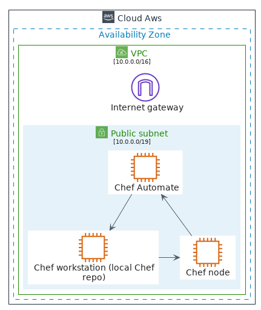
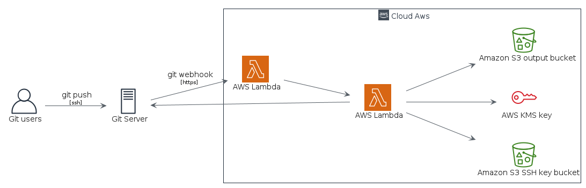
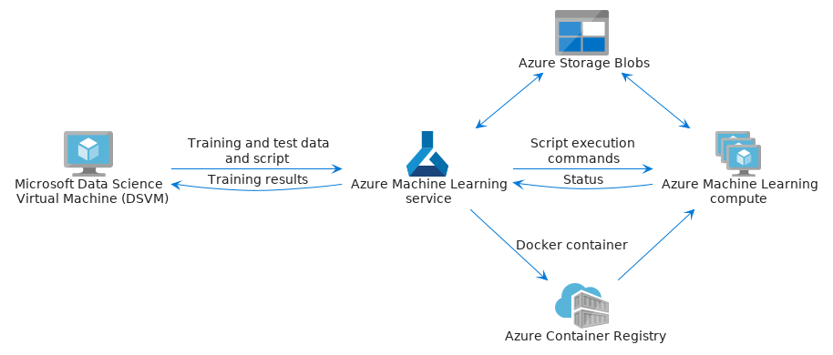
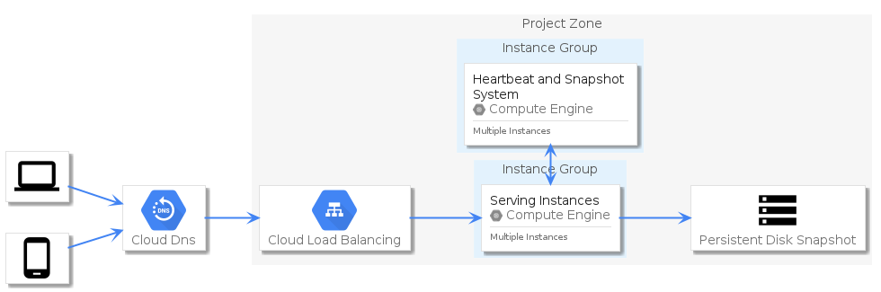

# Examples
## aws - chef automate architecture on aws

```plantuml
@startuml
'!global $LIB_BRANCH="master"
'!global $LIB_BASE_LOCATION="https://raw.githubusercontent.com/tmorin/plantuml-libs/" + $LIB_BRANCH + "/cloud"
'!includeurl $LIB_BASE_LOCATION/library.puml

!global $INCLUSION_MODE="local"
!global $LIB_BASE_LOCATION="../"
!include ../library.puml

include('styles/aws')
include("groups/aws/AwsGroupCloudAws")
include("groups/aws/AwsGroupAvailabilityZone")
include("groups/aws/AwsGroupVpc")
include("groups/aws/AwsGroupPublicSubnet")
include("elements/aws/Compute/Instance/AwsEc2Instance")
include("elements/aws/NetworkingContentDelivery/AwsVpcInternetGateway")

AwsGroupCloudAws('aws') {
    AwsGroupAvailabilityZone('az') {
        AwsGroupVpc('vpc', 'VPC', '10.0.0.0/16') {
            AwsVpcInternetGateway('gateway', 'Internet gateway')
            AwsGroupPublicSubnet('pubnet', 'Public subnet', '10.0.0.0/19') {
                AwsEc2Instance('instance1', 'Chef Automate')
                AwsEc2Instance('instance2', 'Chef workstation (local Chef repo)')
                AwsEc2Instance('instance3', 'Chef node')
            }
        }
    }
}

gateway -[hidden]-> instance1
instance1 -down-> instance2
instance2 -> instance3
instance3 -up-> instance1
@enduml
```
## aws - git to s3 webhooks

```plantuml
@startuml
!global $LIB_BRANCH="master"
!global $LIB_BASE_LOCATION="https://raw.githubusercontent.com/tmorin/plantuml-libs/" + $LIB_BRANCH + "/cloud"
!includeurl $LIB_BASE_LOCATION/library.puml

'!global $INCLUSION_MODE="local"
'!global $LIB_BASE_LOCATION="../"
'!include ../library.puml

include('styles/aws')
include("elements/aws/General/AwsUser")
include("elements/aws/General/AwsTraditionalServer")
include("elements/aws/Compute/AwsLambda")
include("elements/aws/Storage/AwsSimpleStorageServiceS3BucketWithObjects")
include("elements/aws/SecurityIdentityCompliance/AwsIdentityAndAccessManagementIamAddOn")
include("groups/aws/AwsGroupCloudAws")
include("groups/aws/AwsGroupAvailabilityZone")
include("groups/aws/AwsGroupVpc")
include("groups/aws/AwsGroupPublicSubnet")

left to right direction

AwsUser("git_users", "Git users")
AwsTraditionalServer("git_server", "Git Server")
AwsGroupCloudAws('aws') {
    AwsLambda("lambda0", "AWS Lambda")
    AwsLambda("lambda1", "AWS Lambda")
    AwsSimpleStorageServiceS3BucketWithObjects("bucket_ssh", "Amazon S3 SSH key bucket")
    AwsIdentityAndAccessManagementIamAddOn("kms", "AWS KMS key")
    AwsSimpleStorageServiceS3BucketWithObjects("bucket_output", "Amazon S3 output bucket")
}

git_users -down-> git_server : fmtLabel("git push", "ssh")
git_server -down-> lambda0 : fmtLabel("git webhook", "https")
lambda0 -down-> lambda1
lambda1 -down-> bucket_ssh
lambda1 -down-> kms
lambda1 -down-> bucket_output
lambda1 -up-> git_server
@enduml
```
## azure - scikit learn and deep learning

```plantuml
@startuml
' https://docs.microsoft.com/en-us/azure/architecture/reference-architectures/ai/training-python-models

!global $LIB_BRANCH="master"
!global $LIB_BASE_LOCATION="https://raw.githubusercontent.com/tmorin/plantuml-libs/" + $LIB_BRANCH + "/cloud"
!includeurl $LIB_BASE_LOCATION/library.puml

'!global $INCLUSION_MODE="local"
'!global $LIB_BASE_LOCATION="../"
'!include ../library.puml

include('styles/azure')
include("elements/azure/ComputeServiceColor/Vm/AzureVm")
include("elements/azure/AiAndMlServiceColor/AzureMachineLearningServiceWorkspaces")
include("elements/azure/ComputeServiceColor/Vm/AzureVmScaleSets")
include("elements/azure/ContainerServiceColor/AzureContainerRegistries")
include("elements/azure/DatabasesServiceColor/AzureBlobStorage")

AzureVm("dsvm", "Microsoft Data Science Virtual Machine (DSVM)")
AzureMachineLearningServiceWorkspaces("mls", "Azure Machine Learning service")
AzureVmScaleSets('mlc', 'Azure Machine Learning compute')
AzureContainerRegistries("cr", "Azure Container Registry")
AzureBlobStorage("sb", "Azure Storage Blobs")

dsvm -> mls : Training and test data and script
dsvm <- mls : Training results
mls --> cr : Docker container
mls <-up-> sb
mls -> mlc : Script execution commands
mls <- mlc : Status
mlc <-up-> sb
cr -up-> mlc
@enduml
```
## gcp-diagram-elements - diagram elements overview

```plantuml
@startuml
' https://docs.google.com/presentation/d/1vjm5YdmOH5LrubFhHf1vlqW2O9Z2UqdWA8biN3e8K5U/edit#slide=id.g19bd855f64_0_292

!global $LIB_BRANCH="master"
!global $LIB_BASE_LOCATION="https://raw.githubusercontent.com/tmorin/plantuml-libs/" + $LIB_BRANCH + "/cloud"
!includeurl $LIB_BASE_LOCATION/library.puml

'!global $INCLUSION_MODE="local"
'!global $LIB_BASE_LOCATION="../"
'!include ../library.puml

left to right direction

include('styles/gcp')
include('elements/materials/Hardware/MaterialsLaptop')
include('elements/materials/Hardware/MaterialsPhoneAndroid')
include('elements/gcp/Networking/GcpCloudDns')
include('elements/gcp/Networking/GcpCloudLoadBalancing')
include('elements/gcp/Compute/GcpComputeEngine')
include('elements/materials/Device/MaterialsStorage')
include('groups/gcp/GcpGroupProjectZone')
include('groups/gcp/GcpGroupInstances')

MaterialsLaptop('laptop', '')
MaterialsPhoneAndroid('phone', '')
GcpCloudDns('dns')
GcpGroupProjectZone('project') {
  GcpCloudLoadBalancing('lb')
  GcpGroupInstances('grp_instances', 'Instance Group') {
    GcpComputeEngineCard('instances','Serving Instances', 'Multiple Instances')
  }
  GcpGroupInstances('grp_heartbeat', 'Instance Group') {
    GcpComputeEngineCard('heartbeat', 'Heartbeat and Snapshot System', 'Multiple Instances')
  }
  MaterialsStorage('storage', 'Persistent Disk Snapshot')
}

laptop --> dns
phone --> dns
dns --> lb
lb --> instances
heartbeat <-> instances
instances --> storage

@enduml
```
