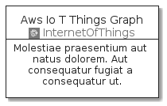
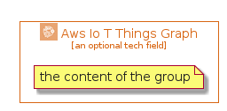

# Aws Io T Things Graph

```text
aws-20200430/Item/InternetOfThings/AwsIoTThingsGraph
```

```text
include('aws-20200430/Item/InternetOfThings/AwsIoTThingsGraph')
```

|icon|card|element|group|
|---|---|---|---|
|||||


## card
### Load remotely
```plantuml
@startuml
' configures the library
!global $LIB_BASE_LOCATION="https://raw.githubusercontent.com/tmorin/plantuml-libs/master/dist"
' loads the library
!include $LIB_BASE_LOCATION/bootstrap.puml
' loads the aws-20200430 bootstrap
include('aws-20200430/bootstrap')
' loads the AwsIoTThingsGraph element
include('aws-20200430/Item/InternetOfThings/AwsIoTThingsGraph')
AwsIoTThingsGraphCard('aws_io_t_things_graph', 'Aws Io T Things Graph', 'Molestiae praesentium aut natus dolorem. Aut consequatur fugiat a consequatur ut.')
@enduml
```
### Load locally
```plantuml
@startuml
' configures the library
!global $INCLUSION_MODE="local"
!global $LIB_BASE_LOCATION="../../.."
' loads the library
!include $LIB_BASE_LOCATION/bootstrap.puml
' loads the aws-20200430 bootstrap
include('aws-20200430/bootstrap')
' loads the AwsIoTThingsGraph element
include('aws-20200430/Item/InternetOfThings/AwsIoTThingsGraph')
AwsIoTThingsGraphCard('aws_io_t_things_graph', 'Aws Io T Things Graph', 'Molestiae praesentium aut natus dolorem. Aut consequatur fugiat a consequatur ut.')
@enduml
```


## element
### Load remotely
```plantuml
@startuml
' configures the library
!global $LIB_BASE_LOCATION="https://raw.githubusercontent.com/tmorin/plantuml-libs/master/dist"
' loads the library
!include $LIB_BASE_LOCATION/bootstrap.puml
' loads the aws-20200430 bootstrap
include('aws-20200430/bootstrap')
' loads the AwsIoTThingsGraph element
include('aws-20200430/Item/InternetOfThings/AwsIoTThingsGraph')
AwsIoTThingsGraph('aws_io_t_things_graph', 'Aws Io T Things Graph', 'an optional tech field')
@enduml
```
### Load locally
```plantuml
@startuml
' configures the library
!global $INCLUSION_MODE="local"
!global $LIB_BASE_LOCATION="../../.."
' loads the library
!include $LIB_BASE_LOCATION/bootstrap.puml
' loads the aws-20200430 bootstrap
include('aws-20200430/bootstrap')
' loads the AwsIoTThingsGraph element
include('aws-20200430/Item/InternetOfThings/AwsIoTThingsGraph')
AwsIoTThingsGraph('aws_io_t_things_graph', 'Aws Io T Things Graph', 'an optional tech field')
@enduml
```


## group
### Load remotely
```plantuml
@startuml
' configures the library
!global $LIB_BASE_LOCATION="https://raw.githubusercontent.com/tmorin/plantuml-libs/master/dist"
' loads the library
!include $LIB_BASE_LOCATION/bootstrap.puml
' loads the aws-20200430 bootstrap
include('aws-20200430/bootstrap')
' loads the AwsIoTThingsGraph element
include('aws-20200430/Item/InternetOfThings/AwsIoTThingsGraph')
AwsIoTThingsGraphGroup('aws_io_t_things_graph', 'Aws Io T Things Graph', 'an optional tech field'){
note as note
the content of the group
end note
}
@enduml
```
### Load locally
```plantuml
@startuml
' configures the library
!global $INCLUSION_MODE="local"
!global $LIB_BASE_LOCATION="../../.."
' loads the library
!include $LIB_BASE_LOCATION/bootstrap.puml
' loads the aws-20200430 bootstrap
include('aws-20200430/bootstrap')
' loads the AwsIoTThingsGraph element
include('aws-20200430/Item/InternetOfThings/AwsIoTThingsGraph')
AwsIoTThingsGraphGroup('aws_io_t_things_graph', 'Aws Io T Things Graph', 'an optional tech field'){
note as note
the content of the group
end note
}
@enduml
```

