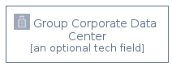
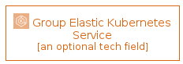

# Group

The module Group contains 23 entries.

| |Name|
|:---:|---|
||[aws-20200430/Group/GroupAutoScaling](../aws-20200430/Group/GroupAutoScaling.md)
||[aws-20200430/Group/GroupAvailabilityZone](../aws-20200430/Group/GroupAvailabilityZone.md)
||[aws-20200430/Group/GroupAwsCloud](../aws-20200430/Group/GroupAwsCloud.md)
||[aws-20200430/Group/GroupAwsStepFunctionsWorkflow](../aws-20200430/Group/GroupAwsStepFunctionsWorkflow.md)
||[aws-20200430/Group/GroupCloud](../aws-20200430/Group/GroupCloud.md)
||[aws-20200430/Group/GroupContainerRegistryService](../aws-20200430/Group/GroupContainerRegistryService.md)
||[aws-20200430/Group/GroupCorporateDataCenter](../aws-20200430/Group/GroupCorporateDataCenter.md)
||[aws-20200430/Group/GroupDashed](../aws-20200430/Group/GroupDashed.md)
||[aws-20200430/Group/GroupEc2InstanceContents](../aws-20200430/Group/GroupEc2InstanceContents.md)
||[aws-20200430/Group/GroupEcsContainer](../aws-20200430/Group/GroupEcsContainer.md)
||[aws-20200430/Group/GroupEcsService](../aws-20200430/Group/GroupEcsService.md)
||[aws-20200430/Group/GroupEcsTask](../aws-20200430/Group/GroupEcsTask.md)
||[aws-20200430/Group/GroupElasticBeanstalkContainer](../aws-20200430/Group/GroupElasticBeanstalkContainer.md)
||[aws-20200430/Group/GroupElasticContainerService](../aws-20200430/Group/GroupElasticContainerService.md)
||[aws-20200430/Group/GroupElasticKubernetesService](../aws-20200430/Group/GroupElasticKubernetesService.md)
||[aws-20200430/Group/GroupPlain](../aws-20200430/Group/GroupPlain.md)
||[aws-20200430/Group/GroupPrivateSubnet](../aws-20200430/Group/GroupPrivateSubnet.md)
||[aws-20200430/Group/GroupPublicSubnet](../aws-20200430/Group/GroupPublicSubnet.md)
||[aws-20200430/Group/GroupRegion](../aws-20200430/Group/GroupRegion.md)
||[aws-20200430/Group/GroupSecurity](../aws-20200430/Group/GroupSecurity.md)
||[aws-20200430/Group/GroupServerContents](../aws-20200430/Group/GroupServerContents.md)
||[aws-20200430/Group/GroupSpotFleet](../aws-20200430/Group/GroupSpotFleet.md)
||[aws-20200430/Group/GroupVpc](../aws-20200430/Group/GroupVpc.md)

