# Item

The module Item contains 539 entries.

- [Analytics](#family-analytics)
- [ApplicationIntegration](#family-applicationintegration)
- [ArVr](#family-arvr)
- [AwsCostManagement](#family-awscostmanagement)
- [Blockchain](#family-blockchain)
- [BusinessApplications](#family-businessapplications)
- [Compute](#family-compute)
- [Compute/Instance](#family-compute/instance)
- [CustomerEnablement](#family-customerenablement)
- [CustomerEngagement](#family-customerengagement)
- [Database](#family-database)
- [DeveloperTools](#family-developertools)
- [EndUserComputing](#family-endusercomputing)
- [GameTech](#family-gametech)
- [General](#family-general)
- [Groups](#family-groups)
- [InternetOfThings](#family-internetofthings)
- [MachineLearning](#family-machinelearning)
- [ManagementGovernance](#family-managementgovernance)
- [MediaServices](#family-mediaservices)
- [MigrationTransfer](#family-migrationtransfer)
- [Mobile](#family-mobile)
- [NetworkingContentDelivery](#family-networkingcontentdelivery)
- [QuantumTechnologies](#family-quantumtechnologies)
- [Robotics](#family-robotics)
- [Satellite](#family-satellite)
- [SecurityIdentityCompliance](#family-securityidentitycompliance)
- [Storage](#family-storage)

## Analytics

| |Name|
|:---:|---|
||[aws-20200430/Item/Analytics/Analytics](../aws-20200430/Item/Analytics/Analytics.md)
||[aws-20200430/Item/Analytics/AwsAthena](../aws-20200430/Item/Analytics/AwsAthena.md)
||[aws-20200430/Item/Analytics/AwsCloudSearch](../aws-20200430/Item/Analytics/AwsCloudSearch.md)
||[aws-20200430/Item/Analytics/AwsCloudSearchSearchDocuments](../aws-20200430/Item/Analytics/AwsCloudSearchSearchDocuments.md)
||[aws-20200430/Item/Analytics/AwsDataLakeResource](../aws-20200430/Item/Analytics/AwsDataLakeResource.md)
|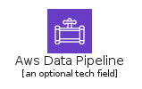|[aws-20200430/Item/Analytics/AwsDataPipeline](../aws-20200430/Item/Analytics/AwsDataPipeline.md)
||[aws-20200430/Item/Analytics/AwsElasticsearchService](../aws-20200430/Item/Analytics/AwsElasticsearchService.md)
||[aws-20200430/Item/Analytics/AwsEmr](../aws-20200430/Item/Analytics/AwsEmr.md)
||[aws-20200430/Item/Analytics/AwsEmrCluster](../aws-20200430/Item/Analytics/AwsEmrCluster.md)
|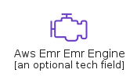|[aws-20200430/Item/Analytics/AwsEmrEmrEngine](../aws-20200430/Item/Analytics/AwsEmrEmrEngine.md)
|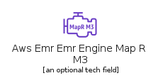|[aws-20200430/Item/Analytics/AwsEmrEmrEngineMapRM3](../aws-20200430/Item/Analytics/AwsEmrEmrEngineMapRM3.md)
||[aws-20200430/Item/Analytics/AwsEmrEmrEngineMapRM5](../aws-20200430/Item/Analytics/AwsEmrEmrEngineMapRM5.md)
||[aws-20200430/Item/Analytics/AwsEmrEmrEngineMapRM7](../aws-20200430/Item/Analytics/AwsEmrEmrEngineMapRM7.md)
|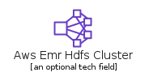|[aws-20200430/Item/Analytics/AwsEmrHdfsCluster](../aws-20200430/Item/Analytics/AwsEmrHdfsCluster.md)
||[aws-20200430/Item/Analytics/AwsGlue](../aws-20200430/Item/Analytics/AwsGlue.md)
||[aws-20200430/Item/Analytics/AwsGlueCrawlers](../aws-20200430/Item/Analytics/AwsGlueCrawlers.md)
||[aws-20200430/Item/Analytics/AwsGlueDataCatalog](../aws-20200430/Item/Analytics/AwsGlueDataCatalog.md)
||[aws-20200430/Item/Analytics/AwsKinesis](../aws-20200430/Item/Analytics/AwsKinesis.md)
||[aws-20200430/Item/Analytics/AwsKinesisDataAnalytics](../aws-20200430/Item/Analytics/AwsKinesisDataAnalytics.md)
||[aws-20200430/Item/Analytics/AwsKinesisDataFirehose](../aws-20200430/Item/Analytics/AwsKinesisDataFirehose.md)
||[aws-20200430/Item/Analytics/AwsKinesisDataStreams](../aws-20200430/Item/Analytics/AwsKinesisDataStreams.md)
||[aws-20200430/Item/Analytics/AwsKinesisVideoStreams](../aws-20200430/Item/Analytics/AwsKinesisVideoStreams.md)
||[aws-20200430/Item/Analytics/AwsLakeFormation](../aws-20200430/Item/Analytics/AwsLakeFormation.md)
||[aws-20200430/Item/Analytics/AwsManagedStreamingForKafka](../aws-20200430/Item/Analytics/AwsManagedStreamingForKafka.md)
||[aws-20200430/Item/Analytics/AwsQuicksight](../aws-20200430/Item/Analytics/AwsQuicksight.md)
|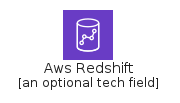|[aws-20200430/Item/Analytics/AwsRedshift](../aws-20200430/Item/Analytics/AwsRedshift.md)
|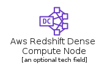|[aws-20200430/Item/Analytics/AwsRedshiftDenseComputeNode](../aws-20200430/Item/Analytics/AwsRedshiftDenseComputeNode.md)
|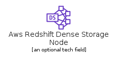|[aws-20200430/Item/Analytics/AwsRedshiftDenseStorageNode](../aws-20200430/Item/Analytics/AwsRedshiftDenseStorageNode.md)

## ApplicationIntegration

| |Name|
|:---:|---|
||[aws-20200430/Item/ApplicationIntegration/ApplicationIntegration](../aws-20200430/Item/ApplicationIntegration/ApplicationIntegration.md)
||[aws-20200430/Item/ApplicationIntegration/ApplicationIntegrationEventResource](../aws-20200430/Item/ApplicationIntegration/ApplicationIntegrationEventResource.md)
||[aws-20200430/Item/ApplicationIntegration/AwsAppSync](../aws-20200430/Item/ApplicationIntegration/AwsAppSync.md)
||[aws-20200430/Item/ApplicationIntegration/AwsConsoleMobileApplication](../aws-20200430/Item/ApplicationIntegration/AwsConsoleMobileApplication.md)
||[aws-20200430/Item/ApplicationIntegration/AwsEventBridge](../aws-20200430/Item/ApplicationIntegration/AwsEventBridge.md)
||[aws-20200430/Item/ApplicationIntegration/AwsEventBridgeCustomEventBusResource](../aws-20200430/Item/ApplicationIntegration/AwsEventBridgeCustomEventBusResource.md)
|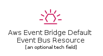|[aws-20200430/Item/ApplicationIntegration/AwsEventBridgeDefaultEventBusResource](../aws-20200430/Item/ApplicationIntegration/AwsEventBridgeDefaultEventBusResource.md)
||[aws-20200430/Item/ApplicationIntegration/AwsEventBridgeSaasPartnerEventBusResource](../aws-20200430/Item/ApplicationIntegration/AwsEventBridgeSaasPartnerEventBusResource.md)
||[aws-20200430/Item/ApplicationIntegration/AwsExpressWorkflows](../aws-20200430/Item/ApplicationIntegration/AwsExpressWorkflows.md)
||[aws-20200430/Item/ApplicationIntegration/AwsMq](../aws-20200430/Item/ApplicationIntegration/AwsMq.md)
||[aws-20200430/Item/ApplicationIntegration/AwsSimpleNotificationServiceSns](../aws-20200430/Item/ApplicationIntegration/AwsSimpleNotificationServiceSns.md)
||[aws-20200430/Item/ApplicationIntegration/AwsSimpleNotificationServiceSnsEmailNotification](../aws-20200430/Item/ApplicationIntegration/AwsSimpleNotificationServiceSnsEmailNotification.md)
||[aws-20200430/Item/ApplicationIntegration/AwsSimpleNotificationServiceSnsHttpNotification](../aws-20200430/Item/ApplicationIntegration/AwsSimpleNotificationServiceSnsHttpNotification.md)
||[aws-20200430/Item/ApplicationIntegration/AwsSimpleNotificationServiceSnsTopic](../aws-20200430/Item/ApplicationIntegration/AwsSimpleNotificationServiceSnsTopic.md)
||[aws-20200430/Item/ApplicationIntegration/AwsSimpleQueueServiceSqs](../aws-20200430/Item/ApplicationIntegration/AwsSimpleQueueServiceSqs.md)
||[aws-20200430/Item/ApplicationIntegration/AwsSimpleQueueServiceSqsMessage](../aws-20200430/Item/ApplicationIntegration/AwsSimpleQueueServiceSqsMessage.md)
||[aws-20200430/Item/ApplicationIntegration/AwsSimpleQueueServiceSqsQueue](../aws-20200430/Item/ApplicationIntegration/AwsSimpleQueueServiceSqsQueue.md)
||[aws-20200430/Item/ApplicationIntegration/AwsStepFunctions](../aws-20200430/Item/ApplicationIntegration/AwsStepFunctions.md)
||[aws-20200430/Item/ApplicationIntegration/CustomEventBusResource64Squid](../aws-20200430/Item/ApplicationIntegration/CustomEventBusResource64Squid.md)
||[aws-20200430/Item/ApplicationIntegration/CustomEventBusResource64White](../aws-20200430/Item/ApplicationIntegration/CustomEventBusResource64White.md)
|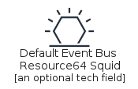|[aws-20200430/Item/ApplicationIntegration/DefaultEventBusResource64Squid](../aws-20200430/Item/ApplicationIntegration/DefaultEventBusResource64Squid.md)
||[aws-20200430/Item/ApplicationIntegration/DefaultEventBusResource64White](../aws-20200430/Item/ApplicationIntegration/DefaultEventBusResource64White.md)
||[aws-20200430/Item/ApplicationIntegration/SaaSEventBusResource64Squid](../aws-20200430/Item/ApplicationIntegration/SaaSEventBusResource64Squid.md)
||[aws-20200430/Item/ApplicationIntegration/SaaSEventBusResource64White](../aws-20200430/Item/ApplicationIntegration/SaaSEventBusResource64White.md)

## ArVr

| |Name|
|:---:|---|
||[aws-20200430/Item/ArVr/ArVr](../aws-20200430/Item/ArVr/ArVr.md)
||[aws-20200430/Item/ArVr/AwsSumerian](../aws-20200430/Item/ArVr/AwsSumerian.md)

## AwsCostManagement

| |Name|
|:---:|---|
||[aws-20200430/Item/AwsCostManagement/AwsBudgets](../aws-20200430/Item/AwsCostManagement/AwsBudgets.md)
||[aws-20200430/Item/AwsCostManagement/AwsCostAndUsageReport](../aws-20200430/Item/AwsCostManagement/AwsCostAndUsageReport.md)
||[aws-20200430/Item/AwsCostManagement/AwsCostExplorer](../aws-20200430/Item/AwsCostManagement/AwsCostExplorer.md)
||[aws-20200430/Item/AwsCostManagement/AwsCostManagement](../aws-20200430/Item/AwsCostManagement/AwsCostManagement.md)
||[aws-20200430/Item/AwsCostManagement/ReservedInstanceReporting](../aws-20200430/Item/AwsCostManagement/ReservedInstanceReporting.md)
||[aws-20200430/Item/AwsCostManagement/SavingsPlans](../aws-20200430/Item/AwsCostManagement/SavingsPlans.md)

## Blockchain

| |Name|
|:---:|---|
||[aws-20200430/Item/Blockchain/AwsManagedBlockchain](../aws-20200430/Item/Blockchain/AwsManagedBlockchain.md)
||[aws-20200430/Item/Blockchain/AwsQuantumLedgerDatabaseQldb](../aws-20200430/Item/Blockchain/AwsQuantumLedgerDatabaseQldb.md)
||[aws-20200430/Item/Blockchain/Blockchain](../aws-20200430/Item/Blockchain/Blockchain.md)
||[aws-20200430/Item/Blockchain/BlockchainResource](../aws-20200430/Item/Blockchain/BlockchainResource.md)

## BusinessApplications

| |Name|
|:---:|---|
||[aws-20200430/Item/BusinessApplications/AlexaForBusiness](../aws-20200430/Item/BusinessApplications/AlexaForBusiness.md)
||[aws-20200430/Item/BusinessApplications/AwsChime](../aws-20200430/Item/BusinessApplications/AwsChime.md)
||[aws-20200430/Item/BusinessApplications/AwsWorkMail](../aws-20200430/Item/BusinessApplications/AwsWorkMail.md)
||[aws-20200430/Item/BusinessApplications/BusinessApplications](../aws-20200430/Item/BusinessApplications/BusinessApplications.md)

## Compute

| |Name|
|:---:|---|
||[aws-20200430/Item/Compute/AwsApplicationAutoScaling](../aws-20200430/Item/Compute/AwsApplicationAutoScaling.md)
||[aws-20200430/Item/Compute/AwsBatch](../aws-20200430/Item/Compute/AwsBatch.md)
||[aws-20200430/Item/Compute/AwsComputeOptimizer](../aws-20200430/Item/Compute/AwsComputeOptimizer.md)
||[aws-20200430/Item/Compute/AwsEc2](../aws-20200430/Item/Compute/AwsEc2.md)
||[aws-20200430/Item/Compute/AwsEc2Ami](../aws-20200430/Item/Compute/AwsEc2Ami.md)
|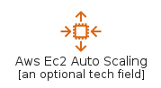|[aws-20200430/Item/Compute/AwsEc2AutoScaling](../aws-20200430/Item/Compute/AwsEc2AutoScaling.md)
||[aws-20200430/Item/Compute/AwsEc2ContainerRegistry](../aws-20200430/Item/Compute/AwsEc2ContainerRegistry.md)
||[aws-20200430/Item/Compute/AwsEc2ContainerRegistryImage](../aws-20200430/Item/Compute/AwsEc2ContainerRegistryImage.md)
||[aws-20200430/Item/Compute/AwsEc2ContainerRegistryRegistry](../aws-20200430/Item/Compute/AwsEc2ContainerRegistryRegistry.md)
||[aws-20200430/Item/Compute/AwsEc2ElasticIpAddress](../aws-20200430/Item/Compute/AwsEc2ElasticIpAddress.md)
|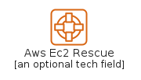|[aws-20200430/Item/Compute/AwsEc2Rescue](../aws-20200430/Item/Compute/AwsEc2Rescue.md)
||[aws-20200430/Item/Compute/AwsElasticBeanstalk](../aws-20200430/Item/Compute/AwsElasticBeanstalk.md)
|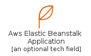|[aws-20200430/Item/Compute/AwsElasticBeanstalkApplication](../aws-20200430/Item/Compute/AwsElasticBeanstalkApplication.md)
||[aws-20200430/Item/Compute/AwsElasticBeanstalkDeployment](../aws-20200430/Item/Compute/AwsElasticBeanstalkDeployment.md)
||[aws-20200430/Item/Compute/AwsElasticContainerService](../aws-20200430/Item/Compute/AwsElasticContainerService.md)
|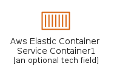|[aws-20200430/Item/Compute/AwsElasticContainerServiceContainer1](../aws-20200430/Item/Compute/AwsElasticContainerServiceContainer1.md)
||[aws-20200430/Item/Compute/AwsElasticContainerServiceContainer2](../aws-20200430/Item/Compute/AwsElasticContainerServiceContainer2.md)
||[aws-20200430/Item/Compute/AwsElasticContainerServiceContainer3](../aws-20200430/Item/Compute/AwsElasticContainerServiceContainer3.md)
||[aws-20200430/Item/Compute/AwsElasticContainerServiceService](../aws-20200430/Item/Compute/AwsElasticContainerServiceService.md)
||[aws-20200430/Item/Compute/AwsElasticContainerServiceTask](../aws-20200430/Item/Compute/AwsElasticContainerServiceTask.md)
||[aws-20200430/Item/Compute/AwsElasticKubernetesService](../aws-20200430/Item/Compute/AwsElasticKubernetesService.md)
||[aws-20200430/Item/Compute/AwsFargate](../aws-20200430/Item/Compute/AwsFargate.md)
||[aws-20200430/Item/Compute/AwsLambda](../aws-20200430/Item/Compute/AwsLambda.md)
||[aws-20200430/Item/Compute/AwsLambdaLambdaFunction](../aws-20200430/Item/Compute/AwsLambdaLambdaFunction.md)
||[aws-20200430/Item/Compute/AwsLightsail](../aws-20200430/Item/Compute/AwsLightsail.md)
||[aws-20200430/Item/Compute/AwsLocalZones](../aws-20200430/Item/Compute/AwsLocalZones.md)
||[aws-20200430/Item/Compute/AwsOutposts](../aws-20200430/Item/Compute/AwsOutposts.md)
||[aws-20200430/Item/Compute/AwsServerlessApplicationRepository](../aws-20200430/Item/Compute/AwsServerlessApplicationRepository.md)
||[aws-20200430/Item/Compute/AwsThinkboxDeadline](../aws-20200430/Item/Compute/AwsThinkboxDeadline.md)
||[aws-20200430/Item/Compute/AwsThinkboxDraft](../aws-20200430/Item/Compute/AwsThinkboxDraft.md)
||[aws-20200430/Item/Compute/AwsThinkboxFrost](../aws-20200430/Item/Compute/AwsThinkboxFrost.md)
||[aws-20200430/Item/Compute/AwsThinkboxKrakatoa](../aws-20200430/Item/Compute/AwsThinkboxKrakatoa.md)
||[aws-20200430/Item/Compute/AwsThinkboxSequoia](../aws-20200430/Item/Compute/AwsThinkboxSequoia.md)
||[aws-20200430/Item/Compute/AwsThinkboxStoke](../aws-20200430/Item/Compute/AwsThinkboxStoke.md)
||[aws-20200430/Item/Compute/AwsThinkboxXMesh](../aws-20200430/Item/Compute/AwsThinkboxXMesh.md)
||[aws-20200430/Item/Compute/AwsWavelength](../aws-20200430/Item/Compute/AwsWavelength.md)
||[aws-20200430/Item/Compute/Bottlerocket](../aws-20200430/Item/Compute/Bottlerocket.md)
||[aws-20200430/Item/Compute/Compute](../aws-20200430/Item/Compute/Compute.md)
||[aws-20200430/Item/Compute/Ec2ImageBuilder](../aws-20200430/Item/Compute/Ec2ImageBuilder.md)
||[aws-20200430/Item/Compute/ParallelCluster](../aws-20200430/Item/Compute/ParallelCluster.md)
||[aws-20200430/Item/Compute/VMwareCloudOnAws](../aws-20200430/Item/Compute/VMwareCloudOnAws.md)

## Compute/Instance

| |Name|
|:---:|---|
|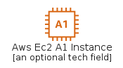|[aws-20200430/Item/Compute/Instance/AwsEc2A1Instance](../aws-20200430/Item/Compute/Instance/AwsEc2A1Instance.md)
||[aws-20200430/Item/Compute/Instance/AwsEc2C4Instance](../aws-20200430/Item/Compute/Instance/AwsEc2C4Instance.md)
||[aws-20200430/Item/Compute/Instance/AwsEc2C5Instance](../aws-20200430/Item/Compute/Instance/AwsEc2C5Instance.md)
||[aws-20200430/Item/Compute/Instance/AwsEc2C5NInstance](../aws-20200430/Item/Compute/Instance/AwsEc2C5NInstance.md)
|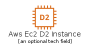|[aws-20200430/Item/Compute/Instance/AwsEc2D2Instance](../aws-20200430/Item/Compute/Instance/AwsEc2D2Instance.md)
||[aws-20200430/Item/Compute/Instance/AwsEc2DbOnInstance](../aws-20200430/Item/Compute/Instance/AwsEc2DbOnInstance.md)
|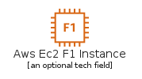|[aws-20200430/Item/Compute/Instance/AwsEc2F1Instance](../aws-20200430/Item/Compute/Instance/AwsEc2F1Instance.md)
||[aws-20200430/Item/Compute/Instance/AwsEc2G3Instance](../aws-20200430/Item/Compute/Instance/AwsEc2G3Instance.md)
|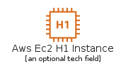|[aws-20200430/Item/Compute/Instance/AwsEc2H1Instance](../aws-20200430/Item/Compute/Instance/AwsEc2H1Instance.md)
||[aws-20200430/Item/Compute/Instance/AwsEc2HighMemoryInstance](../aws-20200430/Item/Compute/Instance/AwsEc2HighMemoryInstance.md)
|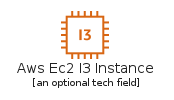|[aws-20200430/Item/Compute/Instance/AwsEc2I3Instance](../aws-20200430/Item/Compute/Instance/AwsEc2I3Instance.md)
|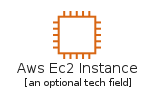|[aws-20200430/Item/Compute/Instance/AwsEc2Instance](../aws-20200430/Item/Compute/Instance/AwsEc2Instance.md)
||[aws-20200430/Item/Compute/Instance/AwsEc2Instances](../aws-20200430/Item/Compute/Instance/AwsEc2Instances.md)
|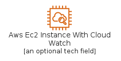|[aws-20200430/Item/Compute/Instance/AwsEc2InstanceWithCloudWatch](../aws-20200430/Item/Compute/Instance/AwsEc2InstanceWithCloudWatch.md)
|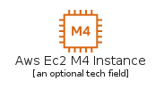|[aws-20200430/Item/Compute/Instance/AwsEc2M4Instance](../aws-20200430/Item/Compute/Instance/AwsEc2M4Instance.md)
||[aws-20200430/Item/Compute/Instance/AwsEc2M5AInstance](../aws-20200430/Item/Compute/Instance/AwsEc2M5AInstance.md)
||[aws-20200430/Item/Compute/Instance/AwsEc2M5Instance](../aws-20200430/Item/Compute/Instance/AwsEc2M5Instance.md)
||[aws-20200430/Item/Compute/Instance/AwsEc2OptimizedInstance](../aws-20200430/Item/Compute/Instance/AwsEc2OptimizedInstance.md)
|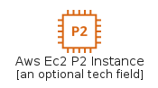|[aws-20200430/Item/Compute/Instance/AwsEc2P2Instance](../aws-20200430/Item/Compute/Instance/AwsEc2P2Instance.md)
||[aws-20200430/Item/Compute/Instance/AwsEc2P3Instance](../aws-20200430/Item/Compute/Instance/AwsEc2P3Instance.md)
||[aws-20200430/Item/Compute/Instance/AwsEc2R4Instance](../aws-20200430/Item/Compute/Instance/AwsEc2R4Instance.md)
|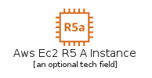|[aws-20200430/Item/Compute/Instance/AwsEc2R5AInstance](../aws-20200430/Item/Compute/Instance/AwsEc2R5AInstance.md)
||[aws-20200430/Item/Compute/Instance/AwsEc2R5Instance](../aws-20200430/Item/Compute/Instance/AwsEc2R5Instance.md)
||[aws-20200430/Item/Compute/Instance/AwsEc2SpotInstance](../aws-20200430/Item/Compute/Instance/AwsEc2SpotInstance.md)
|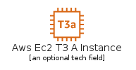|[aws-20200430/Item/Compute/Instance/AwsEc2T3AInstance](../aws-20200430/Item/Compute/Instance/AwsEc2T3AInstance.md)
|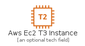|[aws-20200430/Item/Compute/Instance/AwsEc2T3Instance](../aws-20200430/Item/Compute/Instance/AwsEc2T3Instance.md)
||[aws-20200430/Item/Compute/Instance/AwsEc2T3InstanceCopy](../aws-20200430/Item/Compute/Instance/AwsEc2T3InstanceCopy.md)
|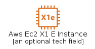|[aws-20200430/Item/Compute/Instance/AwsEc2X1EInstance](../aws-20200430/Item/Compute/Instance/AwsEc2X1EInstance.md)
|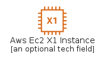|[aws-20200430/Item/Compute/Instance/AwsEc2X1Instance](../aws-20200430/Item/Compute/Instance/AwsEc2X1Instance.md)
|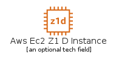|[aws-20200430/Item/Compute/Instance/AwsEc2Z1DInstance](../aws-20200430/Item/Compute/Instance/AwsEc2Z1DInstance.md)

## CustomerEnablement

| |Name|
|:---:|---|
||[aws-20200430/Item/CustomerEnablement/AwsIq](../aws-20200430/Item/CustomerEnablement/AwsIq.md)
||[aws-20200430/Item/CustomerEnablement/AwsManagedServices](../aws-20200430/Item/CustomerEnablement/AwsManagedServices.md)
||[aws-20200430/Item/CustomerEnablement/AwsProfessionalServices](../aws-20200430/Item/CustomerEnablement/AwsProfessionalServices.md)
||[aws-20200430/Item/CustomerEnablement/AwsSupport](../aws-20200430/Item/CustomerEnablement/AwsSupport.md)
||[aws-20200430/Item/CustomerEnablement/CustomerEnablement](../aws-20200430/Item/CustomerEnablement/CustomerEnablement.md)

## CustomerEngagement

| |Name|
|:---:|---|
||[aws-20200430/Item/CustomerEngagement/AwsConnect](../aws-20200430/Item/CustomerEngagement/AwsConnect.md)
||[aws-20200430/Item/CustomerEngagement/AwsPinpoint](../aws-20200430/Item/CustomerEngagement/AwsPinpoint.md)
||[aws-20200430/Item/CustomerEngagement/AwsSimpleEmailServiceSes](../aws-20200430/Item/CustomerEngagement/AwsSimpleEmailServiceSes.md)
||[aws-20200430/Item/CustomerEngagement/AwsSimpleEmailServiceSesEmail](../aws-20200430/Item/CustomerEngagement/AwsSimpleEmailServiceSesEmail.md)
||[aws-20200430/Item/CustomerEngagement/CustomerEngagement](../aws-20200430/Item/CustomerEngagement/CustomerEngagement.md)

## Database

| |Name|
|:---:|---|
|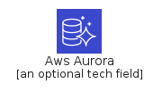|[aws-20200430/Item/Database/AwsAurora](../aws-20200430/Item/Database/AwsAurora.md)
|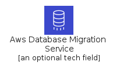|[aws-20200430/Item/Database/AwsDatabaseMigrationService](../aws-20200430/Item/Database/AwsDatabaseMigrationService.md)
||[aws-20200430/Item/Database/AwsDatabaseMigrationServiceDatabaseMigrationWorkflow](../aws-20200430/Item/Database/AwsDatabaseMigrationServiceDatabaseMigrationWorkflow.md)
||[aws-20200430/Item/Database/AwsDocumentDBwithMongoDbCompatibility](../aws-20200430/Item/Database/AwsDocumentDBwithMongoDbCompatibility.md)
|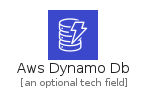|[aws-20200430/Item/Database/AwsDynamoDb](../aws-20200430/Item/Database/AwsDynamoDb.md)
|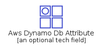|[aws-20200430/Item/Database/AwsDynamoDbAttribute](../aws-20200430/Item/Database/AwsDynamoDbAttribute.md)
|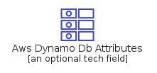|[aws-20200430/Item/Database/AwsDynamoDbAttributes](../aws-20200430/Item/Database/AwsDynamoDbAttributes.md)
|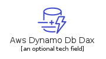|[aws-20200430/Item/Database/AwsDynamoDbDax](../aws-20200430/Item/Database/AwsDynamoDbDax.md)
|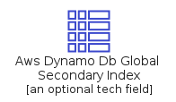|[aws-20200430/Item/Database/AwsDynamoDbGlobalSecondaryIndex](../aws-20200430/Item/Database/AwsDynamoDbGlobalSecondaryIndex.md)
||[aws-20200430/Item/Database/AwsDynamoDbItem](../aws-20200430/Item/Database/AwsDynamoDbItem.md)
|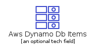|[aws-20200430/Item/Database/AwsDynamoDbItems](../aws-20200430/Item/Database/AwsDynamoDbItems.md)
||[aws-20200430/Item/Database/AwsDynamoDbTable](../aws-20200430/Item/Database/AwsDynamoDbTable.md)
|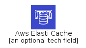|[aws-20200430/Item/Database/AwsElastiCache](../aws-20200430/Item/Database/AwsElastiCache.md)
|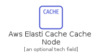|[aws-20200430/Item/Database/AwsElastiCacheCacheNode](../aws-20200430/Item/Database/AwsElastiCacheCacheNode.md)
|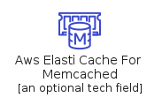|[aws-20200430/Item/Database/AwsElastiCacheForMemcached](../aws-20200430/Item/Database/AwsElastiCacheForMemcached.md)
|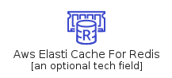|[aws-20200430/Item/Database/AwsElastiCacheForRedis](../aws-20200430/Item/Database/AwsElastiCacheForRedis.md)
|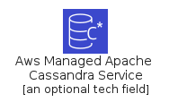|[aws-20200430/Item/Database/AwsManagedApacheCassandraService](../aws-20200430/Item/Database/AwsManagedApacheCassandraService.md)
|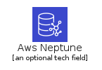|[aws-20200430/Item/Database/AwsNeptune](../aws-20200430/Item/Database/AwsNeptune.md)
||[aws-20200430/Item/Database/AwsQuantumLedgerDatabaseQldb](../aws-20200430/Item/Database/AwsQuantumLedgerDatabaseQldb.md)
|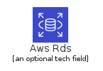|[aws-20200430/Item/Database/AwsRds](../aws-20200430/Item/Database/AwsRds.md)
|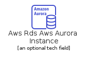|[aws-20200430/Item/Database/AwsRdsAwsAuroraInstance](../aws-20200430/Item/Database/AwsRdsAwsAuroraInstance.md)
|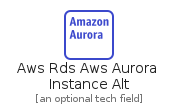|[aws-20200430/Item/Database/AwsRdsAwsAuroraInstanceAlt](../aws-20200430/Item/Database/AwsRdsAwsAuroraInstanceAlt.md)
||[aws-20200430/Item/Database/AwsRdsAwsRdsInstance](../aws-20200430/Item/Database/AwsRdsAwsRdsInstance.md)
||[aws-20200430/Item/Database/AwsRdsAwsRdsInstanceAlt](../aws-20200430/Item/Database/AwsRdsAwsRdsInstanceAlt.md)
||[aws-20200430/Item/Database/AwsRdsMariaDbInstance](../aws-20200430/Item/Database/AwsRdsMariaDbInstance.md)
|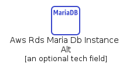|[aws-20200430/Item/Database/AwsRdsMariaDbInstanceAlt](../aws-20200430/Item/Database/AwsRdsMariaDbInstanceAlt.md)
||[aws-20200430/Item/Database/AwsRdsMySqlInstance](../aws-20200430/Item/Database/AwsRdsMySqlInstance.md)
||[aws-20200430/Item/Database/AwsRdsMySqlInstanceAlt](../aws-20200430/Item/Database/AwsRdsMySqlInstanceAlt.md)
||[aws-20200430/Item/Database/AwsRdsOnVMware](../aws-20200430/Item/Database/AwsRdsOnVMware.md)
||[aws-20200430/Item/Database/AwsRdsOracleInstance](../aws-20200430/Item/Database/AwsRdsOracleInstance.md)
||[aws-20200430/Item/Database/AwsRdsOracleInstanceAlt](../aws-20200430/Item/Database/AwsRdsOracleInstanceAlt.md)
|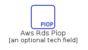|[aws-20200430/Item/Database/AwsRdsPiop](../aws-20200430/Item/Database/AwsRdsPiop.md)
|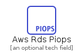|[aws-20200430/Item/Database/AwsRdsPiops](../aws-20200430/Item/Database/AwsRdsPiops.md)
|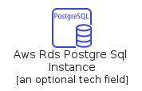|[aws-20200430/Item/Database/AwsRdsPostgreSqlInstance](../aws-20200430/Item/Database/AwsRdsPostgreSqlInstance.md)
||[aws-20200430/Item/Database/AwsRdsPostgreSqlInstanceAlt](../aws-20200430/Item/Database/AwsRdsPostgreSqlInstanceAlt.md)
|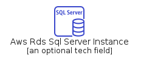|[aws-20200430/Item/Database/AwsRdsSqlServerInstance](../aws-20200430/Item/Database/AwsRdsSqlServerInstance.md)
||[aws-20200430/Item/Database/AwsRdsSqlServerInstanceAlt](../aws-20200430/Item/Database/AwsRdsSqlServerInstanceAlt.md)
||[aws-20200430/Item/Database/AwsRedshift](../aws-20200430/Item/Database/AwsRedshift.md)
||[aws-20200430/Item/Database/AwsRedshiftDenseComputeNode](../aws-20200430/Item/Database/AwsRedshiftDenseComputeNode.md)
||[aws-20200430/Item/Database/AwsRedshiftDenseStorageNode](../aws-20200430/Item/Database/AwsRedshiftDenseStorageNode.md)
||[aws-20200430/Item/Database/AwsTimestream](../aws-20200430/Item/Database/AwsTimestream.md)
||[aws-20200430/Item/Database/Database](../aws-20200430/Item/Database/Database.md)

## DeveloperTools

| |Name|
|:---:|---|
||[aws-20200430/Item/DeveloperTools/AwsCloud9](../aws-20200430/Item/DeveloperTools/AwsCloud9.md)
||[aws-20200430/Item/DeveloperTools/AwsCloudDevelopmentKit](../aws-20200430/Item/DeveloperTools/AwsCloudDevelopmentKit.md)
||[aws-20200430/Item/DeveloperTools/AwsCodeBuild](../aws-20200430/Item/DeveloperTools/AwsCodeBuild.md)
||[aws-20200430/Item/DeveloperTools/AwsCodeCommit](../aws-20200430/Item/DeveloperTools/AwsCodeCommit.md)
||[aws-20200430/Item/DeveloperTools/AwsCodeDeploy](../aws-20200430/Item/DeveloperTools/AwsCodeDeploy.md)
||[aws-20200430/Item/DeveloperTools/AwsCodePipeline](../aws-20200430/Item/DeveloperTools/AwsCodePipeline.md)
||[aws-20200430/Item/DeveloperTools/AwsCodeStar](../aws-20200430/Item/DeveloperTools/AwsCodeStar.md)
||[aws-20200430/Item/DeveloperTools/AwsCommandLineInterface](../aws-20200430/Item/DeveloperTools/AwsCommandLineInterface.md)
||[aws-20200430/Item/DeveloperTools/AwsDynamoDbDax](../aws-20200430/Item/DeveloperTools/AwsDynamoDbDax.md)
||[aws-20200430/Item/DeveloperTools/AwsToolsAndSdKs](../aws-20200430/Item/DeveloperTools/AwsToolsAndSdKs.md)
||[aws-20200430/Item/DeveloperTools/AwsXRay](../aws-20200430/Item/DeveloperTools/AwsXRay.md)
||[aws-20200430/Item/DeveloperTools/Cloud9Resource](../aws-20200430/Item/DeveloperTools/Cloud9Resource.md)
||[aws-20200430/Item/DeveloperTools/DeveloperTools](../aws-20200430/Item/DeveloperTools/DeveloperTools.md)

## EndUserComputing

| |Name|
|:---:|---|
||[aws-20200430/Item/EndUserComputing/AwsAppstream20](../aws-20200430/Item/EndUserComputing/AwsAppstream20.md)
||[aws-20200430/Item/EndUserComputing/AwsWorkDocs](../aws-20200430/Item/EndUserComputing/AwsWorkDocs.md)
||[aws-20200430/Item/EndUserComputing/AwsWorkLink](../aws-20200430/Item/EndUserComputing/AwsWorkLink.md)
||[aws-20200430/Item/EndUserComputing/AwsWorkspaces](../aws-20200430/Item/EndUserComputing/AwsWorkspaces.md)
||[aws-20200430/Item/EndUserComputing/EndUserComputing](../aws-20200430/Item/EndUserComputing/EndUserComputing.md)

## GameTech

| |Name|
|:---:|---|
||[aws-20200430/Item/GameTech/AwsGameLift](../aws-20200430/Item/GameTech/AwsGameLift.md)
||[aws-20200430/Item/GameTech/GameTech](../aws-20200430/Item/GameTech/GameTech.md)

## General

| |Name|
|:---:|---|
||[aws-20200430/Item/General/AwsEmail](../aws-20200430/Item/General/AwsEmail.md)
||[aws-20200430/Item/General/AwsMarketplace](../aws-20200430/Item/General/AwsMarketplace.md)
||[aws-20200430/Item/General/Client](../aws-20200430/Item/General/Client.md)
||[aws-20200430/Item/General/Disk](../aws-20200430/Item/General/Disk.md)
||[aws-20200430/Item/General/Forums](../aws-20200430/Item/General/Forums.md)
||[aws-20200430/Item/General/General](../aws-20200430/Item/General/General.md)
||[aws-20200430/Item/General/GenericDatabase](../aws-20200430/Item/General/GenericDatabase.md)
||[aws-20200430/Item/General/GenericFirewall](../aws-20200430/Item/General/GenericFirewall.md)
||[aws-20200430/Item/General/InternetAlt1](../aws-20200430/Item/General/InternetAlt1.md)
||[aws-20200430/Item/General/InternetAlt2](../aws-20200430/Item/General/InternetAlt2.md)
||[aws-20200430/Item/General/InternetGateway](../aws-20200430/Item/General/InternetGateway.md)
||[aws-20200430/Item/General/MobileClient](../aws-20200430/Item/General/MobileClient.md)
||[aws-20200430/Item/General/Multimedia](../aws-20200430/Item/General/Multimedia.md)
||[aws-20200430/Item/General/OfficeBuilding](../aws-20200430/Item/General/OfficeBuilding.md)
||[aws-20200430/Item/General/SamlToken](../aws-20200430/Item/General/SamlToken.md)
||[aws-20200430/Item/General/Sdk](../aws-20200430/Item/General/Sdk.md)
||[aws-20200430/Item/General/SslPadlock](../aws-20200430/Item/General/SslPadlock.md)
||[aws-20200430/Item/General/TapeStorage](../aws-20200430/Item/General/TapeStorage.md)
||[aws-20200430/Item/General/Toolkit](../aws-20200430/Item/General/Toolkit.md)
||[aws-20200430/Item/General/TraditionalServer](../aws-20200430/Item/General/TraditionalServer.md)
||[aws-20200430/Item/General/User](../aws-20200430/Item/General/User.md)
||[aws-20200430/Item/General/Users](../aws-20200430/Item/General/Users.md)

## Groups

| |Name|
|:---:|---|
||[aws-20200430/Item/Groups/AutoScaling](../aws-20200430/Item/Groups/AutoScaling.md)
||[aws-20200430/Item/Groups/AwsCloud](../aws-20200430/Item/Groups/AwsCloud.md)
||[aws-20200430/Item/Groups/AwsCloudAlt](../aws-20200430/Item/Groups/AwsCloudAlt.md)
||[aws-20200430/Item/Groups/AwsStepFunction](../aws-20200430/Item/Groups/AwsStepFunction.md)
||[aws-20200430/Item/Groups/CorporateDataCenter](../aws-20200430/Item/Groups/CorporateDataCenter.md)
||[aws-20200430/Item/Groups/Ec2InstanceContainer](../aws-20200430/Item/Groups/Ec2InstanceContainer.md)
||[aws-20200430/Item/Groups/ElasticBeanstalkContainer](../aws-20200430/Item/Groups/ElasticBeanstalkContainer.md)
||[aws-20200430/Item/Groups/Region](../aws-20200430/Item/Groups/Region.md)
||[aws-20200430/Item/Groups/ServerContents](../aws-20200430/Item/Groups/ServerContents.md)
||[aws-20200430/Item/Groups/SpotFleet](../aws-20200430/Item/Groups/SpotFleet.md)
||[aws-20200430/Item/Groups/VirtualPrivateCloudVpc](../aws-20200430/Item/Groups/VirtualPrivateCloudVpc.md)
||[aws-20200430/Item/Groups/VpcSubnetPrivate](../aws-20200430/Item/Groups/VpcSubnetPrivate.md)
||[aws-20200430/Item/Groups/VpcSubnetPublic](../aws-20200430/Item/Groups/VpcSubnetPublic.md)

## InternetOfThings

| |Name|
|:---:|---|
||[aws-20200430/Item/InternetOfThings/AwsFreeRtos](../aws-20200430/Item/InternetOfThings/AwsFreeRtos.md)
||[aws-20200430/Item/InternetOfThings/AwsIoT1Click](../aws-20200430/Item/InternetOfThings/AwsIoT1Click.md)
||[aws-20200430/Item/InternetOfThings/AwsIoTAnalytics](../aws-20200430/Item/InternetOfThings/AwsIoTAnalytics.md)
||[aws-20200430/Item/InternetOfThings/AwsIoTAnalyticsChannel](../aws-20200430/Item/InternetOfThings/AwsIoTAnalyticsChannel.md)
||[aws-20200430/Item/InternetOfThings/AwsIoTAnalyticsDataSet](../aws-20200430/Item/InternetOfThings/AwsIoTAnalyticsDataSet.md)
||[aws-20200430/Item/InternetOfThings/AwsIoTAnalyticsDataStore](../aws-20200430/Item/InternetOfThings/AwsIoTAnalyticsDataStore.md)
||[aws-20200430/Item/InternetOfThings/AwsIoTAnalyticsNotebook](../aws-20200430/Item/InternetOfThings/AwsIoTAnalyticsNotebook.md)
||[aws-20200430/Item/InternetOfThings/AwsIoTAnalyticsPipeline](../aws-20200430/Item/InternetOfThings/AwsIoTAnalyticsPipeline.md)
||[aws-20200430/Item/InternetOfThings/AwsIoTButton](../aws-20200430/Item/InternetOfThings/AwsIoTButton.md)
||[aws-20200430/Item/InternetOfThings/AwsIoTCore](../aws-20200430/Item/InternetOfThings/AwsIoTCore.md)
||[aws-20200430/Item/InternetOfThings/AwsIoTDeviceDefender](../aws-20200430/Item/InternetOfThings/AwsIoTDeviceDefender.md)
||[aws-20200430/Item/InternetOfThings/AwsIoTDeviceManagement](../aws-20200430/Item/InternetOfThings/AwsIoTDeviceManagement.md)
||[aws-20200430/Item/InternetOfThings/AwsIoTEvents](../aws-20200430/Item/InternetOfThings/AwsIoTEvents.md)
||[aws-20200430/Item/InternetOfThings/AwsIoTGreengrass](../aws-20200430/Item/InternetOfThings/AwsIoTGreengrass.md)
||[aws-20200430/Item/InternetOfThings/AwsIoTGreengrassConnector](../aws-20200430/Item/InternetOfThings/AwsIoTGreengrassConnector.md)
||[aws-20200430/Item/InternetOfThings/AwsIoTSiteWise](../aws-20200430/Item/InternetOfThings/AwsIoTSiteWise.md)
||[aws-20200430/Item/InternetOfThings/AwsIoTThingsGraph](../aws-20200430/Item/InternetOfThings/AwsIoTThingsGraph.md)
||[aws-20200430/Item/InternetOfThings/InternetOfThings](../aws-20200430/Item/InternetOfThings/InternetOfThings.md)
||[aws-20200430/Item/InternetOfThings/IoTAction](../aws-20200430/Item/InternetOfThings/IoTAction.md)
||[aws-20200430/Item/InternetOfThings/IoTActuator](../aws-20200430/Item/InternetOfThings/IoTActuator.md)
||[aws-20200430/Item/InternetOfThings/IoTAlexaEnabledDevice](../aws-20200430/Item/InternetOfThings/IoTAlexaEnabledDevice.md)
||[aws-20200430/Item/InternetOfThings/IoTAlexaSkill](../aws-20200430/Item/InternetOfThings/IoTAlexaSkill.md)
||[aws-20200430/Item/InternetOfThings/IoTAlexaVoiceService](../aws-20200430/Item/InternetOfThings/IoTAlexaVoiceService.md)
||[aws-20200430/Item/InternetOfThings/IoTBank](../aws-20200430/Item/InternetOfThings/IoTBank.md)
||[aws-20200430/Item/InternetOfThings/IoTBicycle](../aws-20200430/Item/InternetOfThings/IoTBicycle.md)
||[aws-20200430/Item/InternetOfThings/IoTCamera](../aws-20200430/Item/InternetOfThings/IoTCamera.md)
||[aws-20200430/Item/InternetOfThings/IoTCar](../aws-20200430/Item/InternetOfThings/IoTCar.md)
||[aws-20200430/Item/InternetOfThings/IoTCart](../aws-20200430/Item/InternetOfThings/IoTCart.md)
||[aws-20200430/Item/InternetOfThings/IoTCertificateManager](../aws-20200430/Item/InternetOfThings/IoTCertificateManager.md)
||[aws-20200430/Item/InternetOfThings/IoTCoffeePot](../aws-20200430/Item/InternetOfThings/IoTCoffeePot.md)
||[aws-20200430/Item/InternetOfThings/IoTDesiredState](../aws-20200430/Item/InternetOfThings/IoTDesiredState.md)
||[aws-20200430/Item/InternetOfThings/IoTDeviceGateway](../aws-20200430/Item/InternetOfThings/IoTDeviceGateway.md)
||[aws-20200430/Item/InternetOfThings/IoTDeviceJobsResource](../aws-20200430/Item/InternetOfThings/IoTDeviceJobsResource.md)
||[aws-20200430/Item/InternetOfThings/IoTDoorLock](../aws-20200430/Item/InternetOfThings/IoTDoorLock.md)
||[aws-20200430/Item/InternetOfThings/IoTEcho](../aws-20200430/Item/InternetOfThings/IoTEcho.md)
||[aws-20200430/Item/InternetOfThings/IoTFactory](../aws-20200430/Item/InternetOfThings/IoTFactory.md)
||[aws-20200430/Item/InternetOfThings/IoTFireTv](../aws-20200430/Item/InternetOfThings/IoTFireTv.md)
||[aws-20200430/Item/InternetOfThings/IoTFireTvStick](../aws-20200430/Item/InternetOfThings/IoTFireTvStick.md)
||[aws-20200430/Item/InternetOfThings/IoTGeneric](../aws-20200430/Item/InternetOfThings/IoTGeneric.md)
||[aws-20200430/Item/InternetOfThings/IoTHardwareBoard](../aws-20200430/Item/InternetOfThings/IoTHardwareBoard.md)
||[aws-20200430/Item/InternetOfThings/IoTHouse](../aws-20200430/Item/InternetOfThings/IoTHouse.md)
||[aws-20200430/Item/InternetOfThings/IoTHttp2Protocol](../aws-20200430/Item/InternetOfThings/IoTHttp2Protocol.md)
||[aws-20200430/Item/InternetOfThings/IoTHttpProtocol](../aws-20200430/Item/InternetOfThings/IoTHttpProtocol.md)
||[aws-20200430/Item/InternetOfThings/IoTLambdaFunction](../aws-20200430/Item/InternetOfThings/IoTLambdaFunction.md)
||[aws-20200430/Item/InternetOfThings/IoTLightbulb](../aws-20200430/Item/InternetOfThings/IoTLightbulb.md)
||[aws-20200430/Item/InternetOfThings/IoTMedicalEmergency](../aws-20200430/Item/InternetOfThings/IoTMedicalEmergency.md)
||[aws-20200430/Item/InternetOfThings/IoTMqttProtocol](../aws-20200430/Item/InternetOfThings/IoTMqttProtocol.md)
||[aws-20200430/Item/InternetOfThings/IoTOverTheAirUpdate](../aws-20200430/Item/InternetOfThings/IoTOverTheAirUpdate.md)
||[aws-20200430/Item/InternetOfThings/IoTPoliceEmergency](../aws-20200430/Item/InternetOfThings/IoTPoliceEmergency.md)
||[aws-20200430/Item/InternetOfThings/IoTPolicy](../aws-20200430/Item/InternetOfThings/IoTPolicy.md)
||[aws-20200430/Item/InternetOfThings/IoTReportedState](../aws-20200430/Item/InternetOfThings/IoTReportedState.md)
||[aws-20200430/Item/InternetOfThings/IoTRule](../aws-20200430/Item/InternetOfThings/IoTRule.md)
||[aws-20200430/Item/InternetOfThings/IoTSensor](../aws-20200430/Item/InternetOfThings/IoTSensor.md)
||[aws-20200430/Item/InternetOfThings/IoTServo](../aws-20200430/Item/InternetOfThings/IoTServo.md)
||[aws-20200430/Item/InternetOfThings/IoTShadow](../aws-20200430/Item/InternetOfThings/IoTShadow.md)
||[aws-20200430/Item/InternetOfThings/IoTSimulator](../aws-20200430/Item/InternetOfThings/IoTSimulator.md)
||[aws-20200430/Item/InternetOfThings/IoTThermostat](../aws-20200430/Item/InternetOfThings/IoTThermostat.md)
||[aws-20200430/Item/InternetOfThings/IoTTopic](../aws-20200430/Item/InternetOfThings/IoTTopic.md)
||[aws-20200430/Item/InternetOfThings/IoTTravel](../aws-20200430/Item/InternetOfThings/IoTTravel.md)
||[aws-20200430/Item/InternetOfThings/IoTUtility](../aws-20200430/Item/InternetOfThings/IoTUtility.md)
||[aws-20200430/Item/InternetOfThings/IoTWindfarm](../aws-20200430/Item/InternetOfThings/IoTWindfarm.md)

## MachineLearning

| |Name|
|:---:|---|
||[aws-20200430/Item/MachineLearning/ApacheMxNetOnAws](../aws-20200430/Item/MachineLearning/ApacheMxNetOnAws.md)
||[aws-20200430/Item/MachineLearning/AwsAugmentedAi](../aws-20200430/Item/MachineLearning/AwsAugmentedAi.md)
||[aws-20200430/Item/MachineLearning/AwsCodeGuru](../aws-20200430/Item/MachineLearning/AwsCodeGuru.md)
||[aws-20200430/Item/MachineLearning/AwsComprehend](../aws-20200430/Item/MachineLearning/AwsComprehend.md)
||[aws-20200430/Item/MachineLearning/AwsDeepComposer](../aws-20200430/Item/MachineLearning/AwsDeepComposer.md)
||[aws-20200430/Item/MachineLearning/AwsDeepLearningAmIs](../aws-20200430/Item/MachineLearning/AwsDeepLearningAmIs.md)
||[aws-20200430/Item/MachineLearning/AwsDeepLearningContainers](../aws-20200430/Item/MachineLearning/AwsDeepLearningContainers.md)
||[aws-20200430/Item/MachineLearning/AwsDeepLens](../aws-20200430/Item/MachineLearning/AwsDeepLens.md)
||[aws-20200430/Item/MachineLearning/AwsDeepRacer](../aws-20200430/Item/MachineLearning/AwsDeepRacer.md)
||[aws-20200430/Item/MachineLearning/AwsElasticInference](../aws-20200430/Item/MachineLearning/AwsElasticInference.md)
||[aws-20200430/Item/MachineLearning/AwsForecast](../aws-20200430/Item/MachineLearning/AwsForecast.md)
||[aws-20200430/Item/MachineLearning/AwsFraudDetector](../aws-20200430/Item/MachineLearning/AwsFraudDetector.md)
||[aws-20200430/Item/MachineLearning/AwsKendra](../aws-20200430/Item/MachineLearning/AwsKendra.md)
||[aws-20200430/Item/MachineLearning/AwsLex](../aws-20200430/Item/MachineLearning/AwsLex.md)
||[aws-20200430/Item/MachineLearning/AwsPersonalize](../aws-20200430/Item/MachineLearning/AwsPersonalize.md)
||[aws-20200430/Item/MachineLearning/AwsPolly](../aws-20200430/Item/MachineLearning/AwsPolly.md)
||[aws-20200430/Item/MachineLearning/AwsRekognition](../aws-20200430/Item/MachineLearning/AwsRekognition.md)
||[aws-20200430/Item/MachineLearning/AwsRekognitionImage](../aws-20200430/Item/MachineLearning/AwsRekognitionImage.md)
||[aws-20200430/Item/MachineLearning/AwsRekognitionVideo](../aws-20200430/Item/MachineLearning/AwsRekognitionVideo.md)
||[aws-20200430/Item/MachineLearning/AwsSageMaker](../aws-20200430/Item/MachineLearning/AwsSageMaker.md)
||[aws-20200430/Item/MachineLearning/AwsSageMakerGroundTruth](../aws-20200430/Item/MachineLearning/AwsSageMakerGroundTruth.md)
||[aws-20200430/Item/MachineLearning/AwsSageMakerModel](../aws-20200430/Item/MachineLearning/AwsSageMakerModel.md)
||[aws-20200430/Item/MachineLearning/AwsSageMakerNotebook](../aws-20200430/Item/MachineLearning/AwsSageMakerNotebook.md)
||[aws-20200430/Item/MachineLearning/AwsSageMakerTrain](../aws-20200430/Item/MachineLearning/AwsSageMakerTrain.md)
||[aws-20200430/Item/MachineLearning/AwsTextract](../aws-20200430/Item/MachineLearning/AwsTextract.md)
||[aws-20200430/Item/MachineLearning/AwsTranscribe](../aws-20200430/Item/MachineLearning/AwsTranscribe.md)
||[aws-20200430/Item/MachineLearning/AwsTranslate](../aws-20200430/Item/MachineLearning/AwsTranslate.md)
||[aws-20200430/Item/MachineLearning/MachineLearning](../aws-20200430/Item/MachineLearning/MachineLearning.md)
||[aws-20200430/Item/MachineLearning/TensorFlowOnAws](../aws-20200430/Item/MachineLearning/TensorFlowOnAws.md)

## ManagementGovernance

| |Name|
|:---:|---|
||[aws-20200430/Item/ManagementGovernance/AwsAppConfig](../aws-20200430/Item/ManagementGovernance/AwsAppConfig.md)
||[aws-20200430/Item/ManagementGovernance/AwsAutoScaling](../aws-20200430/Item/ManagementGovernance/AwsAutoScaling.md)
||[aws-20200430/Item/ManagementGovernance/AwsCloudFormation](../aws-20200430/Item/ManagementGovernance/AwsCloudFormation.md)
||[aws-20200430/Item/ManagementGovernance/AwsCloudFormationChangeSet](../aws-20200430/Item/ManagementGovernance/AwsCloudFormationChangeSet.md)
||[aws-20200430/Item/ManagementGovernance/AwsCloudFormationStack](../aws-20200430/Item/ManagementGovernance/AwsCloudFormationStack.md)
||[aws-20200430/Item/ManagementGovernance/AwsCloudFormationTemplate](../aws-20200430/Item/ManagementGovernance/AwsCloudFormationTemplate.md)
||[aws-20200430/Item/ManagementGovernance/AwsCloudTrail](../aws-20200430/Item/ManagementGovernance/AwsCloudTrail.md)
||[aws-20200430/Item/ManagementGovernance/AwsCloudWatch](../aws-20200430/Item/ManagementGovernance/AwsCloudWatch.md)
||[aws-20200430/Item/ManagementGovernance/AwsCloudWatchAlarm](../aws-20200430/Item/ManagementGovernance/AwsCloudWatchAlarm.md)
||[aws-20200430/Item/ManagementGovernance/AwsCloudWatchEventEventBased](../aws-20200430/Item/ManagementGovernance/AwsCloudWatchEventEventBased.md)
||[aws-20200430/Item/ManagementGovernance/AwsCloudWatchEventTimeBased](../aws-20200430/Item/ManagementGovernance/AwsCloudWatchEventTimeBased.md)
||[aws-20200430/Item/ManagementGovernance/AwsCloudWatchRule](../aws-20200430/Item/ManagementGovernance/AwsCloudWatchRule.md)
||[aws-20200430/Item/ManagementGovernance/AwsCommandLineInterface](../aws-20200430/Item/ManagementGovernance/AwsCommandLineInterface.md)
||[aws-20200430/Item/ManagementGovernance/AwsConfig](../aws-20200430/Item/ManagementGovernance/AwsConfig.md)
||[aws-20200430/Item/ManagementGovernance/AwsControlTower](../aws-20200430/Item/ManagementGovernance/AwsControlTower.md)
||[aws-20200430/Item/ManagementGovernance/AwsLicenseManager](../aws-20200430/Item/ManagementGovernance/AwsLicenseManager.md)
||[aws-20200430/Item/ManagementGovernance/AwsManagedServices](../aws-20200430/Item/ManagementGovernance/AwsManagedServices.md)
||[aws-20200430/Item/ManagementGovernance/AwsManagementConsole](../aws-20200430/Item/ManagementGovernance/AwsManagementConsole.md)
||[aws-20200430/Item/ManagementGovernance/AwsOpsWorks](../aws-20200430/Item/ManagementGovernance/AwsOpsWorks.md)
||[aws-20200430/Item/ManagementGovernance/AwsOpsWorksApps](../aws-20200430/Item/ManagementGovernance/AwsOpsWorksApps.md)
||[aws-20200430/Item/ManagementGovernance/AwsOpsWorksDeployments](../aws-20200430/Item/ManagementGovernance/AwsOpsWorksDeployments.md)
||[aws-20200430/Item/ManagementGovernance/AwsOpsWorksInstances](../aws-20200430/Item/ManagementGovernance/AwsOpsWorksInstances.md)
||[aws-20200430/Item/ManagementGovernance/AwsOpsWorksLayers](../aws-20200430/Item/ManagementGovernance/AwsOpsWorksLayers.md)
||[aws-20200430/Item/ManagementGovernance/AwsOpsWorksMonitoring](../aws-20200430/Item/ManagementGovernance/AwsOpsWorksMonitoring.md)
||[aws-20200430/Item/ManagementGovernance/AwsOpsWorksPermissions](../aws-20200430/Item/ManagementGovernance/AwsOpsWorksPermissions.md)
||[aws-20200430/Item/ManagementGovernance/AwsOpsWorksResources](../aws-20200430/Item/ManagementGovernance/AwsOpsWorksResources.md)
||[aws-20200430/Item/ManagementGovernance/AwsOpsWorksStack2](../aws-20200430/Item/ManagementGovernance/AwsOpsWorksStack2.md)
||[aws-20200430/Item/ManagementGovernance/AwsOrganizations](../aws-20200430/Item/ManagementGovernance/AwsOrganizations.md)
||[aws-20200430/Item/ManagementGovernance/AwsOrganizationsAccount](../aws-20200430/Item/ManagementGovernance/AwsOrganizationsAccount.md)
||[aws-20200430/Item/ManagementGovernance/AwsOrganizationsOrganizationalUnit](../aws-20200430/Item/ManagementGovernance/AwsOrganizationsOrganizationalUnit.md)
||[aws-20200430/Item/ManagementGovernance/AwsPersonalHealthDashboard](../aws-20200430/Item/ManagementGovernance/AwsPersonalHealthDashboard.md)
||[aws-20200430/Item/ManagementGovernance/AwsServiceCatalog](../aws-20200430/Item/ManagementGovernance/AwsServiceCatalog.md)
||[aws-20200430/Item/ManagementGovernance/AwsSystemsManager](../aws-20200430/Item/ManagementGovernance/AwsSystemsManager.md)
||[aws-20200430/Item/ManagementGovernance/AwsSystemsManagerAutomation](../aws-20200430/Item/ManagementGovernance/AwsSystemsManagerAutomation.md)
||[aws-20200430/Item/ManagementGovernance/AwsSystemsManagerDocuments](../aws-20200430/Item/ManagementGovernance/AwsSystemsManagerDocuments.md)
||[aws-20200430/Item/ManagementGovernance/AwsSystemsManagerInventory](../aws-20200430/Item/ManagementGovernance/AwsSystemsManagerInventory.md)
||[aws-20200430/Item/ManagementGovernance/AwsSystemsManagerMaintenanceWindows](../aws-20200430/Item/ManagementGovernance/AwsSystemsManagerMaintenanceWindows.md)
||[aws-20200430/Item/ManagementGovernance/AwsSystemsManagerParameterStore](../aws-20200430/Item/ManagementGovernance/AwsSystemsManagerParameterStore.md)
||[aws-20200430/Item/ManagementGovernance/AwsSystemsManagerPatchManager](../aws-20200430/Item/ManagementGovernance/AwsSystemsManagerPatchManager.md)
||[aws-20200430/Item/ManagementGovernance/AwsSystemsManagerRunCommand](../aws-20200430/Item/ManagementGovernance/AwsSystemsManagerRunCommand.md)
||[aws-20200430/Item/ManagementGovernance/AwsSystemsManagerStateManager](../aws-20200430/Item/ManagementGovernance/AwsSystemsManagerStateManager.md)
||[aws-20200430/Item/ManagementGovernance/AwsTrustedAdvisor](../aws-20200430/Item/ManagementGovernance/AwsTrustedAdvisor.md)
||[aws-20200430/Item/ManagementGovernance/AwsTrustedAdvisorChecklist](../aws-20200430/Item/ManagementGovernance/AwsTrustedAdvisorChecklist.md)
||[aws-20200430/Item/ManagementGovernance/AwsTrustedAdvisorChecklistCost](../aws-20200430/Item/ManagementGovernance/AwsTrustedAdvisorChecklistCost.md)
||[aws-20200430/Item/ManagementGovernance/AwsTrustedAdvisorChecklistFaultTolerant](../aws-20200430/Item/ManagementGovernance/AwsTrustedAdvisorChecklistFaultTolerant.md)
||[aws-20200430/Item/ManagementGovernance/AwsTrustedAdvisorChecklistPerformance](../aws-20200430/Item/ManagementGovernance/AwsTrustedAdvisorChecklistPerformance.md)
||[aws-20200430/Item/ManagementGovernance/AwsTrustedAdvisorChecklistSecurity](../aws-20200430/Item/ManagementGovernance/AwsTrustedAdvisorChecklistSecurity.md)
||[aws-20200430/Item/ManagementGovernance/AwsWellArchitectedTool](../aws-20200430/Item/ManagementGovernance/AwsWellArchitectedTool.md)
||[aws-20200430/Item/ManagementGovernance/ManagementAndGovernance](../aws-20200430/Item/ManagementGovernance/ManagementAndGovernance.md)
||[aws-20200430/Item/ManagementGovernance/SystemsManagerOpsCenter](../aws-20200430/Item/ManagementGovernance/SystemsManagerOpsCenter.md)

## MediaServices

| |Name|
|:---:|---|
||[aws-20200430/Item/MediaServices/AwsElasticTranscoder](../aws-20200430/Item/MediaServices/AwsElasticTranscoder.md)
||[aws-20200430/Item/MediaServices/AwsElementalConductor](../aws-20200430/Item/MediaServices/AwsElementalConductor.md)
||[aws-20200430/Item/MediaServices/AwsElementalDelta](../aws-20200430/Item/MediaServices/AwsElementalDelta.md)
||[aws-20200430/Item/MediaServices/AwsElementalLive](../aws-20200430/Item/MediaServices/AwsElementalLive.md)
||[aws-20200430/Item/MediaServices/AwsElementalMediaConnect](../aws-20200430/Item/MediaServices/AwsElementalMediaConnect.md)
||[aws-20200430/Item/MediaServices/AwsElementalMediaLive](../aws-20200430/Item/MediaServices/AwsElementalMediaLive.md)
||[aws-20200430/Item/MediaServices/AwsElementalMediaPackage](../aws-20200430/Item/MediaServices/AwsElementalMediaPackage.md)
||[aws-20200430/Item/MediaServices/AwsElementalMediaStore](../aws-20200430/Item/MediaServices/AwsElementalMediaStore.md)
||[aws-20200430/Item/MediaServices/AwsElementalMediaTailor](../aws-20200430/Item/MediaServices/AwsElementalMediaTailor.md)
||[aws-20200430/Item/MediaServices/AwsElementalServer](../aws-20200430/Item/MediaServices/AwsElementalServer.md)
||[aws-20200430/Item/MediaServices/AwsKinesisVideoStreams](../aws-20200430/Item/MediaServices/AwsKinesisVideoStreams.md)
||[aws-20200430/Item/MediaServices/MediaServices](../aws-20200430/Item/MediaServices/MediaServices.md)

## MigrationTransfer

| |Name|
|:---:|---|
||[aws-20200430/Item/MigrationTransfer/AwsApplicationDiscoveryService](../aws-20200430/Item/MigrationTransfer/AwsApplicationDiscoveryService.md)
||[aws-20200430/Item/MigrationTransfer/AwsDatabaseMigrationService](../aws-20200430/Item/MigrationTransfer/AwsDatabaseMigrationService.md)
||[aws-20200430/Item/MigrationTransfer/AwsDataSync](../aws-20200430/Item/MigrationTransfer/AwsDataSync.md)
||[aws-20200430/Item/MigrationTransfer/AwsDataSyncAgent](../aws-20200430/Item/MigrationTransfer/AwsDataSyncAgent.md)
||[aws-20200430/Item/MigrationTransfer/AwsMigrationHub](../aws-20200430/Item/MigrationTransfer/AwsMigrationHub.md)
||[aws-20200430/Item/MigrationTransfer/AwsServerMigrationService](../aws-20200430/Item/MigrationTransfer/AwsServerMigrationService.md)
||[aws-20200430/Item/MigrationTransfer/AwsSnowball](../aws-20200430/Item/MigrationTransfer/AwsSnowball.md)
||[aws-20200430/Item/MigrationTransfer/AwsSnowballEdge](../aws-20200430/Item/MigrationTransfer/AwsSnowballEdge.md)
||[aws-20200430/Item/MigrationTransfer/AwsSnowmobile](../aws-20200430/Item/MigrationTransfer/AwsSnowmobile.md)
||[aws-20200430/Item/MigrationTransfer/AwsTransferFamily](../aws-20200430/Item/MigrationTransfer/AwsTransferFamily.md)
||[aws-20200430/Item/MigrationTransfer/AwsTransferForFtpResource](../aws-20200430/Item/MigrationTransfer/AwsTransferForFtpResource.md)
||[aws-20200430/Item/MigrationTransfer/AwsTransferForFtpsResource](../aws-20200430/Item/MigrationTransfer/AwsTransferForFtpsResource.md)
||[aws-20200430/Item/MigrationTransfer/AwsTransferForSftpResource](../aws-20200430/Item/MigrationTransfer/AwsTransferForSftpResource.md)
||[aws-20200430/Item/MigrationTransfer/CloudEndureMigration](../aws-20200430/Item/MigrationTransfer/CloudEndureMigration.md)
||[aws-20200430/Item/MigrationTransfer/MigrationAndTransfer](../aws-20200430/Item/MigrationTransfer/MigrationAndTransfer.md)

## Mobile

| |Name|
|:---:|---|
||[aws-20200430/Item/Mobile/AwsAmplify](../aws-20200430/Item/Mobile/AwsAmplify.md)
||[aws-20200430/Item/Mobile/AwsApiGateway](../aws-20200430/Item/Mobile/AwsApiGateway.md)
||[aws-20200430/Item/Mobile/AwsApiGatewayEndpoint](../aws-20200430/Item/Mobile/AwsApiGatewayEndpoint.md)
||[aws-20200430/Item/Mobile/AwsAppSync](../aws-20200430/Item/Mobile/AwsAppSync.md)
||[aws-20200430/Item/Mobile/AwsDeviceFarm](../aws-20200430/Item/Mobile/AwsDeviceFarm.md)
||[aws-20200430/Item/Mobile/AwsPinpoint](../aws-20200430/Item/Mobile/AwsPinpoint.md)
||[aws-20200430/Item/Mobile/Mobile](../aws-20200430/Item/Mobile/Mobile.md)

## NetworkingContentDelivery

| |Name|
|:---:|---|
||[aws-20200430/Item/NetworkingContentDelivery/AwsApiGateway](../aws-20200430/Item/NetworkingContentDelivery/AwsApiGateway.md)
||[aws-20200430/Item/NetworkingContentDelivery/AwsApiGatewayEndpoint](../aws-20200430/Item/NetworkingContentDelivery/AwsApiGatewayEndpoint.md)
||[aws-20200430/Item/NetworkingContentDelivery/AwsAppMesh](../aws-20200430/Item/NetworkingContentDelivery/AwsAppMesh.md)
||[aws-20200430/Item/NetworkingContentDelivery/AwsClientVpn](../aws-20200430/Item/NetworkingContentDelivery/AwsClientVpn.md)
||[aws-20200430/Item/NetworkingContentDelivery/AwsCloudFront](../aws-20200430/Item/NetworkingContentDelivery/AwsCloudFront.md)
||[aws-20200430/Item/NetworkingContentDelivery/AwsCloudFrontDownloadDistribution](../aws-20200430/Item/NetworkingContentDelivery/AwsCloudFrontDownloadDistribution.md)
||[aws-20200430/Item/NetworkingContentDelivery/AwsCloudFrontEdgeLocation](../aws-20200430/Item/NetworkingContentDelivery/AwsCloudFrontEdgeLocation.md)
||[aws-20200430/Item/NetworkingContentDelivery/AwsCloudFrontStreamingDistribution](../aws-20200430/Item/NetworkingContentDelivery/AwsCloudFrontStreamingDistribution.md)
||[aws-20200430/Item/NetworkingContentDelivery/AwsCloudMap](../aws-20200430/Item/NetworkingContentDelivery/AwsCloudMap.md)
||[aws-20200430/Item/NetworkingContentDelivery/AwsDirectConnect](../aws-20200430/Item/NetworkingContentDelivery/AwsDirectConnect.md)
||[aws-20200430/Item/NetworkingContentDelivery/AwsGlobalAccelerator](../aws-20200430/Item/NetworkingContentDelivery/AwsGlobalAccelerator.md)
||[aws-20200430/Item/NetworkingContentDelivery/AwsPrivateLink](../aws-20200430/Item/NetworkingContentDelivery/AwsPrivateLink.md)
||[aws-20200430/Item/NetworkingContentDelivery/AwsRoute53](../aws-20200430/Item/NetworkingContentDelivery/AwsRoute53.md)
||[aws-20200430/Item/NetworkingContentDelivery/AwsRoute53HostedZone](../aws-20200430/Item/NetworkingContentDelivery/AwsRoute53HostedZone.md)
||[aws-20200430/Item/NetworkingContentDelivery/AwsRoute53RouteTable](../aws-20200430/Item/NetworkingContentDelivery/AwsRoute53RouteTable.md)
||[aws-20200430/Item/NetworkingContentDelivery/AwsSiteToSiteVpn](../aws-20200430/Item/NetworkingContentDelivery/AwsSiteToSiteVpn.md)
||[aws-20200430/Item/NetworkingContentDelivery/AwsTransitGateway](../aws-20200430/Item/NetworkingContentDelivery/AwsTransitGateway.md)
||[aws-20200430/Item/NetworkingContentDelivery/AwsVpc](../aws-20200430/Item/NetworkingContentDelivery/AwsVpc.md)
||[aws-20200430/Item/NetworkingContentDelivery/AwsVpcCustomerGateway](../aws-20200430/Item/NetworkingContentDelivery/AwsVpcCustomerGateway.md)
||[aws-20200430/Item/NetworkingContentDelivery/AwsVpcElasticNetworkAdapter](../aws-20200430/Item/NetworkingContentDelivery/AwsVpcElasticNetworkAdapter.md)
||[aws-20200430/Item/NetworkingContentDelivery/AwsVpcElasticNetworkInterface](../aws-20200430/Item/NetworkingContentDelivery/AwsVpcElasticNetworkInterface.md)
||[aws-20200430/Item/NetworkingContentDelivery/AwsVpcEndpoints](../aws-20200430/Item/NetworkingContentDelivery/AwsVpcEndpoints.md)
||[aws-20200430/Item/NetworkingContentDelivery/AwsVpcFlowLogs](../aws-20200430/Item/NetworkingContentDelivery/AwsVpcFlowLogs.md)
||[aws-20200430/Item/NetworkingContentDelivery/AwsVpcInternetGateway](../aws-20200430/Item/NetworkingContentDelivery/AwsVpcInternetGateway.md)
||[aws-20200430/Item/NetworkingContentDelivery/AwsVpcNatGateway](../aws-20200430/Item/NetworkingContentDelivery/AwsVpcNatGateway.md)
||[aws-20200430/Item/NetworkingContentDelivery/AwsVpcNetworkAccessControlList](../aws-20200430/Item/NetworkingContentDelivery/AwsVpcNetworkAccessControlList.md)
||[aws-20200430/Item/NetworkingContentDelivery/AwsVpcPeering](../aws-20200430/Item/NetworkingContentDelivery/AwsVpcPeering.md)
||[aws-20200430/Item/NetworkingContentDelivery/AwsVpcRouter](../aws-20200430/Item/NetworkingContentDelivery/AwsVpcRouter.md)
||[aws-20200430/Item/NetworkingContentDelivery/AwsVpcTrafficMirroring](../aws-20200430/Item/NetworkingContentDelivery/AwsVpcTrafficMirroring.md)
||[aws-20200430/Item/NetworkingContentDelivery/AwsVpcVpnConnection](../aws-20200430/Item/NetworkingContentDelivery/AwsVpcVpnConnection.md)
||[aws-20200430/Item/NetworkingContentDelivery/AwsVpcVpnGateway](../aws-20200430/Item/NetworkingContentDelivery/AwsVpcVpnGateway.md)
||[aws-20200430/Item/NetworkingContentDelivery/ElasticLoadBalancing](../aws-20200430/Item/NetworkingContentDelivery/ElasticLoadBalancing.md)
||[aws-20200430/Item/NetworkingContentDelivery/ElasticLoadBalancingClassicLoadBalancer](../aws-20200430/Item/NetworkingContentDelivery/ElasticLoadBalancingClassicLoadBalancer.md)
||[aws-20200430/Item/NetworkingContentDelivery/ElasticLoadBalancingElbApplicationLoadBalancer](../aws-20200430/Item/NetworkingContentDelivery/ElasticLoadBalancingElbApplicationLoadBalancer.md)
||[aws-20200430/Item/NetworkingContentDelivery/ElasticLoadBalancingElbNetworkLoadBalancer](../aws-20200430/Item/NetworkingContentDelivery/ElasticLoadBalancingElbNetworkLoadBalancer.md)
||[aws-20200430/Item/NetworkingContentDelivery/NetworkingAndContentDelivery](../aws-20200430/Item/NetworkingContentDelivery/NetworkingAndContentDelivery.md)

## QuantumTechnologies

| |Name|
|:---:|---|
||[aws-20200430/Item/QuantumTechnologies/AwsBraket](../aws-20200430/Item/QuantumTechnologies/AwsBraket.md)
||[aws-20200430/Item/QuantumTechnologies/QuantumTechnologies](../aws-20200430/Item/QuantumTechnologies/QuantumTechnologies.md)

## Robotics

| |Name|
|:---:|---|
||[aws-20200430/Item/Robotics/AwsRoboMaker](../aws-20200430/Item/Robotics/AwsRoboMaker.md)
||[aws-20200430/Item/Robotics/AwsRoboMakerCloudExtensionRos](../aws-20200430/Item/Robotics/AwsRoboMakerCloudExtensionRos.md)
||[aws-20200430/Item/Robotics/AwsRoboMakerDevelopmentEnvironment](../aws-20200430/Item/Robotics/AwsRoboMakerDevelopmentEnvironment.md)
||[aws-20200430/Item/Robotics/AwsRoboMakerFleetManagement](../aws-20200430/Item/Robotics/AwsRoboMakerFleetManagement.md)
||[aws-20200430/Item/Robotics/AwsRoboMakerSimulation](../aws-20200430/Item/Robotics/AwsRoboMakerSimulation.md)
||[aws-20200430/Item/Robotics/Robotics](../aws-20200430/Item/Robotics/Robotics.md)

## Satellite

| |Name|
|:---:|---|
||[aws-20200430/Item/Satellite/AwsGroundStation](../aws-20200430/Item/Satellite/AwsGroundStation.md)
||[aws-20200430/Item/Satellite/Satellite](../aws-20200430/Item/Satellite/Satellite.md)

## SecurityIdentityCompliance

| |Name|
|:---:|---|
||[aws-20200430/Item/SecurityIdentityCompliance/AdConnector](../aws-20200430/Item/SecurityIdentityCompliance/AdConnector.md)
||[aws-20200430/Item/SecurityIdentityCompliance/AwsArtifact](../aws-20200430/Item/SecurityIdentityCompliance/AwsArtifact.md)
||[aws-20200430/Item/SecurityIdentityCompliance/AwsCertificateAuthority](../aws-20200430/Item/SecurityIdentityCompliance/AwsCertificateAuthority.md)
||[aws-20200430/Item/SecurityIdentityCompliance/AwsCertificateManager](../aws-20200430/Item/SecurityIdentityCompliance/AwsCertificateManager.md)
||[aws-20200430/Item/SecurityIdentityCompliance/AwsCloudDirectory](../aws-20200430/Item/SecurityIdentityCompliance/AwsCloudDirectory.md)
||[aws-20200430/Item/SecurityIdentityCompliance/AwsCloudHsm](../aws-20200430/Item/SecurityIdentityCompliance/AwsCloudHsm.md)
||[aws-20200430/Item/SecurityIdentityCompliance/AwsCognito](../aws-20200430/Item/SecurityIdentityCompliance/AwsCognito.md)
||[aws-20200430/Item/SecurityIdentityCompliance/AwsDetective](../aws-20200430/Item/SecurityIdentityCompliance/AwsDetective.md)
||[aws-20200430/Item/SecurityIdentityCompliance/AwsDirectoryService](../aws-20200430/Item/SecurityIdentityCompliance/AwsDirectoryService.md)
||[aws-20200430/Item/SecurityIdentityCompliance/AwsFirewallManager](../aws-20200430/Item/SecurityIdentityCompliance/AwsFirewallManager.md)
||[aws-20200430/Item/SecurityIdentityCompliance/AwsGuardDuty](../aws-20200430/Item/SecurityIdentityCompliance/AwsGuardDuty.md)
||[aws-20200430/Item/SecurityIdentityCompliance/AwsIdentityAndAccessManagementIam](../aws-20200430/Item/SecurityIdentityCompliance/AwsIdentityAndAccessManagementIam.md)
||[aws-20200430/Item/SecurityIdentityCompliance/AwsIdentityAndAccessManagementIamAccessAnalyzer](../aws-20200430/Item/SecurityIdentityCompliance/AwsIdentityAndAccessManagementIamAccessAnalyzer.md)
||[aws-20200430/Item/SecurityIdentityCompliance/AwsIdentityAndAccessManagementIamAddOn](../aws-20200430/Item/SecurityIdentityCompliance/AwsIdentityAndAccessManagementIamAddOn.md)
||[aws-20200430/Item/SecurityIdentityCompliance/AwsIdentityAndAccessManagementIamAwsSts](../aws-20200430/Item/SecurityIdentityCompliance/AwsIdentityAndAccessManagementIamAwsSts.md)
||[aws-20200430/Item/SecurityIdentityCompliance/AwsIdentityAndAccessManagementIamAwsStsAlternate](../aws-20200430/Item/SecurityIdentityCompliance/AwsIdentityAndAccessManagementIamAwsStsAlternate.md)
||[aws-20200430/Item/SecurityIdentityCompliance/AwsIdentityAndAccessManagementIamDataEncryptionKey](../aws-20200430/Item/SecurityIdentityCompliance/AwsIdentityAndAccessManagementIamDataEncryptionKey.md)
||[aws-20200430/Item/SecurityIdentityCompliance/AwsIdentityAndAccessManagementIamEncryptedData](../aws-20200430/Item/SecurityIdentityCompliance/AwsIdentityAndAccessManagementIamEncryptedData.md)
||[aws-20200430/Item/SecurityIdentityCompliance/AwsIdentityAndAccessManagementIamLongTermSecurityCredential](../aws-20200430/Item/SecurityIdentityCompliance/AwsIdentityAndAccessManagementIamLongTermSecurityCredential.md)
||[aws-20200430/Item/SecurityIdentityCompliance/AwsIdentityAndAccessManagementIamMfaToken](../aws-20200430/Item/SecurityIdentityCompliance/AwsIdentityAndAccessManagementIamMfaToken.md)
||[aws-20200430/Item/SecurityIdentityCompliance/AwsIdentityAndAccessManagementIamPermissions](../aws-20200430/Item/SecurityIdentityCompliance/AwsIdentityAndAccessManagementIamPermissions.md)
||[aws-20200430/Item/SecurityIdentityCompliance/AwsIdentityAndAccessManagementIamRole](../aws-20200430/Item/SecurityIdentityCompliance/AwsIdentityAndAccessManagementIamRole.md)
||[aws-20200430/Item/SecurityIdentityCompliance/AwsIdentityAndAccessManagementIamTemporarySecurityCredential](../aws-20200430/Item/SecurityIdentityCompliance/AwsIdentityAndAccessManagementIamTemporarySecurityCredential.md)
||[aws-20200430/Item/SecurityIdentityCompliance/AwsInspector](../aws-20200430/Item/SecurityIdentityCompliance/AwsInspector.md)
||[aws-20200430/Item/SecurityIdentityCompliance/AwsInspectorAgent](../aws-20200430/Item/SecurityIdentityCompliance/AwsInspectorAgent.md)
||[aws-20200430/Item/SecurityIdentityCompliance/AwsKeyManagementService](../aws-20200430/Item/SecurityIdentityCompliance/AwsKeyManagementService.md)
||[aws-20200430/Item/SecurityIdentityCompliance/AwsMacie](../aws-20200430/Item/SecurityIdentityCompliance/AwsMacie.md)
||[aws-20200430/Item/SecurityIdentityCompliance/AwsManagedMicrosoftAd](../aws-20200430/Item/SecurityIdentityCompliance/AwsManagedMicrosoftAd.md)
||[aws-20200430/Item/SecurityIdentityCompliance/AwsResourceAccessManager](../aws-20200430/Item/SecurityIdentityCompliance/AwsResourceAccessManager.md)
||[aws-20200430/Item/SecurityIdentityCompliance/AwsSecretsManager](../aws-20200430/Item/SecurityIdentityCompliance/AwsSecretsManager.md)
||[aws-20200430/Item/SecurityIdentityCompliance/AwsSecurityHub](../aws-20200430/Item/SecurityIdentityCompliance/AwsSecurityHub.md)
||[aws-20200430/Item/SecurityIdentityCompliance/AwsShield](../aws-20200430/Item/SecurityIdentityCompliance/AwsShield.md)
||[aws-20200430/Item/SecurityIdentityCompliance/AwsShieldShieldAdvanced](../aws-20200430/Item/SecurityIdentityCompliance/AwsShieldShieldAdvanced.md)
||[aws-20200430/Item/SecurityIdentityCompliance/AwsSingleSignOn](../aws-20200430/Item/SecurityIdentityCompliance/AwsSingleSignOn.md)
||[aws-20200430/Item/SecurityIdentityCompliance/AwsWaf](../aws-20200430/Item/SecurityIdentityCompliance/AwsWaf.md)
||[aws-20200430/Item/SecurityIdentityCompliance/AwsWafFilteringRule](../aws-20200430/Item/SecurityIdentityCompliance/AwsWafFilteringRule.md)
||[aws-20200430/Item/SecurityIdentityCompliance/SecurityHubFinding](../aws-20200430/Item/SecurityIdentityCompliance/SecurityHubFinding.md)
||[aws-20200430/Item/SecurityIdentityCompliance/SecurityIdentityAndCompliance](../aws-20200430/Item/SecurityIdentityCompliance/SecurityIdentityAndCompliance.md)
||[aws-20200430/Item/SecurityIdentityCompliance/SimpleAd](../aws-20200430/Item/SecurityIdentityCompliance/SimpleAd.md)

## Storage

| |Name|
|:---:|---|
||[aws-20200430/Item/Storage/AwsBackup](../aws-20200430/Item/Storage/AwsBackup.md)
||[aws-20200430/Item/Storage/AwsElasticBlockStoreEbs](../aws-20200430/Item/Storage/AwsElasticBlockStoreEbs.md)
||[aws-20200430/Item/Storage/AwsElasticBlockStoreEbsSnapshot](../aws-20200430/Item/Storage/AwsElasticBlockStoreEbsSnapshot.md)
||[aws-20200430/Item/Storage/AwsElasticBlockStoreEbsVolume](../aws-20200430/Item/Storage/AwsElasticBlockStoreEbsVolume.md)
||[aws-20200430/Item/Storage/AwsElasticFileSystemEfs](../aws-20200430/Item/Storage/AwsElasticFileSystemEfs.md)
||[aws-20200430/Item/Storage/AwsElasticFileSystemEfsFileSystem](../aws-20200430/Item/Storage/AwsElasticFileSystemEfsFileSystem.md)
||[aws-20200430/Item/Storage/AwsFSx](../aws-20200430/Item/Storage/AwsFSx.md)
||[aws-20200430/Item/Storage/AwsFSxForLustre](../aws-20200430/Item/Storage/AwsFSxForLustre.md)
||[aws-20200430/Item/Storage/AwsFSxForWindowsFileServer](../aws-20200430/Item/Storage/AwsFSxForWindowsFileServer.md)
||[aws-20200430/Item/Storage/AwsS3Glacier](../aws-20200430/Item/Storage/AwsS3Glacier.md)
||[aws-20200430/Item/Storage/AwsS3GlacierArchive](../aws-20200430/Item/Storage/AwsS3GlacierArchive.md)
||[aws-20200430/Item/Storage/AwsS3GlacierVault](../aws-20200430/Item/Storage/AwsS3GlacierVault.md)
||[aws-20200430/Item/Storage/AwsSimpleStorageServiceS3](../aws-20200430/Item/Storage/AwsSimpleStorageServiceS3.md)
||[aws-20200430/Item/Storage/AwsSimpleStorageServiceS3Bucket](../aws-20200430/Item/Storage/AwsSimpleStorageServiceS3Bucket.md)
||[aws-20200430/Item/Storage/AwsSimpleStorageServiceS3BucketWithObjects](../aws-20200430/Item/Storage/AwsSimpleStorageServiceS3BucketWithObjects.md)
||[aws-20200430/Item/Storage/AwsSimpleStorageServiceS3Object](../aws-20200430/Item/Storage/AwsSimpleStorageServiceS3Object.md)
||[aws-20200430/Item/Storage/AwsSnowball](../aws-20200430/Item/Storage/AwsSnowball.md)
||[aws-20200430/Item/Storage/AwsSnowballEdge](../aws-20200430/Item/Storage/AwsSnowballEdge.md)
||[aws-20200430/Item/Storage/AwsSnowFamilySnowballImportExport](../aws-20200430/Item/Storage/AwsSnowFamilySnowballImportExport.md)
||[aws-20200430/Item/Storage/AwsSnowmobile](../aws-20200430/Item/Storage/AwsSnowmobile.md)
||[aws-20200430/Item/Storage/AwsStorageGateway](../aws-20200430/Item/Storage/AwsStorageGateway.md)
||[aws-20200430/Item/Storage/AwsStorageGatewayCachedVolume](../aws-20200430/Item/Storage/AwsStorageGatewayCachedVolume.md)
||[aws-20200430/Item/Storage/AwsStorageGatewayFileGateway](../aws-20200430/Item/Storage/AwsStorageGatewayFileGateway.md)
||[aws-20200430/Item/Storage/AwsStorageGatewayNonCachedVolume](../aws-20200430/Item/Storage/AwsStorageGatewayNonCachedVolume.md)
||[aws-20200430/Item/Storage/AwsStorageGatewayTapeGateway](../aws-20200430/Item/Storage/AwsStorageGatewayTapeGateway.md)
||[aws-20200430/Item/Storage/AwsStorageGatewayVirtualTapeLibrary](../aws-20200430/Item/Storage/AwsStorageGatewayVirtualTapeLibrary.md)
||[aws-20200430/Item/Storage/AwsStorageGatewayVolumeGateway](../aws-20200430/Item/Storage/AwsStorageGatewayVolumeGateway.md)
||[aws-20200430/Item/Storage/CloudEndureDisasterRecovery](../aws-20200430/Item/Storage/CloudEndureDisasterRecovery.md)
||[aws-20200430/Item/Storage/EfsInfrequentAccess](../aws-20200430/Item/Storage/EfsInfrequentAccess.md)
||[aws-20200430/Item/Storage/EfsStandard](../aws-20200430/Item/Storage/EfsStandard.md)
||[aws-20200430/Item/Storage/GeneralAccessPoints](../aws-20200430/Item/Storage/GeneralAccessPoints.md)
||[aws-20200430/Item/Storage/MultipleVolumesResource](../aws-20200430/Item/Storage/MultipleVolumesResource.md)
||[aws-20200430/Item/Storage/Storage](../aws-20200430/Item/Storage/Storage.md)
||[aws-20200430/Item/Storage/VpcAccessPoints](../aws-20200430/Item/Storage/VpcAccessPoints.md)

