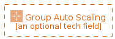

# Group Auto Scaling

```text
aws-20200911/Group/GroupAutoScaling
```

```text
include('aws-20200911/Group/GroupAutoScaling')
```

|group|
|---|
||


## group
### Load remotely
```plantuml
@startuml
' configures the library
!global $LIB_BASE_LOCATION="https://raw.githubusercontent.com/tmorin/plantuml-libs/master/dist"
' loads the library
!include $LIB_BASE_LOCATION/bootstrap.puml
' loads the aws-20200911 bootstrap
include('aws-20200911/bootstrap')
' loads the GroupAutoScaling element
include('aws-20200911/Group/GroupAutoScaling')
GroupAutoScaling('group_auto_scaling', 'Group Auto Scaling', 'an optional tech field')
@enduml
```
### Load locally
```plantuml
@startuml
' configures the library
!global $INCLUSION_MODE="local"
!global $LIB_BASE_LOCATION="../.."
' loads the library
!include $LIB_BASE_LOCATION/bootstrap.puml
' loads the aws-20200911 bootstrap
include('aws-20200911/bootstrap')
' loads the GroupAutoScaling element
include('aws-20200911/Group/GroupAutoScaling')
GroupAutoScaling('group_auto_scaling', 'Group Auto Scaling', 'an optional tech field')
@enduml
```

