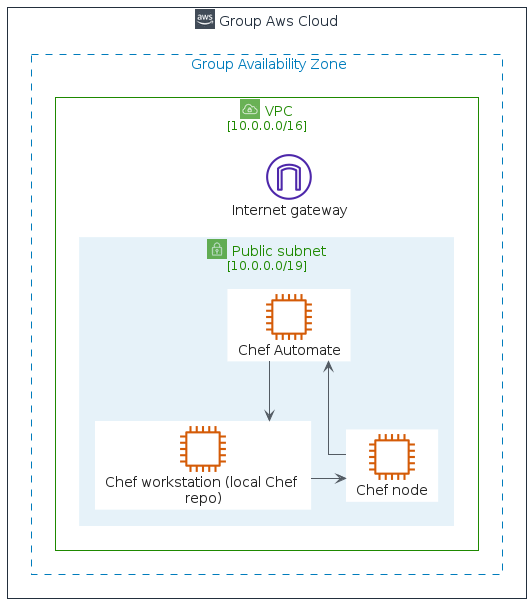
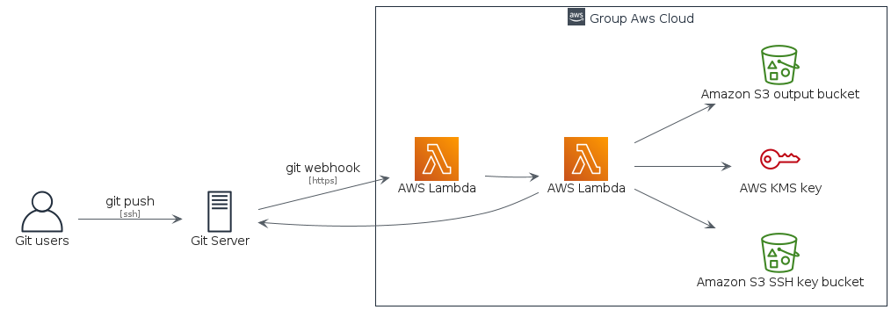

# aws-20200911


## Bootstrap

The package handles its own bootstrap.

```plantuml
' loads the aws-20200911 bootstrap
include('aws-20200911/bootstrap')
```


## Style

The package handles its own style.

The bootstrap loads the style too! ;)

```plantuml
' loads the aws-20200911 style
include('aws-20200911/style')
```


# Modules

The package provides 3 modules.


- [Resource](resource.md) with 300 elements
- [Service](service.md) with 239 elements
- [Group](group.md) with 17 elements

# Examples

The package provides 2 examples.


## chef automate architecture on aws
<br>
[The source file.](../aws-20200911/examples/chef_automate_architecture_on_aws.puml)

## git to s3 webhooks
<br>
[The source file.](../aws-20200911/examples/git_to_s3_webhooks.puml)

