# Resource

The module Resource contains 300 entries.

- [Analytics](#family-analytics)
- [ApplicationIntegration](#family-applicationintegration)
- [Blockchain](#family-blockchain)
- [Compute](#family-compute)
- [Containers](#family-containers)
- [CustomerEngagement](#family-customerengagement)
- [Database](#family-database)
- [DeveloperTools](#family-developertools)
- [GeneralIcons](#family-generalicons)
- [LoT](#family-lot)
- [MachineLearning](#family-machinelearning)
- [ManagementGovernance](#family-managementgovernance)
- [MigrationAndTransfer](#family-migrationandtransfer)
- [Mobile](#family-mobile)
- [NetworkingAndContentDelivery](#family-networkingandcontentdelivery)
- [Robotics](#family-robotics)
- [SecurityIdentityAndCompliance](#family-securityidentityandcompliance)
- [Storage](#family-storage)

## Analytics

| |Name|
|:---:|---|
||[aws-20200911/Resource/Analytics/AwsGlueCrawler](../aws-20200911/Resource/Analytics/AwsGlueCrawler.md)
||[aws-20200911/Resource/Analytics/AwsGlueDataCatalog](../aws-20200911/Resource/Analytics/AwsGlueDataCatalog.md)
||[aws-20200911/Resource/Analytics/AwsLakeFormationDataLake](../aws-20200911/Resource/Analytics/AwsLakeFormationDataLake.md)
||[aws-20200911/Resource/Analytics/CloudSearchSearchDocuments](../aws-20200911/Resource/Analytics/CloudSearchSearchDocuments.md)
||[aws-20200911/Resource/Analytics/EmrCluster](../aws-20200911/Resource/Analytics/EmrCluster.md)
||[aws-20200911/Resource/Analytics/EmrEmrEngine](../aws-20200911/Resource/Analytics/EmrEmrEngine.md)
||[aws-20200911/Resource/Analytics/EmrEmrEngineMapRM3](../aws-20200911/Resource/Analytics/EmrEmrEngineMapRM3.md)
||[aws-20200911/Resource/Analytics/EmrEmrEngineMapRM5](../aws-20200911/Resource/Analytics/EmrEmrEngineMapRM5.md)
||[aws-20200911/Resource/Analytics/EmrEmrEngineMapRM7](../aws-20200911/Resource/Analytics/EmrEmrEngineMapRM7.md)
||[aws-20200911/Resource/Analytics/EmrHdfsCluster](../aws-20200911/Resource/Analytics/EmrHdfsCluster.md)
||[aws-20200911/Resource/Analytics/RedshiftDenseComputeNode](../aws-20200911/Resource/Analytics/RedshiftDenseComputeNode.md)
|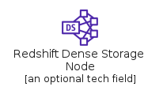|[aws-20200911/Resource/Analytics/RedshiftDenseStorageNode](../aws-20200911/Resource/Analytics/RedshiftDenseStorageNode.md)

## ApplicationIntegration

| |Name|
|:---:|---|
||[aws-20200911/Resource/ApplicationIntegration/EventBridgeCustomEventBus](../aws-20200911/Resource/ApplicationIntegration/EventBridgeCustomEventBus.md)
||[aws-20200911/Resource/ApplicationIntegration/EventBridgeDefaultEventBus](../aws-20200911/Resource/ApplicationIntegration/EventBridgeDefaultEventBus.md)
||[aws-20200911/Resource/ApplicationIntegration/EventBridgeEvent](../aws-20200911/Resource/ApplicationIntegration/EventBridgeEvent.md)
||[aws-20200911/Resource/ApplicationIntegration/EventBridgeRule](../aws-20200911/Resource/ApplicationIntegration/EventBridgeRule.md)
||[aws-20200911/Resource/ApplicationIntegration/EventBridgeSaasPartnerEvent](../aws-20200911/Resource/ApplicationIntegration/EventBridgeSaasPartnerEvent.md)
||[aws-20200911/Resource/ApplicationIntegration/SimpleNotificationServiceEmailNotification](../aws-20200911/Resource/ApplicationIntegration/SimpleNotificationServiceEmailNotification.md)
||[aws-20200911/Resource/ApplicationIntegration/SimpleNotificationServiceHttpNotification](../aws-20200911/Resource/ApplicationIntegration/SimpleNotificationServiceHttpNotification.md)
||[aws-20200911/Resource/ApplicationIntegration/SimpleNotificationServiceTopic](../aws-20200911/Resource/ApplicationIntegration/SimpleNotificationServiceTopic.md)
||[aws-20200911/Resource/ApplicationIntegration/SimpleQueueServiceMessage](../aws-20200911/Resource/ApplicationIntegration/SimpleQueueServiceMessage.md)
||[aws-20200911/Resource/ApplicationIntegration/SimpleQueueServiceQueue](../aws-20200911/Resource/ApplicationIntegration/SimpleQueueServiceQueue.md)

## Blockchain

| |Name|
|:---:|---|
||[aws-20200911/Resource/Blockchain/ManagedBlockchainBlockchain](../aws-20200911/Resource/Blockchain/ManagedBlockchainBlockchain.md)

## Compute

| |Name|
|:---:|---|
||[aws-20200911/Resource/Compute/Ec2A1Instance](../aws-20200911/Resource/Compute/Ec2A1Instance.md)
||[aws-20200911/Resource/Compute/Ec2AmiResource](../aws-20200911/Resource/Compute/Ec2AmiResource.md)
||[aws-20200911/Resource/Compute/Ec2AutoScaling](../aws-20200911/Resource/Compute/Ec2AutoScaling.md)
||[aws-20200911/Resource/Compute/Ec2AwsInferentia](../aws-20200911/Resource/Compute/Ec2AwsInferentia.md)
||[aws-20200911/Resource/Compute/Ec2C4Instance](../aws-20200911/Resource/Compute/Ec2C4Instance.md)
||[aws-20200911/Resource/Compute/Ec2C5Instance](../aws-20200911/Resource/Compute/Ec2C5Instance.md)
||[aws-20200911/Resource/Compute/Ec2C5NInstance](../aws-20200911/Resource/Compute/Ec2C5NInstance.md)
||[aws-20200911/Resource/Compute/Ec2C6GInstance](../aws-20200911/Resource/Compute/Ec2C6GInstance.md)
||[aws-20200911/Resource/Compute/Ec2D2Instance](../aws-20200911/Resource/Compute/Ec2D2Instance.md)
||[aws-20200911/Resource/Compute/Ec2DbInstance](../aws-20200911/Resource/Compute/Ec2DbInstance.md)
||[aws-20200911/Resource/Compute/Ec2ElasticIpAddress](../aws-20200911/Resource/Compute/Ec2ElasticIpAddress.md)
|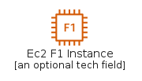|[aws-20200911/Resource/Compute/Ec2F1Instance](../aws-20200911/Resource/Compute/Ec2F1Instance.md)
||[aws-20200911/Resource/Compute/Ec2G3Instance](../aws-20200911/Resource/Compute/Ec2G3Instance.md)
|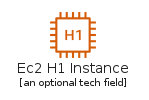|[aws-20200911/Resource/Compute/Ec2H1Instance](../aws-20200911/Resource/Compute/Ec2H1Instance.md)
||[aws-20200911/Resource/Compute/Ec2HmiInstance](../aws-20200911/Resource/Compute/Ec2HmiInstance.md)
|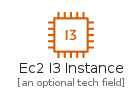|[aws-20200911/Resource/Compute/Ec2I3Instance](../aws-20200911/Resource/Compute/Ec2I3Instance.md)
||[aws-20200911/Resource/Compute/Ec2Instance](../aws-20200911/Resource/Compute/Ec2Instance.md)
||[aws-20200911/Resource/Compute/Ec2Instances](../aws-20200911/Resource/Compute/Ec2Instances.md)
||[aws-20200911/Resource/Compute/Ec2InstanceWithCloudWatch](../aws-20200911/Resource/Compute/Ec2InstanceWithCloudWatch.md)
||[aws-20200911/Resource/Compute/Ec2M4Instance](../aws-20200911/Resource/Compute/Ec2M4Instance.md)
||[aws-20200911/Resource/Compute/Ec2M5AInstance](../aws-20200911/Resource/Compute/Ec2M5AInstance.md)
||[aws-20200911/Resource/Compute/Ec2M5Instance](../aws-20200911/Resource/Compute/Ec2M5Instance.md)
||[aws-20200911/Resource/Compute/Ec2M5NInstance](../aws-20200911/Resource/Compute/Ec2M5NInstance.md)
||[aws-20200911/Resource/Compute/Ec2M6GInstance](../aws-20200911/Resource/Compute/Ec2M6GInstance.md)
||[aws-20200911/Resource/Compute/Ec2P2Instance](../aws-20200911/Resource/Compute/Ec2P2Instance.md)
||[aws-20200911/Resource/Compute/Ec2P3Instance](../aws-20200911/Resource/Compute/Ec2P3Instance.md)
|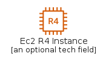|[aws-20200911/Resource/Compute/Ec2R4Instance](../aws-20200911/Resource/Compute/Ec2R4Instance.md)
||[aws-20200911/Resource/Compute/Ec2R5AInstance](../aws-20200911/Resource/Compute/Ec2R5AInstance.md)
||[aws-20200911/Resource/Compute/Ec2R5Instance](../aws-20200911/Resource/Compute/Ec2R5Instance.md)
||[aws-20200911/Resource/Compute/Ec2R5NInstance](../aws-20200911/Resource/Compute/Ec2R5NInstance.md)
||[aws-20200911/Resource/Compute/Ec2R6GInstance](../aws-20200911/Resource/Compute/Ec2R6GInstance.md)
||[aws-20200911/Resource/Compute/Ec2Rescue](../aws-20200911/Resource/Compute/Ec2Rescue.md)
||[aws-20200911/Resource/Compute/Ec2SpotInstance](../aws-20200911/Resource/Compute/Ec2SpotInstance.md)
||[aws-20200911/Resource/Compute/Ec2T2Instance](../aws-20200911/Resource/Compute/Ec2T2Instance.md)
|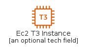|[aws-20200911/Resource/Compute/Ec2T3Instance](../aws-20200911/Resource/Compute/Ec2T3Instance.md)
||[aws-20200911/Resource/Compute/Ec2X1EInstance](../aws-20200911/Resource/Compute/Ec2X1EInstance.md)
||[aws-20200911/Resource/Compute/Ec2X1Instance](../aws-20200911/Resource/Compute/Ec2X1Instance.md)
||[aws-20200911/Resource/Compute/Ec2Z1DInstance](../aws-20200911/Resource/Compute/Ec2Z1DInstance.md)
||[aws-20200911/Resource/Compute/ElasticBeanstalkApplication](../aws-20200911/Resource/Compute/ElasticBeanstalkApplication.md)
||[aws-20200911/Resource/Compute/ElasticBeanstalkDeployment](../aws-20200911/Resource/Compute/ElasticBeanstalkDeployment.md)
||[aws-20200911/Resource/Compute/LambdaLambdaFunction](../aws-20200911/Resource/Compute/LambdaLambdaFunction.md)

## Containers

| |Name|
|:---:|---|
||[aws-20200911/Resource/Containers/ElasticContainerRegistryImage](../aws-20200911/Resource/Containers/ElasticContainerRegistryImage.md)
||[aws-20200911/Resource/Containers/ElasticContainerRegistryRegistry](../aws-20200911/Resource/Containers/ElasticContainerRegistryRegistry.md)
||[aws-20200911/Resource/Containers/ElasticContainerServiceContainer1](../aws-20200911/Resource/Containers/ElasticContainerServiceContainer1.md)
||[aws-20200911/Resource/Containers/ElasticContainerServiceContainer2](../aws-20200911/Resource/Containers/ElasticContainerServiceContainer2.md)
||[aws-20200911/Resource/Containers/ElasticContainerServiceContainer3](../aws-20200911/Resource/Containers/ElasticContainerServiceContainer3.md)
||[aws-20200911/Resource/Containers/ElasticContainerServiceService](../aws-20200911/Resource/Containers/ElasticContainerServiceService.md)
||[aws-20200911/Resource/Containers/ElasticContainerServiceTask](../aws-20200911/Resource/Containers/ElasticContainerServiceTask.md)

## CustomerEngagement

| |Name|
|:---:|---|
||[aws-20200911/Resource/CustomerEngagement/SimpleEmailServiceEmail](../aws-20200911/Resource/CustomerEngagement/SimpleEmailServiceEmail.md)

## Database

| |Name|
|:---:|---|
|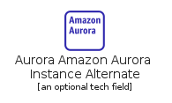|[aws-20200911/Resource/Database/AuroraAmazonAuroraInstanceAlternate](../aws-20200911/Resource/Database/AuroraAmazonAuroraInstanceAlternate.md)
||[aws-20200911/Resource/Database/AuroraAmazonRdsInstance](../aws-20200911/Resource/Database/AuroraAmazonRdsInstance.md)
||[aws-20200911/Resource/Database/AuroraAmazonRdsInstanceAternate](../aws-20200911/Resource/Database/AuroraAmazonRdsInstanceAternate.md)
||[aws-20200911/Resource/Database/AuroraInstance](../aws-20200911/Resource/Database/AuroraInstance.md)
||[aws-20200911/Resource/Database/AuroraMariaDbInstance](../aws-20200911/Resource/Database/AuroraMariaDbInstance.md)
|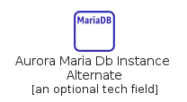|[aws-20200911/Resource/Database/AuroraMariaDbInstanceAlternate](../aws-20200911/Resource/Database/AuroraMariaDbInstanceAlternate.md)
||[aws-20200911/Resource/Database/AuroraMySqlInstance](../aws-20200911/Resource/Database/AuroraMySqlInstance.md)
||[aws-20200911/Resource/Database/AuroraMySqlInstanceAlternate](../aws-20200911/Resource/Database/AuroraMySqlInstanceAlternate.md)
||[aws-20200911/Resource/Database/AuroraOracleInstance](../aws-20200911/Resource/Database/AuroraOracleInstance.md)
||[aws-20200911/Resource/Database/AuroraOracleInstanceAlternate](../aws-20200911/Resource/Database/AuroraOracleInstanceAlternate.md)
||[aws-20200911/Resource/Database/AuroraPiops](../aws-20200911/Resource/Database/AuroraPiops.md)
||[aws-20200911/Resource/Database/AuroraPostgreSqlInstance](../aws-20200911/Resource/Database/AuroraPostgreSqlInstance.md)
|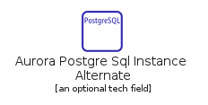|[aws-20200911/Resource/Database/AuroraPostgreSqlInstanceAlternate](../aws-20200911/Resource/Database/AuroraPostgreSqlInstanceAlternate.md)
||[aws-20200911/Resource/Database/AuroraSqlServerInstance](../aws-20200911/Resource/Database/AuroraSqlServerInstance.md)
||[aws-20200911/Resource/Database/AuroraSqlServerInstanceAlternate](../aws-20200911/Resource/Database/AuroraSqlServerInstanceAlternate.md)
|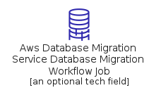|[aws-20200911/Resource/Database/AwsDatabaseMigrationServiceDatabaseMigrationWorkflowJob](../aws-20200911/Resource/Database/AwsDatabaseMigrationServiceDatabaseMigrationWorkflowJob.md)
||[aws-20200911/Resource/Database/DynamoDbAmazonDynamoDbAccelerator](../aws-20200911/Resource/Database/DynamoDbAmazonDynamoDbAccelerator.md)
||[aws-20200911/Resource/Database/DynamoDbAttribute](../aws-20200911/Resource/Database/DynamoDbAttribute.md)
||[aws-20200911/Resource/Database/DynamoDbAttributes](../aws-20200911/Resource/Database/DynamoDbAttributes.md)
||[aws-20200911/Resource/Database/DynamoDbGlobalSecondaryIndex](../aws-20200911/Resource/Database/DynamoDbGlobalSecondaryIndex.md)
||[aws-20200911/Resource/Database/DynamoDbItem](../aws-20200911/Resource/Database/DynamoDbItem.md)
||[aws-20200911/Resource/Database/DynamoDbItems](../aws-20200911/Resource/Database/DynamoDbItems.md)
||[aws-20200911/Resource/Database/DynamoDbTable](../aws-20200911/Resource/Database/DynamoDbTable.md)
|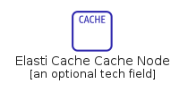|[aws-20200911/Resource/Database/ElastiCacheCacheNode](../aws-20200911/Resource/Database/ElastiCacheCacheNode.md)
||[aws-20200911/Resource/Database/ElastiCacheElastiCacheForMemcached](../aws-20200911/Resource/Database/ElastiCacheElastiCacheForMemcached.md)
||[aws-20200911/Resource/Database/ElastiCacheElastiCacheForRedis](../aws-20200911/Resource/Database/ElastiCacheElastiCacheForRedis.md)
||[aws-20200911/Resource/Database/RdsProxy](../aws-20200911/Resource/Database/RdsProxy.md)
|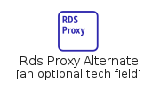|[aws-20200911/Resource/Database/RdsProxyAlternate](../aws-20200911/Resource/Database/RdsProxyAlternate.md)
||[aws-20200911/Resource/Database/RedshiftDenseComputeNode](../aws-20200911/Resource/Database/RedshiftDenseComputeNode.md)
||[aws-20200911/Resource/Database/RedshiftDenseStorageNode](../aws-20200911/Resource/Database/RedshiftDenseStorageNode.md)

## DeveloperTools

| |Name|
|:---:|---|
||[aws-20200911/Resource/DeveloperTools/AwsCloud9Cloud9](../aws-20200911/Resource/DeveloperTools/AwsCloud9Cloud9.md)

## GeneralIcons

| |Name|
|:---:|---|
||[aws-20200911/Resource/GeneralIcons/AwsMarketplace](../aws-20200911/Resource/GeneralIcons/AwsMarketplace.md)
||[aws-20200911/Resource/GeneralIcons/AwsMarketplaceAlrternate](../aws-20200911/Resource/GeneralIcons/AwsMarketplaceAlrternate.md)
||[aws-20200911/Resource/GeneralIcons/Client](../aws-20200911/Resource/GeneralIcons/Client.md)
||[aws-20200911/Resource/GeneralIcons/Disk](../aws-20200911/Resource/GeneralIcons/Disk.md)
||[aws-20200911/Resource/GeneralIcons/Email](../aws-20200911/Resource/GeneralIcons/Email.md)
|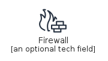|[aws-20200911/Resource/GeneralIcons/Firewall](../aws-20200911/Resource/GeneralIcons/Firewall.md)
||[aws-20200911/Resource/GeneralIcons/Forums](../aws-20200911/Resource/GeneralIcons/Forums.md)
||[aws-20200911/Resource/GeneralIcons/General](../aws-20200911/Resource/GeneralIcons/General.md)
||[aws-20200911/Resource/GeneralIcons/GeneralAlternate](../aws-20200911/Resource/GeneralIcons/GeneralAlternate.md)
||[aws-20200911/Resource/GeneralIcons/GenericDatabase](../aws-20200911/Resource/GeneralIcons/GenericDatabase.md)
|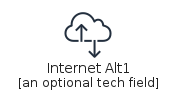|[aws-20200911/Resource/GeneralIcons/InternetAlt1](../aws-20200911/Resource/GeneralIcons/InternetAlt1.md)
||[aws-20200911/Resource/GeneralIcons/InternetAlt2](../aws-20200911/Resource/GeneralIcons/InternetAlt2.md)
||[aws-20200911/Resource/GeneralIcons/InternetGateway](../aws-20200911/Resource/GeneralIcons/InternetGateway.md)
||[aws-20200911/Resource/GeneralIcons/MobileClient](../aws-20200911/Resource/GeneralIcons/MobileClient.md)
||[aws-20200911/Resource/GeneralIcons/Multimedia](../aws-20200911/Resource/GeneralIcons/Multimedia.md)
||[aws-20200911/Resource/GeneralIcons/OfficeBuilding](../aws-20200911/Resource/GeneralIcons/OfficeBuilding.md)
||[aws-20200911/Resource/GeneralIcons/SamlToken](../aws-20200911/Resource/GeneralIcons/SamlToken.md)
||[aws-20200911/Resource/GeneralIcons/Sdk](../aws-20200911/Resource/GeneralIcons/Sdk.md)
||[aws-20200911/Resource/GeneralIcons/SslPadlock](../aws-20200911/Resource/GeneralIcons/SslPadlock.md)
||[aws-20200911/Resource/GeneralIcons/TapeStorage](../aws-20200911/Resource/GeneralIcons/TapeStorage.md)
||[aws-20200911/Resource/GeneralIcons/Toolkit](../aws-20200911/Resource/GeneralIcons/Toolkit.md)
||[aws-20200911/Resource/GeneralIcons/TraditionalServer](../aws-20200911/Resource/GeneralIcons/TraditionalServer.md)
||[aws-20200911/Resource/GeneralIcons/User](../aws-20200911/Resource/GeneralIcons/User.md)
||[aws-20200911/Resource/GeneralIcons/Users](../aws-20200911/Resource/GeneralIcons/Users.md)

## LoT

| |Name|
|:---:|---|
||[aws-20200911/Resource/LoT/AwsIoTAnalyticsChannel](../aws-20200911/Resource/LoT/AwsIoTAnalyticsChannel.md)
||[aws-20200911/Resource/LoT/AwsIoTAnalyticsDataSet](../aws-20200911/Resource/LoT/AwsIoTAnalyticsDataSet.md)
||[aws-20200911/Resource/LoT/AwsIoTAnalyticsDataStore](../aws-20200911/Resource/LoT/AwsIoTAnalyticsDataStore.md)
||[aws-20200911/Resource/LoT/AwsIoTAnalyticsNotebook](../aws-20200911/Resource/LoT/AwsIoTAnalyticsNotebook.md)
||[aws-20200911/Resource/LoT/AwsIoTAnalyticsPipeline](../aws-20200911/Resource/LoT/AwsIoTAnalyticsPipeline.md)
|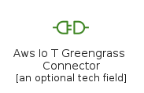|[aws-20200911/Resource/LoT/AwsIoTGreengrassConnector](../aws-20200911/Resource/LoT/AwsIoTGreengrassConnector.md)
||[aws-20200911/Resource/LoT/AwsLoTDeviceDefenderIoTDeviceJobs](../aws-20200911/Resource/LoT/AwsLoTDeviceDefenderIoTDeviceJobs.md)
||[aws-20200911/Resource/LoT/IoTAction](../aws-20200911/Resource/LoT/IoTAction.md)
|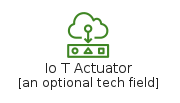|[aws-20200911/Resource/LoT/IoTActuator](../aws-20200911/Resource/LoT/IoTActuator.md)
||[aws-20200911/Resource/LoT/IoTAlexaEnabledDevice](../aws-20200911/Resource/LoT/IoTAlexaEnabledDevice.md)
||[aws-20200911/Resource/LoT/IoTAlexaSkill](../aws-20200911/Resource/LoT/IoTAlexaSkill.md)
||[aws-20200911/Resource/LoT/IoTAlexaVoiceService](../aws-20200911/Resource/LoT/IoTAlexaVoiceService.md)
||[aws-20200911/Resource/LoT/IoTCertificate](../aws-20200911/Resource/LoT/IoTCertificate.md)
||[aws-20200911/Resource/LoT/IoTDesiredState](../aws-20200911/Resource/LoT/IoTDesiredState.md)
||[aws-20200911/Resource/LoT/IoTDeviceGateway](../aws-20200911/Resource/LoT/IoTDeviceGateway.md)
||[aws-20200911/Resource/LoT/IoTEcho](../aws-20200911/Resource/LoT/IoTEcho.md)
||[aws-20200911/Resource/LoT/IoTFireTv](../aws-20200911/Resource/LoT/IoTFireTv.md)
||[aws-20200911/Resource/LoT/IoTFireTvStick](../aws-20200911/Resource/LoT/IoTFireTvStick.md)
||[aws-20200911/Resource/LoT/IoTHardwareBoard](../aws-20200911/Resource/LoT/IoTHardwareBoard.md)
||[aws-20200911/Resource/LoT/IoTHttp2Protocol](../aws-20200911/Resource/LoT/IoTHttp2Protocol.md)
||[aws-20200911/Resource/LoT/IoTHttpProtocol](../aws-20200911/Resource/LoT/IoTHttpProtocol.md)
||[aws-20200911/Resource/LoT/IoTLambdaFunction](../aws-20200911/Resource/LoT/IoTLambdaFunction.md)
||[aws-20200911/Resource/LoT/IoTMqttProtocol](../aws-20200911/Resource/LoT/IoTMqttProtocol.md)
||[aws-20200911/Resource/LoT/IoTOverAirUpdate](../aws-20200911/Resource/LoT/IoTOverAirUpdate.md)
||[aws-20200911/Resource/LoT/IoTPolicy](../aws-20200911/Resource/LoT/IoTPolicy.md)
||[aws-20200911/Resource/LoT/IoTReportedState](../aws-20200911/Resource/LoT/IoTReportedState.md)
|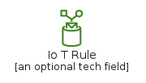|[aws-20200911/Resource/LoT/IoTRule](../aws-20200911/Resource/LoT/IoTRule.md)
||[aws-20200911/Resource/LoT/IoTSensor](../aws-20200911/Resource/LoT/IoTSensor.md)
||[aws-20200911/Resource/LoT/IoTServo](../aws-20200911/Resource/LoT/IoTServo.md)
||[aws-20200911/Resource/LoT/IoTShadow](../aws-20200911/Resource/LoT/IoTShadow.md)
||[aws-20200911/Resource/LoT/IoTSimulator](../aws-20200911/Resource/LoT/IoTSimulator.md)
||[aws-20200911/Resource/LoT/IoTThingBank](../aws-20200911/Resource/LoT/IoTThingBank.md)
||[aws-20200911/Resource/LoT/IoTThingBicycle](../aws-20200911/Resource/LoT/IoTThingBicycle.md)
||[aws-20200911/Resource/LoT/IoTThingbulbLight](../aws-20200911/Resource/LoT/IoTThingbulbLight.md)
||[aws-20200911/Resource/LoT/IoTThingCamera](../aws-20200911/Resource/LoT/IoTThingCamera.md)
||[aws-20200911/Resource/LoT/IoTThingCar](../aws-20200911/Resource/LoT/IoTThingCar.md)
||[aws-20200911/Resource/LoT/IoTThingCart](../aws-20200911/Resource/LoT/IoTThingCart.md)
||[aws-20200911/Resource/LoT/IoTThingCoffeePot](../aws-20200911/Resource/LoT/IoTThingCoffeePot.md)
||[aws-20200911/Resource/LoT/IoTThingDoorLock](../aws-20200911/Resource/LoT/IoTThingDoorLock.md)
||[aws-20200911/Resource/LoT/IoTThingFactory](../aws-20200911/Resource/LoT/IoTThingFactory.md)
||[aws-20200911/Resource/LoT/IoTThingGeneric](../aws-20200911/Resource/LoT/IoTThingGeneric.md)
||[aws-20200911/Resource/LoT/IoTThingHouse](../aws-20200911/Resource/LoT/IoTThingHouse.md)
||[aws-20200911/Resource/LoT/IoTThingMedicalEmergency](../aws-20200911/Resource/LoT/IoTThingMedicalEmergency.md)
||[aws-20200911/Resource/LoT/IoTThingPoliceEmergency](../aws-20200911/Resource/LoT/IoTThingPoliceEmergency.md)
||[aws-20200911/Resource/LoT/IoTThingThermostat](../aws-20200911/Resource/LoT/IoTThingThermostat.md)
||[aws-20200911/Resource/LoT/IoTThingTravel](../aws-20200911/Resource/LoT/IoTThingTravel.md)
||[aws-20200911/Resource/LoT/IoTThingUtility](../aws-20200911/Resource/LoT/IoTThingUtility.md)
||[aws-20200911/Resource/LoT/IoTThingWindfarm](../aws-20200911/Resource/LoT/IoTThingWindfarm.md)
||[aws-20200911/Resource/LoT/IoTTopic](../aws-20200911/Resource/LoT/IoTTopic.md)

## MachineLearning

| |Name|
|:---:|---|
||[aws-20200911/Resource/MachineLearning/RekognitionImage](../aws-20200911/Resource/MachineLearning/RekognitionImage.md)
||[aws-20200911/Resource/MachineLearning/RekognitionVideo](../aws-20200911/Resource/MachineLearning/RekognitionVideo.md)
||[aws-20200911/Resource/MachineLearning/SagemakerModel](../aws-20200911/Resource/MachineLearning/SagemakerModel.md)
||[aws-20200911/Resource/MachineLearning/SagemakerNotebook](../aws-20200911/Resource/MachineLearning/SagemakerNotebook.md)
||[aws-20200911/Resource/MachineLearning/SagemakerTrain](../aws-20200911/Resource/MachineLearning/SagemakerTrain.md)

## ManagementGovernance

| |Name|
|:---:|---|
||[aws-20200911/Resource/ManagementGovernance/AwsCloudFormationChangeSet](../aws-20200911/Resource/ManagementGovernance/AwsCloudFormationChangeSet.md)
||[aws-20200911/Resource/ManagementGovernance/AwsCloudFormationStack](../aws-20200911/Resource/ManagementGovernance/AwsCloudFormationStack.md)
||[aws-20200911/Resource/ManagementGovernance/AwsCloudFormationTemplate](../aws-20200911/Resource/ManagementGovernance/AwsCloudFormationTemplate.md)
||[aws-20200911/Resource/ManagementGovernance/AwsOpsWorksApps](../aws-20200911/Resource/ManagementGovernance/AwsOpsWorksApps.md)
|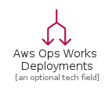|[aws-20200911/Resource/ManagementGovernance/AwsOpsWorksDeployments](../aws-20200911/Resource/ManagementGovernance/AwsOpsWorksDeployments.md)
||[aws-20200911/Resource/ManagementGovernance/AwsOpsWorksInstances](../aws-20200911/Resource/ManagementGovernance/AwsOpsWorksInstances.md)
||[aws-20200911/Resource/ManagementGovernance/AwsOpsWorksLayers](../aws-20200911/Resource/ManagementGovernance/AwsOpsWorksLayers.md)
||[aws-20200911/Resource/ManagementGovernance/AwsOpsWorksMonitoring](../aws-20200911/Resource/ManagementGovernance/AwsOpsWorksMonitoring.md)
||[aws-20200911/Resource/ManagementGovernance/AwsOpsWorksPermissions](../aws-20200911/Resource/ManagementGovernance/AwsOpsWorksPermissions.md)
||[aws-20200911/Resource/ManagementGovernance/AwsOpsWorksResources](../aws-20200911/Resource/ManagementGovernance/AwsOpsWorksResources.md)
|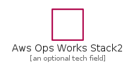|[aws-20200911/Resource/ManagementGovernance/AwsOpsWorksStack2](../aws-20200911/Resource/ManagementGovernance/AwsOpsWorksStack2.md)
||[aws-20200911/Resource/ManagementGovernance/AwsOrganizationsAccount](../aws-20200911/Resource/ManagementGovernance/AwsOrganizationsAccount.md)
||[aws-20200911/Resource/ManagementGovernance/AwsOrganizationsOrganizationalUnit](../aws-20200911/Resource/ManagementGovernance/AwsOrganizationsOrganizationalUnit.md)
||[aws-20200911/Resource/ManagementGovernance/AwsSystemManagerAutomation](../aws-20200911/Resource/ManagementGovernance/AwsSystemManagerAutomation.md)
||[aws-20200911/Resource/ManagementGovernance/AwsSystemManagerDocuments](../aws-20200911/Resource/ManagementGovernance/AwsSystemManagerDocuments.md)
||[aws-20200911/Resource/ManagementGovernance/AwsSystemManagerInventory](../aws-20200911/Resource/ManagementGovernance/AwsSystemManagerInventory.md)
||[aws-20200911/Resource/ManagementGovernance/AwsSystemManagerMaintenanceWindows](../aws-20200911/Resource/ManagementGovernance/AwsSystemManagerMaintenanceWindows.md)
|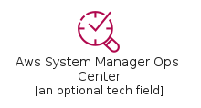|[aws-20200911/Resource/ManagementGovernance/AwsSystemManagerOpsCenter](../aws-20200911/Resource/ManagementGovernance/AwsSystemManagerOpsCenter.md)
||[aws-20200911/Resource/ManagementGovernance/AwsSystemManagerParameterStore](../aws-20200911/Resource/ManagementGovernance/AwsSystemManagerParameterStore.md)
||[aws-20200911/Resource/ManagementGovernance/AwsSystemManagerPatchManager](../aws-20200911/Resource/ManagementGovernance/AwsSystemManagerPatchManager.md)
||[aws-20200911/Resource/ManagementGovernance/AwsSystemManagerRunCommand](../aws-20200911/Resource/ManagementGovernance/AwsSystemManagerRunCommand.md)
||[aws-20200911/Resource/ManagementGovernance/AwsSystemManagerStateManager](../aws-20200911/Resource/ManagementGovernance/AwsSystemManagerStateManager.md)
||[aws-20200911/Resource/ManagementGovernance/AwsTrustedAdvisorChecklist](../aws-20200911/Resource/ManagementGovernance/AwsTrustedAdvisorChecklist.md)
||[aws-20200911/Resource/ManagementGovernance/AwsTrustedAdvisorChecklistCost](../aws-20200911/Resource/ManagementGovernance/AwsTrustedAdvisorChecklistCost.md)
|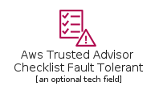|[aws-20200911/Resource/ManagementGovernance/AwsTrustedAdvisorChecklistFaultTolerant](../aws-20200911/Resource/ManagementGovernance/AwsTrustedAdvisorChecklistFaultTolerant.md)
||[aws-20200911/Resource/ManagementGovernance/AwsTrustedAdvisorChecklistPerformance](../aws-20200911/Resource/ManagementGovernance/AwsTrustedAdvisorChecklistPerformance.md)
||[aws-20200911/Resource/ManagementGovernance/AwsTrustedAdvisorChecklistSecurity](../aws-20200911/Resource/ManagementGovernance/AwsTrustedAdvisorChecklistSecurity.md)
||[aws-20200911/Resource/ManagementGovernance/CloudwatchAlarm](../aws-20200911/Resource/ManagementGovernance/CloudwatchAlarm.md)
||[aws-20200911/Resource/ManagementGovernance/CloudwatchEventBased](../aws-20200911/Resource/ManagementGovernance/CloudwatchEventBased.md)
||[aws-20200911/Resource/ManagementGovernance/CloudwatchEventTimeBased](../aws-20200911/Resource/ManagementGovernance/CloudwatchEventTimeBased.md)
||[aws-20200911/Resource/ManagementGovernance/CloudwatchLogs](../aws-20200911/Resource/ManagementGovernance/CloudwatchLogs.md)
||[aws-20200911/Resource/ManagementGovernance/CloudwatchRule](../aws-20200911/Resource/ManagementGovernance/CloudwatchRule.md)

## MigrationAndTransfer

| |Name|
|:---:|---|
|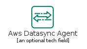|[aws-20200911/Resource/MigrationAndTransfer/AwsDatasyncAgent](../aws-20200911/Resource/MigrationAndTransfer/AwsDatasyncAgent.md)
|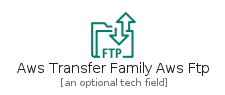|[aws-20200911/Resource/MigrationAndTransfer/AwsTransferFamilyAwsFtp](../aws-20200911/Resource/MigrationAndTransfer/AwsTransferFamilyAwsFtp.md)
|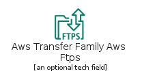|[aws-20200911/Resource/MigrationAndTransfer/AwsTransferFamilyAwsFtps](../aws-20200911/Resource/MigrationAndTransfer/AwsTransferFamilyAwsFtps.md)
||[aws-20200911/Resource/MigrationAndTransfer/AwsTransferFamilyAwsSftp](../aws-20200911/Resource/MigrationAndTransfer/AwsTransferFamilyAwsSftp.md)

## Mobile

| |Name|
|:---:|---|
||[aws-20200911/Resource/Mobile/ApiGatewayEndpoint](../aws-20200911/Resource/Mobile/ApiGatewayEndpoint.md)

## NetworkingAndContentDelivery

| |Name|
|:---:|---|
||[aws-20200911/Resource/NetworkingAndContentDelivery/ApiGatewayEndpoint](../aws-20200911/Resource/NetworkingAndContentDelivery/ApiGatewayEndpoint.md)
||[aws-20200911/Resource/NetworkingAndContentDelivery/AppMeshVirtualGateway](../aws-20200911/Resource/NetworkingAndContentDelivery/AppMeshVirtualGateway.md)
||[aws-20200911/Resource/NetworkingAndContentDelivery/AwsAppMeshMesh](../aws-20200911/Resource/NetworkingAndContentDelivery/AwsAppMeshMesh.md)
||[aws-20200911/Resource/NetworkingAndContentDelivery/AwsAppMeshVirtualNode](../aws-20200911/Resource/NetworkingAndContentDelivery/AwsAppMeshVirtualNode.md)
||[aws-20200911/Resource/NetworkingAndContentDelivery/AwsAppMeshVirtualRouter](../aws-20200911/Resource/NetworkingAndContentDelivery/AwsAppMeshVirtualRouter.md)
||[aws-20200911/Resource/NetworkingAndContentDelivery/AwsAppMeshVirtualService](../aws-20200911/Resource/NetworkingAndContentDelivery/AwsAppMeshVirtualService.md)
||[aws-20200911/Resource/NetworkingAndContentDelivery/AwsCloudMapNamespace](../aws-20200911/Resource/NetworkingAndContentDelivery/AwsCloudMapNamespace.md)
||[aws-20200911/Resource/NetworkingAndContentDelivery/AwsCloudMapResource](../aws-20200911/Resource/NetworkingAndContentDelivery/AwsCloudMapResource.md)
||[aws-20200911/Resource/NetworkingAndContentDelivery/AwsCloudMapService](../aws-20200911/Resource/NetworkingAndContentDelivery/AwsCloudMapService.md)
||[aws-20200911/Resource/NetworkingAndContentDelivery/AwsDirectConnectGateway](../aws-20200911/Resource/NetworkingAndContentDelivery/AwsDirectConnectGateway.md)
||[aws-20200911/Resource/NetworkingAndContentDelivery/CloudFrontDownloadDistribution](../aws-20200911/Resource/NetworkingAndContentDelivery/CloudFrontDownloadDistribution.md)
||[aws-20200911/Resource/NetworkingAndContentDelivery/CloudFrontEdgeLocation](../aws-20200911/Resource/NetworkingAndContentDelivery/CloudFrontEdgeLocation.md)
||[aws-20200911/Resource/NetworkingAndContentDelivery/CloudFrontStreamingDistribution](../aws-20200911/Resource/NetworkingAndContentDelivery/CloudFrontStreamingDistribution.md)
||[aws-20200911/Resource/NetworkingAndContentDelivery/ElasticLoadBalancingApplicationLoadBalancer](../aws-20200911/Resource/NetworkingAndContentDelivery/ElasticLoadBalancingApplicationLoadBalancer.md)
||[aws-20200911/Resource/NetworkingAndContentDelivery/ElasticLoadBalancingClassicLoadBalancer](../aws-20200911/Resource/NetworkingAndContentDelivery/ElasticLoadBalancingClassicLoadBalancer.md)
||[aws-20200911/Resource/NetworkingAndContentDelivery/ElasticLoadBalancingNetworkLoadBalancer](../aws-20200911/Resource/NetworkingAndContentDelivery/ElasticLoadBalancingNetworkLoadBalancer.md)
||[aws-20200911/Resource/NetworkingAndContentDelivery/Route53HostedZone](../aws-20200911/Resource/NetworkingAndContentDelivery/Route53HostedZone.md)
|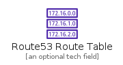|[aws-20200911/Resource/NetworkingAndContentDelivery/Route53RouteTable](../aws-20200911/Resource/NetworkingAndContentDelivery/Route53RouteTable.md)
||[aws-20200911/Resource/NetworkingAndContentDelivery/VpcCustomerGateway](../aws-20200911/Resource/NetworkingAndContentDelivery/VpcCustomerGateway.md)
||[aws-20200911/Resource/NetworkingAndContentDelivery/VpcElasticNetworkAdapter](../aws-20200911/Resource/NetworkingAndContentDelivery/VpcElasticNetworkAdapter.md)
||[aws-20200911/Resource/NetworkingAndContentDelivery/VpcElasticNetworkInterface](../aws-20200911/Resource/NetworkingAndContentDelivery/VpcElasticNetworkInterface.md)
||[aws-20200911/Resource/NetworkingAndContentDelivery/VpcEndpoints](../aws-20200911/Resource/NetworkingAndContentDelivery/VpcEndpoints.md)
||[aws-20200911/Resource/NetworkingAndContentDelivery/VpcFlowLogs](../aws-20200911/Resource/NetworkingAndContentDelivery/VpcFlowLogs.md)
||[aws-20200911/Resource/NetworkingAndContentDelivery/VpcInternetGateway](../aws-20200911/Resource/NetworkingAndContentDelivery/VpcInternetGateway.md)
||[aws-20200911/Resource/NetworkingAndContentDelivery/VpcNatGateway](../aws-20200911/Resource/NetworkingAndContentDelivery/VpcNatGateway.md)
||[aws-20200911/Resource/NetworkingAndContentDelivery/VpcNetworkAccessControlList](../aws-20200911/Resource/NetworkingAndContentDelivery/VpcNetworkAccessControlList.md)
||[aws-20200911/Resource/NetworkingAndContentDelivery/VpcPeeringConnection](../aws-20200911/Resource/NetworkingAndContentDelivery/VpcPeeringConnection.md)
||[aws-20200911/Resource/NetworkingAndContentDelivery/VpcRouter](../aws-20200911/Resource/NetworkingAndContentDelivery/VpcRouter.md)
||[aws-20200911/Resource/NetworkingAndContentDelivery/VpcTrafficMirroring](../aws-20200911/Resource/NetworkingAndContentDelivery/VpcTrafficMirroring.md)
||[aws-20200911/Resource/NetworkingAndContentDelivery/VpcVpnConnection](../aws-20200911/Resource/NetworkingAndContentDelivery/VpcVpnConnection.md)
||[aws-20200911/Resource/NetworkingAndContentDelivery/VpcVpnGateway](../aws-20200911/Resource/NetworkingAndContentDelivery/VpcVpnGateway.md)

## Robotics

| |Name|
|:---:|---|
||[aws-20200911/Resource/Robotics/AwsRoboMakerCloudExtensionsRos](../aws-20200911/Resource/Robotics/AwsRoboMakerCloudExtensionsRos.md)
||[aws-20200911/Resource/Robotics/AwsRoboMakerDevelopmentEnvironment](../aws-20200911/Resource/Robotics/AwsRoboMakerDevelopmentEnvironment.md)
||[aws-20200911/Resource/Robotics/AwsRoboMakerFleetManagement](../aws-20200911/Resource/Robotics/AwsRoboMakerFleetManagement.md)
||[aws-20200911/Resource/Robotics/AwsRoboMakerSimulation](../aws-20200911/Resource/Robotics/AwsRoboMakerSimulation.md)

## SecurityIdentityAndCompliance

| |Name|
|:---:|---|
||[aws-20200911/Resource/SecurityIdentityAndCompliance/AwsCertificateManagerCertificateAuthority](../aws-20200911/Resource/SecurityIdentityAndCompliance/AwsCertificateManagerCertificateAuthority.md)
||[aws-20200911/Resource/SecurityIdentityAndCompliance/AwsDirectoryServiceAdConnector](../aws-20200911/Resource/SecurityIdentityAndCompliance/AwsDirectoryServiceAdConnector.md)
||[aws-20200911/Resource/SecurityIdentityAndCompliance/AwsDirectoryServiceAwsManagedMicrosoftAd](../aws-20200911/Resource/SecurityIdentityAndCompliance/AwsDirectoryServiceAwsManagedMicrosoftAd.md)
||[aws-20200911/Resource/SecurityIdentityAndCompliance/AwsDirectoryServiceSimpleAd](../aws-20200911/Resource/SecurityIdentityAndCompliance/AwsDirectoryServiceSimpleAd.md)
||[aws-20200911/Resource/SecurityIdentityAndCompliance/AwsIdentityAccessManagementAddOn](../aws-20200911/Resource/SecurityIdentityAndCompliance/AwsIdentityAccessManagementAddOn.md)
|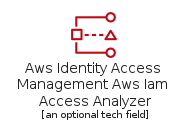|[aws-20200911/Resource/SecurityIdentityAndCompliance/AwsIdentityAccessManagementAwsIamAccessAnalyzer](../aws-20200911/Resource/SecurityIdentityAndCompliance/AwsIdentityAccessManagementAwsIamAccessAnalyzer.md)
||[aws-20200911/Resource/SecurityIdentityAndCompliance/AwsIdentityAccessManagementAwsSts](../aws-20200911/Resource/SecurityIdentityAndCompliance/AwsIdentityAccessManagementAwsSts.md)
|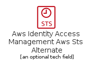|[aws-20200911/Resource/SecurityIdentityAndCompliance/AwsIdentityAccessManagementAwsStsAlternate](../aws-20200911/Resource/SecurityIdentityAndCompliance/AwsIdentityAccessManagementAwsStsAlternate.md)
||[aws-20200911/Resource/SecurityIdentityAndCompliance/AwsIdentityAccessManagementDataEncryptionKey](../aws-20200911/Resource/SecurityIdentityAndCompliance/AwsIdentityAccessManagementDataEncryptionKey.md)
||[aws-20200911/Resource/SecurityIdentityAndCompliance/AwsIdentityAccessManagementEncryptedData](../aws-20200911/Resource/SecurityIdentityAndCompliance/AwsIdentityAccessManagementEncryptedData.md)
||[aws-20200911/Resource/SecurityIdentityAndCompliance/AwsIdentityAccessManagementLongTermSecurityCredential](../aws-20200911/Resource/SecurityIdentityAndCompliance/AwsIdentityAccessManagementLongTermSecurityCredential.md)
||[aws-20200911/Resource/SecurityIdentityAndCompliance/AwsIdentityAccessManagementMfaToken](../aws-20200911/Resource/SecurityIdentityAndCompliance/AwsIdentityAccessManagementMfaToken.md)
||[aws-20200911/Resource/SecurityIdentityAndCompliance/AwsIdentityAccessManagementPermissions](../aws-20200911/Resource/SecurityIdentityAndCompliance/AwsIdentityAccessManagementPermissions.md)
||[aws-20200911/Resource/SecurityIdentityAndCompliance/AwsIdentityAccessManagementRole](../aws-20200911/Resource/SecurityIdentityAndCompliance/AwsIdentityAccessManagementRole.md)
||[aws-20200911/Resource/SecurityIdentityAndCompliance/AwsIdentityAccessManagementTemporarySecurityCredential](../aws-20200911/Resource/SecurityIdentityAndCompliance/AwsIdentityAccessManagementTemporarySecurityCredential.md)
||[aws-20200911/Resource/SecurityIdentityAndCompliance/AwsSecurityHubFinding](../aws-20200911/Resource/SecurityIdentityAndCompliance/AwsSecurityHubFinding.md)
||[aws-20200911/Resource/SecurityIdentityAndCompliance/AwsShieldAwsShieldAdvanced](../aws-20200911/Resource/SecurityIdentityAndCompliance/AwsShieldAwsShieldAdvanced.md)
||[aws-20200911/Resource/SecurityIdentityAndCompliance/AwsWafFilteringRule](../aws-20200911/Resource/SecurityIdentityAndCompliance/AwsWafFilteringRule.md)
||[aws-20200911/Resource/SecurityIdentityAndCompliance/InspectorAgent](../aws-20200911/Resource/SecurityIdentityAndCompliance/InspectorAgent.md)

## Storage

| |Name|
|:---:|---|
||[aws-20200911/Resource/Storage/AwsAmazonSimpleStorageS3Replication](../aws-20200911/Resource/Storage/AwsAmazonSimpleStorageS3Replication.md)
|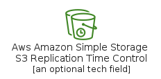|[aws-20200911/Resource/Storage/AwsAmazonSimpleStorageS3ReplicationTimeControl](../aws-20200911/Resource/Storage/AwsAmazonSimpleStorageS3ReplicationTimeControl.md)
||[aws-20200911/Resource/Storage/AwsSnowballSnowballImportExport](../aws-20200911/Resource/Storage/AwsSnowballSnowballImportExport.md)
||[aws-20200911/Resource/Storage/AwsStorageGatewayCachedVolume](../aws-20200911/Resource/Storage/AwsStorageGatewayCachedVolume.md)
||[aws-20200911/Resource/Storage/AwsStorageGatewayFileGateway](../aws-20200911/Resource/Storage/AwsStorageGatewayFileGateway.md)
|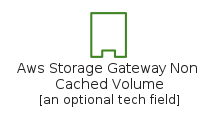|[aws-20200911/Resource/Storage/AwsStorageGatewayNonCachedVolume](../aws-20200911/Resource/Storage/AwsStorageGatewayNonCachedVolume.md)
||[aws-20200911/Resource/Storage/AwsStorageGatewayTapeGateway](../aws-20200911/Resource/Storage/AwsStorageGatewayTapeGateway.md)
||[aws-20200911/Resource/Storage/AwsStorageGatewayVirtualTapeLibrary](../aws-20200911/Resource/Storage/AwsStorageGatewayVirtualTapeLibrary.md)
||[aws-20200911/Resource/Storage/AwsStorageGatewayVolumeGateway](../aws-20200911/Resource/Storage/AwsStorageGatewayVolumeGateway.md)
|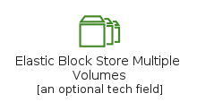|[aws-20200911/Resource/Storage/ElasticBlockStoreMultipleVolumes](../aws-20200911/Resource/Storage/ElasticBlockStoreMultipleVolumes.md)
||[aws-20200911/Resource/Storage/ElasticBlockStoreSnapshot](../aws-20200911/Resource/Storage/ElasticBlockStoreSnapshot.md)
||[aws-20200911/Resource/Storage/ElasticBlockStoreVolume](../aws-20200911/Resource/Storage/ElasticBlockStoreVolume.md)
||[aws-20200911/Resource/Storage/ElasticFileSystemFileSystem](../aws-20200911/Resource/Storage/ElasticFileSystemFileSystem.md)
||[aws-20200911/Resource/Storage/S3GlacierArchive](../aws-20200911/Resource/Storage/S3GlacierArchive.md)
||[aws-20200911/Resource/Storage/S3GlacierVault](../aws-20200911/Resource/Storage/S3GlacierVault.md)
||[aws-20200911/Resource/Storage/SimpleStorageBucket](../aws-20200911/Resource/Storage/SimpleStorageBucket.md)
||[aws-20200911/Resource/Storage/SimpleStorageBucketWithObjects](../aws-20200911/Resource/Storage/SimpleStorageBucketWithObjects.md)
||[aws-20200911/Resource/Storage/SimpleStorageGeneralAccessPoints](../aws-20200911/Resource/Storage/SimpleStorageGeneralAccessPoints.md)
|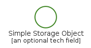|[aws-20200911/Resource/Storage/SimpleStorageObject](../aws-20200911/Resource/Storage/SimpleStorageObject.md)
|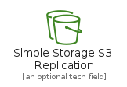|[aws-20200911/Resource/Storage/SimpleStorageS3Replication](../aws-20200911/Resource/Storage/SimpleStorageS3Replication.md)
||[aws-20200911/Resource/Storage/SimpleStorageS3ReplicationTimeControl](../aws-20200911/Resource/Storage/SimpleStorageS3ReplicationTimeControl.md)
|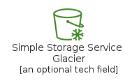|[aws-20200911/Resource/Storage/SimpleStorageServiceGlacier](../aws-20200911/Resource/Storage/SimpleStorageServiceGlacier.md)
||[aws-20200911/Resource/Storage/SimpleStorageServiceGlacierDeepArchive](../aws-20200911/Resource/Storage/SimpleStorageServiceGlacierDeepArchive.md)
||[aws-20200911/Resource/Storage/SimpleStorageServiceIntelligentTiering](../aws-20200911/Resource/Storage/SimpleStorageServiceIntelligentTiering.md)
||[aws-20200911/Resource/Storage/SimpleStorageServiceOneZoneIa](../aws-20200911/Resource/Storage/SimpleStorageServiceOneZoneIa.md)
|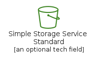|[aws-20200911/Resource/Storage/SimpleStorageServiceStandard](../aws-20200911/Resource/Storage/SimpleStorageServiceStandard.md)
||[aws-20200911/Resource/Storage/SimpleStorageServiceStandardIa](../aws-20200911/Resource/Storage/SimpleStorageServiceStandardIa.md)
||[aws-20200911/Resource/Storage/SimpleStorageVpcAccessPoints](../aws-20200911/Resource/Storage/SimpleStorageVpcAccessPoints.md)

