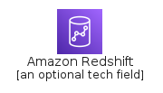
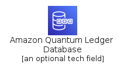
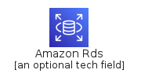
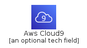

# Service

The module Service contains 239 entries.

- [Analytics](#family-analytics)
- [AppIntegration](#family-appintegration)
- [ArVr](#family-arvr)
- [Blockchain](#family-blockchain)
- [BusinessApplication](#family-businessapplication)
- [Compute](#family-compute)
- [Containers](#family-containers)
- [CostManagement](#family-costmanagement)
- [CustomerEnablement](#family-customerenablement)
- [CustomerEnagagement](#family-customerenagagement)
- [Database](#family-database)
- [DeveloperTools](#family-developertools)
- [EndUserComputing](#family-endusercomputing)
- [GameTech](#family-gametech)
- [InternetOfThings](#family-internetofthings)
- [MachineLearning](#family-machinelearning)
- [ManagementGovernance](#family-managementgovernance)
- [MediaServices](#family-mediaservices)
- [MigrationTransfer](#family-migrationtransfer)
- [Mobile](#family-mobile)
- [NetworkingContent](#family-networkingcontent)
- [QuantumTechnologies](#family-quantumtechnologies)
- [Robotics](#family-robotics)
- [Satellite](#family-satellite)
- [SecurityIdentityCompliance](#family-securityidentitycompliance)
- [Storage](#family-storage)

## Analytics

| |Name|
|:---:|---|
||[aws-20200911/Service/Analytics/AmazonAthena](../aws-20200911/Service/Analytics/AmazonAthena.md)
||[aws-20200911/Service/Analytics/AmazonCloudSearch](../aws-20200911/Service/Analytics/AmazonCloudSearch.md)
||[aws-20200911/Service/Analytics/AmazonElasticsearchService](../aws-20200911/Service/Analytics/AmazonElasticsearchService.md)
||[aws-20200911/Service/Analytics/AmazonEmr](../aws-20200911/Service/Analytics/AmazonEmr.md)
||[aws-20200911/Service/Analytics/AmazonKinesis](../aws-20200911/Service/Analytics/AmazonKinesis.md)
||[aws-20200911/Service/Analytics/AmazonKinesisDataAnalytics](../aws-20200911/Service/Analytics/AmazonKinesisDataAnalytics.md)
||[aws-20200911/Service/Analytics/AmazonKinesisDataStreams](../aws-20200911/Service/Analytics/AmazonKinesisDataStreams.md)
||[aws-20200911/Service/Analytics/AmazonKinesisFirehose](../aws-20200911/Service/Analytics/AmazonKinesisFirehose.md)
||[aws-20200911/Service/Analytics/AmazonKinesisVideoStreams](../aws-20200911/Service/Analytics/AmazonKinesisVideoStreams.md)
||[aws-20200911/Service/Analytics/AmazonManagedStreamingForKafka](../aws-20200911/Service/Analytics/AmazonManagedStreamingForKafka.md)
||[aws-20200911/Service/Analytics/AmazonQuickSight](../aws-20200911/Service/Analytics/AmazonQuickSight.md)
||[aws-20200911/Service/Analytics/AmazonRedshift](../aws-20200911/Service/Analytics/AmazonRedshift.md)
||[aws-20200911/Service/Analytics/AwsDataExchange](../aws-20200911/Service/Analytics/AwsDataExchange.md)
||[aws-20200911/Service/Analytics/AwsDataPipeline](../aws-20200911/Service/Analytics/AwsDataPipeline.md)
||[aws-20200911/Service/Analytics/AwsGlue](../aws-20200911/Service/Analytics/AwsGlue.md)
||[aws-20200911/Service/Analytics/AwsLakeFormation](../aws-20200911/Service/Analytics/AwsLakeFormation.md)

## AppIntegration

| |Name|
|:---:|---|
||[aws-20200911/Service/AppIntegration/AmazonEventBridge](../aws-20200911/Service/AppIntegration/AmazonEventBridge.md)
||[aws-20200911/Service/AppIntegration/AmazonMq](../aws-20200911/Service/AppIntegration/AmazonMq.md)
||[aws-20200911/Service/AppIntegration/AwsAppFlow](../aws-20200911/Service/AppIntegration/AwsAppFlow.md)
||[aws-20200911/Service/AppIntegration/AwsAppSync](../aws-20200911/Service/AppIntegration/AwsAppSync.md)
||[aws-20200911/Service/AppIntegration/AwsConsoleMobileApplication](../aws-20200911/Service/AppIntegration/AwsConsoleMobileApplication.md)
||[aws-20200911/Service/AppIntegration/AwsExpressWorkflow](../aws-20200911/Service/AppIntegration/AwsExpressWorkflow.md)
||[aws-20200911/Service/AppIntegration/AwsSimpleNotificationService](../aws-20200911/Service/AppIntegration/AwsSimpleNotificationService.md)
||[aws-20200911/Service/AppIntegration/AwsSimpleQueueService](../aws-20200911/Service/AppIntegration/AwsSimpleQueueService.md)
||[aws-20200911/Service/AppIntegration/AwsStepFunctions](../aws-20200911/Service/AppIntegration/AwsStepFunctions.md)

## ArVr

| |Name|
|:---:|---|
||[aws-20200911/Service/ArVr/AwsSumerian](../aws-20200911/Service/ArVr/AwsSumerian.md)

## Blockchain

| |Name|
|:---:|---|
||[aws-20200911/Service/Blockchain/AmazonManagedBlockchain](../aws-20200911/Service/Blockchain/AmazonManagedBlockchain.md)
||[aws-20200911/Service/Blockchain/AmazonQuantumLedgerDatabase](../aws-20200911/Service/Blockchain/AmazonQuantumLedgerDatabase.md)

## BusinessApplication

| |Name|
|:---:|---|
||[aws-20200911/Service/BusinessApplication/AlexaForBusiness](../aws-20200911/Service/BusinessApplication/AlexaForBusiness.md)
||[aws-20200911/Service/BusinessApplication/AmazonChime](../aws-20200911/Service/BusinessApplication/AmazonChime.md)
||[aws-20200911/Service/BusinessApplication/AmazonWorkDocs](../aws-20200911/Service/BusinessApplication/AmazonWorkDocs.md)
||[aws-20200911/Service/BusinessApplication/AmazonWorkMail](../aws-20200911/Service/BusinessApplication/AmazonWorkMail.md)

## Compute

| |Name|
|:---:|---|
||[aws-20200911/Service/Compute/AmazonEc2](../aws-20200911/Service/Compute/AmazonEc2.md)
||[aws-20200911/Service/Compute/AmazonEc2AutoScaling](../aws-20200911/Service/Compute/AmazonEc2AutoScaling.md)
||[aws-20200911/Service/Compute/AmazonEc2M5N](../aws-20200911/Service/Compute/AmazonEc2M5N.md)
||[aws-20200911/Service/Compute/AmazonEc2R5N](../aws-20200911/Service/Compute/AmazonEc2R5N.md)
||[aws-20200911/Service/Compute/AmazonElasticContainerKubernetes](../aws-20200911/Service/Compute/AmazonElasticContainerKubernetes.md)
||[aws-20200911/Service/Compute/AmazonElasticContainerRegistry](../aws-20200911/Service/Compute/AmazonElasticContainerRegistry.md)
||[aws-20200911/Service/Compute/AmazonElasticContainerService](../aws-20200911/Service/Compute/AmazonElasticContainerService.md)
||[aws-20200911/Service/Compute/AmazonLightsail](../aws-20200911/Service/Compute/AmazonLightsail.md)
||[aws-20200911/Service/Compute/AwsBatch](../aws-20200911/Service/Compute/AwsBatch.md)
||[aws-20200911/Service/Compute/AwsBottlerocket](../aws-20200911/Service/Compute/AwsBottlerocket.md)
||[aws-20200911/Service/Compute/AwsComputeOptimizer](../aws-20200911/Service/Compute/AwsComputeOptimizer.md)
||[aws-20200911/Service/Compute/AwsEc2ImageBuilder](../aws-20200911/Service/Compute/AwsEc2ImageBuilder.md)
||[aws-20200911/Service/Compute/AwsElasticBeanstalk](../aws-20200911/Service/Compute/AwsElasticBeanstalk.md)
||[aws-20200911/Service/Compute/AwsFargate](../aws-20200911/Service/Compute/AwsFargate.md)
||[aws-20200911/Service/Compute/AwsLambda](../aws-20200911/Service/Compute/AwsLambda.md)
||[aws-20200911/Service/Compute/AwsLocalZones](../aws-20200911/Service/Compute/AwsLocalZones.md)
||[aws-20200911/Service/Compute/AwsNitroEnclaves](../aws-20200911/Service/Compute/AwsNitroEnclaves.md)
||[aws-20200911/Service/Compute/AwsOutposts](../aws-20200911/Service/Compute/AwsOutposts.md)
||[aws-20200911/Service/Compute/AwsParallelCluster](../aws-20200911/Service/Compute/AwsParallelCluster.md)
||[aws-20200911/Service/Compute/AwsServerlessApplicationRepository](../aws-20200911/Service/Compute/AwsServerlessApplicationRepository.md)
||[aws-20200911/Service/Compute/AwsThinkBoxDeadline](../aws-20200911/Service/Compute/AwsThinkBoxDeadline.md)
||[aws-20200911/Service/Compute/AwsThinkBoxFrost](../aws-20200911/Service/Compute/AwsThinkBoxFrost.md)
||[aws-20200911/Service/Compute/AwsThinkBoxKrakatoa](../aws-20200911/Service/Compute/AwsThinkBoxKrakatoa.md)
||[aws-20200911/Service/Compute/AwsThinkBoxSequoia](../aws-20200911/Service/Compute/AwsThinkBoxSequoia.md)
||[aws-20200911/Service/Compute/AwsThinkBoxStoke](../aws-20200911/Service/Compute/AwsThinkBoxStoke.md)
||[aws-20200911/Service/Compute/AwsThinkBoxXMesh](../aws-20200911/Service/Compute/AwsThinkBoxXMesh.md)
||[aws-20200911/Service/Compute/AwsWavelength](../aws-20200911/Service/Compute/AwsWavelength.md)
||[aws-20200911/Service/Compute/VMwareCloudOnAws](../aws-20200911/Service/Compute/VMwareCloudOnAws.md)

## Containers

| |Name|
|:---:|---|
||[aws-20200911/Service/Containers/AmazonElasticContainerKubernetes](../aws-20200911/Service/Containers/AmazonElasticContainerKubernetes.md)
||[aws-20200911/Service/Containers/AmazonElasticContainerRegistry](../aws-20200911/Service/Containers/AmazonElasticContainerRegistry.md)
||[aws-20200911/Service/Containers/AmazonElasticContainerService](../aws-20200911/Service/Containers/AmazonElasticContainerService.md)
||[aws-20200911/Service/Containers/AwsFargate](../aws-20200911/Service/Containers/AwsFargate.md)

## CostManagement

| |Name|
|:---:|---|
||[aws-20200911/Service/CostManagement/AwsBudgets](../aws-20200911/Service/CostManagement/AwsBudgets.md)
||[aws-20200911/Service/CostManagement/AwsCostAndUsageReport](../aws-20200911/Service/CostManagement/AwsCostAndUsageReport.md)
||[aws-20200911/Service/CostManagement/AwsCostExplorer](../aws-20200911/Service/CostManagement/AwsCostExplorer.md)
||[aws-20200911/Service/CostManagement/ReservedInstanceReporting](../aws-20200911/Service/CostManagement/ReservedInstanceReporting.md)
||[aws-20200911/Service/CostManagement/SavingsPlans](../aws-20200911/Service/CostManagement/SavingsPlans.md)

## CustomerEnablement

| |Name|
|:---:|---|
||[aws-20200911/Service/CustomerEnablement/AwsIq](../aws-20200911/Service/CustomerEnablement/AwsIq.md)
||[aws-20200911/Service/CustomerEnablement/AwsManagedServices](../aws-20200911/Service/CustomerEnablement/AwsManagedServices.md)
||[aws-20200911/Service/CustomerEnablement/AwsProfessionalServices](../aws-20200911/Service/CustomerEnablement/AwsProfessionalServices.md)
||[aws-20200911/Service/CustomerEnablement/AwsSupport](../aws-20200911/Service/CustomerEnablement/AwsSupport.md)
||[aws-20200911/Service/CustomerEnablement/AwsTrainingCertification](../aws-20200911/Service/CustomerEnablement/AwsTrainingCertification.md)

## CustomerEnagagement

| |Name|
|:---:|---|
||[aws-20200911/Service/CustomerEnagagement/AmazonConnect](../aws-20200911/Service/CustomerEnagagement/AmazonConnect.md)
||[aws-20200911/Service/CustomerEnagagement/AmazonPinpoint](../aws-20200911/Service/CustomerEnagagement/AmazonPinpoint.md)
||[aws-20200911/Service/CustomerEnagagement/AwsSimpleEmailService](../aws-20200911/Service/CustomerEnagagement/AwsSimpleEmailService.md)

## Database

| |Name|
|:---:|---|
||[aws-20200911/Service/Database/AmazonAurora](../aws-20200911/Service/Database/AmazonAurora.md)
||[aws-20200911/Service/Database/AmazonDocumentDb](../aws-20200911/Service/Database/AmazonDocumentDb.md)
||[aws-20200911/Service/Database/AmazonDynamoDb](../aws-20200911/Service/Database/AmazonDynamoDb.md)
||[aws-20200911/Service/Database/AmazonElastiCache](../aws-20200911/Service/Database/AmazonElastiCache.md)
||[aws-20200911/Service/Database/AmazonKeyspaces](../aws-20200911/Service/Database/AmazonKeyspaces.md)
||[aws-20200911/Service/Database/AmazonNeptune](../aws-20200911/Service/Database/AmazonNeptune.md)
||[aws-20200911/Service/Database/AmazonQuantumLedgerDatabase](../aws-20200911/Service/Database/AmazonQuantumLedgerDatabase.md)
||[aws-20200911/Service/Database/AmazonRds](../aws-20200911/Service/Database/AmazonRds.md)
||[aws-20200911/Service/Database/AmazonRdsForVMware](../aws-20200911/Service/Database/AmazonRdsForVMware.md)
||[aws-20200911/Service/Database/AmazonRedshift](../aws-20200911/Service/Database/AmazonRedshift.md)
||[aws-20200911/Service/Database/AmazonTimestream](../aws-20200911/Service/Database/AmazonTimestream.md)
||[aws-20200911/Service/Database/AwsDatabaseMigration](../aws-20200911/Service/Database/AwsDatabaseMigration.md)

## DeveloperTools

| |Name|
|:---:|---|
||[aws-20200911/Service/DeveloperTools/AmazonCodeBuild](../aws-20200911/Service/DeveloperTools/AmazonCodeBuild.md)
||[aws-20200911/Service/DeveloperTools/AmazonCodestar](../aws-20200911/Service/DeveloperTools/AmazonCodestar.md)
||[aws-20200911/Service/DeveloperTools/AwsCloud9](../aws-20200911/Service/DeveloperTools/AwsCloud9.md)
||[aws-20200911/Service/DeveloperTools/AwsCloudDevelopmentKit](../aws-20200911/Service/DeveloperTools/AwsCloudDevelopmentKit.md)
||[aws-20200911/Service/DeveloperTools/AwsCodeArtifact](../aws-20200911/Service/DeveloperTools/AwsCodeArtifact.md)
||[aws-20200911/Service/DeveloperTools/AwsCodeCommit](../aws-20200911/Service/DeveloperTools/AwsCodeCommit.md)
||[aws-20200911/Service/DeveloperTools/AwsCodeDeploy](../aws-20200911/Service/DeveloperTools/AwsCodeDeploy.md)
||[aws-20200911/Service/DeveloperTools/AwsCodePipeline](../aws-20200911/Service/DeveloperTools/AwsCodePipeline.md)
||[aws-20200911/Service/DeveloperTools/AwsCommandLineInterface](../aws-20200911/Service/DeveloperTools/AwsCommandLineInterface.md)
||[aws-20200911/Service/DeveloperTools/AwsToolsAndSdk](../aws-20200911/Service/DeveloperTools/AwsToolsAndSdk.md)
||[aws-20200911/Service/DeveloperTools/AwsXRay](../aws-20200911/Service/DeveloperTools/AwsXRay.md)

## EndUserComputing

| |Name|
|:---:|---|
||[aws-20200911/Service/EndUserComputing/AmazonAppStream](../aws-20200911/Service/EndUserComputing/AmazonAppStream.md)
||[aws-20200911/Service/EndUserComputing/AmazonWorkDocs](../aws-20200911/Service/EndUserComputing/AmazonWorkDocs.md)
||[aws-20200911/Service/EndUserComputing/AwsWorkLink](../aws-20200911/Service/EndUserComputing/AwsWorkLink.md)
||[aws-20200911/Service/EndUserComputing/AwsWorkSpaces](../aws-20200911/Service/EndUserComputing/AwsWorkSpaces.md)

## GameTech

| |Name|
|:---:|---|
||[aws-20200911/Service/GameTech/AmazonGameLift](../aws-20200911/Service/GameTech/AmazonGameLift.md)

## InternetOfThings

| |Name|
|:---:|---|
||[aws-20200911/Service/InternetOfThings/AmazonFreeRtos](../aws-20200911/Service/InternetOfThings/AmazonFreeRtos.md)
||[aws-20200911/Service/InternetOfThings/AwsIoT1Click](../aws-20200911/Service/InternetOfThings/AwsIoT1Click.md)
||[aws-20200911/Service/InternetOfThings/AwsIoTAnalytics](../aws-20200911/Service/InternetOfThings/AwsIoTAnalytics.md)
||[aws-20200911/Service/InternetOfThings/AwsIoTButton](../aws-20200911/Service/InternetOfThings/AwsIoTButton.md)
||[aws-20200911/Service/InternetOfThings/AwsIoTCore](../aws-20200911/Service/InternetOfThings/AwsIoTCore.md)
||[aws-20200911/Service/InternetOfThings/AwsIoTDeviceDefender](../aws-20200911/Service/InternetOfThings/AwsIoTDeviceDefender.md)
||[aws-20200911/Service/InternetOfThings/AwsIoTDeviceManagement](../aws-20200911/Service/InternetOfThings/AwsIoTDeviceManagement.md)
||[aws-20200911/Service/InternetOfThings/AwsIoTEvents](../aws-20200911/Service/InternetOfThings/AwsIoTEvents.md)
||[aws-20200911/Service/InternetOfThings/AwsIoTGreengrassCore](../aws-20200911/Service/InternetOfThings/AwsIoTGreengrassCore.md)
||[aws-20200911/Service/InternetOfThings/AwsIoTSiteWise](../aws-20200911/Service/InternetOfThings/AwsIoTSiteWise.md)
||[aws-20200911/Service/InternetOfThings/AwsIoTThingsGraph](../aws-20200911/Service/InternetOfThings/AwsIoTThingsGraph.md)

## MachineLearning

| |Name|
|:---:|---|
||[aws-20200911/Service/MachineLearning/AmazonAugmentedAiA2I](../aws-20200911/Service/MachineLearning/AmazonAugmentedAiA2I.md)
||[aws-20200911/Service/MachineLearning/AmazonCodeGuru](../aws-20200911/Service/MachineLearning/AmazonCodeGuru.md)
||[aws-20200911/Service/MachineLearning/AmazonComprehend](../aws-20200911/Service/MachineLearning/AmazonComprehend.md)
||[aws-20200911/Service/MachineLearning/AmazonElasticInference](../aws-20200911/Service/MachineLearning/AmazonElasticInference.md)
||[aws-20200911/Service/MachineLearning/AmazonForecast](../aws-20200911/Service/MachineLearning/AmazonForecast.md)
||[aws-20200911/Service/MachineLearning/AmazonFraudDetector](../aws-20200911/Service/MachineLearning/AmazonFraudDetector.md)
||[aws-20200911/Service/MachineLearning/AmazonKendra](../aws-20200911/Service/MachineLearning/AmazonKendra.md)
||[aws-20200911/Service/MachineLearning/AmazonLex](../aws-20200911/Service/MachineLearning/AmazonLex.md)
||[aws-20200911/Service/MachineLearning/AmazonNeuronMlSdk](../aws-20200911/Service/MachineLearning/AmazonNeuronMlSdk.md)
||[aws-20200911/Service/MachineLearning/AmazonPersonalize](../aws-20200911/Service/MachineLearning/AmazonPersonalize.md)
||[aws-20200911/Service/MachineLearning/AmazonPolly](../aws-20200911/Service/MachineLearning/AmazonPolly.md)
||[aws-20200911/Service/MachineLearning/AmazonRekognition](../aws-20200911/Service/MachineLearning/AmazonRekognition.md)
||[aws-20200911/Service/MachineLearning/AmazonTranscribe](../aws-20200911/Service/MachineLearning/AmazonTranscribe.md)
||[aws-20200911/Service/MachineLearning/AmazonTranslate](../aws-20200911/Service/MachineLearning/AmazonTranslate.md)
||[aws-20200911/Service/MachineLearning/AwsApacheMxNet](../aws-20200911/Service/MachineLearning/AwsApacheMxNet.md)
||[aws-20200911/Service/MachineLearning/AwsDeepComposer](../aws-20200911/Service/MachineLearning/AwsDeepComposer.md)
||[aws-20200911/Service/MachineLearning/AwsDeepLearningAmIs](../aws-20200911/Service/MachineLearning/AwsDeepLearningAmIs.md)
||[aws-20200911/Service/MachineLearning/AwsDeepLearningContainers](../aws-20200911/Service/MachineLearning/AwsDeepLearningContainers.md)
||[aws-20200911/Service/MachineLearning/AwsDeepLense](../aws-20200911/Service/MachineLearning/AwsDeepLense.md)
||[aws-20200911/Service/MachineLearning/AwsDeepracer](../aws-20200911/Service/MachineLearning/AwsDeepracer.md)
||[aws-20200911/Service/MachineLearning/AwsSageMaker](../aws-20200911/Service/MachineLearning/AwsSageMaker.md)
||[aws-20200911/Service/MachineLearning/AwsSageMakerGroundTruth](../aws-20200911/Service/MachineLearning/AwsSageMakerGroundTruth.md)
||[aws-20200911/Service/MachineLearning/AwsTensorFlowOnAws](../aws-20200911/Service/MachineLearning/AwsTensorFlowOnAws.md)
||[aws-20200911/Service/MachineLearning/AwsTextract](../aws-20200911/Service/MachineLearning/AwsTextract.md)
||[aws-20200911/Service/MachineLearning/TorchServe](../aws-20200911/Service/MachineLearning/TorchServe.md)

## ManagementGovernance

| |Name|
|:---:|---|
||[aws-20200911/Service/ManagementGovernance/AmazonCloudWatch](../aws-20200911/Service/ManagementGovernance/AmazonCloudWatch.md)
||[aws-20200911/Service/ManagementGovernance/ApplicationAutoScaling](../aws-20200911/Service/ManagementGovernance/ApplicationAutoScaling.md)
||[aws-20200911/Service/ManagementGovernance/AwsAppConfig](../aws-20200911/Service/ManagementGovernance/AwsAppConfig.md)
||[aws-20200911/Service/ManagementGovernance/AwsAppWizard](../aws-20200911/Service/ManagementGovernance/AwsAppWizard.md)
||[aws-20200911/Service/ManagementGovernance/AwsAutoScaling](../aws-20200911/Service/ManagementGovernance/AwsAutoScaling.md)
||[aws-20200911/Service/ManagementGovernance/AwsBackintAgent](../aws-20200911/Service/ManagementGovernance/AwsBackintAgent.md)
||[aws-20200911/Service/ManagementGovernance/AwsChatbot](../aws-20200911/Service/ManagementGovernance/AwsChatbot.md)
||[aws-20200911/Service/ManagementGovernance/AwsCloudFormation](../aws-20200911/Service/ManagementGovernance/AwsCloudFormation.md)
||[aws-20200911/Service/ManagementGovernance/AwsCloudTrail](../aws-20200911/Service/ManagementGovernance/AwsCloudTrail.md)
||[aws-20200911/Service/ManagementGovernance/AwsCommandLineInterface](../aws-20200911/Service/ManagementGovernance/AwsCommandLineInterface.md)
||[aws-20200911/Service/ManagementGovernance/AwsComputeOptimizer](../aws-20200911/Service/ManagementGovernance/AwsComputeOptimizer.md)
||[aws-20200911/Service/ManagementGovernance/AwsConfig](../aws-20200911/Service/ManagementGovernance/AwsConfig.md)
||[aws-20200911/Service/ManagementGovernance/AwsControlTower](../aws-20200911/Service/ManagementGovernance/AwsControlTower.md)
||[aws-20200911/Service/ManagementGovernance/AwsLicenseManager](../aws-20200911/Service/ManagementGovernance/AwsLicenseManager.md)
||[aws-20200911/Service/ManagementGovernance/AwsManagedServices](../aws-20200911/Service/ManagementGovernance/AwsManagedServices.md)
||[aws-20200911/Service/ManagementGovernance/AwsManagementConsole](../aws-20200911/Service/ManagementGovernance/AwsManagementConsole.md)
||[aws-20200911/Service/ManagementGovernance/AwsOpsWorks](../aws-20200911/Service/ManagementGovernance/AwsOpsWorks.md)
||[aws-20200911/Service/ManagementGovernance/AwsOrganizations](../aws-20200911/Service/ManagementGovernance/AwsOrganizations.md)
||[aws-20200911/Service/ManagementGovernance/AwsPersonalHealthDashboard](../aws-20200911/Service/ManagementGovernance/AwsPersonalHealthDashboard.md)
||[aws-20200911/Service/ManagementGovernance/AwsServiceCatalog](../aws-20200911/Service/ManagementGovernance/AwsServiceCatalog.md)
||[aws-20200911/Service/ManagementGovernance/AwsSystemsManager](../aws-20200911/Service/ManagementGovernance/AwsSystemsManager.md)
||[aws-20200911/Service/ManagementGovernance/AwsTrustedAdvisor](../aws-20200911/Service/ManagementGovernance/AwsTrustedAdvisor.md)
||[aws-20200911/Service/ManagementGovernance/AwsWellArchitectTool](../aws-20200911/Service/ManagementGovernance/AwsWellArchitectTool.md)

## MediaServices

| |Name|
|:---:|---|
||[aws-20200911/Service/MediaServices/AmazonElasticTranscoder](../aws-20200911/Service/MediaServices/AmazonElasticTranscoder.md)
||[aws-20200911/Service/MediaServices/AmazonInteractiveVideo](../aws-20200911/Service/MediaServices/AmazonInteractiveVideo.md)
||[aws-20200911/Service/MediaServices/AmazonKinesisVideoStreams](../aws-20200911/Service/MediaServices/AmazonKinesisVideoStreams.md)
||[aws-20200911/Service/MediaServices/AwsElementalAppliancesSoftware](../aws-20200911/Service/MediaServices/AwsElementalAppliancesSoftware.md)
||[aws-20200911/Service/MediaServices/AwsElementalLink](../aws-20200911/Service/MediaServices/AwsElementalLink.md)
||[aws-20200911/Service/MediaServices/AwsElementalMediaConnect](../aws-20200911/Service/MediaServices/AwsElementalMediaConnect.md)
||[aws-20200911/Service/MediaServices/AwsElementalMediaConvert](../aws-20200911/Service/MediaServices/AwsElementalMediaConvert.md)
||[aws-20200911/Service/MediaServices/AwsElementalMediaLive](../aws-20200911/Service/MediaServices/AwsElementalMediaLive.md)
||[aws-20200911/Service/MediaServices/AwsElementalMediaPackage](../aws-20200911/Service/MediaServices/AwsElementalMediaPackage.md)
||[aws-20200911/Service/MediaServices/AwsElementalMediaStore](../aws-20200911/Service/MediaServices/AwsElementalMediaStore.md)
||[aws-20200911/Service/MediaServices/AwsElementalMediaTailor](../aws-20200911/Service/MediaServices/AwsElementalMediaTailor.md)

## MigrationTransfer

| |Name|
|:---:|---|
||[aws-20200911/Service/MigrationTransfer/AwsApplicationDiscoveryService](../aws-20200911/Service/MigrationTransfer/AwsApplicationDiscoveryService.md)
||[aws-20200911/Service/MigrationTransfer/AwsCloudEndureMigration](../aws-20200911/Service/MigrationTransfer/AwsCloudEndureMigration.md)
||[aws-20200911/Service/MigrationTransfer/AwsDatabaseMigration](../aws-20200911/Service/MigrationTransfer/AwsDatabaseMigration.md)
||[aws-20200911/Service/MigrationTransfer/AwsDataSync](../aws-20200911/Service/MigrationTransfer/AwsDataSync.md)
||[aws-20200911/Service/MigrationTransfer/AwsMigrationHub](../aws-20200911/Service/MigrationTransfer/AwsMigrationHub.md)
||[aws-20200911/Service/MigrationTransfer/AwsServerMigrationService](../aws-20200911/Service/MigrationTransfer/AwsServerMigrationService.md)
||[aws-20200911/Service/MigrationTransfer/AwsTransferFamily](../aws-20200911/Service/MigrationTransfer/AwsTransferFamily.md)

## Mobile

| |Name|
|:---:|---|
||[aws-20200911/Service/Mobile/AmazonPinpoint](../aws-20200911/Service/Mobile/AmazonPinpoint.md)
||[aws-20200911/Service/Mobile/AmazonPinpointJourney](../aws-20200911/Service/Mobile/AmazonPinpointJourney.md)
||[aws-20200911/Service/Mobile/AwsAmplifyConsole](../aws-20200911/Service/Mobile/AwsAmplifyConsole.md)
||[aws-20200911/Service/Mobile/AwsAppSync](../aws-20200911/Service/Mobile/AwsAppSync.md)
||[aws-20200911/Service/Mobile/AwsDeviceFarm](../aws-20200911/Service/Mobile/AwsDeviceFarm.md)

## NetworkingContent

| |Name|
|:---:|---|
||[aws-20200911/Service/NetworkingContent/AmazonApiGateway](../aws-20200911/Service/NetworkingContent/AmazonApiGateway.md)
||[aws-20200911/Service/NetworkingContent/AmazonCloudDirectory](../aws-20200911/Service/NetworkingContent/AmazonCloudDirectory.md)
||[aws-20200911/Service/NetworkingContent/AmazonCloudFront](../aws-20200911/Service/NetworkingContent/AmazonCloudFront.md)
||[aws-20200911/Service/NetworkingContent/AmazonRoute53](../aws-20200911/Service/NetworkingContent/AmazonRoute53.md)
||[aws-20200911/Service/NetworkingContent/AmazonVirtualPrivateCloud](../aws-20200911/Service/NetworkingContent/AmazonVirtualPrivateCloud.md)
||[aws-20200911/Service/NetworkingContent/AwsAppMesh](../aws-20200911/Service/NetworkingContent/AwsAppMesh.md)
||[aws-20200911/Service/NetworkingContent/AwsCloudMap](../aws-20200911/Service/NetworkingContent/AwsCloudMap.md)
||[aws-20200911/Service/NetworkingContent/AwsDirectConnect](../aws-20200911/Service/NetworkingContent/AwsDirectConnect.md)
||[aws-20200911/Service/NetworkingContent/AwsGlobalAccelerator](../aws-20200911/Service/NetworkingContent/AwsGlobalAccelerator.md)
||[aws-20200911/Service/NetworkingContent/AwsPrivateLink](../aws-20200911/Service/NetworkingContent/AwsPrivateLink.md)
||[aws-20200911/Service/NetworkingContent/AwsSiteToSiteVpn](../aws-20200911/Service/NetworkingContent/AwsSiteToSiteVpn.md)
||[aws-20200911/Service/NetworkingContent/AwsTransitGateway](../aws-20200911/Service/NetworkingContent/AwsTransitGateway.md)
||[aws-20200911/Service/NetworkingContent/AwsVpn](../aws-20200911/Service/NetworkingContent/AwsVpn.md)
||[aws-20200911/Service/NetworkingContent/ElasticLoadBalancing](../aws-20200911/Service/NetworkingContent/ElasticLoadBalancing.md)

## QuantumTechnologies

| |Name|
|:---:|---|
||[aws-20200911/Service/QuantumTechnologies/AwsBraket](../aws-20200911/Service/QuantumTechnologies/AwsBraket.md)

## Robotics

| |Name|
|:---:|---|
||[aws-20200911/Service/Robotics/AwsRoboMaker](../aws-20200911/Service/Robotics/AwsRoboMaker.md)

## Satellite

| |Name|
|:---:|---|
||[aws-20200911/Service/Satellite/AwsGroundStation](../aws-20200911/Service/Satellite/AwsGroundStation.md)

## SecurityIdentityCompliance

| |Name|
|:---:|---|
||[aws-20200911/Service/SecurityIdentityCompliance/AmazonCloudDirectory](../aws-20200911/Service/SecurityIdentityCompliance/AmazonCloudDirectory.md)
||[aws-20200911/Service/SecurityIdentityCompliance/AmazonCognito](../aws-20200911/Service/SecurityIdentityCompliance/AmazonCognito.md)
||[aws-20200911/Service/SecurityIdentityCompliance/AmazonDetective](../aws-20200911/Service/SecurityIdentityCompliance/AmazonDetective.md)
||[aws-20200911/Service/SecurityIdentityCompliance/AmazonGuardDuty](../aws-20200911/Service/SecurityIdentityCompliance/AmazonGuardDuty.md)
||[aws-20200911/Service/SecurityIdentityCompliance/AmazonInspector](../aws-20200911/Service/SecurityIdentityCompliance/AmazonInspector.md)
||[aws-20200911/Service/SecurityIdentityCompliance/AmazonMacie](../aws-20200911/Service/SecurityIdentityCompliance/AmazonMacie.md)
||[aws-20200911/Service/SecurityIdentityCompliance/AwsArtifact](../aws-20200911/Service/SecurityIdentityCompliance/AwsArtifact.md)
||[aws-20200911/Service/SecurityIdentityCompliance/AwsCertificateManager](../aws-20200911/Service/SecurityIdentityCompliance/AwsCertificateManager.md)
||[aws-20200911/Service/SecurityIdentityCompliance/AwsCloudHsm](../aws-20200911/Service/SecurityIdentityCompliance/AwsCloudHsm.md)
||[aws-20200911/Service/SecurityIdentityCompliance/AwsDirectoryService](../aws-20200911/Service/SecurityIdentityCompliance/AwsDirectoryService.md)
||[aws-20200911/Service/SecurityIdentityCompliance/AwsFirewallManager](../aws-20200911/Service/SecurityIdentityCompliance/AwsFirewallManager.md)
||[aws-20200911/Service/SecurityIdentityCompliance/AwsIdentityAndAccessManagement](../aws-20200911/Service/SecurityIdentityCompliance/AwsIdentityAndAccessManagement.md)
||[aws-20200911/Service/SecurityIdentityCompliance/AwsKeyManagementServices](../aws-20200911/Service/SecurityIdentityCompliance/AwsKeyManagementServices.md)
||[aws-20200911/Service/SecurityIdentityCompliance/AwsResourcesAccessManager](../aws-20200911/Service/SecurityIdentityCompliance/AwsResourcesAccessManager.md)
||[aws-20200911/Service/SecurityIdentityCompliance/AwsSecretsManager](../aws-20200911/Service/SecurityIdentityCompliance/AwsSecretsManager.md)
||[aws-20200911/Service/SecurityIdentityCompliance/AwsSecurityHub](../aws-20200911/Service/SecurityIdentityCompliance/AwsSecurityHub.md)
||[aws-20200911/Service/SecurityIdentityCompliance/AwsShield](../aws-20200911/Service/SecurityIdentityCompliance/AwsShield.md)
||[aws-20200911/Service/SecurityIdentityCompliance/AwsSingleSignOn](../aws-20200911/Service/SecurityIdentityCompliance/AwsSingleSignOn.md)
||[aws-20200911/Service/SecurityIdentityCompliance/AwsWaf](../aws-20200911/Service/SecurityIdentityCompliance/AwsWaf.md)

## Storage

| |Name|
|:---:|---|
||[aws-20200911/Service/Storage/AmazonElasticBlockStore](../aws-20200911/Service/Storage/AmazonElasticBlockStore.md)
||[aws-20200911/Service/Storage/AmazonElasticFileSystem](../aws-20200911/Service/Storage/AmazonElasticFileSystem.md)
||[aws-20200911/Service/Storage/AmazonFSx](../aws-20200911/Service/Storage/AmazonFSx.md)
||[aws-20200911/Service/Storage/AmazonFSxForLustre](../aws-20200911/Service/Storage/AmazonFSxForLustre.md)
||[aws-20200911/Service/Storage/AmazonFSxForWfs](../aws-20200911/Service/Storage/AmazonFSxForWfs.md)
||[aws-20200911/Service/Storage/AmazonGlacier](../aws-20200911/Service/Storage/AmazonGlacier.md)
||[aws-20200911/Service/Storage/AmazonS3Standard](../aws-20200911/Service/Storage/AmazonS3Standard.md)
||[aws-20200911/Service/Storage/AwsBackup](../aws-20200911/Service/Storage/AwsBackup.md)
||[aws-20200911/Service/Storage/AwsCloudEndureDisasterRecovery](../aws-20200911/Service/Storage/AwsCloudEndureDisasterRecovery.md)
||[aws-20200911/Service/Storage/AwsSnowball](../aws-20200911/Service/Storage/AwsSnowball.md)
||[aws-20200911/Service/Storage/AwsSnowballEdge](../aws-20200911/Service/Storage/AwsSnowballEdge.md)
||[aws-20200911/Service/Storage/AwsSnowcone](../aws-20200911/Service/Storage/AwsSnowcone.md)
||[aws-20200911/Service/Storage/AwsSnowmobile](../aws-20200911/Service/Storage/AwsSnowmobile.md)
||[aws-20200911/Service/Storage/AwsStorageGateway](../aws-20200911/Service/Storage/AwsStorageGateway.md)
||[aws-20200911/Service/Storage/InfrequentAccessStorageClass](../aws-20200911/Service/Storage/InfrequentAccessStorageClass.md)
||[aws-20200911/Service/Storage/StandardStorageClass](../aws-20200911/Service/Storage/StandardStorageClass.md)

