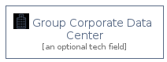

# Group Corporate Data Center

```text
aws-20210131/Group/GroupCorporateDataCenter
```

```text
include('aws-20210131/Group/GroupCorporateDataCenter')
```

|group|
|---|
||


## group
### Load remotely
```plantuml
@startuml
' configures the library
!global $LIB_BASE_LOCATION="https://raw.githubusercontent.com/tmorin/plantuml-libs/master/dist"
' loads the library
!include $LIB_BASE_LOCATION/bootstrap.puml
' loads the aws-20210131 bootstrap
include('aws-20210131/bootstrap')
' loads the GroupCorporateDataCenter element
include('aws-20210131/Group/GroupCorporateDataCenter')
GroupCorporateDataCenter('group_corporate_data_center', 'Group Corporate Data Center', 'an optional tech field')
@enduml
```
### Load locally
```plantuml
@startuml
' configures the library
!global $INCLUSION_MODE="local"
!global $LIB_BASE_LOCATION="../.."
' loads the library
!include $LIB_BASE_LOCATION/bootstrap.puml
' loads the aws-20210131 bootstrap
include('aws-20210131/bootstrap')
' loads the GroupCorporateDataCenter element
include('aws-20210131/Group/GroupCorporateDataCenter')
GroupCorporateDataCenter('group_corporate_data_center', 'Group Corporate Data Center', 'an optional tech field')
@enduml
```

