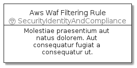
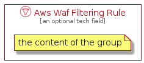

# Aws Waf Filtering Rule

```text
aws-20210131/Resource/SecurityIdentityAndCompliance/AwsWafFilteringRule
```

```text
include('aws-20210131/Resource/SecurityIdentityAndCompliance/AwsWafFilteringRule')
```

|icon|card|element|group|
|---|---|---|---|
|||||


## card
### Load remotely
```plantuml
@startuml
' configures the library
!global $LIB_BASE_LOCATION="https://raw.githubusercontent.com/tmorin/plantuml-libs/master/dist"
' loads the library
!include $LIB_BASE_LOCATION/bootstrap.puml
' loads the aws-20210131 bootstrap
include('aws-20210131/bootstrap')
' loads the AwsWafFilteringRule element
include('aws-20210131/Resource/SecurityIdentityAndCompliance/AwsWafFilteringRule')
AwsWafFilteringRuleCard('aws_waf_filtering_rule', 'Aws Waf Filtering Rule', 'Molestiae praesentium aut natus dolorem. Aut consequatur fugiat a consequatur ut.')
@enduml
```
### Load locally
```plantuml
@startuml
' configures the library
!global $INCLUSION_MODE="local"
!global $LIB_BASE_LOCATION="../../.."
' loads the library
!include $LIB_BASE_LOCATION/bootstrap.puml
' loads the aws-20210131 bootstrap
include('aws-20210131/bootstrap')
' loads the AwsWafFilteringRule element
include('aws-20210131/Resource/SecurityIdentityAndCompliance/AwsWafFilteringRule')
AwsWafFilteringRuleCard('aws_waf_filtering_rule', 'Aws Waf Filtering Rule', 'Molestiae praesentium aut natus dolorem. Aut consequatur fugiat a consequatur ut.')
@enduml
```


## element
### Load remotely
```plantuml
@startuml
' configures the library
!global $LIB_BASE_LOCATION="https://raw.githubusercontent.com/tmorin/plantuml-libs/master/dist"
' loads the library
!include $LIB_BASE_LOCATION/bootstrap.puml
' loads the aws-20210131 bootstrap
include('aws-20210131/bootstrap')
' loads the AwsWafFilteringRule element
include('aws-20210131/Resource/SecurityIdentityAndCompliance/AwsWafFilteringRule')
AwsWafFilteringRule('aws_waf_filtering_rule', 'Aws Waf Filtering Rule', 'an optional tech field')
@enduml
```
### Load locally
```plantuml
@startuml
' configures the library
!global $INCLUSION_MODE="local"
!global $LIB_BASE_LOCATION="../../.."
' loads the library
!include $LIB_BASE_LOCATION/bootstrap.puml
' loads the aws-20210131 bootstrap
include('aws-20210131/bootstrap')
' loads the AwsWafFilteringRule element
include('aws-20210131/Resource/SecurityIdentityAndCompliance/AwsWafFilteringRule')
AwsWafFilteringRule('aws_waf_filtering_rule', 'Aws Waf Filtering Rule', 'an optional tech field')
@enduml
```


## group
### Load remotely
```plantuml
@startuml
' configures the library
!global $LIB_BASE_LOCATION="https://raw.githubusercontent.com/tmorin/plantuml-libs/master/dist"
' loads the library
!include $LIB_BASE_LOCATION/bootstrap.puml
' loads the aws-20210131 bootstrap
include('aws-20210131/bootstrap')
' loads the AwsWafFilteringRule element
include('aws-20210131/Resource/SecurityIdentityAndCompliance/AwsWafFilteringRule')
AwsWafFilteringRuleGroup('aws_waf_filtering_rule', 'Aws Waf Filtering Rule', 'an optional tech field'){
  note as note
  the content of the group
  end note
}
@enduml
```
### Load locally
```plantuml
@startuml
' configures the library
!global $INCLUSION_MODE="local"
!global $LIB_BASE_LOCATION="../../.."
' loads the library
!include $LIB_BASE_LOCATION/bootstrap.puml
' loads the aws-20210131 bootstrap
include('aws-20210131/bootstrap')
' loads the AwsWafFilteringRule element
include('aws-20210131/Resource/SecurityIdentityAndCompliance/AwsWafFilteringRule')
AwsWafFilteringRuleGroup('aws_waf_filtering_rule', 'Aws Waf Filtering Rule', 'an optional tech field'){
  note as note
  the content of the group
  end note
}
@enduml
```

