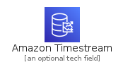
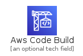
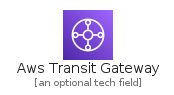
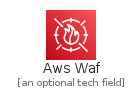

# Architecture

The module Architecture contains 262 entries.

- [Analytics](#family-analytics)
- [AppIntegration](#family-appintegration)
- [ArVr](#family-arvr)
- [AwsCostManagement](#family-awscostmanagement)
- [Blockchain](#family-blockchain)
- [BusinessApplication](#family-businessapplication)
- [Compute](#family-compute)
- [Containers](#family-containers)
- [CustomerEnablement](#family-customerenablement)
- [CustomerEnagagement](#family-customerenagagement)
- [Database](#family-database)
- [DeveloperTools](#family-developertools)
- [EndUserComputing](#family-endusercomputing)
- [FrontEndWebMobile](#family-frontendwebmobile)
- [GameTech](#family-gametech)
- [InternetOfThings](#family-internetofthings)
- [MachineLearning](#family-machinelearning)
- [ManagementGovernance](#family-managementgovernance)
- [MediaServices](#family-mediaservices)
- [MigrationTransfer](#family-migrationtransfer)
- [NetworkingContent](#family-networkingcontent)
- [QuantumTechnologies](#family-quantumtechnologies)
- [Robotics](#family-robotics)
- [Satellite](#family-satellite)
- [SecurityIdentityCompliance](#family-securityidentitycompliance)
- [Storage](#family-storage)

## Analytics

| |Name|
|:---:|---|
||[aws-20210131/Architecture/Analytics/AmazonAthena](../aws-20210131/Architecture/Analytics/AmazonAthena.md)
||[aws-20210131/Architecture/Analytics/AmazonCloudSearch](../aws-20210131/Architecture/Analytics/AmazonCloudSearch.md)
||[aws-20210131/Architecture/Analytics/AmazonElasticsearchService](../aws-20210131/Architecture/Analytics/AmazonElasticsearchService.md)
||[aws-20210131/Architecture/Analytics/AmazonEmr](../aws-20210131/Architecture/Analytics/AmazonEmr.md)
||[aws-20210131/Architecture/Analytics/AmazonKinesis](../aws-20210131/Architecture/Analytics/AmazonKinesis.md)
||[aws-20210131/Architecture/Analytics/AmazonKinesisDataAnalytics](../aws-20210131/Architecture/Analytics/AmazonKinesisDataAnalytics.md)
||[aws-20210131/Architecture/Analytics/AmazonKinesisDataStreams](../aws-20210131/Architecture/Analytics/AmazonKinesisDataStreams.md)
||[aws-20210131/Architecture/Analytics/AmazonKinesisFirehose](../aws-20210131/Architecture/Analytics/AmazonKinesisFirehose.md)
||[aws-20210131/Architecture/Analytics/AmazonKinesisVideoStreams](../aws-20210131/Architecture/Analytics/AmazonKinesisVideoStreams.md)
||[aws-20210131/Architecture/Analytics/AmazonManagedStreamingForApacheKafka](../aws-20210131/Architecture/Analytics/AmazonManagedStreamingForApacheKafka.md)
||[aws-20210131/Architecture/Analytics/AmazonQuickSight](../aws-20210131/Architecture/Analytics/AmazonQuickSight.md)
||[aws-20210131/Architecture/Analytics/AmazonRedshift](../aws-20210131/Architecture/Analytics/AmazonRedshift.md)
||[aws-20210131/Architecture/Analytics/AwsDataExchange](../aws-20210131/Architecture/Analytics/AwsDataExchange.md)
||[aws-20210131/Architecture/Analytics/AwsDataPipeline](../aws-20210131/Architecture/Analytics/AwsDataPipeline.md)
||[aws-20210131/Architecture/Analytics/AwsGlue](../aws-20210131/Architecture/Analytics/AwsGlue.md)
||[aws-20210131/Architecture/Analytics/AwsGlueElasticViews](../aws-20210131/Architecture/Analytics/AwsGlueElasticViews.md)
||[aws-20210131/Architecture/Analytics/AwsLakeFormation](../aws-20210131/Architecture/Analytics/AwsLakeFormation.md)
||[aws-20210131/Architecture/Analytics/AwsSqlWorkbench](../aws-20210131/Architecture/Analytics/AwsSqlWorkbench.md)

## AppIntegration

| |Name|
|:---:|---|
||[aws-20210131/Architecture/AppIntegration/AmazonApiGateway](../aws-20210131/Architecture/AppIntegration/AmazonApiGateway.md)
||[aws-20210131/Architecture/AppIntegration/AmazonAppFlow](../aws-20210131/Architecture/AppIntegration/AmazonAppFlow.md)
||[aws-20210131/Architecture/AppIntegration/AmazonEventBridge](../aws-20210131/Architecture/AppIntegration/AmazonEventBridge.md)
||[aws-20210131/Architecture/AppIntegration/AmazonManagedWorkflowsForApacheAirflow](../aws-20210131/Architecture/AppIntegration/AmazonManagedWorkflowsForApacheAirflow.md)
||[aws-20210131/Architecture/AppIntegration/AmazonMq](../aws-20210131/Architecture/AppIntegration/AmazonMq.md)
||[aws-20210131/Architecture/AppIntegration/AmazonSimpleNotificationService](../aws-20210131/Architecture/AppIntegration/AmazonSimpleNotificationService.md)
||[aws-20210131/Architecture/AppIntegration/AmazonSimpleQueueService](../aws-20210131/Architecture/AppIntegration/AmazonSimpleQueueService.md)
||[aws-20210131/Architecture/AppIntegration/AwsAppSync](../aws-20210131/Architecture/AppIntegration/AwsAppSync.md)
||[aws-20210131/Architecture/AppIntegration/AwsConsoleMobileApplication](../aws-20210131/Architecture/AppIntegration/AwsConsoleMobileApplication.md)
||[aws-20210131/Architecture/AppIntegration/AwsExpressWorkflows](../aws-20210131/Architecture/AppIntegration/AwsExpressWorkflows.md)
||[aws-20210131/Architecture/AppIntegration/AwsStepFunctions](../aws-20210131/Architecture/AppIntegration/AwsStepFunctions.md)

## ArVr

| |Name|
|:---:|---|
||[aws-20210131/Architecture/ArVr/AmazonSumerian](../aws-20210131/Architecture/ArVr/AmazonSumerian.md)

## AwsCostManagement

| |Name|
|:---:|---|
||[aws-20210131/Architecture/AwsCostManagement/AwsBudgets](../aws-20210131/Architecture/AwsCostManagement/AwsBudgets.md)
||[aws-20210131/Architecture/AwsCostManagement/AwsCostAndUsageReport](../aws-20210131/Architecture/AwsCostManagement/AwsCostAndUsageReport.md)
||[aws-20210131/Architecture/AwsCostManagement/AwsCostExplorer](../aws-20210131/Architecture/AwsCostManagement/AwsCostExplorer.md)
||[aws-20210131/Architecture/AwsCostManagement/ReservedInstanceReporting](../aws-20210131/Architecture/AwsCostManagement/ReservedInstanceReporting.md)
||[aws-20210131/Architecture/AwsCostManagement/SavingsPlans](../aws-20210131/Architecture/AwsCostManagement/SavingsPlans.md)

## Blockchain

| |Name|
|:---:|---|
||[aws-20210131/Architecture/Blockchain/AmazonManagedBlockchain](../aws-20210131/Architecture/Blockchain/AmazonManagedBlockchain.md)
||[aws-20210131/Architecture/Blockchain/AmazonQuantumLedgerDatabase](../aws-20210131/Architecture/Blockchain/AmazonQuantumLedgerDatabase.md)

## BusinessApplication

| |Name|
|:---:|---|
||[aws-20210131/Architecture/BusinessApplication/AlexaForBusiness](../aws-20210131/Architecture/BusinessApplication/AlexaForBusiness.md)
||[aws-20210131/Architecture/BusinessApplication/AmazonChime](../aws-20210131/Architecture/BusinessApplication/AmazonChime.md)
||[aws-20210131/Architecture/BusinessApplication/AmazonHoneycode](../aws-20210131/Architecture/BusinessApplication/AmazonHoneycode.md)
||[aws-20210131/Architecture/BusinessApplication/AmazonWorkMail](../aws-20210131/Architecture/BusinessApplication/AmazonWorkMail.md)

## Compute

| |Name|
|:---:|---|
||[aws-20210131/Architecture/Compute/AmazonEc2](../aws-20210131/Architecture/Compute/AmazonEc2.md)
||[aws-20210131/Architecture/Compute/AmazonEc2AutoScaling](../aws-20210131/Architecture/Compute/AmazonEc2AutoScaling.md)
||[aws-20210131/Architecture/Compute/AmazonEc2ImageBuilder](../aws-20210131/Architecture/Compute/AmazonEc2ImageBuilder.md)
||[aws-20210131/Architecture/Compute/AmazonEc2M5N](../aws-20210131/Architecture/Compute/AmazonEc2M5N.md)
||[aws-20210131/Architecture/Compute/AmazonEc2R5N](../aws-20210131/Architecture/Compute/AmazonEc2R5N.md)
||[aws-20210131/Architecture/Compute/AmazonElasticContainerKubernetes](../aws-20210131/Architecture/Compute/AmazonElasticContainerKubernetes.md)
||[aws-20210131/Architecture/Compute/AmazonElasticContainerRegistry](../aws-20210131/Architecture/Compute/AmazonElasticContainerRegistry.md)
||[aws-20210131/Architecture/Compute/AmazonElasticContainerService](../aws-20210131/Architecture/Compute/AmazonElasticContainerService.md)
||[aws-20210131/Architecture/Compute/AmazonLightsail](../aws-20210131/Architecture/Compute/AmazonLightsail.md)
||[aws-20210131/Architecture/Compute/AwsBatch](../aws-20210131/Architecture/Compute/AwsBatch.md)
||[aws-20210131/Architecture/Compute/AwsComputeOptimizer](../aws-20210131/Architecture/Compute/AwsComputeOptimizer.md)
||[aws-20210131/Architecture/Compute/AwsElasticBeanstalk](../aws-20210131/Architecture/Compute/AwsElasticBeanstalk.md)
||[aws-20210131/Architecture/Compute/AwsFargate](../aws-20210131/Architecture/Compute/AwsFargate.md)
||[aws-20210131/Architecture/Compute/AwsLambda](../aws-20210131/Architecture/Compute/AwsLambda.md)
||[aws-20210131/Architecture/Compute/AwsLocalZones](../aws-20210131/Architecture/Compute/AwsLocalZones.md)
||[aws-20210131/Architecture/Compute/AwsNitroEnclaves](../aws-20210131/Architecture/Compute/AwsNitroEnclaves.md)
||[aws-20210131/Architecture/Compute/AwsOutposts](../aws-20210131/Architecture/Compute/AwsOutposts.md)
||[aws-20210131/Architecture/Compute/AwsOutposts1UAnd2UServers](../aws-20210131/Architecture/Compute/AwsOutposts1UAnd2UServers.md)
||[aws-20210131/Architecture/Compute/AwsParallelCluster](../aws-20210131/Architecture/Compute/AwsParallelCluster.md)
||[aws-20210131/Architecture/Compute/AwsServerlessApplicationRepository](../aws-20210131/Architecture/Compute/AwsServerlessApplicationRepository.md)
||[aws-20210131/Architecture/Compute/AwsThinkBoxDeadline](../aws-20210131/Architecture/Compute/AwsThinkBoxDeadline.md)
||[aws-20210131/Architecture/Compute/AwsThinkBoxFrost](../aws-20210131/Architecture/Compute/AwsThinkBoxFrost.md)
||[aws-20210131/Architecture/Compute/AwsThinkBoxKrakatoa](../aws-20210131/Architecture/Compute/AwsThinkBoxKrakatoa.md)
||[aws-20210131/Architecture/Compute/AwsThinkBoxSequoia](../aws-20210131/Architecture/Compute/AwsThinkBoxSequoia.md)
||[aws-20210131/Architecture/Compute/AwsThinkBoxStoke](../aws-20210131/Architecture/Compute/AwsThinkBoxStoke.md)
||[aws-20210131/Architecture/Compute/AwsThinkBoxXMesh](../aws-20210131/Architecture/Compute/AwsThinkBoxXMesh.md)
||[aws-20210131/Architecture/Compute/AwsWavelength](../aws-20210131/Architecture/Compute/AwsWavelength.md)
||[aws-20210131/Architecture/Compute/Bottlerocket](../aws-20210131/Architecture/Compute/Bottlerocket.md)
||[aws-20210131/Architecture/Compute/ElasticFabricAdapter](../aws-20210131/Architecture/Compute/ElasticFabricAdapter.md)
||[aws-20210131/Architecture/Compute/NiceDcv](../aws-20210131/Architecture/Compute/NiceDcv.md)
||[aws-20210131/Architecture/Compute/VMwareCloudOnAws](../aws-20210131/Architecture/Compute/VMwareCloudOnAws.md)

## Containers

| |Name|
|:---:|---|
||[aws-20210131/Architecture/Containers/AmazonEksAnywhere](../aws-20210131/Architecture/Containers/AmazonEksAnywhere.md)
||[aws-20210131/Architecture/Containers/AmazonEksCloud](../aws-20210131/Architecture/Containers/AmazonEksCloud.md)
||[aws-20210131/Architecture/Containers/AmazonEksDistro](../aws-20210131/Architecture/Containers/AmazonEksDistro.md)
||[aws-20210131/Architecture/Containers/AmazonElasticContainerRegistry](../aws-20210131/Architecture/Containers/AmazonElasticContainerRegistry.md)
||[aws-20210131/Architecture/Containers/AmazonElasticContainerService](../aws-20210131/Architecture/Containers/AmazonElasticContainerService.md)
||[aws-20210131/Architecture/Containers/AmazonElasticKubernetesService](../aws-20210131/Architecture/Containers/AmazonElasticKubernetesService.md)
||[aws-20210131/Architecture/Containers/AwsFargate](../aws-20210131/Architecture/Containers/AwsFargate.md)
||[aws-20210131/Architecture/Containers/RedHatOpenShift](../aws-20210131/Architecture/Containers/RedHatOpenShift.md)

## CustomerEnablement

| |Name|
|:---:|---|
||[aws-20210131/Architecture/CustomerEnablement/AwsActivate](../aws-20210131/Architecture/CustomerEnablement/AwsActivate.md)
||[aws-20210131/Architecture/CustomerEnablement/AwsIq](../aws-20210131/Architecture/CustomerEnablement/AwsIq.md)
||[aws-20210131/Architecture/CustomerEnablement/AwsManagedServices](../aws-20210131/Architecture/CustomerEnablement/AwsManagedServices.md)
||[aws-20210131/Architecture/CustomerEnablement/AwsProfessionalServices](../aws-20210131/Architecture/CustomerEnablement/AwsProfessionalServices.md)
||[aws-20210131/Architecture/CustomerEnablement/AwsSupport](../aws-20210131/Architecture/CustomerEnablement/AwsSupport.md)
||[aws-20210131/Architecture/CustomerEnablement/AwsTrainingCertification](../aws-20210131/Architecture/CustomerEnablement/AwsTrainingCertification.md)

## CustomerEnagagement

| |Name|
|:---:|---|
||[aws-20210131/Architecture/CustomerEnagagement/AmazonConnect](../aws-20210131/Architecture/CustomerEnagagement/AmazonConnect.md)
||[aws-20210131/Architecture/CustomerEnagagement/AmazonPinpoint](../aws-20210131/Architecture/CustomerEnagagement/AmazonPinpoint.md)
||[aws-20210131/Architecture/CustomerEnagagement/AmazonSimpleEmailService](../aws-20210131/Architecture/CustomerEnagagement/AmazonSimpleEmailService.md)

## Database

| |Name|
|:---:|---|
||[aws-20210131/Architecture/Database/AmazonAurora](../aws-20210131/Architecture/Database/AmazonAurora.md)
||[aws-20210131/Architecture/Database/AmazonDocumentDb](../aws-20210131/Architecture/Database/AmazonDocumentDb.md)
||[aws-20210131/Architecture/Database/AmazonDynamoDb](../aws-20210131/Architecture/Database/AmazonDynamoDb.md)
||[aws-20210131/Architecture/Database/AmazonElastiCache](../aws-20210131/Architecture/Database/AmazonElastiCache.md)
||[aws-20210131/Architecture/Database/AmazonKeyspaces](../aws-20210131/Architecture/Database/AmazonKeyspaces.md)
||[aws-20210131/Architecture/Database/AmazonNeptune](../aws-20210131/Architecture/Database/AmazonNeptune.md)
||[aws-20210131/Architecture/Database/AmazonQuantumLedgerDatabase](../aws-20210131/Architecture/Database/AmazonQuantumLedgerDatabase.md)
||[aws-20210131/Architecture/Database/AmazonRds](../aws-20210131/Architecture/Database/AmazonRds.md)
||[aws-20210131/Architecture/Database/AmazonRdsOnVMware](../aws-20210131/Architecture/Database/AmazonRdsOnVMware.md)
||[aws-20210131/Architecture/Database/AmazonTimestream](../aws-20210131/Architecture/Database/AmazonTimestream.md)
||[aws-20210131/Architecture/Database/AwsDatabaseMigrationService](../aws-20210131/Architecture/Database/AwsDatabaseMigrationService.md)

## DeveloperTools

| |Name|
|:---:|---|
||[aws-20210131/Architecture/DeveloperTools/AwsCloud9](../aws-20210131/Architecture/DeveloperTools/AwsCloud9.md)
||[aws-20210131/Architecture/DeveloperTools/AwsCloudDevelopmentKit](../aws-20210131/Architecture/DeveloperTools/AwsCloudDevelopmentKit.md)
||[aws-20210131/Architecture/DeveloperTools/AwsCloudShell](../aws-20210131/Architecture/DeveloperTools/AwsCloudShell.md)
||[aws-20210131/Architecture/DeveloperTools/AwsCodeArtifact](../aws-20210131/Architecture/DeveloperTools/AwsCodeArtifact.md)
||[aws-20210131/Architecture/DeveloperTools/AwsCodeBuild](../aws-20210131/Architecture/DeveloperTools/AwsCodeBuild.md)
||[aws-20210131/Architecture/DeveloperTools/AwsCodeCommit](../aws-20210131/Architecture/DeveloperTools/AwsCodeCommit.md)
||[aws-20210131/Architecture/DeveloperTools/AwsCodeDeploy](../aws-20210131/Architecture/DeveloperTools/AwsCodeDeploy.md)
||[aws-20210131/Architecture/DeveloperTools/AwsCodePipeline](../aws-20210131/Architecture/DeveloperTools/AwsCodePipeline.md)
||[aws-20210131/Architecture/DeveloperTools/AwsCodeStar](../aws-20210131/Architecture/DeveloperTools/AwsCodeStar.md)
||[aws-20210131/Architecture/DeveloperTools/AwsCommandLineInterface](../aws-20210131/Architecture/DeveloperTools/AwsCommandLineInterface.md)
||[aws-20210131/Architecture/DeveloperTools/AwsToolsAndSdKs](../aws-20210131/Architecture/DeveloperTools/AwsToolsAndSdKs.md)
||[aws-20210131/Architecture/DeveloperTools/AwsXRay](../aws-20210131/Architecture/DeveloperTools/AwsXRay.md)

## EndUserComputing

| |Name|
|:---:|---|
||[aws-20210131/Architecture/EndUserComputing/AmazonAppStream](../aws-20210131/Architecture/EndUserComputing/AmazonAppStream.md)
||[aws-20210131/Architecture/EndUserComputing/AmazonWorkDocs](../aws-20210131/Architecture/EndUserComputing/AmazonWorkDocs.md)
||[aws-20210131/Architecture/EndUserComputing/AmazonWorkLink](../aws-20210131/Architecture/EndUserComputing/AmazonWorkLink.md)
||[aws-20210131/Architecture/EndUserComputing/AmazonWorkSpaces](../aws-20210131/Architecture/EndUserComputing/AmazonWorkSpaces.md)

## FrontEndWebMobile

| |Name|
|:---:|---|
||[aws-20210131/Architecture/FrontEndWebMobile/AwsAmplify](../aws-20210131/Architecture/FrontEndWebMobile/AwsAmplify.md)
||[aws-20210131/Architecture/FrontEndWebMobile/AwsDeviceFarm](../aws-20210131/Architecture/FrontEndWebMobile/AwsDeviceFarm.md)

## GameTech

| |Name|
|:---:|---|
||[aws-20210131/Architecture/GameTech/AmazonGameLift](../aws-20210131/Architecture/GameTech/AmazonGameLift.md)

## InternetOfThings

| |Name|
|:---:|---|
||[aws-20210131/Architecture/InternetOfThings/AwsIoT1Click](../aws-20210131/Architecture/InternetOfThings/AwsIoT1Click.md)
||[aws-20210131/Architecture/InternetOfThings/AwsIoTAnalytics](../aws-20210131/Architecture/InternetOfThings/AwsIoTAnalytics.md)
||[aws-20210131/Architecture/InternetOfThings/AwsIoTButton](../aws-20210131/Architecture/InternetOfThings/AwsIoTButton.md)
||[aws-20210131/Architecture/InternetOfThings/AwsIoTCore](../aws-20210131/Architecture/InternetOfThings/AwsIoTCore.md)
||[aws-20210131/Architecture/InternetOfThings/AwsIoTDeviceDefender](../aws-20210131/Architecture/InternetOfThings/AwsIoTDeviceDefender.md)
||[aws-20210131/Architecture/InternetOfThings/AwsIoTDeviceManagement](../aws-20210131/Architecture/InternetOfThings/AwsIoTDeviceManagement.md)
||[aws-20210131/Architecture/InternetOfThings/AwsIoTEvents](../aws-20210131/Architecture/InternetOfThings/AwsIoTEvents.md)
||[aws-20210131/Architecture/InternetOfThings/AwsIoTGreengrass](../aws-20210131/Architecture/InternetOfThings/AwsIoTGreengrass.md)
||[aws-20210131/Architecture/InternetOfThings/AwsIoTSiteWise](../aws-20210131/Architecture/InternetOfThings/AwsIoTSiteWise.md)
||[aws-20210131/Architecture/InternetOfThings/AwsIoTThingsGraph](../aws-20210131/Architecture/InternetOfThings/AwsIoTThingsGraph.md)
||[aws-20210131/Architecture/InternetOfThings/FreeRtos](../aws-20210131/Architecture/InternetOfThings/FreeRtos.md)

## MachineLearning

| |Name|
|:---:|---|
||[aws-20210131/Architecture/MachineLearning/AmazonAugmentedAiA2I](../aws-20210131/Architecture/MachineLearning/AmazonAugmentedAiA2I.md)
||[aws-20210131/Architecture/MachineLearning/AmazonCodeGuru](../aws-20210131/Architecture/MachineLearning/AmazonCodeGuru.md)
||[aws-20210131/Architecture/MachineLearning/AmazonComprehend](../aws-20210131/Architecture/MachineLearning/AmazonComprehend.md)
||[aws-20210131/Architecture/MachineLearning/AmazonDevOpsGuru](../aws-20210131/Architecture/MachineLearning/AmazonDevOpsGuru.md)
||[aws-20210131/Architecture/MachineLearning/AmazonElasticInference](../aws-20210131/Architecture/MachineLearning/AmazonElasticInference.md)
||[aws-20210131/Architecture/MachineLearning/AmazonForecast](../aws-20210131/Architecture/MachineLearning/AmazonForecast.md)
||[aws-20210131/Architecture/MachineLearning/AmazonFraudDetector](../aws-20210131/Architecture/MachineLearning/AmazonFraudDetector.md)
||[aws-20210131/Architecture/MachineLearning/AmazonHealthLake](../aws-20210131/Architecture/MachineLearning/AmazonHealthLake.md)
||[aws-20210131/Architecture/MachineLearning/AmazonKendra](../aws-20210131/Architecture/MachineLearning/AmazonKendra.md)
||[aws-20210131/Architecture/MachineLearning/AmazonLex](../aws-20210131/Architecture/MachineLearning/AmazonLex.md)
||[aws-20210131/Architecture/MachineLearning/AmazonLookoutForEquipment](../aws-20210131/Architecture/MachineLearning/AmazonLookoutForEquipment.md)
||[aws-20210131/Architecture/MachineLearning/AmazonLookoutForMetrics](../aws-20210131/Architecture/MachineLearning/AmazonLookoutForMetrics.md)
||[aws-20210131/Architecture/MachineLearning/AmazonLookoutForVision](../aws-20210131/Architecture/MachineLearning/AmazonLookoutForVision.md)
||[aws-20210131/Architecture/MachineLearning/AmazonMonitron](../aws-20210131/Architecture/MachineLearning/AmazonMonitron.md)
||[aws-20210131/Architecture/MachineLearning/AmazonPersonalize](../aws-20210131/Architecture/MachineLearning/AmazonPersonalize.md)
||[aws-20210131/Architecture/MachineLearning/AmazonPolly](../aws-20210131/Architecture/MachineLearning/AmazonPolly.md)
||[aws-20210131/Architecture/MachineLearning/AmazonRekognition](../aws-20210131/Architecture/MachineLearning/AmazonRekognition.md)
||[aws-20210131/Architecture/MachineLearning/AmazonSageMaker](../aws-20210131/Architecture/MachineLearning/AmazonSageMaker.md)
||[aws-20210131/Architecture/MachineLearning/AmazonSageMakerGroundTruth](../aws-20210131/Architecture/MachineLearning/AmazonSageMakerGroundTruth.md)
||[aws-20210131/Architecture/MachineLearning/AmazonTextract](../aws-20210131/Architecture/MachineLearning/AmazonTextract.md)
||[aws-20210131/Architecture/MachineLearning/AmazonTranscribe](../aws-20210131/Architecture/MachineLearning/AmazonTranscribe.md)
||[aws-20210131/Architecture/MachineLearning/AmazonTranslate](../aws-20210131/Architecture/MachineLearning/AmazonTranslate.md)
||[aws-20210131/Architecture/MachineLearning/ApacheMxNetOnAws](../aws-20210131/Architecture/MachineLearning/ApacheMxNetOnAws.md)
||[aws-20210131/Architecture/MachineLearning/AwsDeepComposer](../aws-20210131/Architecture/MachineLearning/AwsDeepComposer.md)
||[aws-20210131/Architecture/MachineLearning/AwsDeepLearningAmIs](../aws-20210131/Architecture/MachineLearning/AwsDeepLearningAmIs.md)
||[aws-20210131/Architecture/MachineLearning/AwsDeepLearningContainers](../aws-20210131/Architecture/MachineLearning/AwsDeepLearningContainers.md)
||[aws-20210131/Architecture/MachineLearning/AwsDeepLens](../aws-20210131/Architecture/MachineLearning/AwsDeepLens.md)
||[aws-20210131/Architecture/MachineLearning/AwsDeepRacer](../aws-20210131/Architecture/MachineLearning/AwsDeepRacer.md)
||[aws-20210131/Architecture/MachineLearning/AwsNeuron](../aws-20210131/Architecture/MachineLearning/AwsNeuron.md)
||[aws-20210131/Architecture/MachineLearning/AwsPanorama](../aws-20210131/Architecture/MachineLearning/AwsPanorama.md)
||[aws-20210131/Architecture/MachineLearning/TensorFlowOnAws](../aws-20210131/Architecture/MachineLearning/TensorFlowOnAws.md)
||[aws-20210131/Architecture/MachineLearning/TorchServe](../aws-20210131/Architecture/MachineLearning/TorchServe.md)

## ManagementGovernance

| |Name|
|:---:|---|
||[aws-20210131/Architecture/ManagementGovernance/AmazonCloudWatch](../aws-20210131/Architecture/ManagementGovernance/AmazonCloudWatch.md)
||[aws-20210131/Architecture/ManagementGovernance/AmazonManagedServiceForGrafana](../aws-20210131/Architecture/ManagementGovernance/AmazonManagedServiceForGrafana.md)
||[aws-20210131/Architecture/ManagementGovernance/AmazonManagedServiceForPrometheus](../aws-20210131/Architecture/ManagementGovernance/AmazonManagedServiceForPrometheus.md)
||[aws-20210131/Architecture/ManagementGovernance/AwsAppConfig](../aws-20210131/Architecture/ManagementGovernance/AwsAppConfig.md)
||[aws-20210131/Architecture/ManagementGovernance/AwsApplicationAutoScaling](../aws-20210131/Architecture/ManagementGovernance/AwsApplicationAutoScaling.md)
||[aws-20210131/Architecture/ManagementGovernance/AwsAutoScaling](../aws-20210131/Architecture/ManagementGovernance/AwsAutoScaling.md)
||[aws-20210131/Architecture/ManagementGovernance/AwsBackintAgent](../aws-20210131/Architecture/ManagementGovernance/AwsBackintAgent.md)
||[aws-20210131/Architecture/ManagementGovernance/AwsChatbot](../aws-20210131/Architecture/ManagementGovernance/AwsChatbot.md)
||[aws-20210131/Architecture/ManagementGovernance/AwsCloudFormation](../aws-20210131/Architecture/ManagementGovernance/AwsCloudFormation.md)
||[aws-20210131/Architecture/ManagementGovernance/AwsCloudTrail](../aws-20210131/Architecture/ManagementGovernance/AwsCloudTrail.md)
||[aws-20210131/Architecture/ManagementGovernance/AwsConfig](../aws-20210131/Architecture/ManagementGovernance/AwsConfig.md)
||[aws-20210131/Architecture/ManagementGovernance/AwsControlTower](../aws-20210131/Architecture/ManagementGovernance/AwsControlTower.md)
||[aws-20210131/Architecture/ManagementGovernance/AwsDistroForOpenTelemetry](../aws-20210131/Architecture/ManagementGovernance/AwsDistroForOpenTelemetry.md)
||[aws-20210131/Architecture/ManagementGovernance/AwsFaultInjectionSimulator](../aws-20210131/Architecture/ManagementGovernance/AwsFaultInjectionSimulator.md)
||[aws-20210131/Architecture/ManagementGovernance/AwsLaunchWizard](../aws-20210131/Architecture/ManagementGovernance/AwsLaunchWizard.md)
||[aws-20210131/Architecture/ManagementGovernance/AwsLicenseManager](../aws-20210131/Architecture/ManagementGovernance/AwsLicenseManager.md)
||[aws-20210131/Architecture/ManagementGovernance/AwsManagementConsole](../aws-20210131/Architecture/ManagementGovernance/AwsManagementConsole.md)
||[aws-20210131/Architecture/ManagementGovernance/AwsOpsWorks](../aws-20210131/Architecture/ManagementGovernance/AwsOpsWorks.md)
||[aws-20210131/Architecture/ManagementGovernance/AwsOrganizations](../aws-20210131/Architecture/ManagementGovernance/AwsOrganizations.md)
||[aws-20210131/Architecture/ManagementGovernance/AwsPersonalHealthDashboard](../aws-20210131/Architecture/ManagementGovernance/AwsPersonalHealthDashboard.md)
||[aws-20210131/Architecture/ManagementGovernance/AwsProton](../aws-20210131/Architecture/ManagementGovernance/AwsProton.md)
||[aws-20210131/Architecture/ManagementGovernance/AwsServiceCatalog](../aws-20210131/Architecture/ManagementGovernance/AwsServiceCatalog.md)
||[aws-20210131/Architecture/ManagementGovernance/AwsSystemsManager](../aws-20210131/Architecture/ManagementGovernance/AwsSystemsManager.md)
||[aws-20210131/Architecture/ManagementGovernance/AwsTrustedAdvisor](../aws-20210131/Architecture/ManagementGovernance/AwsTrustedAdvisor.md)
||[aws-20210131/Architecture/ManagementGovernance/AwsWellArchitectedTool](../aws-20210131/Architecture/ManagementGovernance/AwsWellArchitectedTool.md)

## MediaServices

| |Name|
|:---:|---|
||[aws-20210131/Architecture/MediaServices/AmazonElasticTranscoder](../aws-20210131/Architecture/MediaServices/AmazonElasticTranscoder.md)
||[aws-20210131/Architecture/MediaServices/AmazonInteractiveVideoService](../aws-20210131/Architecture/MediaServices/AmazonInteractiveVideoService.md)
||[aws-20210131/Architecture/MediaServices/AmazonKinesisVideoStreams](../aws-20210131/Architecture/MediaServices/AmazonKinesisVideoStreams.md)
||[aws-20210131/Architecture/MediaServices/AwsElementalAppliancesSoftware](../aws-20210131/Architecture/MediaServices/AwsElementalAppliancesSoftware.md)
||[aws-20210131/Architecture/MediaServices/AwsElementalConductor](../aws-20210131/Architecture/MediaServices/AwsElementalConductor.md)
||[aws-20210131/Architecture/MediaServices/AwsElementalDelta](../aws-20210131/Architecture/MediaServices/AwsElementalDelta.md)
||[aws-20210131/Architecture/MediaServices/AwsElementalLink](../aws-20210131/Architecture/MediaServices/AwsElementalLink.md)
||[aws-20210131/Architecture/MediaServices/AwsElementalLive](../aws-20210131/Architecture/MediaServices/AwsElementalLive.md)
||[aws-20210131/Architecture/MediaServices/AwsElementalMediaConnect](../aws-20210131/Architecture/MediaServices/AwsElementalMediaConnect.md)
||[aws-20210131/Architecture/MediaServices/AwsElementalMediaConvert](../aws-20210131/Architecture/MediaServices/AwsElementalMediaConvert.md)
||[aws-20210131/Architecture/MediaServices/AwsElementalMediaLive](../aws-20210131/Architecture/MediaServices/AwsElementalMediaLive.md)
||[aws-20210131/Architecture/MediaServices/AwsElementalMediaPackage](../aws-20210131/Architecture/MediaServices/AwsElementalMediaPackage.md)
||[aws-20210131/Architecture/MediaServices/AwsElementalMediaStore](../aws-20210131/Architecture/MediaServices/AwsElementalMediaStore.md)
||[aws-20210131/Architecture/MediaServices/AwsElementalMediaTailor](../aws-20210131/Architecture/MediaServices/AwsElementalMediaTailor.md)
||[aws-20210131/Architecture/MediaServices/AwsElementalServer](../aws-20210131/Architecture/MediaServices/AwsElementalServer.md)

## MigrationTransfer

| |Name|
|:---:|---|
||[aws-20210131/Architecture/MigrationTransfer/AwsApplicationDiscoveryService](../aws-20210131/Architecture/MigrationTransfer/AwsApplicationDiscoveryService.md)
||[aws-20210131/Architecture/MigrationTransfer/AwsDataSync](../aws-20210131/Architecture/MigrationTransfer/AwsDataSync.md)
||[aws-20210131/Architecture/MigrationTransfer/AwsMigrationEvaluator](../aws-20210131/Architecture/MigrationTransfer/AwsMigrationEvaluator.md)
||[aws-20210131/Architecture/MigrationTransfer/AwsMigrationHub](../aws-20210131/Architecture/MigrationTransfer/AwsMigrationHub.md)
||[aws-20210131/Architecture/MigrationTransfer/AwsServerMigrationService](../aws-20210131/Architecture/MigrationTransfer/AwsServerMigrationService.md)
||[aws-20210131/Architecture/MigrationTransfer/AwsTransferFamily](../aws-20210131/Architecture/MigrationTransfer/AwsTransferFamily.md)
||[aws-20210131/Architecture/MigrationTransfer/CloudEndureMigration](../aws-20210131/Architecture/MigrationTransfer/CloudEndureMigration.md)

## NetworkingContent

| |Name|
|:---:|---|
||[aws-20210131/Architecture/NetworkingContent/AmazonCloudDirectory](../aws-20210131/Architecture/NetworkingContent/AmazonCloudDirectory.md)
||[aws-20210131/Architecture/NetworkingContent/AmazonCloudFront](../aws-20210131/Architecture/NetworkingContent/AmazonCloudFront.md)
||[aws-20210131/Architecture/NetworkingContent/AmazonRoute53](../aws-20210131/Architecture/NetworkingContent/AmazonRoute53.md)
||[aws-20210131/Architecture/NetworkingContent/AmazonVirtualPrivateCloud](../aws-20210131/Architecture/NetworkingContent/AmazonVirtualPrivateCloud.md)
||[aws-20210131/Architecture/NetworkingContent/AwsAppMesh](../aws-20210131/Architecture/NetworkingContent/AwsAppMesh.md)
||[aws-20210131/Architecture/NetworkingContent/AwsClientVpn](../aws-20210131/Architecture/NetworkingContent/AwsClientVpn.md)
||[aws-20210131/Architecture/NetworkingContent/AwsCloudMap](../aws-20210131/Architecture/NetworkingContent/AwsCloudMap.md)
||[aws-20210131/Architecture/NetworkingContent/AwsDirectConnect](../aws-20210131/Architecture/NetworkingContent/AwsDirectConnect.md)
||[aws-20210131/Architecture/NetworkingContent/AwsGlobalAccelerator](../aws-20210131/Architecture/NetworkingContent/AwsGlobalAccelerator.md)
||[aws-20210131/Architecture/NetworkingContent/AwsPrivateLink](../aws-20210131/Architecture/NetworkingContent/AwsPrivateLink.md)
||[aws-20210131/Architecture/NetworkingContent/AwsSiteToSiteVpn](../aws-20210131/Architecture/NetworkingContent/AwsSiteToSiteVpn.md)
||[aws-20210131/Architecture/NetworkingContent/AwsTransitGateway](../aws-20210131/Architecture/NetworkingContent/AwsTransitGateway.md)
||[aws-20210131/Architecture/NetworkingContent/ElasticLoadBalancing](../aws-20210131/Architecture/NetworkingContent/ElasticLoadBalancing.md)

## QuantumTechnologies

| |Name|
|:---:|---|
||[aws-20210131/Architecture/QuantumTechnologies/AmazonBraket](../aws-20210131/Architecture/QuantumTechnologies/AmazonBraket.md)

## Robotics

| |Name|
|:---:|---|
||[aws-20210131/Architecture/Robotics/AwsRoboMaker](../aws-20210131/Architecture/Robotics/AwsRoboMaker.md)

## Satellite

| |Name|
|:---:|---|
||[aws-20210131/Architecture/Satellite/AwsGroundStation](../aws-20210131/Architecture/Satellite/AwsGroundStation.md)

## SecurityIdentityCompliance

| |Name|
|:---:|---|
||[aws-20210131/Architecture/SecurityIdentityCompliance/AmazonCloudDirectory](../aws-20210131/Architecture/SecurityIdentityCompliance/AmazonCloudDirectory.md)
||[aws-20210131/Architecture/SecurityIdentityCompliance/AmazonCognito](../aws-20210131/Architecture/SecurityIdentityCompliance/AmazonCognito.md)
||[aws-20210131/Architecture/SecurityIdentityCompliance/AmazonDetective](../aws-20210131/Architecture/SecurityIdentityCompliance/AmazonDetective.md)
||[aws-20210131/Architecture/SecurityIdentityCompliance/AmazonGuardDuty](../aws-20210131/Architecture/SecurityIdentityCompliance/AmazonGuardDuty.md)
||[aws-20210131/Architecture/SecurityIdentityCompliance/AmazonInspector](../aws-20210131/Architecture/SecurityIdentityCompliance/AmazonInspector.md)
||[aws-20210131/Architecture/SecurityIdentityCompliance/AmazonMacie](../aws-20210131/Architecture/SecurityIdentityCompliance/AmazonMacie.md)
||[aws-20210131/Architecture/SecurityIdentityCompliance/AwsArtifact](../aws-20210131/Architecture/SecurityIdentityCompliance/AwsArtifact.md)
||[aws-20210131/Architecture/SecurityIdentityCompliance/AwsAuditManager](../aws-20210131/Architecture/SecurityIdentityCompliance/AwsAuditManager.md)
||[aws-20210131/Architecture/SecurityIdentityCompliance/AwsCertificateManager](../aws-20210131/Architecture/SecurityIdentityCompliance/AwsCertificateManager.md)
||[aws-20210131/Architecture/SecurityIdentityCompliance/AwsCloudHsm](../aws-20210131/Architecture/SecurityIdentityCompliance/AwsCloudHsm.md)
||[aws-20210131/Architecture/SecurityIdentityCompliance/AwsDirectoryService](../aws-20210131/Architecture/SecurityIdentityCompliance/AwsDirectoryService.md)
||[aws-20210131/Architecture/SecurityIdentityCompliance/AwsFirewallManager](../aws-20210131/Architecture/SecurityIdentityCompliance/AwsFirewallManager.md)
||[aws-20210131/Architecture/SecurityIdentityCompliance/AwsIdentityAndAccessManagement](../aws-20210131/Architecture/SecurityIdentityCompliance/AwsIdentityAndAccessManagement.md)
||[aws-20210131/Architecture/SecurityIdentityCompliance/AwsKeyManagementService](../aws-20210131/Architecture/SecurityIdentityCompliance/AwsKeyManagementService.md)
||[aws-20210131/Architecture/SecurityIdentityCompliance/AwsNetworkFirewall](../aws-20210131/Architecture/SecurityIdentityCompliance/AwsNetworkFirewall.md)
||[aws-20210131/Architecture/SecurityIdentityCompliance/AwsResourceAccessManager](../aws-20210131/Architecture/SecurityIdentityCompliance/AwsResourceAccessManager.md)
||[aws-20210131/Architecture/SecurityIdentityCompliance/AwsSecretsManager](../aws-20210131/Architecture/SecurityIdentityCompliance/AwsSecretsManager.md)
||[aws-20210131/Architecture/SecurityIdentityCompliance/AwsSecurityHub](../aws-20210131/Architecture/SecurityIdentityCompliance/AwsSecurityHub.md)
||[aws-20210131/Architecture/SecurityIdentityCompliance/AwsShield](../aws-20210131/Architecture/SecurityIdentityCompliance/AwsShield.md)
||[aws-20210131/Architecture/SecurityIdentityCompliance/AwsSigner](../aws-20210131/Architecture/SecurityIdentityCompliance/AwsSigner.md)
||[aws-20210131/Architecture/SecurityIdentityCompliance/AwsSingleSignOn](../aws-20210131/Architecture/SecurityIdentityCompliance/AwsSingleSignOn.md)
||[aws-20210131/Architecture/SecurityIdentityCompliance/AwsWaf](../aws-20210131/Architecture/SecurityIdentityCompliance/AwsWaf.md)

## Storage

| |Name|
|:---:|---|
||[aws-20210131/Architecture/Storage/AmazonElasticBlockStore](../aws-20210131/Architecture/Storage/AmazonElasticBlockStore.md)
||[aws-20210131/Architecture/Storage/AmazonElasticFileSystem](../aws-20210131/Architecture/Storage/AmazonElasticFileSystem.md)
||[aws-20210131/Architecture/Storage/AmazonFSx](../aws-20210131/Architecture/Storage/AmazonFSx.md)
||[aws-20210131/Architecture/Storage/AmazonFSxForLustre](../aws-20210131/Architecture/Storage/AmazonFSxForLustre.md)
||[aws-20210131/Architecture/Storage/AmazonFSxForWindowsFileServer](../aws-20210131/Architecture/Storage/AmazonFSxForWindowsFileServer.md)
||[aws-20210131/Architecture/Storage/AmazonS3OnOutpostsStorage](../aws-20210131/Architecture/Storage/AmazonS3OnOutpostsStorage.md)
||[aws-20210131/Architecture/Storage/AmazonSimpleStorageService](../aws-20210131/Architecture/Storage/AmazonSimpleStorageService.md)
||[aws-20210131/Architecture/Storage/AmazonSimpleStorageServiceGlacier](../aws-20210131/Architecture/Storage/AmazonSimpleStorageServiceGlacier.md)
||[aws-20210131/Architecture/Storage/AwsBackup](../aws-20210131/Architecture/Storage/AwsBackup.md)
||[aws-20210131/Architecture/Storage/AwsSnowball](../aws-20210131/Architecture/Storage/AwsSnowball.md)
||[aws-20210131/Architecture/Storage/AwsSnowballEdge](../aws-20210131/Architecture/Storage/AwsSnowballEdge.md)
||[aws-20210131/Architecture/Storage/AwsSnowcone](../aws-20210131/Architecture/Storage/AwsSnowcone.md)
||[aws-20210131/Architecture/Storage/AwsSnowmobile](../aws-20210131/Architecture/Storage/AwsSnowmobile.md)
||[aws-20210131/Architecture/Storage/AwsStorageGateway](../aws-20210131/Architecture/Storage/AwsStorageGateway.md)
||[aws-20210131/Architecture/Storage/CloudEndureDisasterRecovery](../aws-20210131/Architecture/Storage/CloudEndureDisasterRecovery.md)

