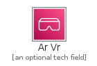
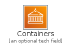
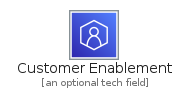
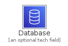
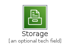

# Category

The module Category contains 26 entries.

- [Analytics](#family-analytics)
- [ApplicationIntegration](#family-applicationintegration)
- [ArVr](#family-arvr)
- [AwsCostManagement](#family-awscostmanagement)
- [Blockchain](#family-blockchain)
- [BusinessApplications](#family-businessapplications)
- [Compute](#family-compute)
- [Containers](#family-containers)
- [CustomerEnablement](#family-customerenablement)
- [Database](#family-database)
- [DeveloperTools](#family-developertools)
- [EndUserComputing](#family-endusercomputing)
- [FrontEndWebMobile](#family-frontendwebmobile)
- [GameTech](#family-gametech)
- [InternetOfThings](#family-internetofthings)
- [MachineLearning](#family-machinelearning)
- [ManagementGovernance](#family-managementgovernance)
- [MediaServices](#family-mediaservices)
- [MigrationTransfer](#family-migrationtransfer)
- [NetworkingContentDelivery](#family-networkingcontentdelivery)
- [QuantumTechnologies](#family-quantumtechnologies)
- [Robotics](#family-robotics)
- [Satellite](#family-satellite)
- [SecurityIdentityCompliance](#family-securityidentitycompliance)
- [Serverless](#family-serverless)
- [Storage](#family-storage)

## Analytics

| |Name|
|:---:|---|
||[aws-20210131/Category/Analytics](../aws-20210131/Category/Analytics.md)

## ApplicationIntegration

| |Name|
|:---:|---|
||[aws-20210131/Category/ApplicationIntegration](../aws-20210131/Category/ApplicationIntegration.md)

## ArVr

| |Name|
|:---:|---|
||[aws-20210131/Category/ArVr](../aws-20210131/Category/ArVr.md)

## AwsCostManagement

| |Name|
|:---:|---|
||[aws-20210131/Category/AwsCostManagement](../aws-20210131/Category/AwsCostManagement.md)

## Blockchain

| |Name|
|:---:|---|
||[aws-20210131/Category/Blockchain](../aws-20210131/Category/Blockchain.md)

## BusinessApplications

| |Name|
|:---:|---|
||[aws-20210131/Category/BusinessApplications](../aws-20210131/Category/BusinessApplications.md)

## Compute

| |Name|
|:---:|---|
||[aws-20210131/Category/Compute](../aws-20210131/Category/Compute.md)

## Containers

| |Name|
|:---:|---|
||[aws-20210131/Category/Containers](../aws-20210131/Category/Containers.md)

## CustomerEnablement

| |Name|
|:---:|---|
||[aws-20210131/Category/CustomerEnablement](../aws-20210131/Category/CustomerEnablement.md)

## Database

| |Name|
|:---:|---|
||[aws-20210131/Category/Database](../aws-20210131/Category/Database.md)

## DeveloperTools

| |Name|
|:---:|---|
||[aws-20210131/Category/DeveloperTools](../aws-20210131/Category/DeveloperTools.md)

## EndUserComputing

| |Name|
|:---:|---|
||[aws-20210131/Category/EndUserComputing](../aws-20210131/Category/EndUserComputing.md)

## FrontEndWebMobile

| |Name|
|:---:|---|
||[aws-20210131/Category/FrontEndWebMobile](../aws-20210131/Category/FrontEndWebMobile.md)

## GameTech

| |Name|
|:---:|---|
||[aws-20210131/Category/GameTech](../aws-20210131/Category/GameTech.md)

## InternetOfThings

| |Name|
|:---:|---|
||[aws-20210131/Category/InternetOfThings](../aws-20210131/Category/InternetOfThings.md)

## MachineLearning

| |Name|
|:---:|---|
||[aws-20210131/Category/MachineLearning](../aws-20210131/Category/MachineLearning.md)

## ManagementGovernance

| |Name|
|:---:|---|
||[aws-20210131/Category/ManagementGovernance](../aws-20210131/Category/ManagementGovernance.md)

## MediaServices

| |Name|
|:---:|---|
||[aws-20210131/Category/MediaServices](../aws-20210131/Category/MediaServices.md)

## MigrationTransfer

| |Name|
|:---:|---|
||[aws-20210131/Category/MigrationTransfer](../aws-20210131/Category/MigrationTransfer.md)

## NetworkingContentDelivery

| |Name|
|:---:|---|
||[aws-20210131/Category/NetworkingContentDelivery](../aws-20210131/Category/NetworkingContentDelivery.md)

## QuantumTechnologies

| |Name|
|:---:|---|
||[aws-20210131/Category/QuantumTechnologies](../aws-20210131/Category/QuantumTechnologies.md)

## Robotics

| |Name|
|:---:|---|
||[aws-20210131/Category/Robotics](../aws-20210131/Category/Robotics.md)

## Satellite

| |Name|
|:---:|---|
||[aws-20210131/Category/Satellite](../aws-20210131/Category/Satellite.md)

## SecurityIdentityCompliance

| |Name|
|:---:|---|
||[aws-20210131/Category/SecurityIdentityCompliance](../aws-20210131/Category/SecurityIdentityCompliance.md)

## Serverless

| |Name|
|:---:|---|
||[aws-20210131/Category/Serverless](../aws-20210131/Category/Serverless.md)

## Storage

| |Name|
|:---:|---|
||[aws-20210131/Category/Storage](../aws-20210131/Category/Storage.md)

