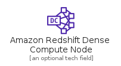
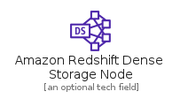
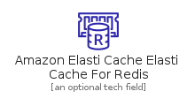
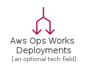
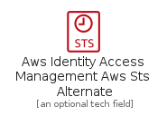
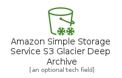
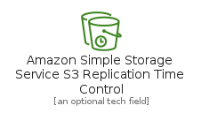

# Resource

The module Resource contains 363 entries.

- [Analytics](#family-analytics)
- [ApplicationIntegration](#family-applicationintegration)
- [Blockchain](#family-blockchain)
- [Compute](#family-compute)
- [Containers](#family-containers)
- [CustomerEngagement](#family-customerengagement)
- [Database](#family-database)
- [DeveloperTools](#family-developertools)
- [GeneralIcons](#family-generalicons)
- [GroupIcons](#family-groupicons)
- [LoT](#family-lot)
- [MachineLearning](#family-machinelearning)
- [ManagementGovernance](#family-managementgovernance)
- [MigrationAndTransfer](#family-migrationandtransfer)
- [NetworkingAndContentDelivery](#family-networkingandcontentdelivery)
- [QuantumTechnologies](#family-quantumtechnologies)
- [Robotics](#family-robotics)
- [SecurityIdentityAndCompliance](#family-securityidentityandcompliance)
- [Storage](#family-storage)

## Analytics

| |Name|
|:---:|---|
||[aws-20210131/Resource/Analytics/AmazonCloudSearchSearchDocuments](../aws-20210131/Resource/Analytics/AmazonCloudSearchSearchDocuments.md)
||[aws-20210131/Resource/Analytics/AmazonEmrCluster](../aws-20210131/Resource/Analytics/AmazonEmrCluster.md)
||[aws-20210131/Resource/Analytics/AmazonEmrEmrEngine](../aws-20210131/Resource/Analytics/AmazonEmrEmrEngine.md)
||[aws-20210131/Resource/Analytics/AmazonEmrHdfsCluster](../aws-20210131/Resource/Analytics/AmazonEmrHdfsCluster.md)
||[aws-20210131/Resource/Analytics/AmazonRedshiftDenseComputeNode](../aws-20210131/Resource/Analytics/AmazonRedshiftDenseComputeNode.md)
||[aws-20210131/Resource/Analytics/AmazonRedshiftDenseStorageNode](../aws-20210131/Resource/Analytics/AmazonRedshiftDenseStorageNode.md)
||[aws-20210131/Resource/Analytics/AmazonRedshiftRa3](../aws-20210131/Resource/Analytics/AmazonRedshiftRa3.md)
||[aws-20210131/Resource/Analytics/AwsGlueCrawler](../aws-20210131/Resource/Analytics/AwsGlueCrawler.md)
||[aws-20210131/Resource/Analytics/AwsGlueDataBrew](../aws-20210131/Resource/Analytics/AwsGlueDataBrew.md)
||[aws-20210131/Resource/Analytics/AwsGlueDataCatalog](../aws-20210131/Resource/Analytics/AwsGlueDataCatalog.md)
||[aws-20210131/Resource/Analytics/AwsLakeFormationDataLake](../aws-20210131/Resource/Analytics/AwsLakeFormationDataLake.md)
||[aws-20210131/Resource/Analytics/AwsRedshiftMl](../aws-20210131/Resource/Analytics/AwsRedshiftMl.md)

## ApplicationIntegration

| |Name|
|:---:|---|
||[aws-20210131/Resource/ApplicationIntegration/AmazonApiGatewayEndpoint](../aws-20210131/Resource/ApplicationIntegration/AmazonApiGatewayEndpoint.md)
||[aws-20210131/Resource/ApplicationIntegration/AmazonEventBridgeCustomEventBus](../aws-20210131/Resource/ApplicationIntegration/AmazonEventBridgeCustomEventBus.md)
||[aws-20210131/Resource/ApplicationIntegration/AmazonEventBridgeDefaultEventBus](../aws-20210131/Resource/ApplicationIntegration/AmazonEventBridgeDefaultEventBus.md)
||[aws-20210131/Resource/ApplicationIntegration/AmazonEventBridgeEvent](../aws-20210131/Resource/ApplicationIntegration/AmazonEventBridgeEvent.md)
||[aws-20210131/Resource/ApplicationIntegration/AmazonEventBridgeRule](../aws-20210131/Resource/ApplicationIntegration/AmazonEventBridgeRule.md)
||[aws-20210131/Resource/ApplicationIntegration/AmazonEventBridgeSaasPartnerEvent](../aws-20210131/Resource/ApplicationIntegration/AmazonEventBridgeSaasPartnerEvent.md)
||[aws-20210131/Resource/ApplicationIntegration/AmazonSimpleNotificationServiceEmailNotification](../aws-20210131/Resource/ApplicationIntegration/AmazonSimpleNotificationServiceEmailNotification.md)
||[aws-20210131/Resource/ApplicationIntegration/AmazonSimpleNotificationServiceHttpNotification](../aws-20210131/Resource/ApplicationIntegration/AmazonSimpleNotificationServiceHttpNotification.md)
||[aws-20210131/Resource/ApplicationIntegration/AmazonSimpleNotificationServiceTopic](../aws-20210131/Resource/ApplicationIntegration/AmazonSimpleNotificationServiceTopic.md)
||[aws-20210131/Resource/ApplicationIntegration/AmazonSimpleQueueServiceMessage](../aws-20210131/Resource/ApplicationIntegration/AmazonSimpleQueueServiceMessage.md)
||[aws-20210131/Resource/ApplicationIntegration/AmazonSimpleQueueServiceQueue](../aws-20210131/Resource/ApplicationIntegration/AmazonSimpleQueueServiceQueue.md)

## Blockchain

| |Name|
|:---:|---|
||[aws-20210131/Resource/Blockchain/AmazonManagedBlockchainBlockchain](../aws-20210131/Resource/Blockchain/AmazonManagedBlockchainBlockchain.md)

## Compute

| |Name|
|:---:|---|
||[aws-20210131/Resource/Compute/AmazonEc2A1Instance](../aws-20210131/Resource/Compute/AmazonEc2A1Instance.md)
||[aws-20210131/Resource/Compute/AmazonEc2AmiResource](../aws-20210131/Resource/Compute/AmazonEc2AmiResource.md)
||[aws-20210131/Resource/Compute/AmazonEc2AutoScaling](../aws-20210131/Resource/Compute/AmazonEc2AutoScaling.md)
||[aws-20210131/Resource/Compute/AmazonEc2AwsInferentia](../aws-20210131/Resource/Compute/AmazonEc2AwsInferentia.md)
||[aws-20210131/Resource/Compute/AmazonEc2C4Instance](../aws-20210131/Resource/Compute/AmazonEc2C4Instance.md)
||[aws-20210131/Resource/Compute/AmazonEc2C5AdInstance](../aws-20210131/Resource/Compute/AmazonEc2C5AdInstance.md)
||[aws-20210131/Resource/Compute/AmazonEc2C5AInstance](../aws-20210131/Resource/Compute/AmazonEc2C5AInstance.md)
||[aws-20210131/Resource/Compute/AmazonEc2C5DInstance](../aws-20210131/Resource/Compute/AmazonEc2C5DInstance.md)
||[aws-20210131/Resource/Compute/AmazonEc2C5Instance](../aws-20210131/Resource/Compute/AmazonEc2C5Instance.md)
||[aws-20210131/Resource/Compute/AmazonEc2C5NInstance](../aws-20210131/Resource/Compute/AmazonEc2C5NInstance.md)
||[aws-20210131/Resource/Compute/AmazonEc2C6GdInstance](../aws-20210131/Resource/Compute/AmazonEc2C6GdInstance.md)
||[aws-20210131/Resource/Compute/AmazonEc2C6GInstance](../aws-20210131/Resource/Compute/AmazonEc2C6GInstance.md)
||[aws-20210131/Resource/Compute/AmazonEc2D2Instance](../aws-20210131/Resource/Compute/AmazonEc2D2Instance.md)
||[aws-20210131/Resource/Compute/AmazonEc2D3EnInstance](../aws-20210131/Resource/Compute/AmazonEc2D3EnInstance.md)
||[aws-20210131/Resource/Compute/AmazonEc2D3Instance](../aws-20210131/Resource/Compute/AmazonEc2D3Instance.md)
||[aws-20210131/Resource/Compute/AmazonEc2DbInstance](../aws-20210131/Resource/Compute/AmazonEc2DbInstance.md)
||[aws-20210131/Resource/Compute/AmazonEc2ElasticIpAddress](../aws-20210131/Resource/Compute/AmazonEc2ElasticIpAddress.md)
||[aws-20210131/Resource/Compute/AmazonEc2F1Instance](../aws-20210131/Resource/Compute/AmazonEc2F1Instance.md)
||[aws-20210131/Resource/Compute/AmazonEc2G3Instance](../aws-20210131/Resource/Compute/AmazonEc2G3Instance.md)
||[aws-20210131/Resource/Compute/AmazonEc2G4AdInstance](../aws-20210131/Resource/Compute/AmazonEc2G4AdInstance.md)
||[aws-20210131/Resource/Compute/AmazonEc2G4DnInstance](../aws-20210131/Resource/Compute/AmazonEc2G4DnInstance.md)
||[aws-20210131/Resource/Compute/AmazonEc2H1Instance](../aws-20210131/Resource/Compute/AmazonEc2H1Instance.md)
||[aws-20210131/Resource/Compute/AmazonEc2HabanaGaudiInstance](../aws-20210131/Resource/Compute/AmazonEc2HabanaGaudiInstance.md)
||[aws-20210131/Resource/Compute/AmazonEc2HmiInstance](../aws-20210131/Resource/Compute/AmazonEc2HmiInstance.md)
||[aws-20210131/Resource/Compute/AmazonEc2I2Instance](../aws-20210131/Resource/Compute/AmazonEc2I2Instance.md)
||[aws-20210131/Resource/Compute/AmazonEc2I3EnInstance](../aws-20210131/Resource/Compute/AmazonEc2I3EnInstance.md)
||[aws-20210131/Resource/Compute/AmazonEc2I3Instance](../aws-20210131/Resource/Compute/AmazonEc2I3Instance.md)
||[aws-20210131/Resource/Compute/AmazonEc2Inf1Instance](../aws-20210131/Resource/Compute/AmazonEc2Inf1Instance.md)
||[aws-20210131/Resource/Compute/AmazonEc2Instance](../aws-20210131/Resource/Compute/AmazonEc2Instance.md)
||[aws-20210131/Resource/Compute/AmazonEc2Instances](../aws-20210131/Resource/Compute/AmazonEc2Instances.md)
||[aws-20210131/Resource/Compute/AmazonEc2InstanceWithCloudWatch](../aws-20210131/Resource/Compute/AmazonEc2InstanceWithCloudWatch.md)
||[aws-20210131/Resource/Compute/AmazonEc2M4Instance](../aws-20210131/Resource/Compute/AmazonEc2M4Instance.md)
||[aws-20210131/Resource/Compute/AmazonEc2M5AInstance](../aws-20210131/Resource/Compute/AmazonEc2M5AInstance.md)
||[aws-20210131/Resource/Compute/AmazonEc2M5DInstance](../aws-20210131/Resource/Compute/AmazonEc2M5DInstance.md)
||[aws-20210131/Resource/Compute/AmazonEc2M5DnInstance](../aws-20210131/Resource/Compute/AmazonEc2M5DnInstance.md)
||[aws-20210131/Resource/Compute/AmazonEc2M5Instance](../aws-20210131/Resource/Compute/AmazonEc2M5Instance.md)
||[aws-20210131/Resource/Compute/AmazonEc2M5NInstance](../aws-20210131/Resource/Compute/AmazonEc2M5NInstance.md)
||[aws-20210131/Resource/Compute/AmazonEc2M5ZnInstance](../aws-20210131/Resource/Compute/AmazonEc2M5ZnInstance.md)
||[aws-20210131/Resource/Compute/AmazonEc2M6GdInstance](../aws-20210131/Resource/Compute/AmazonEc2M6GdInstance.md)
||[aws-20210131/Resource/Compute/AmazonEc2M6GInstance](../aws-20210131/Resource/Compute/AmazonEc2M6GInstance.md)
||[aws-20210131/Resource/Compute/AmazonEc2MacInstance](../aws-20210131/Resource/Compute/AmazonEc2MacInstance.md)
||[aws-20210131/Resource/Compute/AmazonEc2P2Instance](../aws-20210131/Resource/Compute/AmazonEc2P2Instance.md)
||[aws-20210131/Resource/Compute/AmazonEc2P3DnInstance](../aws-20210131/Resource/Compute/AmazonEc2P3DnInstance.md)
||[aws-20210131/Resource/Compute/AmazonEc2P3Instance](../aws-20210131/Resource/Compute/AmazonEc2P3Instance.md)
||[aws-20210131/Resource/Compute/AmazonEc2P4DInstance](../aws-20210131/Resource/Compute/AmazonEc2P4DInstance.md)
||[aws-20210131/Resource/Compute/AmazonEc2P4Instance](../aws-20210131/Resource/Compute/AmazonEc2P4Instance.md)
||[aws-20210131/Resource/Compute/AmazonEc2R4Instance](../aws-20210131/Resource/Compute/AmazonEc2R4Instance.md)
||[aws-20210131/Resource/Compute/AmazonEc2R5AdInstance](../aws-20210131/Resource/Compute/AmazonEc2R5AdInstance.md)
||[aws-20210131/Resource/Compute/AmazonEc2R5AInstance](../aws-20210131/Resource/Compute/AmazonEc2R5AInstance.md)
||[aws-20210131/Resource/Compute/AmazonEc2R5BInstance](../aws-20210131/Resource/Compute/AmazonEc2R5BInstance.md)
||[aws-20210131/Resource/Compute/AmazonEc2R5DInstance](../aws-20210131/Resource/Compute/AmazonEc2R5DInstance.md)
||[aws-20210131/Resource/Compute/AmazonEc2R5GdInstance](../aws-20210131/Resource/Compute/AmazonEc2R5GdInstance.md)
||[aws-20210131/Resource/Compute/AmazonEc2R5Instance](../aws-20210131/Resource/Compute/AmazonEc2R5Instance.md)
||[aws-20210131/Resource/Compute/AmazonEc2R5NInstance](../aws-20210131/Resource/Compute/AmazonEc2R5NInstance.md)
||[aws-20210131/Resource/Compute/AmazonEc2R6GInstance](../aws-20210131/Resource/Compute/AmazonEc2R6GInstance.md)
||[aws-20210131/Resource/Compute/AmazonEc2RdnInstance](../aws-20210131/Resource/Compute/AmazonEc2RdnInstance.md)
||[aws-20210131/Resource/Compute/AmazonEc2Rescue](../aws-20210131/Resource/Compute/AmazonEc2Rescue.md)
||[aws-20210131/Resource/Compute/AmazonEc2SpotInstance](../aws-20210131/Resource/Compute/AmazonEc2SpotInstance.md)
||[aws-20210131/Resource/Compute/AmazonEc2T2Instance](../aws-20210131/Resource/Compute/AmazonEc2T2Instance.md)
||[aws-20210131/Resource/Compute/AmazonEc2T3AInstance](../aws-20210131/Resource/Compute/AmazonEc2T3AInstance.md)
||[aws-20210131/Resource/Compute/AmazonEc2T3Instance](../aws-20210131/Resource/Compute/AmazonEc2T3Instance.md)
||[aws-20210131/Resource/Compute/AmazonEc2T4GInstance](../aws-20210131/Resource/Compute/AmazonEc2T4GInstance.md)
||[aws-20210131/Resource/Compute/AmazonEc2TrainiumInstance](../aws-20210131/Resource/Compute/AmazonEc2TrainiumInstance.md)
||[aws-20210131/Resource/Compute/AmazonEc2X1EInstance](../aws-20210131/Resource/Compute/AmazonEc2X1EInstance.md)
||[aws-20210131/Resource/Compute/AmazonEc2X1Instance](../aws-20210131/Resource/Compute/AmazonEc2X1Instance.md)
||[aws-20210131/Resource/Compute/AmazonEc2Z1DInstance](../aws-20210131/Resource/Compute/AmazonEc2Z1DInstance.md)
||[aws-20210131/Resource/Compute/AmazonElasticBeanstalkApplication](../aws-20210131/Resource/Compute/AmazonElasticBeanstalkApplication.md)
||[aws-20210131/Resource/Compute/AmazonElasticBeanstalkDeployment](../aws-20210131/Resource/Compute/AmazonElasticBeanstalkDeployment.md)
||[aws-20210131/Resource/Compute/AmazonLambdaLambdaFunction](../aws-20210131/Resource/Compute/AmazonLambdaLambdaFunction.md)

## Containers

| |Name|
|:---:|---|
||[aws-20210131/Resource/Containers/AmazonEcsCopilotCli](../aws-20210131/Resource/Containers/AmazonEcsCopilotCli.md)
||[aws-20210131/Resource/Containers/AmazonElasticContainerRegistryImage](../aws-20210131/Resource/Containers/AmazonElasticContainerRegistryImage.md)
||[aws-20210131/Resource/Containers/AmazonElasticContainerRegistryRegistry](../aws-20210131/Resource/Containers/AmazonElasticContainerRegistryRegistry.md)
||[aws-20210131/Resource/Containers/AmazonElasticContainerServiceContainer1](../aws-20210131/Resource/Containers/AmazonElasticContainerServiceContainer1.md)
||[aws-20210131/Resource/Containers/AmazonElasticContainerServiceContainer2](../aws-20210131/Resource/Containers/AmazonElasticContainerServiceContainer2.md)
||[aws-20210131/Resource/Containers/AmazonElasticContainerServiceContainer3](../aws-20210131/Resource/Containers/AmazonElasticContainerServiceContainer3.md)
||[aws-20210131/Resource/Containers/AmazonElasticContainerServiceEcsAnywhere](../aws-20210131/Resource/Containers/AmazonElasticContainerServiceEcsAnywhere.md)
||[aws-20210131/Resource/Containers/AmazonElasticContainerServiceService](../aws-20210131/Resource/Containers/AmazonElasticContainerServiceService.md)
||[aws-20210131/Resource/Containers/AmazonElasticContainerServiceTask](../aws-20210131/Resource/Containers/AmazonElasticContainerServiceTask.md)

## CustomerEngagement

| |Name|
|:---:|---|
||[aws-20210131/Resource/CustomerEngagement/AmazonPinpointJourney](../aws-20210131/Resource/CustomerEngagement/AmazonPinpointJourney.md)
||[aws-20210131/Resource/CustomerEngagement/AmazonSimpleEmailServiceEmail](../aws-20210131/Resource/CustomerEngagement/AmazonSimpleEmailServiceEmail.md)

## Database

| |Name|
|:---:|---|
||[aws-20210131/Resource/Database/AmazonAuroraAmazonAuroraInstanceAlternate](../aws-20210131/Resource/Database/AmazonAuroraAmazonAuroraInstanceAlternate.md)
||[aws-20210131/Resource/Database/AmazonAuroraAmazonRdsInstance](../aws-20210131/Resource/Database/AmazonAuroraAmazonRdsInstance.md)
||[aws-20210131/Resource/Database/AmazonAuroraAmazonRdsInstanceAternate](../aws-20210131/Resource/Database/AmazonAuroraAmazonRdsInstanceAternate.md)
||[aws-20210131/Resource/Database/AmazonAuroraInstance](../aws-20210131/Resource/Database/AmazonAuroraInstance.md)
||[aws-20210131/Resource/Database/AmazonAuroraMariaDbInstance](../aws-20210131/Resource/Database/AmazonAuroraMariaDbInstance.md)
||[aws-20210131/Resource/Database/AmazonAuroraMariaDbInstanceAlternate](../aws-20210131/Resource/Database/AmazonAuroraMariaDbInstanceAlternate.md)
||[aws-20210131/Resource/Database/AmazonAuroraMySqlInstance](../aws-20210131/Resource/Database/AmazonAuroraMySqlInstance.md)
||[aws-20210131/Resource/Database/AmazonAuroraMySqlInstanceAlternate](../aws-20210131/Resource/Database/AmazonAuroraMySqlInstanceAlternate.md)
||[aws-20210131/Resource/Database/AmazonAuroraOracleInstance](../aws-20210131/Resource/Database/AmazonAuroraOracleInstance.md)
||[aws-20210131/Resource/Database/AmazonAuroraOracleInstanceAlternate](../aws-20210131/Resource/Database/AmazonAuroraOracleInstanceAlternate.md)
||[aws-20210131/Resource/Database/AmazonAuroraPiops](../aws-20210131/Resource/Database/AmazonAuroraPiops.md)
||[aws-20210131/Resource/Database/AmazonAuroraPostgreSqlInstance](../aws-20210131/Resource/Database/AmazonAuroraPostgreSqlInstance.md)
||[aws-20210131/Resource/Database/AmazonAuroraPostgreSqlInstanceAlternate](../aws-20210131/Resource/Database/AmazonAuroraPostgreSqlInstanceAlternate.md)
||[aws-20210131/Resource/Database/AmazonAuroraSqlServerInstance](../aws-20210131/Resource/Database/AmazonAuroraSqlServerInstance.md)
||[aws-20210131/Resource/Database/AmazonAuroraSqlServerInstanceAlternate](../aws-20210131/Resource/Database/AmazonAuroraSqlServerInstanceAlternate.md)
||[aws-20210131/Resource/Database/AmazonDynamoDbAmazonDynamoDbAccelerator](../aws-20210131/Resource/Database/AmazonDynamoDbAmazonDynamoDbAccelerator.md)
||[aws-20210131/Resource/Database/AmazonDynamoDbAttribute](../aws-20210131/Resource/Database/AmazonDynamoDbAttribute.md)
||[aws-20210131/Resource/Database/AmazonDynamoDbAttributes](../aws-20210131/Resource/Database/AmazonDynamoDbAttributes.md)
||[aws-20210131/Resource/Database/AmazonDynamoDbGlobalSecondaryIndex](../aws-20210131/Resource/Database/AmazonDynamoDbGlobalSecondaryIndex.md)
||[aws-20210131/Resource/Database/AmazonDynamoDbItem](../aws-20210131/Resource/Database/AmazonDynamoDbItem.md)
||[aws-20210131/Resource/Database/AmazonDynamoDbItems](../aws-20210131/Resource/Database/AmazonDynamoDbItems.md)
||[aws-20210131/Resource/Database/AmazonDynamoDbTable](../aws-20210131/Resource/Database/AmazonDynamoDbTable.md)
||[aws-20210131/Resource/Database/AmazonElastiCacheCacheNode](../aws-20210131/Resource/Database/AmazonElastiCacheCacheNode.md)
||[aws-20210131/Resource/Database/AmazonElastiCacheElastiCacheForMemcached](../aws-20210131/Resource/Database/AmazonElastiCacheElastiCacheForMemcached.md)
||[aws-20210131/Resource/Database/AmazonElastiCacheElastiCacheForRedis](../aws-20210131/Resource/Database/AmazonElastiCacheElastiCacheForRedis.md)
||[aws-20210131/Resource/Database/AmazonRdsProxy](../aws-20210131/Resource/Database/AmazonRdsProxy.md)
||[aws-20210131/Resource/Database/AmazonRdsProxyAlternate](../aws-20210131/Resource/Database/AmazonRdsProxyAlternate.md)
||[aws-20210131/Resource/Database/AwsDatabaseMigrationServiceDatabaseMigrationWorkflowJob](../aws-20210131/Resource/Database/AwsDatabaseMigrationServiceDatabaseMigrationWorkflowJob.md)

## DeveloperTools

| |Name|
|:---:|---|
||[aws-20210131/Resource/DeveloperTools/AwsCloud9Cloud9](../aws-20210131/Resource/DeveloperTools/AwsCloud9Cloud9.md)

## GeneralIcons

| |Name|
|:---:|---|
||[aws-20210131/Resource/GeneralIcons/Client](../aws-20210131/Resource/GeneralIcons/Client.md)
||[aws-20210131/Resource/GeneralIcons/Disk](../aws-20210131/Resource/GeneralIcons/Disk.md)
||[aws-20210131/Resource/GeneralIcons/Email](../aws-20210131/Resource/GeneralIcons/Email.md)
||[aws-20210131/Resource/GeneralIcons/Firewall](../aws-20210131/Resource/GeneralIcons/Firewall.md)
||[aws-20210131/Resource/GeneralIcons/Forums](../aws-20210131/Resource/GeneralIcons/Forums.md)
||[aws-20210131/Resource/GeneralIcons/General](../aws-20210131/Resource/GeneralIcons/General.md)
||[aws-20210131/Resource/GeneralIcons/GenericDatabase](../aws-20210131/Resource/GeneralIcons/GenericDatabase.md)
||[aws-20210131/Resource/GeneralIcons/Internet](../aws-20210131/Resource/GeneralIcons/Internet.md)
||[aws-20210131/Resource/GeneralIcons/InternetAlt1](../aws-20210131/Resource/GeneralIcons/InternetAlt1.md)
||[aws-20210131/Resource/GeneralIcons/InternetAlt2](../aws-20210131/Resource/GeneralIcons/InternetAlt2.md)
||[aws-20210131/Resource/GeneralIcons/MobileClient](../aws-20210131/Resource/GeneralIcons/MobileClient.md)
||[aws-20210131/Resource/GeneralIcons/Multimedia](../aws-20210131/Resource/GeneralIcons/Multimedia.md)
||[aws-20210131/Resource/GeneralIcons/OfficeBuilding](../aws-20210131/Resource/GeneralIcons/OfficeBuilding.md)
||[aws-20210131/Resource/GeneralIcons/SamlToken](../aws-20210131/Resource/GeneralIcons/SamlToken.md)
||[aws-20210131/Resource/GeneralIcons/Sdk](../aws-20210131/Resource/GeneralIcons/Sdk.md)
||[aws-20210131/Resource/GeneralIcons/SslPadlock](../aws-20210131/Resource/GeneralIcons/SslPadlock.md)
||[aws-20210131/Resource/GeneralIcons/TapeStorage](../aws-20210131/Resource/GeneralIcons/TapeStorage.md)
||[aws-20210131/Resource/GeneralIcons/Toolkit](../aws-20210131/Resource/GeneralIcons/Toolkit.md)
||[aws-20210131/Resource/GeneralIcons/TraditionalServer](../aws-20210131/Resource/GeneralIcons/TraditionalServer.md)
||[aws-20210131/Resource/GeneralIcons/User](../aws-20210131/Resource/GeneralIcons/User.md)
||[aws-20210131/Resource/GeneralIcons/Users](../aws-20210131/Resource/GeneralIcons/Users.md)

## GroupIcons

| |Name|
|:---:|---|
||[aws-20210131/Resource/GroupIcons/AutoScaling](../aws-20210131/Resource/GroupIcons/AutoScaling.md)
||[aws-20210131/Resource/GroupIcons/AwsCloud](../aws-20210131/Resource/GroupIcons/AwsCloud.md)
||[aws-20210131/Resource/GroupIcons/AwsStepFunction](../aws-20210131/Resource/GroupIcons/AwsStepFunction.md)
||[aws-20210131/Resource/GroupIcons/Cloud](../aws-20210131/Resource/GroupIcons/Cloud.md)
||[aws-20210131/Resource/GroupIcons/CorporateDataCenter](../aws-20210131/Resource/GroupIcons/CorporateDataCenter.md)
||[aws-20210131/Resource/GroupIcons/Ec2InstanceContainer](../aws-20210131/Resource/GroupIcons/Ec2InstanceContainer.md)
||[aws-20210131/Resource/GroupIcons/ElasticBeanstalkContainer](../aws-20210131/Resource/GroupIcons/ElasticBeanstalkContainer.md)
||[aws-20210131/Resource/GroupIcons/Region](../aws-20210131/Resource/GroupIcons/Region.md)
||[aws-20210131/Resource/GroupIcons/ServerContents](../aws-20210131/Resource/GroupIcons/ServerContents.md)
||[aws-20210131/Resource/GroupIcons/SpotFleet](../aws-20210131/Resource/GroupIcons/SpotFleet.md)
||[aws-20210131/Resource/GroupIcons/Vpc](../aws-20210131/Resource/GroupIcons/Vpc.md)
||[aws-20210131/Resource/GroupIcons/VpcSubnetPrivate](../aws-20210131/Resource/GroupIcons/VpcSubnetPrivate.md)
||[aws-20210131/Resource/GroupIcons/VpcSubnetPublic](../aws-20210131/Resource/GroupIcons/VpcSubnetPublic.md)

## LoT

| |Name|
|:---:|---|
||[aws-20210131/Resource/LoT/AmazonIoTLoRaWanProtocol](../aws-20210131/Resource/LoT/AmazonIoTLoRaWanProtocol.md)
||[aws-20210131/Resource/LoT/AmazonIoTSailboat](../aws-20210131/Resource/LoT/AmazonIoTSailboat.md)
||[aws-20210131/Resource/LoT/AwsIoTAnalyticsChannel](../aws-20210131/Resource/LoT/AwsIoTAnalyticsChannel.md)
||[aws-20210131/Resource/LoT/AwsIoTAnalyticsDataSet](../aws-20210131/Resource/LoT/AwsIoTAnalyticsDataSet.md)
||[aws-20210131/Resource/LoT/AwsIoTAnalyticsDataStore](../aws-20210131/Resource/LoT/AwsIoTAnalyticsDataStore.md)
||[aws-20210131/Resource/LoT/AwsIoTAnalyticsNotebook](../aws-20210131/Resource/LoT/AwsIoTAnalyticsNotebook.md)
||[aws-20210131/Resource/LoT/AwsIoTAnalyticsPipeline](../aws-20210131/Resource/LoT/AwsIoTAnalyticsPipeline.md)
||[aws-20210131/Resource/LoT/AwsIoTGreengrassConnector](../aws-20210131/Resource/LoT/AwsIoTGreengrassConnector.md)
||[aws-20210131/Resource/LoT/AwsLoTDeviceDefenderIoTDeviceJobs](../aws-20210131/Resource/LoT/AwsLoTDeviceDefenderIoTDeviceJobs.md)
||[aws-20210131/Resource/LoT/IoTAction](../aws-20210131/Resource/LoT/IoTAction.md)
||[aws-20210131/Resource/LoT/IoTActuator](../aws-20210131/Resource/LoT/IoTActuator.md)
||[aws-20210131/Resource/LoT/IoTAlexaEnabledDevice](../aws-20210131/Resource/LoT/IoTAlexaEnabledDevice.md)
||[aws-20210131/Resource/LoT/IoTAlexaSkill](../aws-20210131/Resource/LoT/IoTAlexaSkill.md)
||[aws-20210131/Resource/LoT/IoTAlexaVoiceService](../aws-20210131/Resource/LoT/IoTAlexaVoiceService.md)
||[aws-20210131/Resource/LoT/IoTCertificate](../aws-20210131/Resource/LoT/IoTCertificate.md)
||[aws-20210131/Resource/LoT/IoTDesiredState](../aws-20210131/Resource/LoT/IoTDesiredState.md)
||[aws-20210131/Resource/LoT/IoTDeviceGateway](../aws-20210131/Resource/LoT/IoTDeviceGateway.md)
||[aws-20210131/Resource/LoT/IoTEcho](../aws-20210131/Resource/LoT/IoTEcho.md)
||[aws-20210131/Resource/LoT/IoTFireTv](../aws-20210131/Resource/LoT/IoTFireTv.md)
||[aws-20210131/Resource/LoT/IoTFireTvStick](../aws-20210131/Resource/LoT/IoTFireTvStick.md)
||[aws-20210131/Resource/LoT/IoTHardwareBoard](../aws-20210131/Resource/LoT/IoTHardwareBoard.md)
||[aws-20210131/Resource/LoT/IoTHttp2Protocol](../aws-20210131/Resource/LoT/IoTHttp2Protocol.md)
||[aws-20210131/Resource/LoT/IoTHttpProtocol](../aws-20210131/Resource/LoT/IoTHttpProtocol.md)
||[aws-20210131/Resource/LoT/IoTLambdaFunction](../aws-20210131/Resource/LoT/IoTLambdaFunction.md)
||[aws-20210131/Resource/LoT/IoTMqttProtocol](../aws-20210131/Resource/LoT/IoTMqttProtocol.md)
||[aws-20210131/Resource/LoT/IoTOverAirUpdate](../aws-20210131/Resource/LoT/IoTOverAirUpdate.md)
||[aws-20210131/Resource/LoT/IoTPolicy](../aws-20210131/Resource/LoT/IoTPolicy.md)
||[aws-20210131/Resource/LoT/IoTReportedState](../aws-20210131/Resource/LoT/IoTReportedState.md)
||[aws-20210131/Resource/LoT/IoTRule](../aws-20210131/Resource/LoT/IoTRule.md)
||[aws-20210131/Resource/LoT/IoTSensor](../aws-20210131/Resource/LoT/IoTSensor.md)
||[aws-20210131/Resource/LoT/IoTServo](../aws-20210131/Resource/LoT/IoTServo.md)
||[aws-20210131/Resource/LoT/IoTShadow](../aws-20210131/Resource/LoT/IoTShadow.md)
||[aws-20210131/Resource/LoT/IoTSimulator](../aws-20210131/Resource/LoT/IoTSimulator.md)
||[aws-20210131/Resource/LoT/IoTThingBank](../aws-20210131/Resource/LoT/IoTThingBank.md)
||[aws-20210131/Resource/LoT/IoTThingBicycle](../aws-20210131/Resource/LoT/IoTThingBicycle.md)
||[aws-20210131/Resource/LoT/IoTThingCamera](../aws-20210131/Resource/LoT/IoTThingCamera.md)
||[aws-20210131/Resource/LoT/IoTThingCar](../aws-20210131/Resource/LoT/IoTThingCar.md)
||[aws-20210131/Resource/LoT/IoTThingCart](../aws-20210131/Resource/LoT/IoTThingCart.md)
||[aws-20210131/Resource/LoT/IoTThingCoffeePot](../aws-20210131/Resource/LoT/IoTThingCoffeePot.md)
||[aws-20210131/Resource/LoT/IoTThingDoorLock](../aws-20210131/Resource/LoT/IoTThingDoorLock.md)
||[aws-20210131/Resource/LoT/IoTThingFactory](../aws-20210131/Resource/LoT/IoTThingFactory.md)
||[aws-20210131/Resource/LoT/IoTThingGeneric](../aws-20210131/Resource/LoT/IoTThingGeneric.md)
||[aws-20210131/Resource/LoT/IoTThingHouse](../aws-20210131/Resource/LoT/IoTThingHouse.md)
||[aws-20210131/Resource/LoT/IoTThingLightbulb](../aws-20210131/Resource/LoT/IoTThingLightbulb.md)
||[aws-20210131/Resource/LoT/IoTThingMedicalEmergency](../aws-20210131/Resource/LoT/IoTThingMedicalEmergency.md)
||[aws-20210131/Resource/LoT/IoTThingPoliceEmergency](../aws-20210131/Resource/LoT/IoTThingPoliceEmergency.md)
||[aws-20210131/Resource/LoT/IoTThingThermostat](../aws-20210131/Resource/LoT/IoTThingThermostat.md)
||[aws-20210131/Resource/LoT/IoTThingTravel](../aws-20210131/Resource/LoT/IoTThingTravel.md)
||[aws-20210131/Resource/LoT/IoTThingUtility](../aws-20210131/Resource/LoT/IoTThingUtility.md)
||[aws-20210131/Resource/LoT/IoTThingWindfarm](../aws-20210131/Resource/LoT/IoTThingWindfarm.md)
||[aws-20210131/Resource/LoT/IoTTopic](../aws-20210131/Resource/LoT/IoTTopic.md)

## MachineLearning

| |Name|
|:---:|---|
||[aws-20210131/Resource/MachineLearning/AmazonDevOpsGuruInsights](../aws-20210131/Resource/MachineLearning/AmazonDevOpsGuruInsights.md)
||[aws-20210131/Resource/MachineLearning/AmazonRekognitionImage](../aws-20210131/Resource/MachineLearning/AmazonRekognitionImage.md)
||[aws-20210131/Resource/MachineLearning/AmazonRekognitionVideo](../aws-20210131/Resource/MachineLearning/AmazonRekognitionVideo.md)
||[aws-20210131/Resource/MachineLearning/AmazonSagemakerModel](../aws-20210131/Resource/MachineLearning/AmazonSagemakerModel.md)
||[aws-20210131/Resource/MachineLearning/AmazonSagemakerNotebook](../aws-20210131/Resource/MachineLearning/AmazonSagemakerNotebook.md)
||[aws-20210131/Resource/MachineLearning/AmazonSagemakerTrain](../aws-20210131/Resource/MachineLearning/AmazonSagemakerTrain.md)

## ManagementGovernance

| |Name|
|:---:|---|
||[aws-20210131/Resource/ManagementGovernance/AmazonCloudwatchAlarm](../aws-20210131/Resource/ManagementGovernance/AmazonCloudwatchAlarm.md)
||[aws-20210131/Resource/ManagementGovernance/AmazonCloudwatchEventBased](../aws-20210131/Resource/ManagementGovernance/AmazonCloudwatchEventBased.md)
||[aws-20210131/Resource/ManagementGovernance/AmazonCloudwatchEventTimeBased](../aws-20210131/Resource/ManagementGovernance/AmazonCloudwatchEventTimeBased.md)
||[aws-20210131/Resource/ManagementGovernance/AmazonCloudwatchLogs](../aws-20210131/Resource/ManagementGovernance/AmazonCloudwatchLogs.md)
||[aws-20210131/Resource/ManagementGovernance/AmazonCloudwatchRule](../aws-20210131/Resource/ManagementGovernance/AmazonCloudwatchRule.md)
||[aws-20210131/Resource/ManagementGovernance/AwsCloudFormationChangeSet](../aws-20210131/Resource/ManagementGovernance/AwsCloudFormationChangeSet.md)
||[aws-20210131/Resource/ManagementGovernance/AwsCloudFormationStack](../aws-20210131/Resource/ManagementGovernance/AwsCloudFormationStack.md)
||[aws-20210131/Resource/ManagementGovernance/AwsCloudFormationTemplate](../aws-20210131/Resource/ManagementGovernance/AwsCloudFormationTemplate.md)
||[aws-20210131/Resource/ManagementGovernance/AwsLicenseManagerApplicationDiscovery](../aws-20210131/Resource/ManagementGovernance/AwsLicenseManagerApplicationDiscovery.md)
||[aws-20210131/Resource/ManagementGovernance/AwsLicenseManagerLicenseBlending](../aws-20210131/Resource/ManagementGovernance/AwsLicenseManagerLicenseBlending.md)
||[aws-20210131/Resource/ManagementGovernance/AwsOpsWorksApps](../aws-20210131/Resource/ManagementGovernance/AwsOpsWorksApps.md)
||[aws-20210131/Resource/ManagementGovernance/AwsOpsWorksDeployments](../aws-20210131/Resource/ManagementGovernance/AwsOpsWorksDeployments.md)
||[aws-20210131/Resource/ManagementGovernance/AwsOpsWorksInstances](../aws-20210131/Resource/ManagementGovernance/AwsOpsWorksInstances.md)
||[aws-20210131/Resource/ManagementGovernance/AwsOpsWorksLayers](../aws-20210131/Resource/ManagementGovernance/AwsOpsWorksLayers.md)
||[aws-20210131/Resource/ManagementGovernance/AwsOpsWorksMonitoring](../aws-20210131/Resource/ManagementGovernance/AwsOpsWorksMonitoring.md)
||[aws-20210131/Resource/ManagementGovernance/AwsOpsWorksPermissions](../aws-20210131/Resource/ManagementGovernance/AwsOpsWorksPermissions.md)
||[aws-20210131/Resource/ManagementGovernance/AwsOpsWorksResources](../aws-20210131/Resource/ManagementGovernance/AwsOpsWorksResources.md)
||[aws-20210131/Resource/ManagementGovernance/AwsOpsWorksStack2](../aws-20210131/Resource/ManagementGovernance/AwsOpsWorksStack2.md)
||[aws-20210131/Resource/ManagementGovernance/AwsOrganizationsAccount](../aws-20210131/Resource/ManagementGovernance/AwsOrganizationsAccount.md)
||[aws-20210131/Resource/ManagementGovernance/AwsOrganizationsManagementAccount](../aws-20210131/Resource/ManagementGovernance/AwsOrganizationsManagementAccount.md)
||[aws-20210131/Resource/ManagementGovernance/AwsOrganizationsOrganizationalUnit](../aws-20210131/Resource/ManagementGovernance/AwsOrganizationsOrganizationalUnit.md)
||[aws-20210131/Resource/ManagementGovernance/AwsSystemsManagerAutomation](../aws-20210131/Resource/ManagementGovernance/AwsSystemsManagerAutomation.md)
||[aws-20210131/Resource/ManagementGovernance/AwsSystemsManagerDocuments](../aws-20210131/Resource/ManagementGovernance/AwsSystemsManagerDocuments.md)
||[aws-20210131/Resource/ManagementGovernance/AwsSystemsManagerInventory](../aws-20210131/Resource/ManagementGovernance/AwsSystemsManagerInventory.md)
||[aws-20210131/Resource/ManagementGovernance/AwsSystemsManagerMaintenanceWindows](../aws-20210131/Resource/ManagementGovernance/AwsSystemsManagerMaintenanceWindows.md)
||[aws-20210131/Resource/ManagementGovernance/AwsSystemsManagerOpsCenter](../aws-20210131/Resource/ManagementGovernance/AwsSystemsManagerOpsCenter.md)
||[aws-20210131/Resource/ManagementGovernance/AwsSystemsManagerParameterStore](../aws-20210131/Resource/ManagementGovernance/AwsSystemsManagerParameterStore.md)
||[aws-20210131/Resource/ManagementGovernance/AwsSystemsManagerPatchManager](../aws-20210131/Resource/ManagementGovernance/AwsSystemsManagerPatchManager.md)
||[aws-20210131/Resource/ManagementGovernance/AwsSystemsManagerRunCommand](../aws-20210131/Resource/ManagementGovernance/AwsSystemsManagerRunCommand.md)
||[aws-20210131/Resource/ManagementGovernance/AwsSystemsManagerStateManager](../aws-20210131/Resource/ManagementGovernance/AwsSystemsManagerStateManager.md)
||[aws-20210131/Resource/ManagementGovernance/AwsTrustedAdvisorChecklist](../aws-20210131/Resource/ManagementGovernance/AwsTrustedAdvisorChecklist.md)
||[aws-20210131/Resource/ManagementGovernance/AwsTrustedAdvisorChecklistCost](../aws-20210131/Resource/ManagementGovernance/AwsTrustedAdvisorChecklistCost.md)
||[aws-20210131/Resource/ManagementGovernance/AwsTrustedAdvisorChecklistFaultTolerant](../aws-20210131/Resource/ManagementGovernance/AwsTrustedAdvisorChecklistFaultTolerant.md)
||[aws-20210131/Resource/ManagementGovernance/AwsTrustedAdvisorChecklistPerformance](../aws-20210131/Resource/ManagementGovernance/AwsTrustedAdvisorChecklistPerformance.md)
||[aws-20210131/Resource/ManagementGovernance/AwsTrustedAdvisorChecklistSecurity](../aws-20210131/Resource/ManagementGovernance/AwsTrustedAdvisorChecklistSecurity.md)

## MigrationAndTransfer

| |Name|
|:---:|---|
||[aws-20210131/Resource/MigrationAndTransfer/AwsDatasyncAgent](../aws-20210131/Resource/MigrationAndTransfer/AwsDatasyncAgent.md)
||[aws-20210131/Resource/MigrationAndTransfer/AwsTransferFamilyAwsFtp](../aws-20210131/Resource/MigrationAndTransfer/AwsTransferFamilyAwsFtp.md)
||[aws-20210131/Resource/MigrationAndTransfer/AwsTransferFamilyAwsFtps](../aws-20210131/Resource/MigrationAndTransfer/AwsTransferFamilyAwsFtps.md)
||[aws-20210131/Resource/MigrationAndTransfer/AwsTransferFamilyAwsSftp](../aws-20210131/Resource/MigrationAndTransfer/AwsTransferFamilyAwsSftp.md)

## NetworkingAndContentDelivery

| |Name|
|:---:|---|
||[aws-20210131/Resource/NetworkingAndContentDelivery/AmazonCloudFrontDownloadDistribution](../aws-20210131/Resource/NetworkingAndContentDelivery/AmazonCloudFrontDownloadDistribution.md)
||[aws-20210131/Resource/NetworkingAndContentDelivery/AmazonCloudFrontEdgeLocation](../aws-20210131/Resource/NetworkingAndContentDelivery/AmazonCloudFrontEdgeLocation.md)
||[aws-20210131/Resource/NetworkingAndContentDelivery/AmazonCloudfrontFunctions](../aws-20210131/Resource/NetworkingAndContentDelivery/AmazonCloudfrontFunctions.md)
||[aws-20210131/Resource/NetworkingAndContentDelivery/AmazonCloudFrontStreamingDistribution](../aws-20210131/Resource/NetworkingAndContentDelivery/AmazonCloudFrontStreamingDistribution.md)
||[aws-20210131/Resource/NetworkingAndContentDelivery/AmazonRoute53HostedZone](../aws-20210131/Resource/NetworkingAndContentDelivery/AmazonRoute53HostedZone.md)
||[aws-20210131/Resource/NetworkingAndContentDelivery/AmazonRoute53RouteTable](../aws-20210131/Resource/NetworkingAndContentDelivery/AmazonRoute53RouteTable.md)
||[aws-20210131/Resource/NetworkingAndContentDelivery/AmazonVpcCustomerGateway](../aws-20210131/Resource/NetworkingAndContentDelivery/AmazonVpcCustomerGateway.md)
||[aws-20210131/Resource/NetworkingAndContentDelivery/AmazonVpcElasticNetworkAdapter](../aws-20210131/Resource/NetworkingAndContentDelivery/AmazonVpcElasticNetworkAdapter.md)
||[aws-20210131/Resource/NetworkingAndContentDelivery/AmazonVpcElasticNetworkInterface](../aws-20210131/Resource/NetworkingAndContentDelivery/AmazonVpcElasticNetworkInterface.md)
||[aws-20210131/Resource/NetworkingAndContentDelivery/AmazonVpcEndpoints](../aws-20210131/Resource/NetworkingAndContentDelivery/AmazonVpcEndpoints.md)
||[aws-20210131/Resource/NetworkingAndContentDelivery/AmazonVpcFlowLogs](../aws-20210131/Resource/NetworkingAndContentDelivery/AmazonVpcFlowLogs.md)
||[aws-20210131/Resource/NetworkingAndContentDelivery/AmazonVpcInternetGateway](../aws-20210131/Resource/NetworkingAndContentDelivery/AmazonVpcInternetGateway.md)
||[aws-20210131/Resource/NetworkingAndContentDelivery/AmazonVpcNatGateway](../aws-20210131/Resource/NetworkingAndContentDelivery/AmazonVpcNatGateway.md)
||[aws-20210131/Resource/NetworkingAndContentDelivery/AmazonVpcNetworkAccessControlList](../aws-20210131/Resource/NetworkingAndContentDelivery/AmazonVpcNetworkAccessControlList.md)
||[aws-20210131/Resource/NetworkingAndContentDelivery/AmazonVpcPeeringConnection](../aws-20210131/Resource/NetworkingAndContentDelivery/AmazonVpcPeeringConnection.md)
||[aws-20210131/Resource/NetworkingAndContentDelivery/AmazonVpcReachabilityAnalyzer](../aws-20210131/Resource/NetworkingAndContentDelivery/AmazonVpcReachabilityAnalyzer.md)
||[aws-20210131/Resource/NetworkingAndContentDelivery/AmazonVpcRouter](../aws-20210131/Resource/NetworkingAndContentDelivery/AmazonVpcRouter.md)
||[aws-20210131/Resource/NetworkingAndContentDelivery/AmazonVpcTrafficMirroring](../aws-20210131/Resource/NetworkingAndContentDelivery/AmazonVpcTrafficMirroring.md)
||[aws-20210131/Resource/NetworkingAndContentDelivery/AmazonVpcVpnConnection](../aws-20210131/Resource/NetworkingAndContentDelivery/AmazonVpcVpnConnection.md)
||[aws-20210131/Resource/NetworkingAndContentDelivery/AmazonVpcVpnGateway](../aws-20210131/Resource/NetworkingAndContentDelivery/AmazonVpcVpnGateway.md)
||[aws-20210131/Resource/NetworkingAndContentDelivery/AppMeshVirtualGateway](../aws-20210131/Resource/NetworkingAndContentDelivery/AppMeshVirtualGateway.md)
||[aws-20210131/Resource/NetworkingAndContentDelivery/AwsAppMeshMesh](../aws-20210131/Resource/NetworkingAndContentDelivery/AwsAppMeshMesh.md)
||[aws-20210131/Resource/NetworkingAndContentDelivery/AwsAppMeshVirtualNode](../aws-20210131/Resource/NetworkingAndContentDelivery/AwsAppMeshVirtualNode.md)
||[aws-20210131/Resource/NetworkingAndContentDelivery/AwsAppMeshVirtualRouter](../aws-20210131/Resource/NetworkingAndContentDelivery/AwsAppMeshVirtualRouter.md)
||[aws-20210131/Resource/NetworkingAndContentDelivery/AwsAppMeshVirtualService](../aws-20210131/Resource/NetworkingAndContentDelivery/AwsAppMeshVirtualService.md)
||[aws-20210131/Resource/NetworkingAndContentDelivery/AwsCloudMapNamespace](../aws-20210131/Resource/NetworkingAndContentDelivery/AwsCloudMapNamespace.md)
||[aws-20210131/Resource/NetworkingAndContentDelivery/AwsCloudMapResource](../aws-20210131/Resource/NetworkingAndContentDelivery/AwsCloudMapResource.md)
||[aws-20210131/Resource/NetworkingAndContentDelivery/AwsCloudMapService](../aws-20210131/Resource/NetworkingAndContentDelivery/AwsCloudMapService.md)
||[aws-20210131/Resource/NetworkingAndContentDelivery/AwsDirectConnectGateway](../aws-20210131/Resource/NetworkingAndContentDelivery/AwsDirectConnectGateway.md)
||[aws-20210131/Resource/NetworkingAndContentDelivery/ElasticLoadBalancingApplicationLoadBalancer](../aws-20210131/Resource/NetworkingAndContentDelivery/ElasticLoadBalancingApplicationLoadBalancer.md)
||[aws-20210131/Resource/NetworkingAndContentDelivery/ElasticLoadBalancingClassicLoadBalancer](../aws-20210131/Resource/NetworkingAndContentDelivery/ElasticLoadBalancingClassicLoadBalancer.md)
||[aws-20210131/Resource/NetworkingAndContentDelivery/ElasticLoadBalancingGatewayLoadBalancer](../aws-20210131/Resource/NetworkingAndContentDelivery/ElasticLoadBalancingGatewayLoadBalancer.md)
||[aws-20210131/Resource/NetworkingAndContentDelivery/ElasticLoadBalancingNetworkLoadBalancer](../aws-20210131/Resource/NetworkingAndContentDelivery/ElasticLoadBalancingNetworkLoadBalancer.md)

## QuantumTechnologies

| |Name|
|:---:|---|
||[aws-20210131/Resource/QuantumTechnologies/AmazonBraketChandelier](../aws-20210131/Resource/QuantumTechnologies/AmazonBraketChandelier.md)
||[aws-20210131/Resource/QuantumTechnologies/AmazonBraketChip](../aws-20210131/Resource/QuantumTechnologies/AmazonBraketChip.md)
||[aws-20210131/Resource/QuantumTechnologies/AmazonBraketQpu](../aws-20210131/Resource/QuantumTechnologies/AmazonBraketQpu.md)
||[aws-20210131/Resource/QuantumTechnologies/AmazonBraketSimulator](../aws-20210131/Resource/QuantumTechnologies/AmazonBraketSimulator.md)
||[aws-20210131/Resource/QuantumTechnologies/AmazonBraketSimulator1](../aws-20210131/Resource/QuantumTechnologies/AmazonBraketSimulator1.md)
||[aws-20210131/Resource/QuantumTechnologies/AmazonBraketSimulator2](../aws-20210131/Resource/QuantumTechnologies/AmazonBraketSimulator2.md)
||[aws-20210131/Resource/QuantumTechnologies/AmazonBraketSimulator3](../aws-20210131/Resource/QuantumTechnologies/AmazonBraketSimulator3.md)
||[aws-20210131/Resource/QuantumTechnologies/AmazonBraketSimulator4](../aws-20210131/Resource/QuantumTechnologies/AmazonBraketSimulator4.md)
||[aws-20210131/Resource/QuantumTechnologies/AmazonBraketStateVector](../aws-20210131/Resource/QuantumTechnologies/AmazonBraketStateVector.md)
||[aws-20210131/Resource/QuantumTechnologies/AmazonBraketTensorNetwork](../aws-20210131/Resource/QuantumTechnologies/AmazonBraketTensorNetwork.md)

## Robotics

| |Name|
|:---:|---|
||[aws-20210131/Resource/Robotics/AwsRoboMakerCloudExtensionsRos](../aws-20210131/Resource/Robotics/AwsRoboMakerCloudExtensionsRos.md)
||[aws-20210131/Resource/Robotics/AwsRoboMakerDevelopmentEnvironment](../aws-20210131/Resource/Robotics/AwsRoboMakerDevelopmentEnvironment.md)
||[aws-20210131/Resource/Robotics/AwsRoboMakerFleetManagement](../aws-20210131/Resource/Robotics/AwsRoboMakerFleetManagement.md)
||[aws-20210131/Resource/Robotics/AwsRoboMakerSimulation](../aws-20210131/Resource/Robotics/AwsRoboMakerSimulation.md)

## SecurityIdentityAndCompliance

| |Name|
|:---:|---|
||[aws-20210131/Resource/SecurityIdentityAndCompliance/AmazonInspectorAgent](../aws-20210131/Resource/SecurityIdentityAndCompliance/AmazonInspectorAgent.md)
||[aws-20210131/Resource/SecurityIdentityAndCompliance/AwsCertificateManagerCertificateAuthority](../aws-20210131/Resource/SecurityIdentityAndCompliance/AwsCertificateManagerCertificateAuthority.md)
||[aws-20210131/Resource/SecurityIdentityAndCompliance/AwsDirectoryServiceAdConnector](../aws-20210131/Resource/SecurityIdentityAndCompliance/AwsDirectoryServiceAdConnector.md)
||[aws-20210131/Resource/SecurityIdentityAndCompliance/AwsDirectoryServiceAwsManagedMicrosoftAd](../aws-20210131/Resource/SecurityIdentityAndCompliance/AwsDirectoryServiceAwsManagedMicrosoftAd.md)
||[aws-20210131/Resource/SecurityIdentityAndCompliance/AwsDirectoryServiceSimpleAd](../aws-20210131/Resource/SecurityIdentityAndCompliance/AwsDirectoryServiceSimpleAd.md)
||[aws-20210131/Resource/SecurityIdentityAndCompliance/AwsIdentityAccessManagementAddOn](../aws-20210131/Resource/SecurityIdentityAndCompliance/AwsIdentityAccessManagementAddOn.md)
||[aws-20210131/Resource/SecurityIdentityAndCompliance/AwsIdentityAccessManagementAwsIamAccessAnalyzer](../aws-20210131/Resource/SecurityIdentityAndCompliance/AwsIdentityAccessManagementAwsIamAccessAnalyzer.md)
||[aws-20210131/Resource/SecurityIdentityAndCompliance/AwsIdentityAccessManagementAwsSts](../aws-20210131/Resource/SecurityIdentityAndCompliance/AwsIdentityAccessManagementAwsSts.md)
||[aws-20210131/Resource/SecurityIdentityAndCompliance/AwsIdentityAccessManagementAwsStsAlternate](../aws-20210131/Resource/SecurityIdentityAndCompliance/AwsIdentityAccessManagementAwsStsAlternate.md)
||[aws-20210131/Resource/SecurityIdentityAndCompliance/AwsIdentityAccessManagementDataEncryptionKey](../aws-20210131/Resource/SecurityIdentityAndCompliance/AwsIdentityAccessManagementDataEncryptionKey.md)
||[aws-20210131/Resource/SecurityIdentityAndCompliance/AwsIdentityAccessManagementEncryptedData](../aws-20210131/Resource/SecurityIdentityAndCompliance/AwsIdentityAccessManagementEncryptedData.md)
||[aws-20210131/Resource/SecurityIdentityAndCompliance/AwsIdentityAccessManagementLongTermSecurityCredential](../aws-20210131/Resource/SecurityIdentityAndCompliance/AwsIdentityAccessManagementLongTermSecurityCredential.md)
||[aws-20210131/Resource/SecurityIdentityAndCompliance/AwsIdentityAccessManagementMfaToken](../aws-20210131/Resource/SecurityIdentityAndCompliance/AwsIdentityAccessManagementMfaToken.md)
||[aws-20210131/Resource/SecurityIdentityAndCompliance/AwsIdentityAccessManagementPermissions](../aws-20210131/Resource/SecurityIdentityAndCompliance/AwsIdentityAccessManagementPermissions.md)
||[aws-20210131/Resource/SecurityIdentityAndCompliance/AwsIdentityAccessManagementRole](../aws-20210131/Resource/SecurityIdentityAndCompliance/AwsIdentityAccessManagementRole.md)
||[aws-20210131/Resource/SecurityIdentityAndCompliance/AwsIdentityAccessManagementTemporarySecurityCredential](../aws-20210131/Resource/SecurityIdentityAndCompliance/AwsIdentityAccessManagementTemporarySecurityCredential.md)
||[aws-20210131/Resource/SecurityIdentityAndCompliance/AwsNetworkFirewallEndpoints](../aws-20210131/Resource/SecurityIdentityAndCompliance/AwsNetworkFirewallEndpoints.md)
||[aws-20210131/Resource/SecurityIdentityAndCompliance/AwsSecurityHubFinding](../aws-20210131/Resource/SecurityIdentityAndCompliance/AwsSecurityHubFinding.md)
||[aws-20210131/Resource/SecurityIdentityAndCompliance/AwsShieldAwsShieldAdvanced](../aws-20210131/Resource/SecurityIdentityAndCompliance/AwsShieldAwsShieldAdvanced.md)
||[aws-20210131/Resource/SecurityIdentityAndCompliance/AwsWafFilteringRule](../aws-20210131/Resource/SecurityIdentityAndCompliance/AwsWafFilteringRule.md)

## Storage

| |Name|
|:---:|---|
||[aws-20210131/Resource/Storage/AmazonElasticBlockStoreMultipleVolumes](../aws-20210131/Resource/Storage/AmazonElasticBlockStoreMultipleVolumes.md)
||[aws-20210131/Resource/Storage/AmazonElasticBlockStoreSnapshot](../aws-20210131/Resource/Storage/AmazonElasticBlockStoreSnapshot.md)
||[aws-20210131/Resource/Storage/AmazonElasticBlockStoreVolume](../aws-20210131/Resource/Storage/AmazonElasticBlockStoreVolume.md)
||[aws-20210131/Resource/Storage/AmazonElasticBlockStoreVolumeGp3](../aws-20210131/Resource/Storage/AmazonElasticBlockStoreVolumeGp3.md)
||[aws-20210131/Resource/Storage/AmazonElasticFileSystemFileSystem](../aws-20210131/Resource/Storage/AmazonElasticFileSystemFileSystem.md)
||[aws-20210131/Resource/Storage/AmazonElasticFileSystemInfrequentAccess](../aws-20210131/Resource/Storage/AmazonElasticFileSystemInfrequentAccess.md)
||[aws-20210131/Resource/Storage/AmazonElasticFileSystemOneZoneInfrequentAccess](../aws-20210131/Resource/Storage/AmazonElasticFileSystemOneZoneInfrequentAccess.md)
||[aws-20210131/Resource/Storage/AmazonElasticFileSystemOneZoneStandard](../aws-20210131/Resource/Storage/AmazonElasticFileSystemOneZoneStandard.md)
||[aws-20210131/Resource/Storage/AmazonElasticFileSystemStandard](../aws-20210131/Resource/Storage/AmazonElasticFileSystemStandard.md)
||[aws-20210131/Resource/Storage/AmazonSimpleStorageServiceBucket](../aws-20210131/Resource/Storage/AmazonSimpleStorageServiceBucket.md)
||[aws-20210131/Resource/Storage/AmazonSimpleStorageServiceBucketWithObjects](../aws-20210131/Resource/Storage/AmazonSimpleStorageServiceBucketWithObjects.md)
||[aws-20210131/Resource/Storage/AmazonSimpleStorageServiceGeneralAccessPoints](../aws-20210131/Resource/Storage/AmazonSimpleStorageServiceGeneralAccessPoints.md)
||[aws-20210131/Resource/Storage/AmazonSimpleStorageServiceGlacierArchive](../aws-20210131/Resource/Storage/AmazonSimpleStorageServiceGlacierArchive.md)
||[aws-20210131/Resource/Storage/AmazonSimpleStorageServiceGlacierVault](../aws-20210131/Resource/Storage/AmazonSimpleStorageServiceGlacierVault.md)
||[aws-20210131/Resource/Storage/AmazonSimpleStorageServiceObject](../aws-20210131/Resource/Storage/AmazonSimpleStorageServiceObject.md)
||[aws-20210131/Resource/Storage/AmazonSimpleStorageServiceS3Glacier](../aws-20210131/Resource/Storage/AmazonSimpleStorageServiceS3Glacier.md)
||[aws-20210131/Resource/Storage/AmazonSimpleStorageServiceS3GlacierDeepArchive](../aws-20210131/Resource/Storage/AmazonSimpleStorageServiceS3GlacierDeepArchive.md)
||[aws-20210131/Resource/Storage/AmazonSimpleStorageServiceS3IntelligentTiering](../aws-20210131/Resource/Storage/AmazonSimpleStorageServiceS3IntelligentTiering.md)
||[aws-20210131/Resource/Storage/AmazonSimpleStorageServiceS3OneZoneIa](../aws-20210131/Resource/Storage/AmazonSimpleStorageServiceS3OneZoneIa.md)
||[aws-20210131/Resource/Storage/AmazonSimpleStorageServiceS3OnOutposts](../aws-20210131/Resource/Storage/AmazonSimpleStorageServiceS3OnOutposts.md)
||[aws-20210131/Resource/Storage/AmazonSimpleStorageServiceS3Replication](../aws-20210131/Resource/Storage/AmazonSimpleStorageServiceS3Replication.md)
||[aws-20210131/Resource/Storage/AmazonSimpleStorageServiceS3ReplicationTimeControl](../aws-20210131/Resource/Storage/AmazonSimpleStorageServiceS3ReplicationTimeControl.md)
||[aws-20210131/Resource/Storage/AmazonSimpleStorageServiceS3Standard](../aws-20210131/Resource/Storage/AmazonSimpleStorageServiceS3Standard.md)
||[aws-20210131/Resource/Storage/AmazonSimpleStorageServiceS3StandardIa](../aws-20210131/Resource/Storage/AmazonSimpleStorageServiceS3StandardIa.md)
||[aws-20210131/Resource/Storage/AmazonSimpleStorageServiceS3StorageLens](../aws-20210131/Resource/Storage/AmazonSimpleStorageServiceS3StorageLens.md)
||[aws-20210131/Resource/Storage/AmazonSimpleStorageServiceVpcAccessPoints](../aws-20210131/Resource/Storage/AmazonSimpleStorageServiceVpcAccessPoints.md)
||[aws-20210131/Resource/Storage/AwsSnowballSnowballImportExport](../aws-20210131/Resource/Storage/AwsSnowballSnowballImportExport.md)
||[aws-20210131/Resource/Storage/AwsStorageGatewayCachedVolume](../aws-20210131/Resource/Storage/AwsStorageGatewayCachedVolume.md)
||[aws-20210131/Resource/Storage/AwsStorageGatewayFileGateway](../aws-20210131/Resource/Storage/AwsStorageGatewayFileGateway.md)
||[aws-20210131/Resource/Storage/AwsStorageGatewayNonCachedVolume](../aws-20210131/Resource/Storage/AwsStorageGatewayNonCachedVolume.md)
||[aws-20210131/Resource/Storage/AwsStorageGatewayTapeGateway](../aws-20210131/Resource/Storage/AwsStorageGatewayTapeGateway.md)
||[aws-20210131/Resource/Storage/AwsStorageGatewayVirtualTapeLibrary](../aws-20210131/Resource/Storage/AwsStorageGatewayVirtualTapeLibrary.md)
||[aws-20210131/Resource/Storage/AwsStorageGatewayVolumeGateway](../aws-20210131/Resource/Storage/AwsStorageGatewayVolumeGateway.md)

