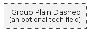

# Group Plain Dashed

```text
azure-v2/Group/GroupPlainDashed
```

```text
include('azure-v2/Group/GroupPlainDashed')
```

|group|
|---|
||


## group
### Load remotely
```plantuml
@startuml
' configures the library
!global $LIB_BASE_LOCATION="https://raw.githubusercontent.com/tmorin/plantuml-libs/master/dist"
' loads the library
!include $LIB_BASE_LOCATION/bootstrap.puml
' loads the azure-v2 bootstrap
include('azure-v2/bootstrap')
' loads the GroupPlainDashed element
include('azure-v2/Group/GroupPlainDashed')
GroupPlainDashed('group_plain_dashed', 'Group Plain Dashed', 'an optional tech field')
@enduml
```
### Load locally
```plantuml
@startuml
' configures the library
!global $INCLUSION_MODE="local"
!global $LIB_BASE_LOCATION="../.."
' loads the library
!include $LIB_BASE_LOCATION/bootstrap.puml
' loads the azure-v2 bootstrap
include('azure-v2/bootstrap')
' loads the GroupPlainDashed element
include('azure-v2/Group/GroupPlainDashed')
GroupPlainDashed('group_plain_dashed', 'Group Plain Dashed', 'an optional tech field')
@enduml
```

