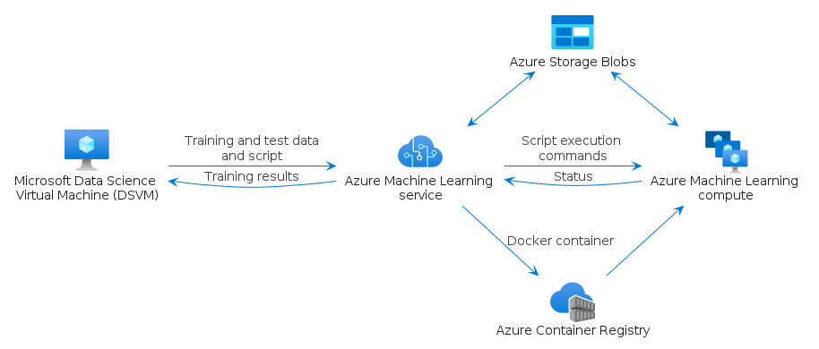

# azure-v2


## Bootstrap

The package handles its own bootstrap.

```plantuml
' loads the azure-v2 bootstrap
include('azure-v2/bootstrap')
```


## Style

The package handles its own style.

The bootstrap loads the style too! ;)

```plantuml
' loads the azure-v2 style
include('azure-v2/style')
```


# Modules

The package provides 2 modules.


- [Item](item.md) with 313 elements
- [Group](group.md) with 7 elements

# Examples

The package provides 1 examples.


## scikit learn and deep learning
<br>
[The source file.](../azure-v2/examples/scikit_learn_and_deep_learning.puml)

