# Item

The module Item contains 313 entries.

- [AiMachineLearning](#family-aimachinelearning)
- [Analytics](#family-analytics)
- [AppServices](#family-appservices)
- [AzureStack](#family-azurestack)
- [AzureVMwareSolution](#family-azurevmwaresolution)
- [Blockchain](#family-blockchain)
- [Compute](#family-compute)
- [Containers](#family-containers)
- [Cxp](#family-cxp)
- [Databases](#family-databases)
- [DevOps](#family-devops)
- [General](#family-general)
- [Identity](#family-identity)
- [Integration](#family-integration)
- [InternetOfThings](#family-internetofthings)
- [Intune](#family-intune)
- [IoT](#family-iot)
- [ManagementGovernance](#family-managementgovernance)
- [Migrate](#family-migrate)
- [MixedReality](#family-mixedreality)
- [Monitor](#family-monitor)
- [Networking](#family-networking)
- [Other](#family-other)
- [Preview](#family-preview)
- [Security](#family-security)
- [Storage](#family-storage)
- [Web](#family-web)

## AiMachineLearning

| |Name|
|:---:|---|
||[azure-v2/Item/AiMachineLearning/ServiceBotServices](../azure-v2/Item/AiMachineLearning/ServiceBotServices.md)
||[azure-v2/Item/AiMachineLearning/ServiceCognitiveServices](../azure-v2/Item/AiMachineLearning/ServiceCognitiveServices.md)

## Analytics

| |Name|
|:---:|---|
||[azure-v2/Item/Analytics/ServiceAnalysisServices](../azure-v2/Item/Analytics/ServiceAnalysisServices.md)
|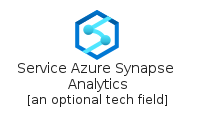|[azure-v2/Item/Analytics/ServiceAzureSynapseAnalytics](../azure-v2/Item/Analytics/ServiceAzureSynapseAnalytics.md)
|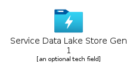|[azure-v2/Item/Analytics/ServiceDataLakeStoreGen1](../azure-v2/Item/Analytics/ServiceDataLakeStoreGen1.md)
||[azure-v2/Item/Analytics/ServiceEventHubClusters](../azure-v2/Item/Analytics/ServiceEventHubClusters.md)
||[azure-v2/Item/Analytics/ServiceEventHubs](../azure-v2/Item/Analytics/ServiceEventHubs.md)
||[azure-v2/Item/Analytics/ServiceHdInsightClusters](../azure-v2/Item/Analytics/ServiceHdInsightClusters.md)
|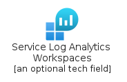|[azure-v2/Item/Analytics/ServiceLogAnalyticsWorkspaces](../azure-v2/Item/Analytics/ServiceLogAnalyticsWorkspaces.md)
||[azure-v2/Item/Analytics/ServiceStreamAnalyticsJobs](../azure-v2/Item/Analytics/ServiceStreamAnalyticsJobs.md)

## AppServices

| |Name|
|:---:|---|
||[azure-v2/Item/AppServices/ServiceApiManagementServices](../azure-v2/Item/AppServices/ServiceApiManagementServices.md)
||[azure-v2/Item/AppServices/ServiceAppServiceCertificates](../azure-v2/Item/AppServices/ServiceAppServiceCertificates.md)
||[azure-v2/Item/AppServices/ServiceAppServiceDomains](../azure-v2/Item/AppServices/ServiceAppServiceDomains.md)
||[azure-v2/Item/AppServices/ServiceAppServiceEnvironments](../azure-v2/Item/AppServices/ServiceAppServiceEnvironments.md)
||[azure-v2/Item/AppServices/ServiceAppServicePlans](../azure-v2/Item/AppServices/ServiceAppServicePlans.md)
||[azure-v2/Item/AppServices/ServiceAppServices](../azure-v2/Item/AppServices/ServiceAppServices.md)
||[azure-v2/Item/AppServices/ServiceCdnProfiles](../azure-v2/Item/AppServices/ServiceCdnProfiles.md)
||[azure-v2/Item/AppServices/ServiceNotificationHubs](../azure-v2/Item/AppServices/ServiceNotificationHubs.md)
||[azure-v2/Item/AppServices/ServiceSearchServices](../azure-v2/Item/AppServices/ServiceSearchServices.md)

## AzureStack

| |Name|
|:---:|---|
|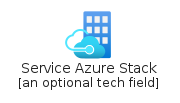|[azure-v2/Item/AzureStack/ServiceAzureStack](../azure-v2/Item/AzureStack/ServiceAzureStack.md)
|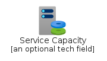|[azure-v2/Item/AzureStack/ServiceCapacity](../azure-v2/Item/AzureStack/ServiceCapacity.md)
|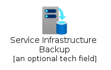|[azure-v2/Item/AzureStack/ServiceInfrastructureBackup](../azure-v2/Item/AzureStack/ServiceInfrastructureBackup.md)
||[azure-v2/Item/AzureStack/ServiceMultiTenancy](../azure-v2/Item/AzureStack/ServiceMultiTenancy.md)
||[azure-v2/Item/AzureStack/ServiceOffers](../azure-v2/Item/AzureStack/ServiceOffers.md)
||[azure-v2/Item/AzureStack/ServicePlans](../azure-v2/Item/AzureStack/ServicePlans.md)
||[azure-v2/Item/AzureStack/ServiceUpdates](../azure-v2/Item/AzureStack/ServiceUpdates.md)
||[azure-v2/Item/AzureStack/ServiceUserSubscriptions](../azure-v2/Item/AzureStack/ServiceUserSubscriptions.md)

## AzureVMwareSolution

| |Name|
|:---:|---|
||[azure-v2/Item/AzureVMwareSolution/ServiceAvs](../azure-v2/Item/AzureVMwareSolution/ServiceAvs.md)

## Blockchain

| |Name|
|:---:|---|
||[azure-v2/Item/Blockchain/ServiceAbsMember](../azure-v2/Item/Blockchain/ServiceAbsMember.md)
||[azure-v2/Item/Blockchain/ServiceAzureBlockchainService](../azure-v2/Item/Blockchain/ServiceAzureBlockchainService.md)
||[azure-v2/Item/Blockchain/ServiceAzureTokenService](../azure-v2/Item/Blockchain/ServiceAzureTokenService.md)
||[azure-v2/Item/Blockchain/ServiceConsortium](../azure-v2/Item/Blockchain/ServiceConsortium.md)
||[azure-v2/Item/Blockchain/ServiceOutboundConnection](../azure-v2/Item/Blockchain/ServiceOutboundConnection.md)

## Compute

| |Name|
|:---:|---|
||[azure-v2/Item/Compute/ServiceAppServices](../azure-v2/Item/Compute/ServiceAppServices.md)
||[azure-v2/Item/Compute/ServiceAvailabilitySets](../azure-v2/Item/Compute/ServiceAvailabilitySets.md)
||[azure-v2/Item/Compute/ServiceBatchAccounts](../azure-v2/Item/Compute/ServiceBatchAccounts.md)
||[azure-v2/Item/Compute/ServiceCloudServicesClassic](../azure-v2/Item/Compute/ServiceCloudServicesClassic.md)
||[azure-v2/Item/Compute/ServiceContainerInstances](../azure-v2/Item/Compute/ServiceContainerInstances.md)
||[azure-v2/Item/Compute/ServiceContainerServicesDeprecated](../azure-v2/Item/Compute/ServiceContainerServicesDeprecated.md)
||[azure-v2/Item/Compute/ServiceDiskEncryptionSets](../azure-v2/Item/Compute/ServiceDiskEncryptionSets.md)
||[azure-v2/Item/Compute/ServiceDisks](../azure-v2/Item/Compute/ServiceDisks.md)
||[azure-v2/Item/Compute/ServiceDisksClassic](../azure-v2/Item/Compute/ServiceDisksClassic.md)
||[azure-v2/Item/Compute/ServiceDisksSnapshots](../azure-v2/Item/Compute/ServiceDisksSnapshots.md)
||[azure-v2/Item/Compute/ServiceFunctionApps](../azure-v2/Item/Compute/ServiceFunctionApps.md)
||[azure-v2/Item/Compute/ServiceImageDefinitions](../azure-v2/Item/Compute/ServiceImageDefinitions.md)
||[azure-v2/Item/Compute/ServiceImages](../azure-v2/Item/Compute/ServiceImages.md)
||[azure-v2/Item/Compute/ServiceImageVersions](../azure-v2/Item/Compute/ServiceImageVersions.md)
||[azure-v2/Item/Compute/ServiceKubernetesServices](../azure-v2/Item/Compute/ServiceKubernetesServices.md)
||[azure-v2/Item/Compute/ServiceMeshApplications](../azure-v2/Item/Compute/ServiceMeshApplications.md)
||[azure-v2/Item/Compute/ServiceOsImagesClassic](../azure-v2/Item/Compute/ServiceOsImagesClassic.md)
||[azure-v2/Item/Compute/ServiceServiceFabricClusters](../azure-v2/Item/Compute/ServiceServiceFabricClusters.md)
||[azure-v2/Item/Compute/ServiceSharedImageGalleries](../azure-v2/Item/Compute/ServiceSharedImageGalleries.md)
|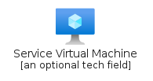|[azure-v2/Item/Compute/ServiceVirtualMachine](../azure-v2/Item/Compute/ServiceVirtualMachine.md)
||[azure-v2/Item/Compute/ServiceVirtualMachinesClassic](../azure-v2/Item/Compute/ServiceVirtualMachinesClassic.md)
||[azure-v2/Item/Compute/ServiceVmImagesClassic](../azure-v2/Item/Compute/ServiceVmImagesClassic.md)
|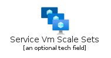|[azure-v2/Item/Compute/ServiceVmScaleSets](../azure-v2/Item/Compute/ServiceVmScaleSets.md)
||[azure-v2/Item/Compute/ServiceWorkspaces](../azure-v2/Item/Compute/ServiceWorkspaces.md)

## Containers

| |Name|
|:---:|---|
||[azure-v2/Item/Containers/ServiceAppServices](../azure-v2/Item/Containers/ServiceAppServices.md)
||[azure-v2/Item/Containers/ServiceBatchAccounts](../azure-v2/Item/Containers/ServiceBatchAccounts.md)
||[azure-v2/Item/Containers/ServiceContainerInstances](../azure-v2/Item/Containers/ServiceContainerInstances.md)
||[azure-v2/Item/Containers/ServiceContainerRegistries](../azure-v2/Item/Containers/ServiceContainerRegistries.md)
||[azure-v2/Item/Containers/ServiceKubernetesServices](../azure-v2/Item/Containers/ServiceKubernetesServices.md)
||[azure-v2/Item/Containers/ServiceServiceFabricClusters](../azure-v2/Item/Containers/ServiceServiceFabricClusters.md)

## Cxp

| |Name|
|:---:|---|
||[azure-v2/Item/Cxp/ServiceElixir](../azure-v2/Item/Cxp/ServiceElixir.md)
||[azure-v2/Item/Cxp/ServiceElixirPurple](../azure-v2/Item/Cxp/ServiceElixirPurple.md)

## Databases

| |Name|
|:---:|---|
||[azure-v2/Item/Databases/ServiceAzureCosmosDb](../azure-v2/Item/Databases/ServiceAzureCosmosDb.md)
||[azure-v2/Item/Databases/ServiceAzureDatabaseMariaDbServer](../azure-v2/Item/Databases/ServiceAzureDatabaseMariaDbServer.md)
|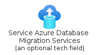|[azure-v2/Item/Databases/ServiceAzureDatabaseMigrationServices](../azure-v2/Item/Databases/ServiceAzureDatabaseMigrationServices.md)
||[azure-v2/Item/Databases/ServiceAzureDatabaseMySqlServer](../azure-v2/Item/Databases/ServiceAzureDatabaseMySqlServer.md)
||[azure-v2/Item/Databases/ServiceAzureDatabasePostgreSqlServer](../azure-v2/Item/Databases/ServiceAzureDatabasePostgreSqlServer.md)
||[azure-v2/Item/Databases/ServiceAzureDataExplorerClusters](../azure-v2/Item/Databases/ServiceAzureDataExplorerClusters.md)
||[azure-v2/Item/Databases/ServiceAzureSqlServerStretchDatabases](../azure-v2/Item/Databases/ServiceAzureSqlServerStretchDatabases.md)
||[azure-v2/Item/Databases/ServiceAzureSqlVm](../azure-v2/Item/Databases/ServiceAzureSqlVm.md)
||[azure-v2/Item/Databases/ServiceAzureSynapseAnalytics](../azure-v2/Item/Databases/ServiceAzureSynapseAnalytics.md)
||[azure-v2/Item/Databases/ServiceCacheRedis](../azure-v2/Item/Databases/ServiceCacheRedis.md)
||[azure-v2/Item/Databases/ServiceDataFactory](../azure-v2/Item/Databases/ServiceDataFactory.md)
||[azure-v2/Item/Databases/ServiceElasticJobAgents](../azure-v2/Item/Databases/ServiceElasticJobAgents.md)
||[azure-v2/Item/Databases/ServiceInstancePools](../azure-v2/Item/Databases/ServiceInstancePools.md)
||[azure-v2/Item/Databases/ServiceManagedDatabase](../azure-v2/Item/Databases/ServiceManagedDatabase.md)
||[azure-v2/Item/Databases/ServiceSqlDatabase](../azure-v2/Item/Databases/ServiceSqlDatabase.md)
||[azure-v2/Item/Databases/ServiceSqlDataWarehouses](../azure-v2/Item/Databases/ServiceSqlDataWarehouses.md)
||[azure-v2/Item/Databases/ServiceSqlElasticPools](../azure-v2/Item/Databases/ServiceSqlElasticPools.md)
||[azure-v2/Item/Databases/ServiceSqlManagedInstance](../azure-v2/Item/Databases/ServiceSqlManagedInstance.md)
||[azure-v2/Item/Databases/ServiceSqlServer](../azure-v2/Item/Databases/ServiceSqlServer.md)
||[azure-v2/Item/Databases/ServiceVirtualClusters](../azure-v2/Item/Databases/ServiceVirtualClusters.md)

## DevOps

| |Name|
|:---:|---|
||[azure-v2/Item/DevOps/ServiceApplicationInsights](../azure-v2/Item/DevOps/ServiceApplicationInsights.md)
||[azure-v2/Item/DevOps/ServiceAzureDevOps](../azure-v2/Item/DevOps/ServiceAzureDevOps.md)
||[azure-v2/Item/DevOps/ServiceDevTestLabs](../azure-v2/Item/DevOps/ServiceDevTestLabs.md)
||[azure-v2/Item/DevOps/ServiceLabServices](../azure-v2/Item/DevOps/ServiceLabServices.md)

## General

| |Name|
|:---:|---|
||[azure-v2/Item/General/ServiceAllResources](../azure-v2/Item/General/ServiceAllResources.md)
||[azure-v2/Item/General/ServiceBacklog](../azure-v2/Item/General/ServiceBacklog.md)
||[azure-v2/Item/General/ServiceBizTalk](../azure-v2/Item/General/ServiceBizTalk.md)
||[azure-v2/Item/General/ServiceBlobBlock](../azure-v2/Item/General/ServiceBlobBlock.md)
||[azure-v2/Item/General/ServiceBlobPage](../azure-v2/Item/General/ServiceBlobPage.md)
||[azure-v2/Item/General/ServiceBranch](../azure-v2/Item/General/ServiceBranch.md)
||[azure-v2/Item/General/ServiceBrowser](../azure-v2/Item/General/ServiceBrowser.md)
||[azure-v2/Item/General/ServiceBug](../azure-v2/Item/General/ServiceBug.md)
|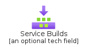|[azure-v2/Item/General/ServiceBuilds](../azure-v2/Item/General/ServiceBuilds.md)
||[azure-v2/Item/General/ServiceCache](../azure-v2/Item/General/ServiceCache.md)
||[azure-v2/Item/General/ServiceCode](../azure-v2/Item/General/ServiceCode.md)
||[azure-v2/Item/General/ServiceCommit](../azure-v2/Item/General/ServiceCommit.md)
||[azure-v2/Item/General/ServiceControls](../azure-v2/Item/General/ServiceControls.md)
||[azure-v2/Item/General/ServiceControlsHorizontal](../azure-v2/Item/General/ServiceControlsHorizontal.md)
||[azure-v2/Item/General/ServiceCostAlerts](../azure-v2/Item/General/ServiceCostAlerts.md)
||[azure-v2/Item/General/ServiceCostAnalysis](../azure-v2/Item/General/ServiceCostAnalysis.md)
||[azure-v2/Item/General/ServiceCostBudgets](../azure-v2/Item/General/ServiceCostBudgets.md)
||[azure-v2/Item/General/ServiceCostManagement](../azure-v2/Item/General/ServiceCostManagement.md)
||[azure-v2/Item/General/ServiceCounter](../azure-v2/Item/General/ServiceCounter.md)
||[azure-v2/Item/General/ServiceCubes](../azure-v2/Item/General/ServiceCubes.md)
||[azure-v2/Item/General/ServiceDashboard](../azure-v2/Item/General/ServiceDashboard.md)
||[azure-v2/Item/General/ServiceDevConsole](../azure-v2/Item/General/ServiceDevConsole.md)
||[azure-v2/Item/General/ServiceDownload](../azure-v2/Item/General/ServiceDownload.md)
||[azure-v2/Item/General/ServiceError](../azure-v2/Item/General/ServiceError.md)
||[azure-v2/Item/General/ServiceExtensions](../azure-v2/Item/General/ServiceExtensions.md)
||[azure-v2/Item/General/ServiceFile](../azure-v2/Item/General/ServiceFile.md)
||[azure-v2/Item/General/ServiceFiles](../azure-v2/Item/General/ServiceFiles.md)
||[azure-v2/Item/General/ServiceFolderBlank](../azure-v2/Item/General/ServiceFolderBlank.md)
||[azure-v2/Item/General/ServiceFolderWebsite](../azure-v2/Item/General/ServiceFolderWebsite.md)
||[azure-v2/Item/General/ServiceFtp](../azure-v2/Item/General/ServiceFtp.md)
||[azure-v2/Item/General/ServiceGear](../azure-v2/Item/General/ServiceGear.md)
||[azure-v2/Item/General/ServiceGlobe](../azure-v2/Item/General/ServiceGlobe.md)
||[azure-v2/Item/General/ServiceGlobeError](../azure-v2/Item/General/ServiceGlobeError.md)
||[azure-v2/Item/General/ServiceGlobeSuccess](../azure-v2/Item/General/ServiceGlobeSuccess.md)
||[azure-v2/Item/General/ServiceGlobeWarning](../azure-v2/Item/General/ServiceGlobeWarning.md)
||[azure-v2/Item/General/ServiceGuide](../azure-v2/Item/General/ServiceGuide.md)
||[azure-v2/Item/General/ServiceHeart](../azure-v2/Item/General/ServiceHeart.md)
||[azure-v2/Item/General/ServiceHelpAndSupport](../azure-v2/Item/General/ServiceHelpAndSupport.md)
||[azure-v2/Item/General/ServiceImage](../azure-v2/Item/General/ServiceImage.md)
||[azure-v2/Item/General/ServiceInformation](../azure-v2/Item/General/ServiceInformation.md)
||[azure-v2/Item/General/ServiceInputOutput](../azure-v2/Item/General/ServiceInputOutput.md)
||[azure-v2/Item/General/ServiceJourneyHub](../azure-v2/Item/General/ServiceJourneyHub.md)
||[azure-v2/Item/General/ServiceLaunchPortal](../azure-v2/Item/General/ServiceLaunchPortal.md)
||[azure-v2/Item/General/ServiceLearn](../azure-v2/Item/General/ServiceLearn.md)
||[azure-v2/Item/General/ServiceLoadTest](../azure-v2/Item/General/ServiceLoadTest.md)
||[azure-v2/Item/General/ServiceLocation](../azure-v2/Item/General/ServiceLocation.md)
||[azure-v2/Item/General/ServiceLogStreaming](../azure-v2/Item/General/ServiceLogStreaming.md)
||[azure-v2/Item/General/ServiceManagementGroups](../azure-v2/Item/General/ServiceManagementGroups.md)
||[azure-v2/Item/General/ServiceManagementPortal](../azure-v2/Item/General/ServiceManagementPortal.md)
||[azure-v2/Item/General/ServiceMarketplace](../azure-v2/Item/General/ServiceMarketplace.md)
||[azure-v2/Item/General/ServiceMedia](../azure-v2/Item/General/ServiceMedia.md)
||[azure-v2/Item/General/ServiceMediaFile](../azure-v2/Item/General/ServiceMediaFile.md)
||[azure-v2/Item/General/ServiceMobile](../azure-v2/Item/General/ServiceMobile.md)
||[azure-v2/Item/General/ServiceMobileEngagement](../azure-v2/Item/General/ServiceMobileEngagement.md)
||[azure-v2/Item/General/ServiceModule](../azure-v2/Item/General/ServiceModule.md)
||[azure-v2/Item/General/ServicePower](../azure-v2/Item/General/ServicePower.md)
||[azure-v2/Item/General/ServicePowershell](../azure-v2/Item/General/ServicePowershell.md)
||[azure-v2/Item/General/ServicePowerUp](../azure-v2/Item/General/ServicePowerUp.md)
||[azure-v2/Item/General/ServicePreview](../azure-v2/Item/General/ServicePreview.md)
||[azure-v2/Item/General/ServiceProcessExplorer](../azure-v2/Item/General/ServiceProcessExplorer.md)
||[azure-v2/Item/General/ServiceProductionReadyDatabase](../azure-v2/Item/General/ServiceProductionReadyDatabase.md)
||[azure-v2/Item/General/ServiceQuickstartCenter](../azure-v2/Item/General/ServiceQuickstartCenter.md)
||[azure-v2/Item/General/ServiceRecent](../azure-v2/Item/General/ServiceRecent.md)
||[azure-v2/Item/General/ServiceReservations](../azure-v2/Item/General/ServiceReservations.md)
||[azure-v2/Item/General/ServiceResourceGroupList](../azure-v2/Item/General/ServiceResourceGroupList.md)
||[azure-v2/Item/General/ServiceResourceGroups](../azure-v2/Item/General/ServiceResourceGroups.md)
||[azure-v2/Item/General/ServiceResourceLinked](../azure-v2/Item/General/ServiceResourceLinked.md)
||[azure-v2/Item/General/ServiceScale](../azure-v2/Item/General/ServiceScale.md)
||[azure-v2/Item/General/ServiceScheduler](../azure-v2/Item/General/ServiceScheduler.md)
||[azure-v2/Item/General/ServiceSearch](../azure-v2/Item/General/ServiceSearch.md)
||[azure-v2/Item/General/ServiceSearchGrid](../azure-v2/Item/General/ServiceSearchGrid.md)
||[azure-v2/Item/General/ServiceServerFarm](../azure-v2/Item/General/ServiceServerFarm.md)
||[azure-v2/Item/General/ServiceServiceBus](../azure-v2/Item/General/ServiceServiceBus.md)
||[azure-v2/Item/General/ServiceServiceHealth](../azure-v2/Item/General/ServiceServiceHealth.md)
||[azure-v2/Item/General/ServiceSsd](../azure-v2/Item/General/ServiceSsd.md)
||[azure-v2/Item/General/ServiceStorageAzureFiles](../azure-v2/Item/General/ServiceStorageAzureFiles.md)
|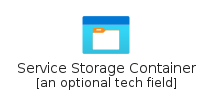|[azure-v2/Item/General/ServiceStorageContainer](../azure-v2/Item/General/ServiceStorageContainer.md)
||[azure-v2/Item/General/ServiceStorageQueue](../azure-v2/Item/General/ServiceStorageQueue.md)
||[azure-v2/Item/General/ServiceSubscriptions](../azure-v2/Item/General/ServiceSubscriptions.md)
||[azure-v2/Item/General/ServiceTable](../azure-v2/Item/General/ServiceTable.md)
||[azure-v2/Item/General/ServiceTags](../azure-v2/Item/General/ServiceTags.md)
||[azure-v2/Item/General/ServiceTfsVcRepository](../azure-v2/Item/General/ServiceTfsVcRepository.md)
||[azure-v2/Item/General/ServiceToolbox](../azure-v2/Item/General/ServiceToolbox.md)
||[azure-v2/Item/General/ServiceVersions](../azure-v2/Item/General/ServiceVersions.md)
||[azure-v2/Item/General/ServiceWebsitePower](../azure-v2/Item/General/ServiceWebsitePower.md)
||[azure-v2/Item/General/ServiceWebsiteStaging](../azure-v2/Item/General/ServiceWebsiteStaging.md)
||[azure-v2/Item/General/ServiceWebSlots](../azure-v2/Item/General/ServiceWebSlots.md)
||[azure-v2/Item/General/ServiceWebTest](../azure-v2/Item/General/ServiceWebTest.md)
||[azure-v2/Item/General/ServiceWorkbooks](../azure-v2/Item/General/ServiceWorkbooks.md)
||[azure-v2/Item/General/ServiceWorkflow](../azure-v2/Item/General/ServiceWorkflow.md)

## Identity

| |Name|
|:---:|---|
||[azure-v2/Item/Identity/ServiceActiveDirectoryConnectHealth](../azure-v2/Item/Identity/ServiceActiveDirectoryConnectHealth.md)
||[azure-v2/Item/Identity/ServiceAppRegistrations](../azure-v2/Item/Identity/ServiceAppRegistrations.md)
||[azure-v2/Item/Identity/ServiceAzureActiveDirectory](../azure-v2/Item/Identity/ServiceAzureActiveDirectory.md)
||[azure-v2/Item/Identity/ServiceAzureAdB2C](../azure-v2/Item/Identity/ServiceAzureAdB2C.md)
||[azure-v2/Item/Identity/ServiceAzureAdDomainServices](../azure-v2/Item/Identity/ServiceAzureAdDomainServices.md)
||[azure-v2/Item/Identity/ServiceEnterpriseApplications](../azure-v2/Item/Identity/ServiceEnterpriseApplications.md)
||[azure-v2/Item/Identity/ServiceGroups](../azure-v2/Item/Identity/ServiceGroups.md)
||[azure-v2/Item/Identity/ServiceIdentityGovernance](../azure-v2/Item/Identity/ServiceIdentityGovernance.md)
||[azure-v2/Item/Identity/ServiceUsers](../azure-v2/Item/Identity/ServiceUsers.md)

## Integration

| |Name|
|:---:|---|
||[azure-v2/Item/Integration/ServiceApiManagementServices](../azure-v2/Item/Integration/ServiceApiManagementServices.md)
||[azure-v2/Item/Integration/ServiceAzureDataCatalog](../azure-v2/Item/Integration/ServiceAzureDataCatalog.md)
||[azure-v2/Item/Integration/ServiceEventGridDomains](../azure-v2/Item/Integration/ServiceEventGridDomains.md)
||[azure-v2/Item/Integration/ServiceEventGridSubscriptions](../azure-v2/Item/Integration/ServiceEventGridSubscriptions.md)
||[azure-v2/Item/Integration/ServiceEventGridTopics](../azure-v2/Item/Integration/ServiceEventGridTopics.md)
||[azure-v2/Item/Integration/ServiceIntegrationAccounts](../azure-v2/Item/Integration/ServiceIntegrationAccounts.md)
||[azure-v2/Item/Integration/ServiceLogicApps](../azure-v2/Item/Integration/ServiceLogicApps.md)
||[azure-v2/Item/Integration/ServiceRelays](../azure-v2/Item/Integration/ServiceRelays.md)
||[azure-v2/Item/Integration/ServiceSoftwareAsAService](../azure-v2/Item/Integration/ServiceSoftwareAsAService.md)
|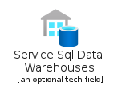|[azure-v2/Item/Integration/ServiceSqlDataWarehouses](../azure-v2/Item/Integration/ServiceSqlDataWarehouses.md)

## InternetOfThings

| |Name|
|:---:|---|
||[azure-v2/Item/InternetOfThings/ServiceDigitalTwins](../azure-v2/Item/InternetOfThings/ServiceDigitalTwins.md)

## Intune

| |Name|
|:---:|---|
||[azure-v2/Item/Intune/ServiceAzureAdRolesAndAdministrators](../azure-v2/Item/Intune/ServiceAzureAdRolesAndAdministrators.md)
||[azure-v2/Item/Intune/ServiceDeviceSecurityApple](../azure-v2/Item/Intune/ServiceDeviceSecurityApple.md)
||[azure-v2/Item/Intune/ServiceDeviceSecurityGoogle](../azure-v2/Item/Intune/ServiceDeviceSecurityGoogle.md)
||[azure-v2/Item/Intune/ServiceDeviceSecurityWindows](../azure-v2/Item/Intune/ServiceDeviceSecurityWindows.md)

## IoT

| |Name|
|:---:|---|
|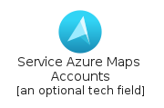|[azure-v2/Item/IoT/ServiceAzureMapsAccounts](../azure-v2/Item/IoT/ServiceAzureMapsAccounts.md)
||[azure-v2/Item/IoT/ServiceDeviceProvisioningServices](../azure-v2/Item/IoT/ServiceDeviceProvisioningServices.md)
||[azure-v2/Item/IoT/ServiceEventHubs](../azure-v2/Item/IoT/ServiceEventHubs.md)
||[azure-v2/Item/IoT/ServiceFunctionApps](../azure-v2/Item/IoT/ServiceFunctionApps.md)
||[azure-v2/Item/IoT/ServiceIoTCentralApplications](../azure-v2/Item/IoT/ServiceIoTCentralApplications.md)
||[azure-v2/Item/IoT/ServiceIoTHub](../azure-v2/Item/IoT/ServiceIoTHub.md)
||[azure-v2/Item/IoT/ServiceLogicApps](../azure-v2/Item/IoT/ServiceLogicApps.md)
||[azure-v2/Item/IoT/ServiceNotificationHubs](../azure-v2/Item/IoT/ServiceNotificationHubs.md)
||[azure-v2/Item/IoT/ServiceStreamAnalyticsJobs](../azure-v2/Item/IoT/ServiceStreamAnalyticsJobs.md)
||[azure-v2/Item/IoT/ServiceTimeSeriesInsightsEnvironments](../azure-v2/Item/IoT/ServiceTimeSeriesInsightsEnvironments.md)
||[azure-v2/Item/IoT/ServiceTimeSeriesInsightsEventSources](../azure-v2/Item/IoT/ServiceTimeSeriesInsightsEventSources.md)

## ManagementGovernance

| |Name|
|:---:|---|
||[azure-v2/Item/ManagementGovernance/ServiceActivityLog](../azure-v2/Item/ManagementGovernance/ServiceActivityLog.md)
||[azure-v2/Item/ManagementGovernance/ServiceAdvisor](../azure-v2/Item/ManagementGovernance/ServiceAdvisor.md)
||[azure-v2/Item/ManagementGovernance/ServiceAlerts](../azure-v2/Item/ManagementGovernance/ServiceAlerts.md)
||[azure-v2/Item/ManagementGovernance/ServiceApplicationInsights](../azure-v2/Item/ManagementGovernance/ServiceApplicationInsights.md)
||[azure-v2/Item/ManagementGovernance/ServiceAutomationAccounts](../azure-v2/Item/ManagementGovernance/ServiceAutomationAccounts.md)
||[azure-v2/Item/ManagementGovernance/ServiceAzureArc](../azure-v2/Item/ManagementGovernance/ServiceAzureArc.md)
||[azure-v2/Item/ManagementGovernance/ServiceAzureLighthouse](../azure-v2/Item/ManagementGovernance/ServiceAzureLighthouse.md)
||[azure-v2/Item/ManagementGovernance/ServiceBlueprints](../azure-v2/Item/ManagementGovernance/ServiceBlueprints.md)
||[azure-v2/Item/ManagementGovernance/ServiceCompliance](../azure-v2/Item/ManagementGovernance/ServiceCompliance.md)
||[azure-v2/Item/ManagementGovernance/ServiceDiagnosticsSettings](../azure-v2/Item/ManagementGovernance/ServiceDiagnosticsSettings.md)
||[azure-v2/Item/ManagementGovernance/ServiceEducation](../azure-v2/Item/ManagementGovernance/ServiceEducation.md)
||[azure-v2/Item/ManagementGovernance/ServiceLogAnalyticsWorkspaces](../azure-v2/Item/ManagementGovernance/ServiceLogAnalyticsWorkspaces.md)
||[azure-v2/Item/ManagementGovernance/ServiceMachinesAzureArc](../azure-v2/Item/ManagementGovernance/ServiceMachinesAzureArc.md)
||[azure-v2/Item/ManagementGovernance/ServiceManagedApplicationsCenter](../azure-v2/Item/ManagementGovernance/ServiceManagedApplicationsCenter.md)
||[azure-v2/Item/ManagementGovernance/ServiceMetrics](../azure-v2/Item/ManagementGovernance/ServiceMetrics.md)
||[azure-v2/Item/ManagementGovernance/ServiceMonitor](../azure-v2/Item/ManagementGovernance/ServiceMonitor.md)
||[azure-v2/Item/ManagementGovernance/ServiceMyCustomers](../azure-v2/Item/ManagementGovernance/ServiceMyCustomers.md)
||[azure-v2/Item/ManagementGovernance/ServiceOperationLogClassic](../azure-v2/Item/ManagementGovernance/ServiceOperationLogClassic.md)
||[azure-v2/Item/ManagementGovernance/ServicePolicy](../azure-v2/Item/ManagementGovernance/ServicePolicy.md)
||[azure-v2/Item/ManagementGovernance/ServiceRecoveryServicesVaults](../azure-v2/Item/ManagementGovernance/ServiceRecoveryServicesVaults.md)
||[azure-v2/Item/ManagementGovernance/ServiceResourceGraphExplorer](../azure-v2/Item/ManagementGovernance/ServiceResourceGraphExplorer.md)
||[azure-v2/Item/ManagementGovernance/ServiceServiceProviders](../azure-v2/Item/ManagementGovernance/ServiceServiceProviders.md)
||[azure-v2/Item/ManagementGovernance/ServiceSolutions](../azure-v2/Item/ManagementGovernance/ServiceSolutions.md)
||[azure-v2/Item/ManagementGovernance/ServiceUserPrivacy](../azure-v2/Item/ManagementGovernance/ServiceUserPrivacy.md)

## Migrate

| |Name|
|:---:|---|
||[azure-v2/Item/Migrate/ServiceAzureMigrate](../azure-v2/Item/Migrate/ServiceAzureMigrate.md)
||[azure-v2/Item/Migrate/ServiceDataBox](../azure-v2/Item/Migrate/ServiceDataBox.md)
||[azure-v2/Item/Migrate/ServiceDataBoxEdge](../azure-v2/Item/Migrate/ServiceDataBoxEdge.md)
||[azure-v2/Item/Migrate/ServiceRecoveryServicesVaults](../azure-v2/Item/Migrate/ServiceRecoveryServicesVaults.md)

## MixedReality

| |Name|
|:---:|---|
||[azure-v2/Item/MixedReality/ServiceRemoteRendering](../azure-v2/Item/MixedReality/ServiceRemoteRendering.md)

## Monitor

| |Name|
|:---:|---|
|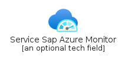|[azure-v2/Item/Monitor/ServiceSapAzureMonitor](../azure-v2/Item/Monitor/ServiceSapAzureMonitor.md)

## Networking

| |Name|
|:---:|---|
||[azure-v2/Item/Networking/ServiceApplicationGateways](../azure-v2/Item/Networking/ServiceApplicationGateways.md)
||[azure-v2/Item/Networking/ServiceAzureFirewallManager](../azure-v2/Item/Networking/ServiceAzureFirewallManager.md)
||[azure-v2/Item/Networking/ServiceCdnProfiles](../azure-v2/Item/Networking/ServiceCdnProfiles.md)
||[azure-v2/Item/Networking/ServiceConnections](../azure-v2/Item/Networking/ServiceConnections.md)
||[azure-v2/Item/Networking/ServiceDDoSProtectionPlans](../azure-v2/Item/Networking/ServiceDDoSProtectionPlans.md)
||[azure-v2/Item/Networking/ServiceDnsZones](../azure-v2/Item/Networking/ServiceDnsZones.md)
||[azure-v2/Item/Networking/ServiceExpressRouteCircuits](../azure-v2/Item/Networking/ServiceExpressRouteCircuits.md)
||[azure-v2/Item/Networking/ServiceFirewalls](../azure-v2/Item/Networking/ServiceFirewalls.md)
||[azure-v2/Item/Networking/ServiceFrontDoors](../azure-v2/Item/Networking/ServiceFrontDoors.md)
||[azure-v2/Item/Networking/ServiceIpGroups](../azure-v2/Item/Networking/ServiceIpGroups.md)
||[azure-v2/Item/Networking/ServiceLoadBalancers](../azure-v2/Item/Networking/ServiceLoadBalancers.md)
||[azure-v2/Item/Networking/ServiceNat](../azure-v2/Item/Networking/ServiceNat.md)
||[azure-v2/Item/Networking/ServiceNetworkInterfaces](../azure-v2/Item/Networking/ServiceNetworkInterfaces.md)
||[azure-v2/Item/Networking/ServiceNetworkSecurityGroups](../azure-v2/Item/Networking/ServiceNetworkSecurityGroups.md)
||[azure-v2/Item/Networking/ServiceNetworkWatcher](../azure-v2/Item/Networking/ServiceNetworkWatcher.md)
||[azure-v2/Item/Networking/ServicePrivateLink](../azure-v2/Item/Networking/ServicePrivateLink.md)
||[azure-v2/Item/Networking/ServicePrivateLinkService](../azure-v2/Item/Networking/ServicePrivateLinkService.md)
||[azure-v2/Item/Networking/ServiceProximityPlacementGroups](../azure-v2/Item/Networking/ServiceProximityPlacementGroups.md)
||[azure-v2/Item/Networking/ServicePublicIpAddresses](../azure-v2/Item/Networking/ServicePublicIpAddresses.md)
||[azure-v2/Item/Networking/ServicePublicIpAddressesClassic](../azure-v2/Item/Networking/ServicePublicIpAddressesClassic.md)
||[azure-v2/Item/Networking/ServicePublicIpPrefixes](../azure-v2/Item/Networking/ServicePublicIpPrefixes.md)
||[azure-v2/Item/Networking/ServiceReservedIpAddressesClassic](../azure-v2/Item/Networking/ServiceReservedIpAddressesClassic.md)
||[azure-v2/Item/Networking/ServiceRouteFilters](../azure-v2/Item/Networking/ServiceRouteFilters.md)
||[azure-v2/Item/Networking/ServiceRouteTables](../azure-v2/Item/Networking/ServiceRouteTables.md)
||[azure-v2/Item/Networking/ServiceServiceEndpointPolicies](../azure-v2/Item/Networking/ServiceServiceEndpointPolicies.md)
||[azure-v2/Item/Networking/ServiceTrafficManagerProfiles](../azure-v2/Item/Networking/ServiceTrafficManagerProfiles.md)
||[azure-v2/Item/Networking/ServiceVirtualNetworkGateways](../azure-v2/Item/Networking/ServiceVirtualNetworkGateways.md)
||[azure-v2/Item/Networking/ServiceVirtualNetworks](../azure-v2/Item/Networking/ServiceVirtualNetworks.md)
||[azure-v2/Item/Networking/ServiceVirtualNetworksClassic](../azure-v2/Item/Networking/ServiceVirtualNetworksClassic.md)
||[azure-v2/Item/Networking/ServiceVirtualWaNs](../azure-v2/Item/Networking/ServiceVirtualWaNs.md)
||[azure-v2/Item/Networking/ServiceWebApplicationFirewallPoliciesWaf](../azure-v2/Item/Networking/ServiceWebApplicationFirewallPoliciesWaf.md)

## Other

| |Name|
|:---:|---|
||[azure-v2/Item/Other/ServiceDetonation](../azure-v2/Item/Other/ServiceDetonation.md)
||[azure-v2/Item/Other/ServiceInstancePools](../azure-v2/Item/Other/ServiceInstancePools.md)
||[azure-v2/Item/Other/ServiceInternetAnalyzerProfiles](../azure-v2/Item/Other/ServiceInternetAnalyzerProfiles.md)
||[azure-v2/Item/Other/ServicePeeringService](../azure-v2/Item/Other/ServicePeeringService.md)
||[azure-v2/Item/Other/ServiceUniversalPrint](../azure-v2/Item/Other/ServiceUniversalPrint.md)
||[azure-v2/Item/Other/ServiceWindowsVirtualDesktop](../azure-v2/Item/Other/ServiceWindowsVirtualDesktop.md)

## Preview

| |Name|
|:---:|---|
||[azure-v2/Item/Preview/ServiceAzureCloudShell](../azure-v2/Item/Preview/ServiceAzureCloudShell.md)
||[azure-v2/Item/Preview/ServiceAzureSphere](../azure-v2/Item/Preview/ServiceAzureSphere.md)
||[azure-v2/Item/Preview/ServiceAzureWorkbooks](../azure-v2/Item/Preview/ServiceAzureWorkbooks.md)
||[azure-v2/Item/Preview/ServiceIoTEdge](../azure-v2/Item/Preview/ServiceIoTEdge.md)
||[azure-v2/Item/Preview/ServicePrivateLinkHub](../azure-v2/Item/Preview/ServicePrivateLinkHub.md)
||[azure-v2/Item/Preview/ServiceRtos](../azure-v2/Item/Preview/ServiceRtos.md)
||[azure-v2/Item/Preview/ServiceStaticApps](../azure-v2/Item/Preview/ServiceStaticApps.md)
||[azure-v2/Item/Preview/ServiceTimeSeriesDataSets](../azure-v2/Item/Preview/ServiceTimeSeriesDataSets.md)
||[azure-v2/Item/Preview/ServiceWebEnvironment](../azure-v2/Item/Preview/ServiceWebEnvironment.md)

## Security

| |Name|
|:---:|---|
||[azure-v2/Item/Security/ServiceApplicationSecurityGroups](../azure-v2/Item/Security/ServiceApplicationSecurityGroups.md)
||[azure-v2/Item/Security/ServiceAzureSentinel](../azure-v2/Item/Security/ServiceAzureSentinel.md)
||[azure-v2/Item/Security/ServiceConditionalAccess](../azure-v2/Item/Security/ServiceConditionalAccess.md)
||[azure-v2/Item/Security/ServiceExtendedSecurityUpdates](../azure-v2/Item/Security/ServiceExtendedSecurityUpdates.md)
||[azure-v2/Item/Security/ServiceKeyVaults](../azure-v2/Item/Security/ServiceKeyVaults.md)
||[azure-v2/Item/Security/ServiceSecurityCenter](../azure-v2/Item/Security/ServiceSecurityCenter.md)

## Storage

| |Name|
|:---:|---|
||[azure-v2/Item/Storage/ServiceAzureHcpCache](../azure-v2/Item/Storage/ServiceAzureHcpCache.md)
||[azure-v2/Item/Storage/ServiceAzureNetAppFiles](../azure-v2/Item/Storage/ServiceAzureNetAppFiles.md)
||[azure-v2/Item/Storage/ServiceAzureStackEdge](../azure-v2/Item/Storage/ServiceAzureStackEdge.md)
||[azure-v2/Item/Storage/ServiceDataBox](../azure-v2/Item/Storage/ServiceDataBox.md)
|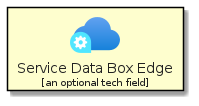|[azure-v2/Item/Storage/ServiceDataBoxEdge](../azure-v2/Item/Storage/ServiceDataBoxEdge.md)
|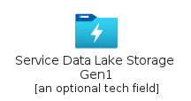|[azure-v2/Item/Storage/ServiceDataLakeStorageGen1](../azure-v2/Item/Storage/ServiceDataLakeStorageGen1.md)
||[azure-v2/Item/Storage/ServiceDataShareInvitations](../azure-v2/Item/Storage/ServiceDataShareInvitations.md)
|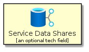|[azure-v2/Item/Storage/ServiceDataShares](../azure-v2/Item/Storage/ServiceDataShares.md)
||[azure-v2/Item/Storage/ServiceImportExportJobs](../azure-v2/Item/Storage/ServiceImportExportJobs.md)
||[azure-v2/Item/Storage/ServiceRecoveryServicesVaults](../azure-v2/Item/Storage/ServiceRecoveryServicesVaults.md)
||[azure-v2/Item/Storage/ServiceStorageAccounts](../azure-v2/Item/Storage/ServiceStorageAccounts.md)
||[azure-v2/Item/Storage/ServiceStorageAccountsClassic](../azure-v2/Item/Storage/ServiceStorageAccountsClassic.md)
||[azure-v2/Item/Storage/ServiceStorageSyncServices](../azure-v2/Item/Storage/ServiceStorageSyncServices.md)
|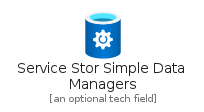|[azure-v2/Item/Storage/ServiceStorSimpleDataManagers](../azure-v2/Item/Storage/ServiceStorSimpleDataManagers.md)
||[azure-v2/Item/Storage/ServiceStorSimpleDeviceManagers](../azure-v2/Item/Storage/ServiceStorSimpleDeviceManagers.md)

## Web

| |Name|
|:---:|---|
||[azure-v2/Item/Web/ServiceAzureMediaService](../azure-v2/Item/Web/ServiceAzureMediaService.md)
||[azure-v2/Item/Web/ServiceNotificationHubNamespaces](../azure-v2/Item/Web/ServiceNotificationHubNamespaces.md)

