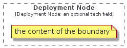

# Deployment Node

```text
c4model/Boundary/DeploymentNodeBoundary
```

```text
include('c4model/Boundary/DeploymentNodeBoundary')
```

|element|
|---|
||


## element
### Load remotely
```plantuml
@startuml
' configures the library
!global $LIB_BASE_LOCATION="https://raw.githubusercontent.com/tmorin/plantuml-libs/master/dist"
' loads the library
!include $LIB_BASE_LOCATION/bootstrap.puml
' loads the c4model bootstrap
include('c4model/bootstrap')
' loads the DeploymentNodeBoundary element
include('c4model/Boundary/DeploymentNodeBoundary')
DeploymentNodeBoundary('deployment_node_boundary', 'Deployment Node', 'an optional tech field') {
  note as note
  the content of the boundary
  end note
}
@enduml
```
### Load locally
```plantuml
@startuml
' configures the library
!global $INCLUSION_MODE="local"
!global $LIB_BASE_LOCATION="../.."
' loads the library
!include $LIB_BASE_LOCATION/bootstrap.puml
' loads the c4model bootstrap
include('c4model/bootstrap')
' loads the DeploymentNodeBoundary element
include('c4model/Boundary/DeploymentNodeBoundary')
DeploymentNodeBoundary('deployment_node_boundary', 'Deployment Node', 'an optional tech field') {
  note as note
  the content of the boundary
  end note
}
@enduml
```

