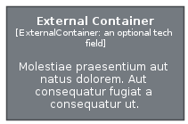

# External Container

```text
c4model/Element/ExternalContainer
```

```text
include('c4model/Element/ExternalContainer')
```

|element|
|---|
||


## element
### Load remotely
```plantuml
@startuml
' configures the library
!global $LIB_BASE_LOCATION="https://raw.githubusercontent.com/tmorin/plantuml-libs/master/dist"
' loads the library
!include $LIB_BASE_LOCATION/bootstrap.puml
' loads the c4model bootstrap
include('c4model/bootstrap')
' loads the ExternalContainer element
include('c4model/Element/ExternalContainer')
ExternalContainer('external_container', 'External Container', 'Molestiae praesentium aut natus dolorem. Aut consequatur fugiat a consequatur ut.', 'an optional tech field')
@enduml
```
### Load locally
```plantuml
@startuml
' configures the library
!global $INCLUSION_MODE="local"
!global $LIB_BASE_LOCATION="../.."
' loads the library
!include $LIB_BASE_LOCATION/bootstrap.puml
' loads the c4model bootstrap
include('c4model/bootstrap')
' loads the ExternalContainer element
include('c4model/Element/ExternalContainer')
ExternalContainer('external_container', 'External Container', 'Molestiae praesentium aut natus dolorem. Aut consequatur fugiat a consequatur ut.', 'an optional tech field')
@enduml
```

