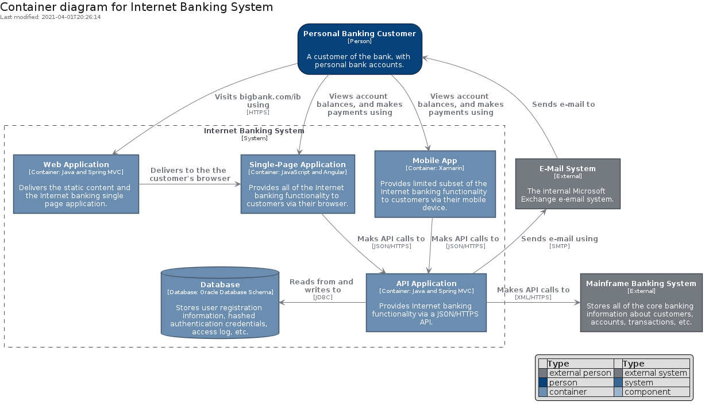
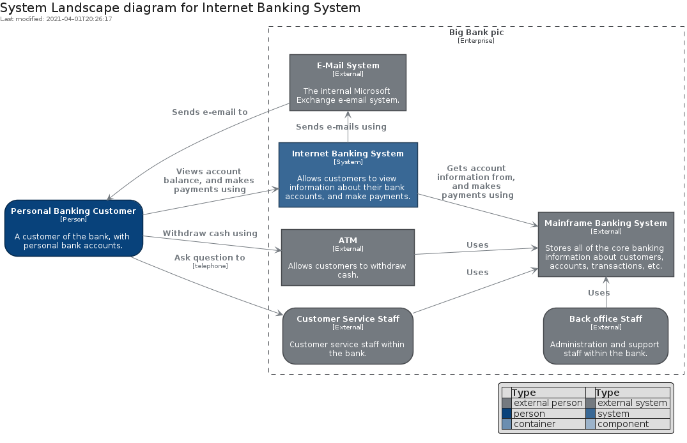
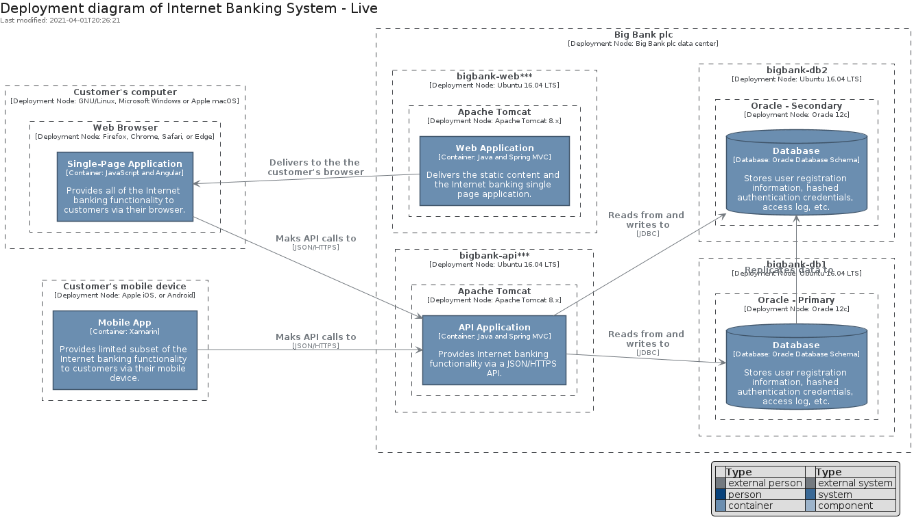

# c4model


## Presentation
This package implements `elements` and `boundaries` coming from the [C4 Model](https://c4model.com).

### Legend

The C4 Model legend can be displayed using the procedure:
```
C4Legend()
```

### Relationship for C4 diagrams

The relationships' texts between the diagram's items can be formatted using the procedure:
```
C4Relationship("an expected reason of the relationship", "an optional technology")
```


## Bootstrap

The package handles its own bootstrap.

```plantuml
' loads the c4model bootstrap
include('c4model/bootstrap')
```


## Style

The package handles its own style.

The bootstrap loads the style too! ;)

```plantuml
' loads the c4model style
include('c4model/style')
```


# Modules

The package provides 2 modules.


- [Boundary](boundary.md) with 4 elements
- [Element](element.md) with 8 elements

# Examples

The package provides 6 examples.


## Level 1 System Context
<br>
[The source file.](../c4model/examples/Level_1_System_Context.puml)

## Level 2 Container
<br>
[The source file.](../c4model/examples/Level_2_Container.puml)

## Level 3 Component
<br>
[The source file.](../c4model/examples/Level_3_Component.puml)

## System Landscape diagram
<br>
[The source file.](../c4model/examples/System_Landscape_diagram.puml)

## Dynamic diagram
<br>
[The source file.](../c4model/examples/Dynamic_diagram.puml)

## Deployment diagram
<br>
[The source file.](../c4model/examples/Deployment_diagram.puml)

