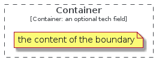
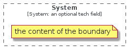

# Boundary

The module Boundary contains 4 entries.

| |Name|
|:---:|---|
||[c4model/Boundary/ContainerBoundary](../c4model/Boundary/ContainerBoundary.md)
||[c4model/Boundary/DeploymentNodeBoundary](../c4model/Boundary/DeploymentNodeBoundary.md)
||[c4model/Boundary/EnterpriseBoundary](../c4model/Boundary/EnterpriseBoundary.md)
||[c4model/Boundary/SystemBoundary](../c4model/Boundary/SystemBoundary.md)

