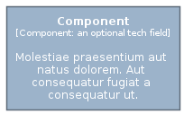
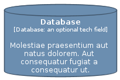
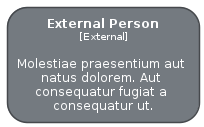
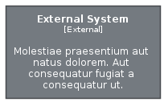
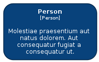
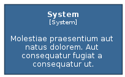

# Element

The module Element contains 7 entries.

| |Name|
|:---:|---|
||[c4model/Element/Component](../c4model/Element/Component.md)
||[c4model/Element/Container](../c4model/Element/Container.md)
||[c4model/Element/Database](../c4model/Element/Database.md)
||[c4model/Element/ExternalPerson](../c4model/Element/ExternalPerson.md)
||[c4model/Element/ExternalSystem](../c4model/Element/ExternalSystem.md)
||[c4model/Element/Person](../c4model/Element/Person.md)
||[c4model/Element/System](../c4model/Element/System.md)

