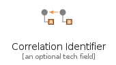

# MessageConstruction

The module MessageConstruction contains 7 entries.

| |Name|
|:---:|---|
||[eip/MessageConstruction/CommandMessage](../eip/MessageConstruction/CommandMessage.md)
||[eip/MessageConstruction/CorrelationIdentifier](../eip/MessageConstruction/CorrelationIdentifier.md)
||[eip/MessageConstruction/DocumentMessage](../eip/MessageConstruction/DocumentMessage.md)
||[eip/MessageConstruction/EventMessage](../eip/MessageConstruction/EventMessage.md)
||[eip/MessageConstruction/MessageExpiration](../eip/MessageConstruction/MessageExpiration.md)
||[eip/MessageConstruction/MessageSequence](../eip/MessageConstruction/MessageSequence.md)
||[eip/MessageConstruction/ReturnAddress](../eip/MessageConstruction/ReturnAddress.md)

