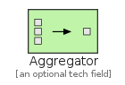
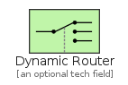

# MessageRouting

The module MessageRouting contains 11 entries.

| |Name|
|:---:|---|
||[eip/MessageRouting/Aggregator](../eip/MessageRouting/Aggregator.md)
||[eip/MessageRouting/ComposedMessageProcessor](../eip/MessageRouting/ComposedMessageProcessor.md)
||[eip/MessageRouting/ContentBasedRouter](../eip/MessageRouting/ContentBasedRouter.md)
||[eip/MessageRouting/DynamicRouter](../eip/MessageRouting/DynamicRouter.md)
||[eip/MessageRouting/MessageBroker](../eip/MessageRouting/MessageBroker.md)
||[eip/MessageRouting/MessageFilter](../eip/MessageRouting/MessageFilter.md)
||[eip/MessageRouting/ProcessManager](../eip/MessageRouting/ProcessManager.md)
||[eip/MessageRouting/RecipientList](../eip/MessageRouting/RecipientList.md)
||[eip/MessageRouting/Resequencer](../eip/MessageRouting/Resequencer.md)
||[eip/MessageRouting/RoutingSlip](../eip/MessageRouting/RoutingSlip.md)
||[eip/MessageRouting/Splitter](../eip/MessageRouting/Splitter.md)

