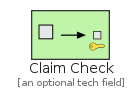
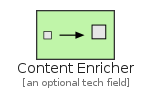

# MessageTransformation

The module MessageTransformation contains 5 entries.

| |Name|
|:---:|---|
||[eip/MessageTransformation/ClaimCheck](../eip/MessageTransformation/ClaimCheck.md)
||[eip/MessageTransformation/ContentEnricher](../eip/MessageTransformation/ContentEnricher.md)
||[eip/MessageTransformation/ContentFilter](../eip/MessageTransformation/ContentFilter.md)
||[eip/MessageTransformation/EnvelopeWrapper](../eip/MessageTransformation/EnvelopeWrapper.md)
||[eip/MessageTransformation/Normalizer](../eip/MessageTransformation/Normalizer.md)

