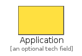
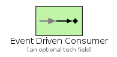
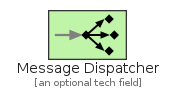
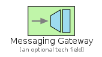
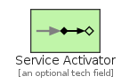

# MessagingEndpoints

The module MessagingEndpoints contains 11 entries.

| |Name|
|:---:|---|
||[eip/MessagingEndpoints/Application](../eip/MessagingEndpoints/Application.md)
||[eip/MessagingEndpoints/CompetingConsumers](../eip/MessagingEndpoints/CompetingConsumers.md)
||[eip/MessagingEndpoints/DurableSubscriberLock](../eip/MessagingEndpoints/DurableSubscriberLock.md)
||[eip/MessagingEndpoints/Endpoint](../eip/MessagingEndpoints/Endpoint.md)
||[eip/MessagingEndpoints/EventDrivenConsumer](../eip/MessagingEndpoints/EventDrivenConsumer.md)
||[eip/MessagingEndpoints/MessageDispatcher](../eip/MessagingEndpoints/MessageDispatcher.md)
||[eip/MessagingEndpoints/MessagingGateway](../eip/MessagingEndpoints/MessagingGateway.md)
||[eip/MessagingEndpoints/PollingConsumer](../eip/MessagingEndpoints/PollingConsumer.md)
||[eip/MessagingEndpoints/SelectiveConsumer](../eip/MessagingEndpoints/SelectiveConsumer.md)
||[eip/MessagingEndpoints/ServiceActivator](../eip/MessagingEndpoints/ServiceActivator.md)
||[eip/MessagingEndpoints/TransactionalClient](../eip/MessagingEndpoints/TransactionalClient.md)

