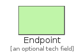

# Endpoint

```text
eip/MessagingEndpoints/Endpoint
```

```text
include('eip/MessagingEndpoints/Endpoint')
```

|icon|element|
|---|---|
|||


## element
### Load remotely
```plantuml
@startuml
' configures the library
!global $LIB_BASE_LOCATION="https://raw.githubusercontent.com/tmorin/plantuml-libs/master/dist"
' loads the library
!include $LIB_BASE_LOCATION/bootstrap.puml
' loads the eip bootstrap
include('eip/bootstrap')
' loads the Endpoint element
include('eip/MessagingEndpoints/Endpoint')
Endpoint('endpoint', 'Endpoint', 'an optional tech field')
@enduml
```
### Load locally
```plantuml
@startuml
' configures the library
!global $INCLUSION_MODE="local"
!global $LIB_BASE_LOCATION="../.."
' loads the library
!include $LIB_BASE_LOCATION/bootstrap.puml
' loads the eip bootstrap
include('eip/bootstrap')
' loads the Endpoint element
include('eip/MessagingEndpoints/Endpoint')
Endpoint('endpoint', 'Endpoint', 'an optional tech field')
@enduml
```

