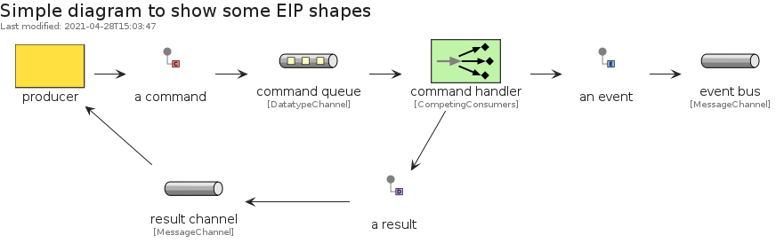

# eip


## Presentation
This package implements elements based on [codeclou/enterprise-integration-pattern-shapes-for-gliffy](https://github.com/codeclou/enterprise-integration-pattern-shapes-for-gliffy).


## Bootstrap

The package handles its own bootstrap.

```plantuml
' loads the eip bootstrap
include('eip/bootstrap')
```


## Style

The package handles its own style.

The bootstrap loads the style too! ;)

```plantuml
' loads the eip style
include('eip/style')
```


# Modules

The package provides 7 modules.


- [MessageConstruction](MessageConstruction.md) with 7 elements
- [MessageRouting](MessageRouting.md) with 11 elements
- [MessageTransformation](MessageTransformation.md) with 5 elements
- [MessagingChannels](MessagingChannels.md) with 5 elements
- [MessagingEndpoints](MessagingEndpoints.md) with 10 elements
- [MessagingSystems](MessagingSystems.md) with 7 elements
- [SystemManagement](SystemManagement.md) with 7 elements

# Examples

The package provides 1 examples.


## simple
<br>
[The source file.](../eip/examples/simple.puml)

