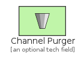
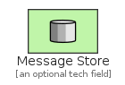

# SystemManagement

The module SystemManagement contains 7 entries.

| |Name|
|:---:|---|
||[eip/SystemManagement/ChannelPurger](../eip/SystemManagement/ChannelPurger.md)
||[eip/SystemManagement/ControlBus](../eip/SystemManagement/ControlBus.md)
||[eip/SystemManagement/Detour](../eip/SystemManagement/Detour.md)
||[eip/SystemManagement/MessageStore](../eip/SystemManagement/MessageStore.md)
||[eip/SystemManagement/SmartProxy](../eip/SystemManagement/SmartProxy.md)
||[eip/SystemManagement/TestMessage](../eip/SystemManagement/TestMessage.md)
||[eip/SystemManagement/WireTap](../eip/SystemManagement/WireTap.md)

