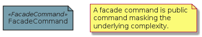

# FacadeCommand

```text
eventstorming/Element/FacadeCommand
```

```text
include('eventstorming/Element/FacadeCommand')
```

|element|
|---|
||


## element
### Load remotely
```plantuml
@startuml
' configures the library
!global $LIB_BASE_LOCATION="https://raw.githubusercontent.com/tmorin/plantuml-libs/master/dist"
' loads the library
!include $LIB_BASE_LOCATION/bootstrap.puml
' loads the eventstorming bootstrap
include('eventstorming/bootstrap')
' loads the FacadeCommand element
include('eventstorming/Element/FacadeCommand')
FacadeCommand('facade_command', 'FacadeCommand')
note as note
A facade command is public command masking the underlying complexity.
end note
@enduml
```
### Load locally
```plantuml
@startuml
' configures the library
!global $INCLUSION_MODE="local"
!global $LIB_BASE_LOCATION="../.."
' loads the library
!include $LIB_BASE_LOCATION/bootstrap.puml
' loads the eventstorming bootstrap
include('eventstorming/bootstrap')
' loads the FacadeCommand element
include('eventstorming/Element/FacadeCommand')
FacadeCommand('facade_command', 'FacadeCommand')
note as note
A facade command is public command masking the underlying complexity.
end note
@enduml
```

