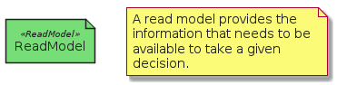

# ReadModel

```text
eventstorming/Element/ReadModel
```

```text
include('eventstorming/Element/ReadModel')
```

|element|
|---|
||


## element
### Load remotely
```plantuml
@startuml
' configures the library
!global $LIB_BASE_LOCATION="https://raw.githubusercontent.com/tmorin/plantuml-libs/master/dist"
' loads the library
!include $LIB_BASE_LOCATION/bootstrap.puml
' loads the eventstorming bootstrap
include('eventstorming/bootstrap')
' loads the ReadModel element
include('eventstorming/Element/ReadModel')
ReadModel('read_model', 'ReadModel')
note as note
A read model provides the information that needs to be available to take a given decision.
end note
@enduml
```
### Load locally
```plantuml
@startuml
' configures the library
!global $INCLUSION_MODE="local"
!global $LIB_BASE_LOCATION="../.."
' loads the library
!include $LIB_BASE_LOCATION/bootstrap.puml
' loads the eventstorming bootstrap
include('eventstorming/bootstrap')
' loads the ReadModel element
include('eventstorming/Element/ReadModel')
ReadModel('read_model', 'ReadModel')
note as note
A read model provides the information that needs to be available to take a given decision.
end note
@enduml
```

