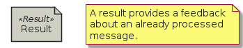

# Result

```text
eventstorming/Element/Result
```

```text
include('eventstorming/Element/Result')
```

|element|
|---|
||


## element
### Load remotely
```plantuml
@startuml
' configures the library
!global $LIB_BASE_LOCATION="https://raw.githubusercontent.com/tmorin/plantuml-libs/master/dist"
' loads the library
!include $LIB_BASE_LOCATION/bootstrap.puml
' loads the eventstorming bootstrap
include('eventstorming/bootstrap')
' loads the Result element
include('eventstorming/Element/Result')
Result('result', 'Result')
note as note
A result provides a feedback about an already processed message.
end note
@enduml
```
### Load locally
```plantuml
@startuml
' configures the library
!global $INCLUSION_MODE="local"
!global $LIB_BASE_LOCATION="../.."
' loads the library
!include $LIB_BASE_LOCATION/bootstrap.puml
' loads the eventstorming bootstrap
include('eventstorming/bootstrap')
' loads the Result element
include('eventstorming/Element/Result')
Result('result', 'Result')
note as note
A result provides a feedback about an already processed message.
end note
@enduml
```

