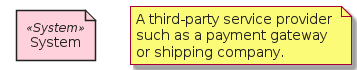

# System

```text
eventstorming/Element/System
```

```text
include('eventstorming/Element/System')
```

|element|
|---|
||


## element
### Load remotely
```plantuml
@startuml
' configures the library
!global $LIB_BASE_LOCATION="https://raw.githubusercontent.com/tmorin/plantuml-libs/master/dist"
' loads the library
!include $LIB_BASE_LOCATION/bootstrap.puml
' loads the eventstorming bootstrap
include('eventstorming/bootstrap')
' loads the System element
include('eventstorming/Element/System')
System('system', 'System')
note as note
A third-party service provider such as a payment gateway or shipping company.
end note
@enduml
```
### Load locally
```plantuml
@startuml
' configures the library
!global $INCLUSION_MODE="local"
!global $LIB_BASE_LOCATION="../.."
' loads the library
!include $LIB_BASE_LOCATION/bootstrap.puml
' loads the eventstorming bootstrap
include('eventstorming/bootstrap')
' loads the System element
include('eventstorming/Element/System')
System('system', 'System')
note as note
A third-party service provider such as a payment gateway or shipping company.
end note
@enduml
```

