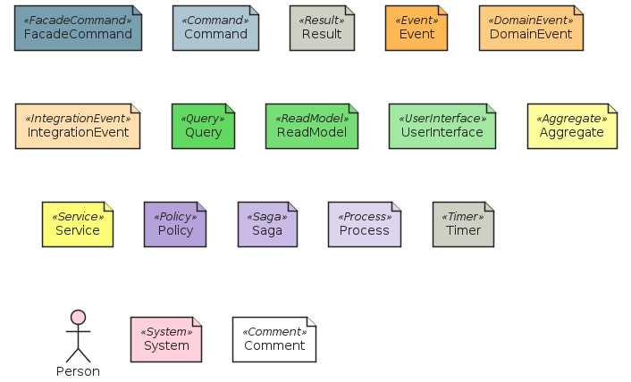
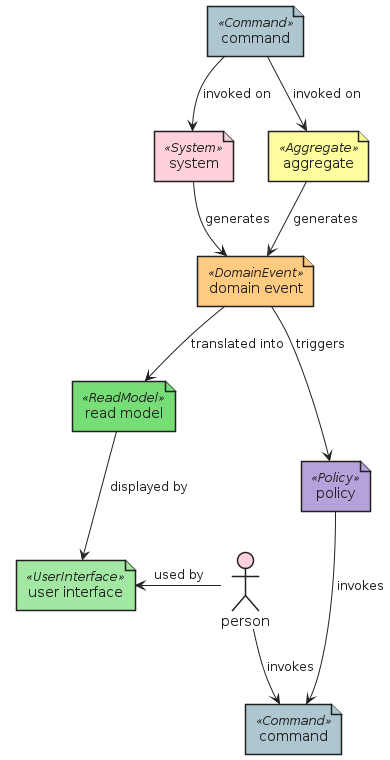
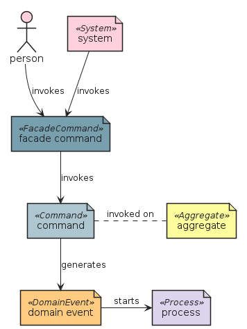
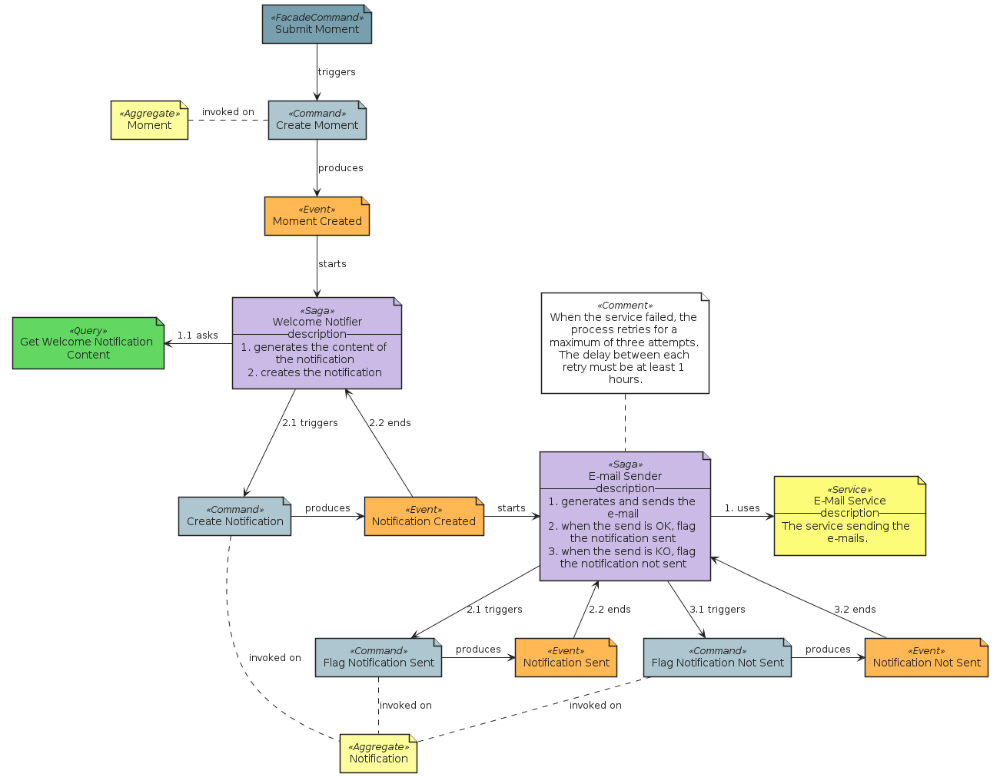

# eventstorming


## Presentation
This package implements the notation provided in [EventStorming](https://www.eventstorming.com).


## Bootstrap

The package handles its own bootstrap.

```plantuml
' loads the eventstorming bootstrap
include('eventstorming/bootstrap')
```


## Style

The package handles its own style.

The bootstrap loads the style too! ;)

```plantuml
' loads the eventstorming style
include('eventstorming/style')
```


# Modules

The package provides 1 modules.


- [Element](element.md) with 18 elements

# Examples

The package provides 4 examples.


## all elements
<br>
[The source file.](../eventstorming/examples/all_elements.puml)

## book flow
<br>
[The source file.](../eventstorming/examples/book_flow.puml)

## causality chain
<br>
[The source file.](../eventstorming/examples/causality_chain.puml)

## hoozbuzzing
<br>
[The source file.](../eventstorming/examples/hoozbuzzing.puml)

