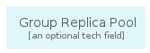

# Group Replica Pool

```text
gcp/Group/GroupReplicaPool
```

```text
include('gcp/Group/GroupReplicaPool')
```

|group|
|---|
||


## group
### Load remotely
```plantuml
@startuml
' configures the library
!global $LIB_BASE_LOCATION="https://raw.githubusercontent.com/tmorin/plantuml-libs/master/dist"
' loads the library
!include $LIB_BASE_LOCATION/bootstrap.puml
' loads the gcp bootstrap
include('gcp/bootstrap')
' loads the GroupReplicaPool element
include('gcp/Group/GroupReplicaPool')
GroupReplicaPool('group_replica_pool', 'Group Replica Pool', 'an optional tech field')
@enduml
```
### Load locally
```plantuml
@startuml
' configures the library
!global $INCLUSION_MODE="local"
!global $LIB_BASE_LOCATION="../.."
' loads the library
!include $LIB_BASE_LOCATION/bootstrap.puml
' loads the gcp bootstrap
include('gcp/bootstrap')
' loads the GroupReplicaPool element
include('gcp/Group/GroupReplicaPool')
GroupReplicaPool('group_replica_pool', 'Group Replica Pool', 'an optional tech field')
@enduml
```

