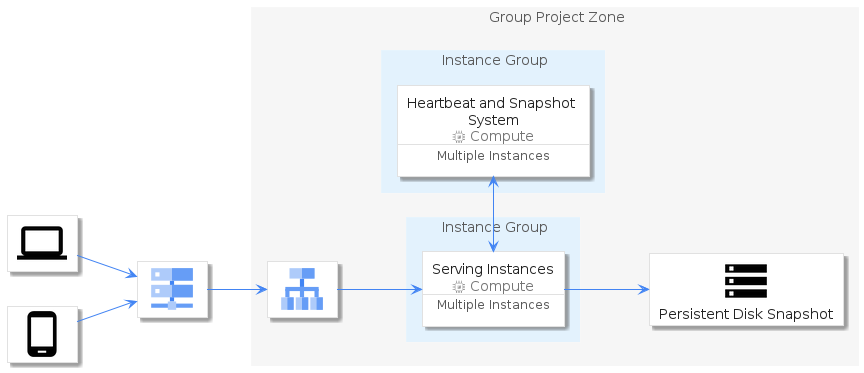

# gcp


## Bootstrap

The package handles its own bootstrap.

```plantuml
' loads the gcp bootstrap
include('gcp/bootstrap')
```


## Style

The package handles its own style.

The bootstrap loads the style too! ;)

```plantuml
' loads the gcp style
include('gcp/style')
```


# Modules

The package provides 2 modules.


- [Item](item.md) with 98 elements
- [Group](group.md) with 22 elements

# Examples

The package provides 1 examples.


## diagram-elements-overview
<br>
[The source file.](../gcp/examples/diagram-elements-overview.puml)

