# Group

The module Group contains 22 entries.

| |Name|
|:---:|---|
||[gcp/Group/GroupAccount](../gcp/Group/GroupAccount.md)
||[gcp/Group/GroupCloudServiceProvider](../gcp/Group/GroupCloudServiceProvider.md)
||[gcp/Group/GroupExternalDataSources](../gcp/Group/GroupExternalDataSources.md)
|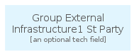|[gcp/Group/GroupExternalInfrastructure1StParty](../gcp/Group/GroupExternalInfrastructure1StParty.md)
|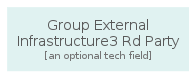|[gcp/Group/GroupExternalInfrastructure3RdParty](../gcp/Group/GroupExternalInfrastructure3RdParty.md)
||[gcp/Group/GroupExternalSaaSProviders](../gcp/Group/GroupExternalSaaSProviders.md)
||[gcp/Group/GroupFirewall](../gcp/Group/GroupFirewall.md)
|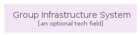|[gcp/Group/GroupInfrastructureSystem](../gcp/Group/GroupInfrastructureSystem.md)
||[gcp/Group/GroupInstanceGroup](../gcp/Group/GroupInstanceGroup.md)
|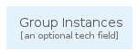|[gcp/Group/GroupInstances](../gcp/Group/GroupInstances.md)
|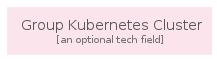|[gcp/Group/GroupKubernetesCluster](../gcp/Group/GroupKubernetesCluster.md)
||[gcp/Group/GroupLogicalGroupingOfServices](../gcp/Group/GroupLogicalGroupingOfServices.md)
|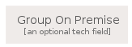|[gcp/Group/GroupOnPremise](../gcp/Group/GroupOnPremise.md)
|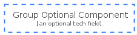|[gcp/Group/GroupOptionalComponent](../gcp/Group/GroupOptionalComponent.md)
|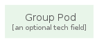|[gcp/Group/GroupPod](../gcp/Group/GroupPod.md)
|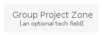|[gcp/Group/GroupProjectZone](../gcp/Group/GroupProjectZone.md)
|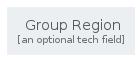|[gcp/Group/GroupRegion](../gcp/Group/GroupRegion.md)
||[gcp/Group/GroupReplicaPool](../gcp/Group/GroupReplicaPool.md)
||[gcp/Group/GroupSubNetwork](../gcp/Group/GroupSubNetwork.md)
|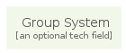|[gcp/Group/GroupSystem](../gcp/Group/GroupSystem.md)
||[gcp/Group/GroupUser](../gcp/Group/GroupUser.md)
||[gcp/Group/GroupZone](../gcp/Group/GroupZone.md)

