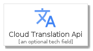
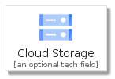
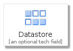

# Item

The module Item contains 98 entries.

- [ApiPlatformEcosystems](#family-apiplatformecosystems)
- [BigData](#family-bigdata)
- [CloudAi](#family-cloudai)
- [Compute](#family-compute)
- [DataTransfer](#family-datatransfer)
- [DeveloperTools](#family-developertools)
- [ExpandedProductCardIcons](#family-expandedproductcardicons)
- [Generic](#family-generic)
- [IdentitySecurity](#family-identitysecurity)
- [InternetOfThings](#family-internetofthings)
- [ManagementTools](#family-managementtools)
- [Networking](#family-networking)
- [OpenSourceIcons](#family-opensourceicons)
- [StorageDatabases](#family-storagedatabases)

## ApiPlatformEcosystems

| |Name|
|:---:|---|
||[gcp/Item/ApiPlatformEcosystems/ApiAnalytics](../gcp/Item/ApiPlatformEcosystems/ApiAnalytics.md)
||[gcp/Item/ApiPlatformEcosystems/ApigeeApiPlatform](../gcp/Item/ApiPlatformEcosystems/ApigeeApiPlatform.md)
||[gcp/Item/ApiPlatformEcosystems/ApigeeSense](../gcp/Item/ApiPlatformEcosystems/ApigeeSense.md)
||[gcp/Item/ApiPlatformEcosystems/ApiMonetization](../gcp/Item/ApiPlatformEcosystems/ApiMonetization.md)
||[gcp/Item/ApiPlatformEcosystems/CloudEndpoints](../gcp/Item/ApiPlatformEcosystems/CloudEndpoints.md)
||[gcp/Item/ApiPlatformEcosystems/DeveloperPortal](../gcp/Item/ApiPlatformEcosystems/DeveloperPortal.md)

## BigData

| |Name|
|:---:|---|
||[gcp/Item/BigData/Bigquery](../gcp/Item/BigData/Bigquery.md)
||[gcp/Item/BigData/CloudComposer](../gcp/Item/BigData/CloudComposer.md)
||[gcp/Item/BigData/Dataflow](../gcp/Item/BigData/Dataflow.md)
||[gcp/Item/BigData/DataLab](../gcp/Item/BigData/DataLab.md)
||[gcp/Item/BigData/Dataprep](../gcp/Item/BigData/Dataprep.md)
||[gcp/Item/BigData/Dataproc](../gcp/Item/BigData/Dataproc.md)
||[gcp/Item/BigData/DataStudio](../gcp/Item/BigData/DataStudio.md)
||[gcp/Item/BigData/Genomics](../gcp/Item/BigData/Genomics.md)
||[gcp/Item/BigData/PubSub](../gcp/Item/BigData/PubSub.md)

## CloudAi

| |Name|
|:---:|---|
||[gcp/Item/CloudAi/AdvancedSolutionsLab1](../gcp/Item/CloudAi/AdvancedSolutionsLab1.md)
||[gcp/Item/CloudAi/AiPlatform](../gcp/Item/CloudAi/AiPlatform.md)
||[gcp/Item/CloudAi/AutoMl](../gcp/Item/CloudAi/AutoMl.md)
||[gcp/Item/CloudAi/CloudeTpu](../gcp/Item/CloudAi/CloudeTpu.md)
||[gcp/Item/CloudAi/CloudJobsApi](../gcp/Item/CloudAi/CloudJobsApi.md)
||[gcp/Item/CloudAi/CloudNaturalLanguageApi](../gcp/Item/CloudAi/CloudNaturalLanguageApi.md)
||[gcp/Item/CloudAi/CloudTranslationApi](../gcp/Item/CloudAi/CloudTranslationApi.md)
||[gcp/Item/CloudAi/CloudVisionApi](../gcp/Item/CloudAi/CloudVisionApi.md)
||[gcp/Item/CloudAi/Dialogflow](../gcp/Item/CloudAi/Dialogflow.md)
||[gcp/Item/CloudAi/SpeechToText](../gcp/Item/CloudAi/SpeechToText.md)
||[gcp/Item/CloudAi/TextToSpeech](../gcp/Item/CloudAi/TextToSpeech.md)
||[gcp/Item/CloudAi/VideoIntelligenceApi](../gcp/Item/CloudAi/VideoIntelligenceApi.md)

## Compute

| |Name|
|:---:|---|
||[gcp/Item/Compute/AppEngine](../gcp/Item/Compute/AppEngine.md)
||[gcp/Item/Compute/CloudFunctions](../gcp/Item/Compute/CloudFunctions.md)
||[gcp/Item/Compute/CloudGpu](../gcp/Item/Compute/CloudGpu.md)
||[gcp/Item/Compute/ComputeEngine](../gcp/Item/Compute/ComputeEngine.md)
||[gcp/Item/Compute/ContainerOptimizedOs](../gcp/Item/Compute/ContainerOptimizedOs.md)
||[gcp/Item/Compute/ContainerOptimizedOs32Flat](../gcp/Item/Compute/ContainerOptimizedOs32Flat.md)
||[gcp/Item/Compute/GkeOnPrem](../gcp/Item/Compute/GkeOnPrem.md)

## DataTransfer

| |Name|
|:---:|---|
||[gcp/Item/DataTransfer/TransferAppliance](../gcp/Item/DataTransfer/TransferAppliance.md)

## DeveloperTools

| |Name|
|:---:|---|
||[gcp/Item/DeveloperTools/ArtifactRegistry](../gcp/Item/DeveloperTools/ArtifactRegistry.md)
||[gcp/Item/DeveloperTools/CloudBuild](../gcp/Item/DeveloperTools/CloudBuild.md)
||[gcp/Item/DeveloperTools/CloudDeploymentManager](../gcp/Item/DeveloperTools/CloudDeploymentManager.md)
||[gcp/Item/DeveloperTools/ToolsForPowershell](../gcp/Item/DeveloperTools/ToolsForPowershell.md)

## ExpandedProductCardIcons

| |Name|
|:---:|---|
||[gcp/Item/ExpandedProductCardIcons/AppEngine](../gcp/Item/ExpandedProductCardIcons/AppEngine.md)
||[gcp/Item/ExpandedProductCardIcons/CloudDataflow](../gcp/Item/ExpandedProductCardIcons/CloudDataflow.md)
||[gcp/Item/ExpandedProductCardIcons/CloudDataproc](../gcp/Item/ExpandedProductCardIcons/CloudDataproc.md)
||[gcp/Item/ExpandedProductCardIcons/ComputeEngine](../gcp/Item/ExpandedProductCardIcons/ComputeEngine.md)
||[gcp/Item/ExpandedProductCardIcons/ContainerEngine](../gcp/Item/ExpandedProductCardIcons/ContainerEngine.md)
||[gcp/Item/ExpandedProductCardIcons/ModifiersAutoscaling](../gcp/Item/ExpandedProductCardIcons/ModifiersAutoscaling.md)
||[gcp/Item/ExpandedProductCardIcons/ModifiersCustomVirtualMachine](../gcp/Item/ExpandedProductCardIcons/ModifiersCustomVirtualMachine.md)
||[gcp/Item/ExpandedProductCardIcons/ModifiersHighCpuMachine](../gcp/Item/ExpandedProductCardIcons/ModifiersHighCpuMachine.md)
||[gcp/Item/ExpandedProductCardIcons/ModifiersHighMemoryMachine](../gcp/Item/ExpandedProductCardIcons/ModifiersHighMemoryMachine.md)
||[gcp/Item/ExpandedProductCardIcons/ModifiersPreemptableVm](../gcp/Item/ExpandedProductCardIcons/ModifiersPreemptableVm.md)
||[gcp/Item/ExpandedProductCardIcons/ModifiersSharedCoreMachineF1](../gcp/Item/ExpandedProductCardIcons/ModifiersSharedCoreMachineF1.md)
||[gcp/Item/ExpandedProductCardIcons/ModifiersSharedCoreMachineG1](../gcp/Item/ExpandedProductCardIcons/ModifiersSharedCoreMachineG1.md)
||[gcp/Item/ExpandedProductCardIcons/ModifiersStandardMachine](../gcp/Item/ExpandedProductCardIcons/ModifiersStandardMachine.md)
||[gcp/Item/ExpandedProductCardIcons/ModifiersStorage](../gcp/Item/ExpandedProductCardIcons/ModifiersStorage.md)

## Generic

| |Name|
|:---:|---|
||[gcp/Item/Generic/Generic](../gcp/Item/Generic/Generic.md)

## IdentitySecurity

| |Name|
|:---:|---|
||[gcp/Item/IdentitySecurity/Beyondcorp](../gcp/Item/IdentitySecurity/Beyondcorp.md)
||[gcp/Item/IdentitySecurity/DataLossPreventionApi](../gcp/Item/IdentitySecurity/DataLossPreventionApi.md)
||[gcp/Item/IdentitySecurity/Iam](../gcp/Item/IdentitySecurity/Iam.md)
||[gcp/Item/IdentitySecurity/KeyAccessJustifications](../gcp/Item/IdentitySecurity/KeyAccessJustifications.md)
||[gcp/Item/IdentitySecurity/SecurityCommandCenter](../gcp/Item/IdentitySecurity/SecurityCommandCenter.md)
||[gcp/Item/IdentitySecurity/WebSecurityScanner](../gcp/Item/IdentitySecurity/WebSecurityScanner.md)

## InternetOfThings

| |Name|
|:---:|---|
||[gcp/Item/InternetOfThings/IotCore](../gcp/Item/InternetOfThings/IotCore.md)

## ManagementTools

| |Name|
|:---:|---|
||[gcp/Item/ManagementTools/Cloudapis521](../gcp/Item/ManagementTools/Cloudapis521.md)
||[gcp/Item/ManagementTools/CloudDeploymentManager](../gcp/Item/ManagementTools/CloudDeploymentManager.md)
||[gcp/Item/ManagementTools/CloudLogging](../gcp/Item/ManagementTools/CloudLogging.md)
||[gcp/Item/ManagementTools/CloudMonitoring](../gcp/Item/ManagementTools/CloudMonitoring.md)
||[gcp/Item/ManagementTools/Debugger](../gcp/Item/ManagementTools/Debugger.md)
||[gcp/Item/ManagementTools/ErrorReporting](../gcp/Item/ManagementTools/ErrorReporting.md)
||[gcp/Item/ManagementTools/Stackdriver](../gcp/Item/ManagementTools/Stackdriver.md)
||[gcp/Item/ManagementTools/Trace](../gcp/Item/ManagementTools/Trace.md)

## Networking

| |Name|
|:---:|---|
||[gcp/Item/Networking/Cloudarmor](../gcp/Item/Networking/Cloudarmor.md)
||[gcp/Item/Networking/CloudCdn](../gcp/Item/Networking/CloudCdn.md)
||[gcp/Item/Networking/CloudDns](../gcp/Item/Networking/CloudDns.md)
||[gcp/Item/Networking/CloudExternalIpAddresses](../gcp/Item/Networking/CloudExternalIpAddresses.md)
||[gcp/Item/Networking/CloudFirewallRules](../gcp/Item/Networking/CloudFirewallRules.md)
||[gcp/Item/Networking/CloudInterconnect](../gcp/Item/Networking/CloudInterconnect.md)
||[gcp/Item/Networking/CloudLoadBalancing](../gcp/Item/Networking/CloudLoadBalancing.md)
||[gcp/Item/Networking/CloudNetwork](../gcp/Item/Networking/CloudNetwork.md)
||[gcp/Item/Networking/CloudRouter](../gcp/Item/Networking/CloudRouter.md)
||[gcp/Item/Networking/CloudRoutes](../gcp/Item/Networking/CloudRoutes.md)
||[gcp/Item/Networking/CloudVpn](../gcp/Item/Networking/CloudVpn.md)
||[gcp/Item/Networking/PartnerInterconnect](../gcp/Item/Networking/PartnerInterconnect.md)
||[gcp/Item/Networking/PremiumNetworkTier](../gcp/Item/Networking/PremiumNetworkTier.md)
||[gcp/Item/Networking/StandardNetworkTier](../gcp/Item/Networking/StandardNetworkTier.md)
||[gcp/Item/Networking/VirtualPrivateCloud](../gcp/Item/Networking/VirtualPrivateCloud.md)

## OpenSourceIcons

| |Name|
|:---:|---|
||[gcp/Item/OpenSourceIcons/ForsetiLockup](../gcp/Item/OpenSourceIcons/ForsetiLockup.md)
||[gcp/Item/OpenSourceIcons/ForsetiLogo](../gcp/Item/OpenSourceIcons/ForsetiLogo.md)
||[gcp/Item/OpenSourceIcons/IstioLogo](../gcp/Item/OpenSourceIcons/IstioLogo.md)
||[gcp/Item/OpenSourceIcons/KubernetesLogo](../gcp/Item/OpenSourceIcons/KubernetesLogo.md)
||[gcp/Item/OpenSourceIcons/KubernetesName](../gcp/Item/OpenSourceIcons/KubernetesName.md)
||[gcp/Item/OpenSourceIcons/TensorFlowLogo](../gcp/Item/OpenSourceIcons/TensorFlowLogo.md)

## StorageDatabases

| |Name|
|:---:|---|
||[gcp/Item/StorageDatabases/CloudBigtable](../gcp/Item/StorageDatabases/CloudBigtable.md)
||[gcp/Item/StorageDatabases/CloudSpanner](../gcp/Item/StorageDatabases/CloudSpanner.md)
||[gcp/Item/StorageDatabases/CloudSql](../gcp/Item/StorageDatabases/CloudSql.md)
||[gcp/Item/StorageDatabases/CloudStorage](../gcp/Item/StorageDatabases/CloudStorage.md)
||[gcp/Item/StorageDatabases/Datastore](../gcp/Item/StorageDatabases/Datastore.md)
||[gcp/Item/StorageDatabases/Filestore](../gcp/Item/StorageDatabases/Filestore.md)
||[gcp/Item/StorageDatabases/Memorystore](../gcp/Item/StorageDatabases/Memorystore.md)
||[gcp/Item/StorageDatabases/PersistentDisk](../gcp/Item/StorageDatabases/PersistentDisk.md)

