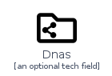
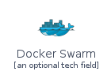
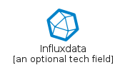
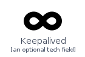
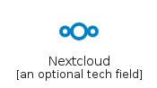
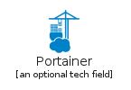

# Brand

The module Brand contains 13 entries.

- [Brand](#family-brand)

## Brand

| |Name|
|:---:|---|
||[homecloud/Brand/Backup](../homecloud/Brand/Backup.md)
||[homecloud/Brand/Calibreweb](../homecloud/Brand/Calibreweb.md)
||[homecloud/Brand/Ceph](../homecloud/Brand/Ceph.md)
||[homecloud/Brand/Dnas](../homecloud/Brand/Dnas.md)
||[homecloud/Brand/Docker](../homecloud/Brand/Docker.md)
||[homecloud/Brand/DockerSwarm](../homecloud/Brand/DockerSwarm.md)
||[homecloud/Brand/Influxdata](../homecloud/Brand/Influxdata.md)
||[homecloud/Brand/Keepalived](../homecloud/Brand/Keepalived.md)
||[homecloud/Brand/Nextcloud](../homecloud/Brand/Nextcloud.md)
||[homecloud/Brand/Portainer](../homecloud/Brand/Portainer.md)
||[homecloud/Brand/Samba](../homecloud/Brand/Samba.md)
||[homecloud/Brand/Syncthing](../homecloud/Brand/Syncthing.md)
||[homecloud/Brand/Traefik](../homecloud/Brand/Traefik.md)

