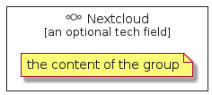

# Nextcloud

```text
homecloud/Brand/Nextcloud
```

```text
include('homecloud/Brand/Nextcloud')
```

|icon|card|element|group|
|---|---|---|---|
|||||


## card
### Load remotely
```plantuml
@startuml
' configures the library
!global $LIB_BASE_LOCATION="https://raw.githubusercontent.com/tmorin/plantuml-libs/master/dist"
' loads the library
!include $LIB_BASE_LOCATION/bootstrap.puml
' loads the homecloud bootstrap
include('homecloud/bootstrap')
' loads the Nextcloud element
include('homecloud/Brand/Nextcloud')
NextcloudCard('nextcloud', 'Nextcloud', 'Molestiae praesentium aut natus dolorem. Aut consequatur fugiat a consequatur ut.')
@enduml
```
### Load locally
```plantuml
@startuml
' configures the library
!global $INCLUSION_MODE="local"
!global $LIB_BASE_LOCATION="../.."
' loads the library
!include $LIB_BASE_LOCATION/bootstrap.puml
' loads the homecloud bootstrap
include('homecloud/bootstrap')
' loads the Nextcloud element
include('homecloud/Brand/Nextcloud')
NextcloudCard('nextcloud', 'Nextcloud', 'Molestiae praesentium aut natus dolorem. Aut consequatur fugiat a consequatur ut.')
@enduml
```


## element
### Load remotely
```plantuml
@startuml
' configures the library
!global $LIB_BASE_LOCATION="https://raw.githubusercontent.com/tmorin/plantuml-libs/master/dist"
' loads the library
!include $LIB_BASE_LOCATION/bootstrap.puml
' loads the homecloud bootstrap
include('homecloud/bootstrap')
' loads the Nextcloud element
include('homecloud/Brand/Nextcloud')
Nextcloud('nextcloud', 'Nextcloud', 'an optional tech field')
@enduml
```
### Load locally
```plantuml
@startuml
' configures the library
!global $INCLUSION_MODE="local"
!global $LIB_BASE_LOCATION="../.."
' loads the library
!include $LIB_BASE_LOCATION/bootstrap.puml
' loads the homecloud bootstrap
include('homecloud/bootstrap')
' loads the Nextcloud element
include('homecloud/Brand/Nextcloud')
Nextcloud('nextcloud', 'Nextcloud', 'an optional tech field')
@enduml
```


## group
### Load remotely
```plantuml
@startuml
' configures the library
!global $LIB_BASE_LOCATION="https://raw.githubusercontent.com/tmorin/plantuml-libs/master/dist"
' loads the library
!include $LIB_BASE_LOCATION/bootstrap.puml
' loads the homecloud bootstrap
include('homecloud/bootstrap')
' loads the Nextcloud element
include('homecloud/Brand/Nextcloud')
NextcloudGroup('nextcloud', 'Nextcloud', 'an optional tech field'){
note as note
the content of the group
end note
}
@enduml
```
### Load locally
```plantuml
@startuml
' configures the library
!global $INCLUSION_MODE="local"
!global $LIB_BASE_LOCATION="../.."
' loads the library
!include $LIB_BASE_LOCATION/bootstrap.puml
' loads the homecloud bootstrap
include('homecloud/bootstrap')
' loads the Nextcloud element
include('homecloud/Brand/Nextcloud')
NextcloudGroup('nextcloud', 'Nextcloud', 'an optional tech field'){
note as note
the content of the group
end note
}
@enduml
```

