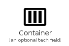

# Container

The module Container contains 4 entries.

- [Container](#family-container)

## Container

| |Name|
|:---:|---|
||[homecloud/Container/Container](../homecloud/Container/Container.md)
||[homecloud/Container/Registry](../homecloud/Container/Registry.md)
||[homecloud/Container/Stack](../homecloud/Container/Stack.md)
||[homecloud/Container/Volume](../homecloud/Container/Volume.md)

