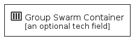

# Group Swarm Container

```text
homecloud/Group/GroupSwarmContainer
```

```text
include('homecloud/Group/GroupSwarmContainer')
```

|group|
|---|
||


## group
### Load remotely
```plantuml
@startuml
' configures the library
!global $LIB_BASE_LOCATION="https://raw.githubusercontent.com/tmorin/plantuml-libs/master/dist"
' loads the library
!include $LIB_BASE_LOCATION/bootstrap.puml
' loads the homecloud bootstrap
include('homecloud/bootstrap')
' loads the GroupSwarmContainer element
include('homecloud/Group/GroupSwarmContainer')
GroupSwarmContainer('group_swarm_container', 'Group Swarm Container', 'an optional tech field')
@enduml
```
### Load locally
```plantuml
@startuml
' configures the library
!global $INCLUSION_MODE="local"
!global $LIB_BASE_LOCATION="../.."
' loads the library
!include $LIB_BASE_LOCATION/bootstrap.puml
' loads the homecloud bootstrap
include('homecloud/bootstrap')
' loads the GroupSwarmContainer element
include('homecloud/Group/GroupSwarmContainer')
GroupSwarmContainer('group_swarm_container', 'Group Swarm Container', 'an optional tech field')
@enduml
```

