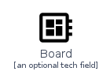
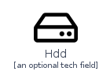
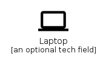
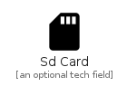
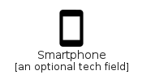
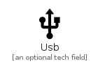

# Hardware

The module Hardware contains 6 entries.

- [Hardware](#family-hardware)

## Hardware

| |Name|
|:---:|---|
||[homecloud/Hardware/Board](../homecloud/Hardware/Board.md)
||[homecloud/Hardware/Hdd](../homecloud/Hardware/Hdd.md)
||[homecloud/Hardware/Laptop](../homecloud/Hardware/Laptop.md)
||[homecloud/Hardware/SdCard](../homecloud/Hardware/SdCard.md)
||[homecloud/Hardware/Smartphone](../homecloud/Hardware/Smartphone.md)
||[homecloud/Hardware/Usb](../homecloud/Hardware/Usb.md)

